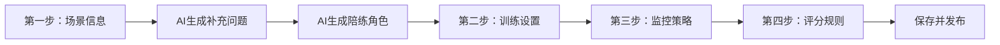
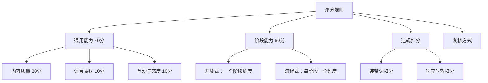
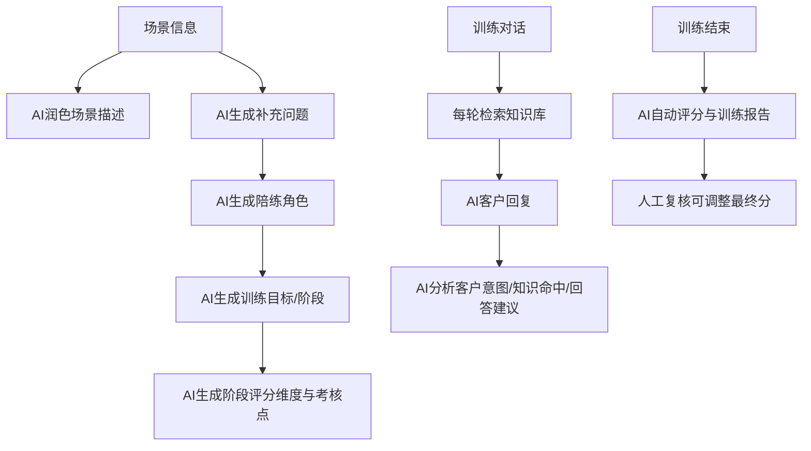

# AI问答训练 V1.5.0 需求整理

> 来源：蓝湖原型 `AI问答训练V1.5.0.rp`。  
> 整理方式：按蓝湖页面逐页读取 Axure 原型文本后，整理成开发可理解的需求文档。原型中的菜单、占位符、重复演示数据已做归纳；个别横向大画布内容如与蓝湖冲突，以蓝湖原型为准。

## 1. 版本范围

### 1.0 当前项目一期落地口径

蓝湖原型里存在管理端、学员端、任务模式、练习模式、权限和复核等完整平台能力，但当前项目一期先不按完整平台拆角色实现。

当前项目一期只做“单用户功能闭环”：

1. 不区分管理端、员工端、教练端和学员端。
2. 不做用户权限、组织权限、数据权限、角色可见性控制。
3. 能上传训练资料，并保存原文件、去重、解析、切片、写入训练向量库。
4. 能选择/填写学员画像、客户画像、场景描述和补充细节。
5. 能基于上传资料和画像生成 AI 陪练角色。
6. 能生成开放式训练设置，轮数由 LLM 动态给出，后端只校验范围。
7. 能进入文字训练对话，支持流式和一次性返回切换。
8. 能在训练结束后进行 AI 自动评分并生成训练报告。

当前项目一期先不做：

1. 流程式训练。
2. 语音、视频、数字人、实时人脸检测。
3. 违规词扣分。
4. 人工复核、多角色协同和任务发布审批。
5. 管理端/员工端隔离，以及 `visible/hidden/scoring_only` 这类权限可见性配置。

### 1.1 一期能力

1. AI陪练角色场景细化。
2. 训练方式支持 `流程式` 和 `开放式`。
3. 新增评分细则设置，包含通用评分、阶段评分、违禁词。
4. 支持人工复核评分。

### 1.2 二期能力

1. 训练模式新增语音通话。

### 1.3 三期能力

1. 训练模式新增语音转文字。
2. 监控策略新增切出屏幕检测、复制粘贴检测、实时人脸检测。
3. 评分规则新增响应时效扣分，覆盖文字模式、语音模式、视频模式。

## 2. 页面目录

### 2.1 管理端

1. 任务模式
   - 新建任务 - 场景信息
   - 训练设置
   - 监控策略
   - 评分规则
   - 通用能力评分逻辑
   - 任务明细
   - 训练报告
   - 训练明细
   - 复核
2. 练习模式
   - 训练报告

### 2.2 学员端

1. 任务模式
   - 开始任务
   - 训练历史
2. 练习模式
   - 新建训练
   - 开始训练

## 3. 管理端：新建任务

管理端新建任务是一个四步流程：



### 3.1 第一步：场景信息

目标：收集任务基础信息、学员画像、客户画像、知识补充和场景描述，用于生成 AI 陪练角色。

#### 基础任务字段

| 字段 | 规则 |
| --- | --- |
| 任务名称 | 文本输入 |
| 所属部门 | 选择部门 |
| 任务次数 | 数值 |
| 适用范围 | 选择适用范围 |
| 任务周期 | 选填；不填表示不限周期；选择后到期自动关闭任务 |
| 共享设置 | 配置 |
| 训练归属 | 待入职、试用、正式 |
| 入职天数 | 支持按入职天数范围加入训练 |

#### 学员画像

学员画像决定 AI 客户的提问方式、对话难度和针对性。

字段要求：

| 字段 | 规则 |
| --- | --- |
| 职位角色 | 枚举，新增 `海外BD`；原 `外贸AI客服` 改为 `超级客服` |
| 经验等级 | 选择 |
| 任务目标/难度 | 选择 |
| 短板标签 | 选择或输入，用于针对性训练 |
| 其他 | 字数限制 300，非必填 |

#### 客户画像

客户画像直接映射为 AI 客户的身份、诉求和痛点。

通用字段：

| 字段 | 规则 |
| --- | --- |
| 客户类型/客户分类 | 必填 |
| 性别 | 男、女 |
| 年龄 | 18 到 100，正整数，必填 |
| 客户阶段/合作阶段 | 必填 |
| 核心关注点 | 选择 |
| 次要关注点 | 选择 |
| 价格敏感度 | 极低、低、中、高、极高；默认中 |
| 适用产品 | 选择 |
| 行业 | 选择 |
| 外贸经验 | 选择 |
| 其他 | 字数限制 300，非必填 |

海外 BD 相关字段示例：

| 字段 | 枚举/说明 |
| --- | --- |
| 客户阶段 | A：成交客户、B1：报价后客户冷淡、B2：报价后深互动、B3：PI阶段高意向、C：产品相关且有回复客户、D：产品相关不回复客户、E：非产品咨询客户、F：暂空客户 |
| 客户所在地 | 乌兹别克斯坦、阿联酋、法国、西班牙、意大利、印尼、迪拜、哈萨克斯坦、土耳其、伊拉克、肯尼亚、智利、匈牙利、希腊、罗马尼亚、越南等 |
| 客户来源 | Facebook、Google-seo、阿里国际站 |
| 客户意向 | 高意向、有兴趣、一般了解、暂不考虑 |
| 客户类型 | 新用户、老客户、公海客户 |
| 行业 | 工程机械、农业机械、电动搬运、木工、五金、激光设备、板材、智能一体机 |
| 当前阶段 | 首次跟进、再次跟进、跟进不回、跟进回复 |
| 关注点 | 质量、交期、售后质保、品牌、定制化、资质认证、信任获取、付款方式、预付款占比、产品适配度、报价、逼单促销、发货、物流、关税、增值税、经销商政策 |

#### 知识补充

知识补充让 AI 拥有真实业务知识、行业背景和术语，用于提升对话真实感，并验证学员知识掌握度。

规则：

| 字段 | 规则 |
| --- | --- |
| 上传格式 | doc、docx、ppt、pptx、pdf |
| 文件数量 | 最多 9 个 |
| 单文件大小 | 不超过 20M |
| 是否必填 | 非必填 |

当前项目一期说明：上传资料只负责文件保存、去重、解析、切片和向量入库。上传页面不要求用户填写画像类型、训练任务类型、行业、难度、可见性、训练方式、对话轮数、评分规则等训练运行参数。

后端可以为兼容旧接口保留这些可选字段，但前端一期不展示，默认按 `lms_case` 训练资料处理。

知识补充会提取：

1. 产品功能/特性。
2. 竞品对比信息。
3. 成功案例。
4. 行业术语/缩写。
5. 常见客户问题与标准答案。

#### 场景描述

规则：

| 字段 | 规则 |
| --- | --- |
| 场景描述 | 必填，字数限制 500 |
| 输入方式 | 直接手输 |
| AI润色 | 初始不可见；当场景描述有内容后按钮可见 |

AI润色逻辑：结合客户画像和场景描述内容进行润色补充。

#### 补充问答场景细节

点击 `下一步` 后弹出补充问答场景细节弹窗。

AI根据客户信息、知识补充和场景描述生成问题：

1. 问题数量：至少 1 个，最多 5 个。
2. 问题方向：客户核心痛点、客户性格、价格等。
3. 每个问题包含 4 个选项和 1 个补充回答。
4. 用户确认后进入 AI 陪练角色生成等待页。

示例问题：

1. 如果“AI盈出海”确实能帮您解决复购效率问题，在做决定前还有哪些因素会让您犹豫？
2. 如果换一套新工具，除价格之外最看重它做到什么程度才算值？
3. 跟进复购订单时，哪个环节最让您觉得“明明可以更快但就是快不起来”？

### 3.2 AI陪练角色生成

AI陪练角色由以下信息共同生成：

1. 学员画像：决定 AI 客户提问方式、对话难度和针对性。
2. 客户画像：映射角色基本身份、诉求和痛点。
3. 知识补充：提供业务知识、行业背景、术语、案例和标准答案。
4. 场景描述：提取业务痛点、典型异议、对话氛围和内容侧重。
5. 补充细节：进一步细化角色关注点和潜台词。

生成步骤：

1. 从客户画像中提取核心属性：客户类型、核心关注点、价格敏感度、性格特征、合作阶段、行业等。
2. 根据行业和客户类型推断合理职位。
3. 结合场景描述和补充细节生成当前工作痛点。
4. 从知识补充中提取关键事实。
5. 依据性格特征和价格敏感度推断沟通习惯。
6. 从痛点和知识补充中提炼潜台词。
7. 根据学员画像调整挑战强度。
8. 输出完整角色形象。

角色输出至少包含：

| 字段 | 说明 |
| --- | --- |
| 职位 | AI 客户岗位 |
| 角色简介 | 客户身份、背景、合作阶段 |
| 性格特征 | 沟通风格和心理特点 |
| 成本控制习惯 | 对价格、ROI、投入产出的偏好 |
| 业务痛点 | 当前业务问题 |
| 潜台词 | 不直接说出口的真实顾虑 |

## 4. 第二步：训练设置

左侧展示第一步生成的 AI 训练角色场景，并支持编辑修改。右侧根据训练方式生成默认训练目标。

### 4.1 训练方式

训练方式为单选，默认选中 `开放式`。

#### 开放式

定义：不要求流程顺序，围绕 AI 预设的核心目标展开对话，完成目标即可。

规则：

1. 只有一个阶段目标。
2. AI默认填充：训练宗旨、核心目标、目标达成条件、目标失败条件、对话轮数。
3. 支持 AI 重新生成。
4. 支持编辑 AI 预设内容。

字段：

| 字段 | 类型 | 限制 |
| --- | --- | --- |
| 训练宗旨 | 文本输入 | 20 字以内 |
| 核心目标 | 文本输入 | 50 字以内 |
| 目标达成条件 | 文本输入 | 500 字以内 |
| 目标失败条件 | 文本输入 | 500 字以内 |
| 对话轮数 | 计数器 | 正整数，5 到 100 轮 |

#### 流程式

定义：AI 根据角色场景按照 SOP 流程生成多个阶段推进，例如破冰、需求挖掘、方案、异议、成交。未达成当前阶段目标不会进入下一阶段。

规则：

1. 阶段拆分最多 10 个。
2. 拆分取客户画像中选择的当前阶段及以后。
3. 默认拆分 4 个阶段。
4. 每个阶段由 AI 填充：阶段名称、阶段目标、目标达成条件 3 个、目标失败条件 3 个、对话轮数。
5. 每个阶段支持重新生成、编辑、删除、拖拽排序。
6. 至少保留 1 个阶段。
7. 每个阶段轮数 1 到 50。
8. 全部阶段轮数总和不得超过 100。

字段：

| 字段 | 类型 | 限制 |
| --- | --- | --- |
| 阶段名称 | 文本输入 | 20 字以内 |
| 阶段目标 | 文本输入 | 50 字以内 |
| 目标达成条件 | 文本输入 | 500 字以内；多条条件任意一条达成即通过 |
| 目标失败条件 | 文本输入 | 500 字以内；多条条件任意一条触发即失败 |
| 对话轮数 | 计数器 | 正整数，1 到 50 轮 |

### 4.2 对话发起人

对话发起人为单选，默认选中 `AI`。

| 发起人 | 说明 |
| --- | --- |
| AI | 学员开始训练时，由 AI 主动发起对话 |
| 学员 | 学员开始训练时，由学员主动发起对话 |

### 4.3 问答模式

问答模式为多选。

1. 1.5.0 默认勾选文字问答。
2. 1.5.3 计划支持语音转文字输入。
3. 语音问答支持语音通话模式训练，系统可生成对话字幕，并根据客户年龄与性别自动匹配音色。

音色规则：

| 年龄 | 音色 |
| --- | --- |
| 18 到 35 岁 | 青年 |
| 36 到 59 岁 | 中年 |
| 60 岁以上 | 老年 |

### 4.4 完成标准

默认选中 `达到目标阶段`。

#### 达到目标阶段

开放式：

1. 触发阶段目标认可关键词后自动结束。
2. 学员端提示：`训练目标已达成，自动生成训练报告中`。

流程式：

1. 触发当前阶段目标认可关键词且无下一阶段：提示训练目标已达成并生成报告。
2. 触发当前阶段目标认可关键词且有下一阶段：提示训练目标已达成并自动进入下一阶段训练。

#### 达到问答轮数/目标阶段

两者达到其一即可。

开放式：

1. 达到问答轮数自动结束。
2. 学员端提示：`超过对话轮次，本次对话结束，自动生成训练报告`。

流程式：

1. 当前阶段达到问答轮数且无下一阶段：结束并生成报告。
2. 当前阶段达到问答轮数且有下一阶段：自动进入下一阶段训练。

### 4.5 AI 轮数预设参考规则

该规则来自原型训练设置页的说明区域，主要用于 AI 自动生成默认轮数，不是上传资料阶段的配置项，也不应放到文件上传表单或上传接口中。

使用方式：

1. 开放式：用于 AI 生成单一阶段的总对话轮数，生成后管理员/教练可在训练设置页编辑。
2. 流程式：用于 AI 生成每个阶段的对话轮数，并受单阶段轮数和总轮数上限约束。

难度基准轮数（AI 预设参考）：

| 难度 | 基准轮数 | 说明 |
| --- | --- | --- |
| L1 初级 | 8 | 聚焦基础话术、流程完整性，不宜过长 |
| L2 中级 | 15 | 需挖掘痛点、价值传递、处理异议，中等长度 |
| L3 高级 | 25 | 涉及多轮博弈、复杂异议、商务谈判，轮数较多 |

客户性格调整：

| 客户性格 | 调整方向 | 调整幅度 |
| --- | --- | --- |
| 急躁、直接 | 减少轮数 | -20% |
| 随和、理性 | 基准值 | 0% |
| 挑剔细节控 | 增加轮数 | +15% |
| 固执、强势 | 增加轮数 | +20% |
| 谨慎、多疑 | 增加轮数 | +25% |

学员经验调整：

| 学员经验 | 调整幅度 | 说明 |
| --- | --- | --- |
| 新手 | +30% | 需要更多练习机会，允许试错 |
| 初级 | 0% | 正常水平 |
| 中级 | -15% | 效率更高，要求快速达成 |
| 高级 | -25% | 期望精准高效，轮数可压缩 |

## 5. 第三步：监控策略

目标：配置训练过程中的行为监控策略，确保训练数据真实性、学员专注度和公平性。

### 5.1 切出屏幕检测

1. 默认开启。
2. 允许切出次数：整数，默认 3 次，范围 1 到 20。
3. 超过后的惩罚动作单选：仅记录、强制终止训练。
4. 默认惩罚动作：仅记录。

### 5.2 复制粘贴检测

1. 默认开启。
2. 监听学员在文本框中的输入行为。
3. 判定规则：单次输入字符数大于 30 且输入间隔小于 50ms，视为一次性粘贴。
4. 用途：防止脚本粘贴作弊。

### 5.3 实时人脸检测

原型标注：该能力为三期，且实时人脸检测只需实现离开镜头。

规则：

1. 默认开启。
2. 人脸离开持续超过 10 秒：学员端弹窗提示 `请保持面部在镜头内`。
3. 多人入镜持续超过 15 秒：提示 `请立即调整摄像头，确保只有您本人。若再次出现，可能导致训练终止。`
4. 换人检测：每隔 10 秒提取人脸特征，与初始特征比对；相似度低于 0.7 且持续超过 10 秒，强制终止训练。
5. 特殊情况：
   - 光线过暗：提示 `光线不足，请调整`。
   - 学员短暂低头/侧脸小于 2 秒，不计入离开。

## 6. 第四步：评分规则

评分规则由通用能力、阶段能力和违规扣分组成。



### 6.1 总分校验

1. 总分必须始终为 100 分。
2. 保存并发布时实时校验所有考核点分值之和。
3. 如果不等于 100，提示：`满分为100分，当前为xxx分，是否自动平衡总分？`
4. 点击确认后按最大余数法分配。
5. 自动平衡只作用于阶段评分和自定义通用评分；系统预设通用评分不受影响。

### 6.2 通用能力

通用能力总分 40 分，系统固定，默认开启，不支持删除与编辑。每个通用评分维度下至少必须开启一项。

| 维度 | 总分 | 考核点 |
| --- | --- | --- |
| 内容质量 | 20 | 信息准确性 10、需求理解与回应 5、价值传递 5 |
| 语言表达 | 10 | 流利度 4、专业术语使用 3、逻辑性清晰度 3 |
| 互动与态度 | 10 | 倾听与承接 4、礼貌与亲和力 3、主动引导 3 |

### 6.3 阶段能力

开放式：

1. 只有一个阶段评分维度。
2. AI 根据学员画像、客户画像、场景描述和核心目标拆分至少 3 个考核点。
3. 阶段能力与通用能力相加必须等于 100。
4. 至少保留一个阶段评分。

流程式：

1. AI 根据每个阶段生成一个阶段评分维度。
2. 每个维度结合学员画像、客户画像、场景描述和核心目标拆分至少 3 个考核点。
3. 与通用能力相加必须等于 100。

操作：

| 操作 | 规则 |
| --- | --- |
| 编辑 | 支持评分维度、考核点、分数编辑 |
| 添加 | 在当前评分维度的当前考核点下方新增一条考核点和分数 |
| 删除 | 删除当前评分维度下的考核点 |
| 新增评分维度 | 弹窗新增自定义评分维度，分数范围 1 到 100 |

限制：

1. 考核点剩余 1 个时不支持删除。
2. 每个维度下考核点最多 10 个，至少 1 个。
3. 考核分数范围 1 到 100，正整数。
4. 评分范围表示该维度适用的阶段；开放式默认只有阶段 1。

### 6.4 违规扣分

#### 违禁词扣分

1. 支持输入多个违禁词。
2. 学员对话中出现预设违禁词时，按设置次数扣分。
3. 3 个内容项均必填，默认为空。
4. 次数范围 1 到 10，扣分范围 0 到 10。
5. 最多扣分不能小于最小扣分，可以相等。

#### 响应时效扣分

系统固定扣分规则，支持超时扣分规则修改。

| 延迟类型 | 对话模式 | 合理上限 | 扣分规则 |
| --- | --- | --- | --- |
| 思考时间：AI说完到学员开始 | 文字模式 | ≤10秒 | 10到15秒扣1分；15到25秒扣3分；大于25秒扣5分 |
| 思考时间：AI说完到学员开始 | 语音模式 | ≤10秒 | 10到15秒扣1分；15到25秒扣3分；大于25秒扣5分 |
| 回答耗时：开始到提交 | 文字模式 | ≤45秒 | 45到60秒扣1分；60到90秒扣2分；大于90秒扣5分 |
| 回答耗时：开始到提交 | 语音模式 | ≤30秒 | 30到45秒扣1分；45到60秒扣2分；大于60秒扣5分 |

补充规则：

1. 每轮合计不超过 5 分。
2. 首次开场白、网络延迟等情况不进行扣分处理。

### 6.5 复核方式

复核方式为单选，默认 `AI自动评分`。

| 方式 | 说明 |
| --- | --- |
| 仅AI自动评分 | AI评分直接生效 |
| AI自动评分 + 人工复核 | AI先给出评分，管理员可人工调整分数，确认后生效 |

### 6.6 AI评分公式

```text
AI评分 = 通用能力 x (1 - 惩罚系数) + 阶段能力 - 违规扣分
```

惩罚系数：

| 阶段完成情况 | 惩罚系数 |
| --- | --- |
| 所有阶段完成 | 0 |
| 存在未完成阶段 | 0.3，通用能力得分打 7 折 |

当存在未完成阶段时：

1. 总分封顶为及格分 - 1。
2. 判定为不及格。
3. 最后得分四舍五入取整。

### 6.7 等级划分

| 总分 | 等级 |
| --- | --- |
| 大于 90 | 优秀 |
| 大于 80 且小于等于 90 | 良好 |
| 大于等于 75 且小于等于 80 | 及格 |
| 大于等于 60 且小于 75 | 待观察 |
| 大于等于 0 且小于 60 | 不及格 |

## 7. 通用能力评分逻辑

### 7.1 信息准确性 10分

| 等级 | 得分 | 判定 |
| --- | --- | --- |
| 合理可信 | 10 | 符合基本常识，与前文无矛盾，无明显夸大或绝对化表述 |
| 轻微欠妥 | 6 | 表述模糊、有歧义、轻度夸张，或与行业常识不完全一致但非关键错误 |
| 明显错误 | 2 | 明显违背常识、前后矛盾、绝对化承诺、严重不符合行业认知 |

### 7.2 需求理解与回应 5分

| 等级 | 判定 |
| --- | --- |
| 贴合互动 | 精准承接客户问题或反馈，直接回应客户关注点 |
| 基本贴合 | 大体承接问题，但存在轻微跑偏、回答不够直接或绕弯 |
| 严重跑偏 | 答非所问，忽略客户问题，自顾自输出固定话术或无关内容 |

### 7.3 价值传递 5分

| 等级 | 判定 |
| --- | --- |
| 清晰传递 | 明确将产品功能与客户需求关联，指出具体好处，最好有量化或场景化描述 |
| 基本合格 | 提到价值但不具体，只有模糊表达，没有量化或场景 |
| 较差 | 只罗列功能，不提客户利益；或价值陈述与客户需求无关 |

### 7.4 流利度 4分

扣分项：

| 条件 | 扣分 |
| --- | --- |
| 每分钟字数小于 150 或大于 300 | 扣 2 分，最多扣 2 分 |
| 单次停顿时间大于等于 3 秒 | 每次扣 1 分 |
| 冗余词占比大于 3% | 扣 1 分 |

### 7.5 专业术语使用 3分

优秀：

1. 术语准确、恰当、数量适中。
2. 必要时对复杂术语解释。
3. 无错用、滥用。

较差：

1. 术语使用错误。
2. 大量堆砌术语导致难以理解。
3. 生造非专业词汇。
4. 使用明显不恰当行业黑话。

### 7.6 礼貌与亲和力

优秀：

1. 使用礼貌用语。
2. 态度积极正向。
3. 无负面或消极词汇。
4. 能主动表达感谢或理解。

较差：

1. 使用负面用语。
2. 态度消极、不耐烦。
3. 反问顶撞客户。

## 8. 管理端：任务明细与训练明细

### 8.1 任务明细

筛选条件：

1. 部门。
2. 学员姓名。
3. 学员状态。
4. 职位。
5. 完成状态。

列表字段：

| 字段 | 说明 |
| --- | --- |
| 学员姓名 | 示例：张三 |
| 学员状态 | 正常、移除 |
| 职位角色 | 示例：外综服客户经理 |
| 职位状态 | 示例：临时 |
| 部门 | 示例：外综服 |
| 完成状态 | 未开始、进行中、按时完成、已通过、未通过 |
| 最高评分 | 该学员任务内最高分 |
| 最高等级 | 最高评分对应等级 |
| 加入任务时间 | 时间 |
| 完成任务时间 | 时间 |
| 复核状态 | 已复核、未复核 |
| 操作 | 查看训练报告 |

### 8.2 训练明细

筛选条件：

1. 部门。
2. 学员姓名。
3. 学员状态。
4. 职位。
5. 训练状态。
6. 是否复核。

列表字段：

| 字段 | 说明 |
| --- | --- |
| 训练名称 | 示例：xxx训练 |
| 学员姓名 | 示例：张三 |
| 学员状态 | 正常、移除 |
| 职位角色 | 示例：外综服客户经理 |
| 部门 | 示例：外综服 |
| AI评分 | AI自动评分 |
| 人工评分 | 不需要复核时显示 `-`；人工复核后显示 |
| 最终得分 | 人工复核时取人工评分；无需人工复核时取 AI 评分 |
| 等级 | 示例：优秀 |
| 训练状态 | 未开始、进行中、待复核、已完成 |
| 复核状态 | 已复核、未复核 |
| 复核人 | 人工复核人员 |
| 复核时间 | 时间 |
| 生成报告时间 | 时间 |
| 操作 | 查看训练报告；待复核可进入复核 |

## 9. 管理端：复核与训练报告

训练报告展示内容：

1. 总分。
2. 综合等级。
3. 分数公式，例如：通用能力 + 阶段附加 - 违规扣分。
4. 核心结论。
5. 通用能力得分明细。
6. 违规扣分记录。
7. 亮点。
8. 待改进问题。
9. 改进建议。
10. 监控数据。
11. 对话回放。
12. 阶段目标达成明细。
13. AI客户画像。
14. 对话目标。

复核规则：

1. 当复核方式为 `AI自动评分 + 人工复核` 时，管理员进入复核页。
2. 复核页支持查看 AI训练报告。
3. 管理员可以人工复核评分。
4. 人工评分确认后成为最终得分。

## 10. 学员端：任务模式开始任务

### 10.1 进入训练前设备检测

点击开始任务后，系统先检查任务配置参数，再决定需要检测的设备。

| 任务参数 | 需要检测设备 |
| --- | --- |
| 文字问答 + 语音转文字输入 | 麦克风 |
| 语音问答 | 麦克风 |
| 视频问答 | 摄像头 |

检测规则：

1. 麦克风检测到有声音后通过。
2. 摄像头检测到有画面后通过。
3. 若防作弊或监控功能开启，提示学员全程保持面部在画面内。

### 10.2 训练页面结构

页面展示：

1. AI客户角色卡片。
2. 客户身份、客户人设、角色简介。
3. 场景描述。
4. 性格特征。
5. 阶段目标。
6. 对话区。
7. AI客户分析。
8. 知识库命中。
9. 学员回答分析。
10. 改进建议。
11. 参考话术。

### 10.3 阶段训练

支持查看全部阶段。

阶段弹窗字段：

| 字段 | 说明 |
| --- | --- |
| 阶段名称 | 当前剧本预设阶段标题 |
| 阶段目标 | 该阶段需要达成的具体对话目标 |
| 轮数进度 | 已完成轮数 / 总轮数上限 |
| 状态 | 已完成、进行中、未完成 |

状态定义：

| 状态 | 说明 |
| --- | --- |
| 已完成 | 阶段目标已达成，轮数达到上限或提前达标 |
| 进行中 | 当前正在进行，已完成部分轮数，目标尚未完全达成 |
| 未完成 | 尚未开始，或轮数为 0 / 未触发 |

流程式训练要求：阶段目标需依次达成，完成当前阶段后才可进入下一阶段。

## 11. 学员端：练习模式

### 11.1 新建训练

学员端练习模式支持创建 AI 模拟对话训练。

字段：

| 字段 | 说明 |
| --- | --- |
| 任务名称 | 训练名称 |
| 场景描述 | 建议从人物性格、教育背景、客户公司背景、客户核心痛点、目标达成等方面描述 |
| AI润色 | 对场景描述进行润色 |
| 客户画像 | 配置客户类型、价格敏感度、合作阶段等 |
| 职位角色 | 选择 |
| 自身标签 | 选择 |
| 经验等级 | 选择 |
| 目标等级 | 选择 |
| 训练方式 | 开放式或流程式 |
| 对话发起人 | AI或学员 |

### 11.2 开始训练

与任务模式类似，展示：

1. 问答训练对话区。
2. 训练方式。
3. AI客户消息。
4. 我的回答。
5. AI客户分析。
6. 客户意图。
7. 知识库命中。
8. 回答评价。
9. 总结性问题。
10. 改进建议。
11. 参考话术。
12. 结束训练、生成报告、返回训练中心等操作。

## 12. 语音/数字人对话规则

原型中该部分标注为二期/三期相关能力。

规则：

1. 对话方式为一人一句交替，不可抢话。
2. AI发言时学员麦克风静音。
3. 学员正常说完一句话后，VAD 检测到语音能量消失 1000ms 后开始计时，超过阈值视为说话完成，提交识别文本给 LLM。
4. 学员停顿超过 5 秒且尚未提交时，系统将已识别内容作为完整回答强制提交，避免无限等待。
5. LLM 流式生成文本时，TTS 按句号、逗号断句实时合成并播放，不等完整回复。
6. 数字人唇形同步由数字人引擎按音素生成口型帧。
7. AI和学员语音都实时显示字幕。
8. 超时阈值：AI说完后等待学员回答，首次 12 秒，二次 20 秒，三次 30 秒；学员说话中途停顿超过 5 秒自动提交。
9. 超时时间可针对不同任务难度配置。

## 13. AI生成点汇总



AI生成内容包括：

1. 场景描述润色。
2. 补充问答场景问题。
3. AI陪练角色。
4. 训练目标与阶段。
5. 阶段评分维度与考核点。
6. 训练中的 AI客户回复。
7. 每轮客户意图分析、知识库命中、回答建议、参考话术。
8. 训练结束后的评分报告。

## 14. 建议的数据对象

### 14.1 训练任务

| 字段 | 说明 |
| --- | --- |
| task_id | 任务ID |
| task_name | 任务名称 |
| department_id | 所属部门 |
| task_count | 任务次数 |
| scope_config | 适用范围 |
| cycle_days | 任务周期 |
| share_config | 共享设置 |
| trainee_scope | 待入职、试用、正式 |
| status | 草稿、已发布、关闭 |
| created_by | 创建人 |
| created_at | 创建时间 |
| updated_at | 更新时间 |

### 14.2 学员画像

| 字段 | 说明 |
| --- | --- |
| trainee_profile_id | 学员画像ID |
| position_role | 职位角色 |
| experience_level | 经验等级 |
| target_level | 目标等级 |
| weakness_tags | 短板标签 |
| extra_text | 其他说明 |

### 14.3 客户画像

| 字段 | 说明 |
| --- | --- |
| customer_profile_id | 客户画像ID |
| customer_type | 客户类型 |
| gender | 性别 |
| age | 年龄 |
| stage | 客户阶段/合作阶段 |
| core_concern | 核心关注点 |
| secondary_concern | 次要关注点 |
| price_sensitivity | 价格敏感度 |
| industry | 行业 |
| product | 适用产品 |
| extra_fields_json | 不同职位角色下的扩展字段 |

### 14.4 知识补充文件

| 字段 | 说明 |
| --- | --- |
| material_id | 文件ID |
| task_id | 所属任务 |
| filename | 文件名 |
| file_path | 保存路径 |
| file_md5 | 去重 |
| file_type | doc、docx、ppt、pptx、pdf |
| file_size | 文件大小 |
| parse_status | 解析状态 |
| created_at | 上传时间 |

### 14.5 训练设置

| 字段 | 说明 |
| --- | --- |
| setting_id | 设置ID |
| task_id | 任务ID |
| training_mode | open/process |
| initiator | ai/trainee |
| qa_modes | text、voice、video、speech_to_text |
| completion_standard | 目标阶段/轮数或目标阶段 |
| ai_analysis_enabled | AI分析是否开启 |

### 14.6 训练阶段

| 字段 | 说明 |
| --- | --- |
| stage_id | 阶段ID |
| setting_id | 设置ID |
| stage_no | 阶段顺序 |
| stage_name | 阶段名称 |
| stage_goal | 阶段目标 |
| success_conditions | 达成条件 |
| failure_conditions | 失败条件 |
| round_limit | 对话轮数 |

### 14.7 评分规则

| 字段 | 说明 |
| --- | --- |
| scoring_rule_id | 评分规则ID |
| task_id | 任务ID |
| total_score | 总分，固定100 |
| review_mode | ai_auto / ai_auto_manual_review |
| penalty_config | 违规扣分配置 |
| formula | 评分公式版本 |

### 14.8 评分维度与考核点

| 字段 | 说明 |
| --- | --- |
| dimension_id | 维度ID |
| scoring_rule_id | 评分规则ID |
| dimension_name | 维度名称 |
| scope_stage | 评分范围 |
| score | 维度分值 |
| is_system | 是否系统固定通用能力 |
| point_id | 考核点ID |
| point_name | 考核点名称 |
| point_description | 判定说明 |
| point_score | 考核点分值 |

### 14.9 训练会话

| 字段 | 说明 |
| --- | --- |
| session_id | 会话ID |
| task_id | 任务ID |
| trainee_id | 学员ID |
| role_profile_id | AI客户角色ID |
| current_stage_no | 当前阶段 |
| status | 未开始、进行中、待复核、已完成 |
| ai_score | AI评分 |
| manual_score | 人工评分 |
| final_score | 最终得分 |
| level | 等级 |
| report_json | 训练报告 |

### 14.10 对话轮次

| 字段 | 说明 |
| --- | --- |
| turn_id | 轮次ID |
| session_id | 会话ID |
| role | ai_customer / trainee / system |
| content | 文本内容 |
| round_no | 轮次 |
| stage_no | 阶段 |
| response_seconds | 回答耗时 |
| thinking_seconds | 思考耗时 |
| retrieved_knowledge | 知识库命中 |
| ai_analysis | 本轮分析 |
| created_at | 时间 |

## 15. 待确认问题

以下问题已经按当前项目一期口径收敛：

1. 一期只做文字问答，语音、数字人、实时人脸检测全部后置。
2. 违规词扣分一期不做。
3. 流程式训练一期不做，只做开放式训练。
4. 一期不区分管理端、员工端、教练端和学员端，只做单用户功能闭环。
5. 一期上传训练资料不配置 `visible/hidden/scoring_only` 可见性，不做用户权限隔离。

仍需后续确认：

4. 蓝湖评分页中复核报告示例的通用能力显示为 20/20/20，与评分规则页固定 40 分存在展示冲突，需要确认是示例旧数据还是新规则未同步。
5. 任务模式和练习模式的数据是否共用一套训练配置表，还是练习模式允许学员创建私有训练配置。
7. 人工复核是否允许多次复核并保存复核历史。
8. 监控策略的违规记录是否参与最终扣分，还是只进入报告展示。
9. 训练报告是否需要支持导出。
10. 1.5.0 上线后清空现有数据的范围，需要确认是仅清空 AI训练数据，还是包含原有知识库和用户训练历史。
