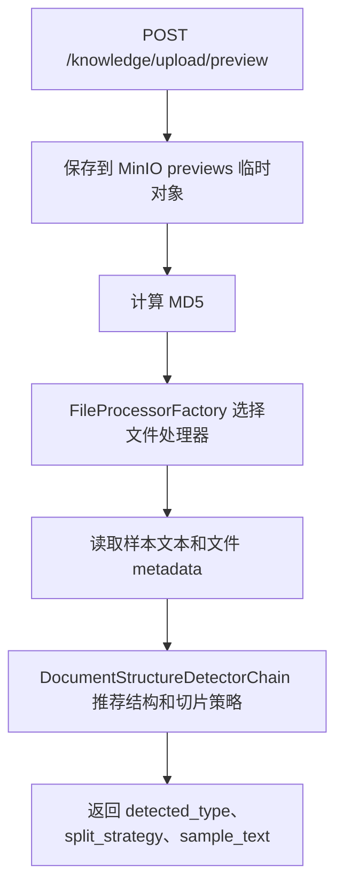
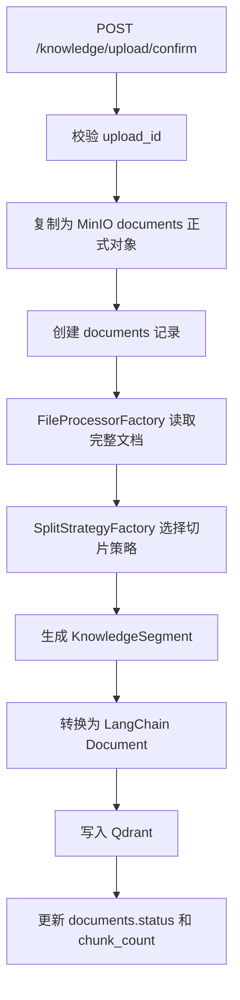

# RAG 上传文件处理与切片策略设计

本文档用于设计知识库上传入库链路的下一阶段重构方案。目标是把当前的文件读取、结构识别、切片规则从集中式 `if/else` 逻辑升级为可扩展的设计模式组合。

核心方向：

1. 文件处理使用“工厂模式 + 策略模式”。
2. 切片规则使用“工厂模式 + 策略模式”。
3. 自动识别文档结构使用“责任链模式”。
4. 入库主流程使用“模板方法模式”或服务编排。
5. 多粒度 chunk 使用“组合模式”的思想表达父子关系。

## 一、当前问题

当前上传入库链路已经支持 `txt` 和 `pdf`，并支持以下切分方式：

| 文档结构 | 切分策略 | 说明 |
| --- | --- | --- |
| `qa` | `numbered_qa` | 编号问答切分 |
| `qa` | `outline_qa` | PDF 书签目录问答切分 |
| `numbered` | `numbered_segments` | 编号条目切分 |
| `text` | `recursive` | 通用递归切分 |

这个设计已经比固定长度 chunk 更成熟，但仍有几个扩展瓶颈：

1. 文件类型扩展不够独立。
   新增 `docx`、`md`、`html`、`xlsx` 时，需要同时改配置、loader、预览、解析入口。

2. 文件读取和向量服务耦合偏重。
   上传预览本质只需要读取文件和识别结构，不应该依赖 Qdrant 初始化。

3. 切片策略集中在 `DocumentParser` 内部。
   当切片规则继续增加时，`DocumentParser` 容易变成大类。

4. 当前主要是“文件级策略”。
   一份文件通常只选择一个 `split_strategy`，但真实文档可能同时包含章节、问答、表格、代码块、普通段落。

5. 缺少多粒度 chunk。
   当前更偏单层 chunk，后续应支持小 chunk、父 chunk、章节摘要、完整 QA 等多层结构。

## 二、总体设计目标

重构后的设计应满足：

1. 新增文件类型时，只新增一个文件处理器，并注册到工厂。
2. 新增切片规则时，只新增一个切片策略，并注册到工厂。
3. 上传预览不依赖 Qdrant，确认入库才依赖 embedding 和 Qdrant。
4. 文档结构识别、切片策略选择、切片执行三者职责分离。
5. 支持文件级策略，也支持后续升级到章节级、片段级策略。
6. Qdrant payload 保留足够 metadata，支持检索、考试、溯源和重建。

## 三、设计模式选型

| 模式 | 使用位置 | 解决问题 |
| --- | --- | --- |
| 工厂模式 | 根据 `file_type` 选择文件处理器；根据 `split_strategy` 选择切片策略 | 消除主流程中的大量 `if/else` |
| 策略模式 | 不同文件读取方式；不同切片规则 | 每种算法独立扩展 |
| 责任链模式 | 文档结构识别和策略推荐 | 多个识别器按顺序判断，命中后返回推荐 |
| 模板方法模式 | 上传入库主流程 | 固定“校验、保存、预览、确认、索引”的流程骨架 |
| 外观模式 | `KnowledgeUploadService` 对外暴露简单接口 | 路由层不感知底层复杂流程 |
| 组合模式 | 父子 chunk、章节 chunk、QA chunk | 表达多粒度知识结构 |
| 适配器模式 | 封装第三方 loader，如 `pypdf`、`python-docx`、OCR、Unstructured | 屏蔽第三方库差异 |

推荐第一阶段落地：

```text
外观模式 + 工厂模式 + 策略模式
```

后续增强：

```text
责任链模式 + 组合模式 + 模板方法模式
```

## 四、目标架构

```mermaid
flowchart TD
    A["KnowledgeUploadService"] --> B["FileProcessorFactory"]
    B --> C["TxtFileProcessor"]
    B --> D["PdfFileProcessor"]
    B --> E["DocxFileProcessor"]
    B --> F["MarkdownFileProcessor"]

    A --> G["DocumentStructureDetectorChain"]
    G --> H["PdfOutlineQaDetector"]
    G --> I["NumberedQaDetector"]
    G --> J["NumberedSegmentDetector"]
    G --> K["PlainTextDetector"]

    A --> L["SplitStrategyFactory"]
    L --> M["RecursiveSplitStrategy"]
    L --> N["NumberedQaSplitStrategy"]
    L --> O["OutlineQaSplitStrategy"]
    L --> P["NumberedSegmentSplitStrategy"]
    L --> Q["MarkdownHeadingSplitStrategy"]

    A --> R["VectorIndexService"]
    R --> S["Qdrant"]
    A --> T["KnowledgeStore MySQL"]
```



## 五、文件处理策略设计

文件处理策略负责把不同类型的原始文件转成统一的 `Document` 列表。

### 5.1 接口定义

```python
from abc import ABC, abstractmethod
from langchain_core.documents import Document


class BaseFileProcessor(ABC):
    """知识库文件处理器接口。"""

    @abstractmethod
    def support_file_type(self, file_type: str) -> bool:
        """判断当前处理器是否支持指定文件类型。"""

    @abstractmethod
    def load_documents(self, file_path: str) -> list[Document]:
        """读取原始文件，并转换为 LangChain Document 列表。"""

    def load_preview_text(self, file_path: str, max_chars: int = 5000) -> str:
        """读取预览文本，默认复用 load_documents。"""

        documents = self.load_documents(file_path)
        return "\n\n".join(document.page_content for document in documents)[:max_chars]
```

### 5.2 具体实现

```text
TxtFileProcessor
  负责 TXT 文件读取。

PdfFileProcessor
  负责 PDF 文本读取、页码 metadata、PDF 书签目录读取。

DocxFileProcessor
  负责 Word 文档段落、标题、表格读取。

MarkdownFileProcessor
  负责 Markdown 标题层级、代码块、表格读取。
```

### 5.3 工厂设计

```python
class FileProcessorFactory:
    """根据文件类型选择知识库文件处理器。"""

    _processors: list[BaseFileProcessor] = []

    @classmethod
    def register(cls, processor: BaseFileProcessor) -> None:
        """注册文件处理器。"""

        cls._processors.append(processor)

    @classmethod
    def get_processor(cls, file_type: str) -> BaseFileProcessor:
        """返回支持指定文件类型的处理器。"""

        for processor in cls._processors:
            if processor.support_file_type(file_type):
                return processor
        raise ValueError(f"不支持的知识库文件类型：{file_type}")
```

## 六、切片策略设计

切片策略负责把统一的 `Document` 列表切成知识片段。

### 6.1 核心概念

```text
FileProcessor
  负责读文件。

DocumentStructureDetector
  负责判断文档结构和推荐 split_strategy。

SplitStrategy
  负责真正切片。
```

### 6.2 上下文对象

```python
from dataclasses import dataclass
from langchain_core.documents import Document


@dataclass
class SplitContext:
    """切片上下文。"""

    document_id: str
    filename: str
    file_md5: str
    version: int
    document_type: str
    split_strategy: str
    documents: list[Document]
    outline: list[dict] | None = None
```

### 6.3 切片结果对象

```python
from dataclasses import dataclass, field


@dataclass
class KnowledgeSegment:
    """知识片段。"""

    segment_id: str
    content: str
    segment_index: int
    content_type: str = "segment"
    page_no: int | None = None
    heading_path: str | None = None
    parent_segment_id: str | None = None
    chunk_level: str = "child"
    metadata: dict = field(default_factory=dict)
```

### 6.4 策略接口

```python
from abc import ABC, abstractmethod


class BaseSplitStrategy(ABC):
    """知识库切片策略接口。"""

    @abstractmethod
    def support_strategy(self, split_strategy: str) -> bool:
        """判断当前策略是否支持指定切分方式。"""

    @abstractmethod
    def split(self, context: SplitContext) -> list[KnowledgeSegment]:
        """执行切片并返回知识片段。"""
```

### 6.5 具体策略

| 策略类 | 对应 `split_strategy` | 说明 |
| --- | --- | --- |
| `RecursiveSplitStrategy` | `recursive` | 普通文本兜底切分 |
| `NumberedQaSplitStrategy` | `numbered_qa` | 编号问答切分 |
| `OutlineQaSplitStrategy` | `outline_qa` | PDF 书签目录问答切分 |
| `NumberedSegmentSplitStrategy` | `numbered_segments` | 编号条目切分 |
| `MarkdownHeadingSplitStrategy` | `markdown_heading` | Markdown 标题层级切分 |
| `TableSplitStrategy` | `table` | 表格行、表格块切分 |
| `ParentChildSplitStrategy` | `parent_child` | 多粒度父子 chunk 切分 |

### 6.6 切片策略工厂

```python
class SplitStrategyFactory:
    """根据 split_strategy 选择知识库切片策略。"""

    _strategies: list[BaseSplitStrategy] = []

    @classmethod
    def register(cls, strategy: BaseSplitStrategy) -> None:
        """注册切片策略。"""

        cls._strategies.append(strategy)

    @classmethod
    def get_strategy(cls, split_strategy: str) -> BaseSplitStrategy:
        """返回支持指定切分方式的策略。"""

        for strategy in cls._strategies:
            if strategy.support_strategy(split_strategy):
                return strategy
        raise ValueError(f"不支持的知识库切片策略：{split_strategy}")
```

## 七、文档结构识别责任链

结构识别不建议写成一个巨大函数，而是拆成多个 detector。

```text
PdfOutlineQaDetector
  如果 PDF 有稳定两层书签，且二级目录像题目，推荐 outline_qa。

NumberedQaDetector
  如果文本中大量出现编号问题和答案，推荐 numbered_qa。

NumberedSegmentDetector
  如果文本中大量出现编号条目，但不是问答，推荐 numbered_segments。

PlainTextDetector
  兜底推荐 recursive。
```

### 7.1 Detector 接口

```python
from dataclasses import dataclass


@dataclass
class DetectionResult:
    """文档结构识别结果。"""

    document_type: str
    split_strategy: str
    confidence: float
    reasons: list[str]
    matched: bool = True


class BaseStructureDetector:
    """文档结构识别器接口。"""

    def detect(self, filename: str, sample_text: str, metadata: dict) -> DetectionResult | None:
        """识别文档结构；无法识别时返回 None。"""
```

### 7.2 责任链执行

```python
class DocumentStructureDetectorChain:
    """文档结构识别责任链。"""

    def __init__(self, detectors: list[BaseStructureDetector]):
        self.detectors = detectors

    def detect(self, filename: str, sample_text: str, metadata: dict) -> DetectionResult:
        """按顺序执行识别器，返回第一个命中的结果。"""

        for detector in self.detectors:
            result = detector.detect(filename, sample_text, metadata)
            if result is not None and result.matched:
                return result
        return DetectionResult(
            document_type="text",
            split_strategy="recursive",
            confidence=0.5,
            reasons=["未命中特定结构，使用通用递归切分"],
        )
```

## 八、多粒度切片设计

好的 RAG 上传切片不应该只有单层 chunk。推荐逐步支持父子 chunk。

```text
章节父 chunk
  保存章节标题、章节摘要、章节完整路径。

子 chunk
  保存可精准召回的小片段。

完整 QA chunk
  保存一道题的完整问答。

长答案子 chunk
  长答案二次切片，多个片段共享 question_id。
```

Qdrant payload 建议补充：

| 字段 | 说明 |
| --- | --- |
| `document_id` | 文件 ID |
| `version` | 文件索引版本 |
| `segment_id` | 当前片段 ID |
| `parent_segment_id` | 父片段 ID |
| `chunk_level` | `parent` / `child` / `summary` |
| `content_type` | `qa` / `segment` / `table` / `code` / `summary` |
| `split_strategy` | 当前片段来源策略 |
| `section_path` | 章节路径 |
| `question_id` | 问答题 ID |
| `source_page` | 来源页码 |
| `knowledge_point` | 知识点，可后续由模型抽取 |
| `tags` | 标签 |

检索时推荐：

1. 先用 child chunk 精准召回。
2. 根据 `parent_segment_id` 找到父 chunk。
3. 把 child chunk 和父级上下文组合后送入回答模型。

## 九、上传入库流程改造

### 9.1 预览阶段



预览阶段不访问 Qdrant。

### 9.2 确认入库阶段



后续建议把确认入库改成后台任务，避免接口长时间阻塞。

## 十、目录建议

推荐新增目录：

```text
rag/
  file_processors/
    __init__.py
    base.py
    factory.py
    txt_processor.py
    pdf_processor.py
    docx_processor.py

  split_strategies/
    __init__.py
    base.py
    factory.py
    recursive_strategy.py
    numbered_qa_strategy.py
    outline_qa_strategy.py
    numbered_segment_strategy.py

  structure_detectors/
    __init__.py
    base.py
    chain.py
    pdf_outline_qa_detector.py
    numbered_qa_detector.py
    numbered_segment_detector.py
    plain_text_detector.py
```

`DocumentParser` 后续可以逐步收敛为协调器，或者拆分后只保留兼容入口。

## 十一、第一阶段落地计划

第一阶段目标是结构清晰，不强求一次支持所有新文件类型。

1. 新增 `rag/file_processors`。
2. 把当前 `txt_loader`、`pdf_loader` 包成 `TxtFileProcessor`、`PdfFileProcessor`。
3. 新增 `FileProcessorFactory`，替换 `VectorStoreService.get_file_documents()` 中的 `if/else`。
4. 新增 `rag/split_strategies`。
5. 把当前 `recursive`、`numbered_qa`、`outline_qa`、`numbered_segments` 拆成策略类。
6. 新增 `SplitStrategyFactory`，让 `DocumentParser` 调用策略，而不是内部硬编码分支。
7. 保持 API 响应结构不变，确保前端无感。
8. 补充单元测试：每个文件处理器、每个切片策略至少一组测试。

## 十二、第二阶段落地计划

第二阶段开始增强能力。

1. 新增 `DocumentStructureDetectorChain`，拆分结构识别逻辑。
2. 上传预览从 `VectorStoreService.preview_file()` 迁移到独立 `DocumentPreviewService`。
3. 新增 `docx` 或 `md` 文件处理器，验证扩展效果。
4. 引入 `parent_segment_id`、`chunk_level`，支持父子 chunk。
5. 检索链路支持 child 命中后补父 chunk。
6. 后台索引任务化，`confirm` 返回 `document_id/job_id`。

## 十三、设计收益

重构完成后：

1. 新增文件类型更简单。
   只需新增文件处理器并注册，不改上传主流程。

2. 新增切片规则更简单。
   只需新增切片策略并注册，不改 `VectorStoreService` 和路由。

3. 预览链路更稳定。
   Qdrant 故障不影响上传预览。

4. RAG 效果更可控。
   不同文档结构使用不同切片算法，减少误切和语义断裂。

5. 后续考试模块更好用。
   `question_id`、`section_path`、`knowledge_point` 等 metadata 更稳定，题源筛选和章节测评更容易实现。

## 十四、结论

当前项目已经具备结构化 RAG 上传的基础能力。下一步最合适的方向不是继续堆 `if/else`，而是把文件处理和切片规则抽成可注册、可扩展的策略体系。

推荐最终形态：

```text
KnowledgeUploadService
  -> FileProcessorFactory
  -> DocumentStructureDetectorChain
  -> SplitStrategyFactory
  -> VectorIndexService
```

这套设计既符合当前项目规模，也能支撑后续扩展 `docx`、`md`、表格、OCR、多粒度 chunk 和后台索引任务。
