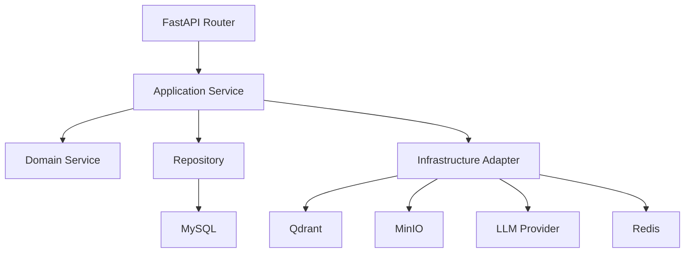

# V2 大爆炸重构设计

## 1. 重构结论

本次采用“方案一”：直接建立 V2 新架构，旧兼容层和历史测试业务链路不再保留。业务数据除字典外都可以重建，接口允许破坏式调整。字典内容保留原样，只迁移到新的字典仓储和接口中继续使用。

## 2. 当前主要问题

### 2.1 后端架构问题

| 问题 | 现状 | V2 处理方式 |
| --- | --- | --- |
| API 与业务混杂 | `api/routers` 里存在较多流程编排、状态处理和异常处理 | 路由只做参数校验和响应转换，业务移动到 application service |
| 仓储过大 | `rag/knowledge_store.py` 同时管文件、字典、会话、考试 | 拆成 `DictionaryRepository`、`DocumentRepository`、`ConversationRepository`、`ExamRepository` |
| 销售训练服务过大 | `training/services/sales_training_service.py` 超过 2800 行 | 拆成资料、画像、目标、对话、评分五个应用服务 |
| 兼容文件太多 | `api/chat_services.py`、`rag/vector_store.py` 等只是旧导入路径 | 删除兼容入口，所有调用改成 V2 正式路径 |
| 自动补表污染启动 | 启动时 service/repository 自动 ALTER 表 | V2 使用明确初始化 SQL，不在业务类里偷偷改表 |
| 配置与硬编码混用 | collection、状态码、默认页大小、模型档位散落 | 稳定常量集中到配置对象，业务可配置项走字典 |

### 2.2 前端架构问题

| 问题 | 现状 | V2 处理方式 |
| --- | --- | --- |
| 页面文件过大 | `SalesTrainingPage.vue` 约 5700 行，`HomePage.vue` 约 2200 行 | 拆成 feature 模块、页面容器、组件、composable |
| API 全堆在一个文件 | `src/api.ts` 超过 1200 行 | 拆成 `shared/api/http.ts` 和各业务 client |
| 页面信息堆叠 | 销售陪练一个页面展示上传、画像、目标、聊天、评分 | 改成工作台、资料库、方案向导、训练对话、复盘评分 |
| 深色浅色不统一 | 部分弹窗、列表、按钮在主题下可读性差 | 建统一设计 token 和通用科技商务组件 |
| 操作入口重复 | 首页、聊天页、销售训练页都有知识库/资料入口 | 首页做驾驶舱，知识资产统一入口，业务页只保留当前流程所需入口 |

## 3. V2 后端目标架构



### 3.1 目录结构

```text
app_v2/
  api/
    router.py
    routes/
      auth.py
      dashboard.py
      dictionaries.py
      knowledge.py
      chat.py
      training.py
      exam.py
  application/
    auth_service.py
    dashboard_service.py
    dictionary_service.py
    knowledge_service.py
    chat_service.py
    training/
      material_service.py
      profile_service.py
      goal_service.py
      session_service.py
      scoring_service.py
  domain/
    constants.py
    schemas.py
    errors.py
  infrastructure/
    repositories/
    adapters/
    factories/
  shared/
    pagination.py
    response.py
    logging.py
```

`api/main.py` 只创建 FastAPI 应用并挂载 V2 Router。旧 `api/services`、旧 re-export 文件、旧 Streamlit `app.py` 删除。

### 3.2 接口原则

| 模块 | V2 路径 | 说明 |
| --- | --- | --- |
| 登录 | `/api/v2/auth/*` | JWT access token + refresh cookie |
| 首页 | `/api/v2/dashboard/overview` | 聚合服务状态、知识库、训练、最近会话 |
| 字典 | `/api/v2/dictionaries/*` | 保留字典内容，支持父子层级和分页 |
| 知识库 | `/api/v2/knowledge/*` | 普通知识和训练资料统一文件资产入口 |
| 智能客服 | `/api/v2/chat/*` | 一次性和流式都支持 |
| 销售训练 | `/api/v2/training/*` | 资料、方案、画像、目标、会话、评分分模块 |
| 问答考试 | `/api/v2/exam/*` | 从知识库题源生成问答测试 |

旧接口不再作为主要协议维护。前端同步改到 V2 client。

## 4. 数据设计

### 4.1 保留表

| 表 | 保留原因 |
| --- | --- |
| `dictionary_items` | 用户明确要求字典内容原样保留 |
| `system_users` | 登录需要；默认 admin / 1234qwer |

### 4.2 重建表

业务测试数据可以不保留，V2 允许重建以下表：

| 表 | 字段重点 | 说明 |
| --- | --- | --- |
| `documents` | `document_id`、`filename`、`file_md5`、`bucket_name`、`object_name`、`asset_type`、`collection_name`、`status` | 文件资产唯一台账，MinIO 是唯一文件存储 |
| `document_indexes` | `index_id`、`document_id`、`collection_name`、`chunk_count`、`index_version`、`status` | 文件向量索引状态，不把切片正文写 MySQL |
| `conversations` | `conversation_id`、`user_id`、`title`、`status`、`last_message_at` | 聊天会话主表 |
| `conversation_messages` | `message_id`、`conversation_id`、`role`、`content`、`metadata_json` | 聊天消息 |
| `training_materials` | `material_id`、`document_id`、`source_type`、`status`、`quality_report_json` | 销售训练资料 |
| `training_plans` | `plan_id`、`plan_name`、`trainee_json`、`customer_profile_json`、`scenario_json`、`status` | 训练方案和分步结果 |
| `training_sessions` | `session_id`、`plan_id`、`response_mode`、`round_limit`、`status` | 一场开放式训练 |
| `training_turns` | `turn_id`、`session_id`、`role`、`content`、`analysis_json` | 对话与教练分析 |
| `training_scores` | `score_id`、`session_id`、`general_score`、`stage_score`、`final_score`、`detail_json` | 训练评分 |
| `exam_sessions` / `exam_questions` | 考试记录、题目、答案、评分 | 问答考试 |

### 4.3 字段含义示例

#### `documents`

| 字段 | 含义 |
| --- | --- |
| `document_id` | 文件资产编号，删除、预览、重建索引都靠它定位 |
| `filename` | 用户上传的原始文件名 |
| `file_md5` | 文件内容 MD5，用于重复校验 |
| `bucket_name` | MinIO 桶名 |
| `object_name` | MinIO 对象路径 |
| `asset_type` | `knowledge`、`training`、`system_seed` 等文件用途 |
| `collection_name` | 对应 Qdrant collection |
| `status` | `uploaded`、`indexed`、`failed`、`deleted` |

#### `training_plans`

| 字段 | 含义 |
| --- | --- |
| `plan_id` | 训练方案编号 |
| `plan_name` | 训练名称，V2 建议唯一，避免列表难识别 |
| `trainee_json` | 学员画像快照 |
| `customer_profile_json` | 客户画像选择和 AI 生成结果 |
| `scenario_json` | 场景描述、补充细节、AI 润色结果 |
| `goal_json` | 开放式训练目标、目标达成条件、失败条件、动态轮数 |
| `scoring_json` | 40 分通用能力 + 60 分 LLM 阶段能力 |
| `status` | `draft`、`ready`、`training`、`completed` |

## 5. 查询与性能优化

| 查询 | 当前风险 | V2 优化 |
| --- | --- | --- |
| 字典查询 | 多处每次请求创建 `KnowledgeStore` 并反复查字典 | 字典仓储统一 Redis 缓存，写操作后清缓存 |
| 文档列表 | 文件列表和训练资料列表 join/兼容字段复杂 | 文件台账统一，训练资料只关联 `document_id` |
| 会话列表 | 模糊查未统一转义，分页逻辑散落 | 统一 `PageRequest` 和 LIKE 转义工具 |
| 首页统计 | 前端多接口拼装 | 后端 dashboard 聚合接口一次返回 |
| Qdrant 查询 | collection 名称散落，重复初始化服务 | Vector adapter 工厂按 collection 缓存 |
| LLM 调用 | 训练服务内 prompt 和调用混在一起 | LLM adapter + prompt builder 分离，日志统一中文输出 |

## 6. 硬编码治理

| 类型 | 处理方式 |
| --- | --- |
| 业务状态码 | 字典或集中常量，不在页面和 service 里散写 |
| 默认页大小、最大页大小 | `app_v2/domain/constants.py` |
| collection 名称 | `config/storage.yml` 和 `config/training.yml`，通过配置对象读取 |
| 模型档位 | 字典 + `config/app.yml` 映射 |
| 前端菜单、页面标题 | `src/shared/navigation.ts` |
| 评分 40/60 | `training/scoring_policy.py` 固定策略，页面可编辑考核点 |

## 7. 前端 V2 设计

### 7.1 页面结构

```text
src/
  app/
    AppShell.vue
    LoginGate.vue
    navigation.ts
  shared/
    api/
    components/
    composables/
    styles/
  features/
    dashboard/
    dictionaries/
    knowledge/
    chat/
    sales-training/
    exam/
```

### 7.2 主页面

| 页面 | 使用者目标 | V2 展示 |
| --- | --- | --- |
| 首页驾驶舱 | 快速看系统是否可用、资料是否正常、进入高频任务 | 服务状态、知识资产、销售训练驾驶舱、最近会话、快捷入口 |
| 智能客服 | 聚焦问答 | 左侧知识库选择和会话，右侧聊天，输入框固定底部 |
| 知识资产 | 管理普通知识和训练资料 | 普通知识 / 训练资料 tab，上传、去重、预览、删除、重建索引 |
| 销售训练 | 建方案、生成角色、训练、评分复盘 | 列表页 + 创建向导 + 独立训练对话页 + 复盘页 |
| 字典管理 | 管父子级配置 | 父级分页，点击进入子级，新增/修改/启用/禁用/删除都有二次确认 |
| 问答考试 | 基于知识库抽题评分 | 题源选择、题量设置、答题、LLM 判分和试卷查看 |

### 7.3 页面视觉

统一采用“科技商务”风格：

- 深色和浅色主题共用 CSS token。
- 卡片只用于单个数据块，不再卡片套卡片。
- 按钮使用 lucide 图标和明确操作状态。
- 列表优先显示关键字段，长文本 20 字截断，悬浮或点击查看完整内容。
- 销售训练不再一屏塞满，按任务流拆成向导和独立训练页。

## 8. 使用的设计模式

| 设计模式 | 使用位置 | 选择原因 |
| --- | --- | --- |
| 外观模式 | `KnowledgeApplicationService`、`TrainingApplicationService` | 给路由层一个简洁入口，隐藏 MinIO、Qdrant、MySQL、LLM 细节 |
| 策略模式 | 文件切片、训练资料解析、评分规则 | 不同资料类型和评分方式可替换 |
| 工厂方法模式 | LLM、Embedding、VectorStore、FileProcessor 创建 | 根据配置创建具体实现 |
| 适配器模式 | MinIO、Qdrant、OpenAI-compatible、Redis | 把第三方 SDK 包装成项目内部接口 |
| 责任链模式 | API 请求鉴权、异常、日志、审计中间件 | 横切逻辑按顺序处理 |
| 模板方法模式 | 上传预览、确认入库、发布训练资料 | 固定流程，差异步骤由子类/策略实现 |
| 建造者模式 | LLM prompt 构造 | 分阶段组装复杂提示词，避免长函数拼字符串 |

## 9. 第一阶段交付边界

本次“大爆炸重写”的第一阶段必须完成：

1. 新建 V2 后端目录结构，并让 `api/main.py` 挂载 V2 router。
2. 删除旧兼容导入文件和旧 Streamlit 入口。
3. 拆出字典、文档、会话、训练资料的 V2 仓储和服务。
4. 首页改为 V2 dashboard 聚合接口。
5. 前端拆出 shared api、layout、feature 页面壳，销售训练和知识资产从大页面中拆出。
6. 保留字典内容，不清空 `dictionary_items`。
7. 新增中文日志，关键 LLM 调用、RAG 检索、上传入库、训练评分都打印中文信息。
8. 保证登录、首页、智能客服、知识资产、销售训练资料、训练对话主流程可运行。

## 10. 明确删除范围

| 文件/目录 | 处理 |
| --- | --- |
| `app.py` | 删除，Streamlit 旧入口不用 |
| `api/chat_services.py`、`api/common_services.py`、`api/indexing_services.py`、`api/upload_services.py` | 删除旧 re-export |
| `rag/rag_service.py`、`rag/query_planner.py`、`rag/vector_store.py` | 删除旧 re-export |
| `api/services/__init__.py` 聚合导出 | 删除或清空，不再作为兼容入口 |
| 前端 `src/api.ts` | 拆分后删除 |
| 前端超大页面 | 拆成 feature 模块后替换为轻页面容器 |

不删除：

- 字典数据。
- `domain/entities.py` 可作为第一阶段 ORM 基础保留，后续再拆。
- `infrastructure/file_storage_service.py`、`infrastructure/vector_store_service.py` 可作为适配器基础保留并迁到 V2 调用。

