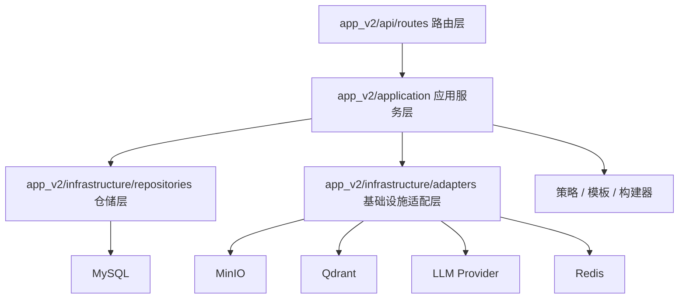

# 全量 V2 化三周迁移设计

> 本文档承接 `04-V2重构整改复盘与尾巴清单.md`，用于规划剩余旧依赖如何在 3 周内稳妥迁移到 V2 架构。  
> 目标不是继续做“大爆炸式删除”，而是按业务链路逐步替换真实实现，最后用扫描、测试和文档确认旧入口可以退场。

## 1. 设计结论

本轮采用 **3 周稳妥推进**：

1. 第 1 周优先拆销售训练核心大类。
2. 第 2 周迁移知识上传、文件资产和索引链路。
3. 第 3 周前半迁移聊天 RAG 与考试 V2 入口，后半做旧依赖扫描、回归测试和文档沉淀。

这样排序的原因：

- 销售训练是当前业务复杂度最高、后续需求最多的模块，继续叠功能会扩大旧大类风险。
- 知识上传和索引是 MinIO、Qdrant、documents 表统一的基础链路，必须在删除旧上传服务前稳定。
- 聊天 RAG 和考试都依赖检索、会话、题源等底层能力，放在基础链路之后迁移更稳。
- 最后一段时间必须留给旧依赖扫描，避免“看起来 V2 化，实际运行仍走旧服务”。

## 2. 当前基线

### 2.1 已具备的 V2 能力

- `app_v2` 分层结构已建立，`api/main.py` 已挂载 `/api/v2`。
- 字典、文档、会话已拆出部分 V2 repository。
- 首页驾驶舱、知识资产、销售训练画像已经开始使用 V2 字典仓储。
- 前端主入口已统一调用 `/api/v2`，页面已迁到 `src/features/*`。
- 最近目标测试记录为 `42 passed`，主要 warning 是既有 deprecation。

### 2.2 仍然不能删除的旧依赖

| 旧模块 | 当前原因 | 全量 V2 化目标 |
| --- | --- | --- |
| `training.services.sales_training_service` | 资料、画像、目标、会话、评分真实逻辑仍集中在旧大类 | 真实业务拆到 V2 training application services |
| `api.services.upload_services` | 上传预览、临时对象、MinIO 提升仍被 V2 知识服务复用 | 拆到 V2 knowledge 子服务和 file storage adapter |
| `api.services.indexing_services` | 索引构建和 data 目录同步仍复用旧函数 | 拆到 V2 indexing service，统一依赖 repository 和 adapter |
| `api.services.document_asset_service` | 删除链路仍是旧服务承接真实协调逻辑 | 移到 V2 document asset service 或 knowledge asset service |
| `api.services.chat_services` | 直连 RAG、Agent、流式输出、保存消息仍在旧服务 | 拆到 V2 chat generation service 和策略类 |
| `api.routers.exam` | V2 exam 路由只是直接挂旧路由 | 新建 V2 exam application service 和 repository |
| `rag.knowledge_store` | 仍被聊天、考试、上传、训练等链路使用 | 方法按业务域迁出，生产代码不再依赖 |

## 3. 全量 V2 化边界

### 3.1 本轮必须完成

- `app_v2` 不再导入旧 `api.services.chat_services`、`api.services.upload_services`、`api.services.indexing_services`。
- `app_v2/api/routes/exam.py` 不再直接 `from api.routers.exam import router`。
- 销售训练 V2 服务不再把核心业务委托给 `SalesTrainingService`。
- 知识上传、预览、确认入库、索引、删除链路统一经过 V2 service、repository、adapter。
- 前端继续只调用 `/api/v2/*`。
- 旧依赖扫描结果能解释：哪些已删除，哪些仅作为测试或历史文档引用保留。

### 3.2 本轮不做或不强行做

- 不在第一天直接删除所有旧文件。
- 不为即将删除的旧大类补大量注释。
- 不重做前端视觉体系，只做与 V2 接口迁移相关的必要调整。
- 不强行清理所有历史 Markdown 里的旧路径描述，但最终设计和执行记录必须说明当前真实路径。

## 4. 目标架构

### 4.1 后端分层



### 4.2 模块边界

| 模块 | V2 入口 | 职责 |
| --- | --- | --- |
| 字典 | `DictionaryApplicationService` | 字典分页、父子级、缓存、默认值、编码归一化 |
| 知识资产 | `KnowledgeApplicationService` | 上传预览、确认入库、列表、详情、预览、删除、重建索引 |
| 文件资产 | `DocumentAssetApplicationService` | MinIO 对象、documents、Qdrant 删除协调 |
| 索引 | `KnowledgeIndexingService` | 读文件、切片、写向量库、更新索引状态 |
| 聊天 | `ChatApplicationService` | 聊天入口、会话查询、流式/一次性响应外观 |
| 生成 | `ChatGenerationService` | 直连 RAG、Agent、兜底模型策略选择和回答生成 |
| 销售训练 | `training/*_service.py` | 资料、画像、目标、方案、会话、评分分域实现 |
| 考试 | `ExamApplicationService` | 题源选择、题目生成、答题、评分、试卷记录 |

### 4.3 设计模式使用

| 场景 | 模式 | 使用方式 |
| --- | --- | --- |
| 聊天回答链路 | 策略模式 | `DirectRagStrategy`、`AgentStrategy`、`FallbackModelStrategy` |
| 文件索引流程 | 模板方法 | 固定“读文件 -> 切片 -> 入库 -> 更新状态”，具体处理由子步骤实现 |
| 文件存储和向量库 | 适配器模式 | MinIO、Qdrant 对应用层隐藏 SDK 细节 |
| 销售训练角色和评分规则 | 建造者模式 | 组装客户画像、训练目标、评分规则快照 |
| 销售训练会话阶段 | 状态模式 | `draft`、`ready`、`training`、`completed`、`failed` |
| 应用入口 | 外观模式 | 路由只调用应用服务，复杂子系统在服务内部编排 |

## 5. 三周路线图

### 第 1 周：销售训练核心 V2 化

目标：把销售训练真实业务从旧 `SalesTrainingService` 拆到 V2 services，旧大类只允许作为临时对照，不能继续承接新增逻辑。

#### 主要任务

1. `material_service.py` 接管训练资料上传、预览、发布、回滚、重解析、版本和 chunks 查询。
2. `profile_service.py` 接管学员画像、客户画像、角色生成、场景润色。
3. `goal_service.py` 接管开放式训练目标、动态轮数、达成条件和失败条件。
4. `plan_service.py` 接管训练方案创建、查询、删除和方案快照。
5. `session_service.py` 接管训练会话创建、每轮检索、客户回复、会话状态。
6. `scoring_service.py` 接管 40 分通用评分、60 分阶段评分和最终报告。
7. 把旧私有 mapper 移到 V2 mapper/helper，首页和训练页面不再调用旧私有转换方法。

#### 关键验收

- V2 training 服务核心路径不再实例化 `SalesTrainingService`。
- 销售训练接口 OpenAPI 路径保持 `/api/v2/training/*`。
- 训练资料、方案、画像、会话、评分目标测试通过。
- 新增或迁移的类、方法保留中文注释，说明职责和迁移原因。

#### 建议验证

```powershell
.\.venv312\Scripts\python.exe -m pytest tests\test_v2_training_no_legacy_service.py tests\test_v2_training_profile_service.py tests\test_sales_training_repository.py -q
.\.venv312\Scripts\python.exe -m pytest tests\test_api_app.py::test_openapi_exposes_core_routes -q
```

### 第 2 周：知识上传、文件资产和索引 V2 化

目标：让知识资产从上传预览到索引构建都走 V2 service、repository 和 adapter，旧上传/索引服务退出 V2 运行链路。

#### 主要任务

1. 新建 `app_v2/application/knowledge/upload_preview_service.py`。
2. 新建 `app_v2/application/knowledge/indexing_service.py`。
3. 新建 `app_v2/application/knowledge/document_asset_service.py`。
4. 把 `_save_preview_file`、`_get_preview_file`、`_promote_preview_file`、`_delete_preview_file` 迁到 V2。
5. 把 `_index_document` 迁到 V2，依赖 `DocumentRepository`、`FileStorageAdapter`、`VectorStoreAdapter`。
6. 明确 `uploads/_preview` 和 MinIO 临时对象的生命周期，避免测试清理逻辑和真实运行逻辑混淆。
7. 全量重建索引不再通过旧 `KnowledgeStore` 读取 documents。

#### 关键验收

- `app_v2/application/knowledge_service.py` 不再导入旧 `api.services.upload_services`、`api.services.indexing_services`。
- 文档确认入库、单文件重建、全量重建都通过 `DocumentRepository` 更新状态。
- 删除文件时能同时处理 documents、MinIO、Qdrant，失败日志使用中文并打印堆栈。
- MinIO 仍是唯一文件持久化入口，本地目录只作为临时缓存或测试辅助。

#### 建议验证

```powershell
.\.venv312\Scripts\python.exe -m pytest tests\test_v2_knowledge_service.py tests\test_document_asset_service.py -q
.\.venv312\Scripts\python.exe -m pytest tests\test_minio_client.py tests\test_processor_and_strategy_factories.py -q
```

### 第 3 周前半：聊天 RAG 与考试 V2 化

目标：聊天生成链路和考试入口不再挂旧服务，`KnowledgeStore` 的生产调用点进一步收缩。

#### 聊天主要任务

1. 新建 `app_v2/application/rag_service.py`，封装检索、重排、上下文拼装。
2. 新建 `app_v2/application/chat_generation_service.py`，统一一次性回答和流式回答。
3. 把 `_should_use_direct_rag`、`_stream_direct_rag`、`_stream_agent` 拆成策略类。
4. 把 `_prepare_chat_conversation`、`_save_chat_exchange` 改为调用 `ConversationRepository`。
5. SSE 事件名保持英文协议，日志内容保持中文。

#### 考试主要任务

1. 新建 `app_v2/application/exam_service.py`。
2. 新建 `app_v2/infrastructure/repositories/exam_repository.py`。
3. 把考试 session、题目生成、答题、评分从旧路由拆出。
4. 把题源检索封装到 V2 adapter，不在路由里直接操作旧 `KnowledgeStore`。
5. `app_v2/api/routes/exam.py` 改为调用 V2 service。

#### 关键验收

- `app_v2/application/chat_service.py` 不再导入 `api.services.chat_services`。
- `app_v2/api/routes/exam.py` 不再挂载 `api.routers.exam`。
- 聊天记录查询、消息保存、会话删除统一走 `ConversationRepository`。
- 考试 session、题目、答案、评分有独立 repository 或清晰的 V2 持久化入口。

#### 建议验证

```powershell
.\.venv312\Scripts\python.exe -m pytest tests\test_v2_chat_service.py tests\test_api_app.py -q
.\.venv312\Scripts\python.exe -m pytest tests\test_api_app.py::test_openapi_exposes_core_routes -q
```

### 第 3 周后半：旧依赖退场、回归和文档沉淀

目标：确认生产代码已经全量 V2 化，旧模块要么删除，要么明确只作为历史文档或测试替身存在。

#### 主要任务

1. 扫描 `app_v2` 对旧服务、旧路由、旧训练大类和旧 `KnowledgeStore` 的导入。
2. 扫描前端是否仍调用非 `/api/v2` 路径。
3. 对纯兼容壳直接删除。
4. 对仍有真实逻辑的旧文件，先迁移逻辑，再删除或冻结。
5. 更新执行记录和尾巴清单，把已完成项和仍保留项写清楚。
6. 跑后端全量测试、前端契约测试和前端构建。

#### 关键验收

- 旧依赖扫描无未解释的生产调用点。
- 后端目标测试和全量测试通过。
- 前端契约测试和构建通过。
- 文档说明当前真实架构，不再只停留在计划。

#### 建议验证

```powershell
rg -n "from api\.services\.chat_services|from api\.services\.upload_services|from api\.services\.indexing_services|from api\.services\.document_asset_service|from api\.routers\.exam import router|from training\.services\.sales_training_service import SalesTrainingService" app_v2
.\.venv312\Scripts\python.exe -m pytest -q
```

前端项目 `C:\Users\Administrator\WebstormProjects\AI_RAG_Agent_Frontend` 中执行：

```powershell
node scripts/api-url-contract.test.mjs
node scripts/app-shell-contract.test.mjs
node scripts/feature-pages-contract.test.mjs
node scripts/async-pages-contract.test.mjs
npm run build
```

## 6. 阶段验收标准

| 阶段 | 必须通过 | 允许遗留 |
| --- | --- | --- |
| 第 1 周结束 | 销售训练核心逻辑进入 V2 services，新增逻辑不再写入旧大类 | 旧大类可保留少量尚未迁移的只读辅助 |
| 第 2 周结束 | 知识上传、预览、确认、索引不再依赖旧上传/索引服务 | 历史测试可继续引用 fake 或旧路径对照 |
| 第 3 周前半 | 聊天生成和考试入口不再挂旧服务/旧路由 | RAG 底层工具可先保留，但入口必须是 V2 |
| 第 3 周结束 | 旧依赖扫描有清单，测试和构建通过，文档更新 | 历史 docs 中的旧路径描述可保留，但需要标注已过时 |

## 7. 删除旧代码的准入条件

某个旧文件允许删除，必须同时满足：

1. `app_v2` 没有导入它。
2. 前端没有调用它暴露的旧接口。
3. OpenAPI 中不需要继续暴露旧路径。
4. 测试已经覆盖对应 V2 替代路径。
5. 删除后目标测试和相关全量测试通过。

不满足以上条件时，只能冻结旧文件并在注释或执行记录中说明原因，不能直接删除。

## 8. 风险与控制

| 风险 | 表现 | 控制方式 |
| --- | --- | --- |
| 模块同时开刀过多 | 迁移中断后接口不可用 | 每周只定一个主迁移主题 |
| 旧依赖暗中残留 | OpenAPI 是 V2，内部仍走旧服务 | 每周末跑旧依赖扫描 |
| MinIO 真实路径和测试路径混淆 | 测试通过但真实对象不存在 | 单独区分 fake-backed unit test 和 real MinIO integration check |
| RAG 链路回归 | 流式输出、Agent、直连 RAG 行为不一致 | 一次性和流式共享生成服务，只在响应适配层分开 |
| 考试模块迁移过大 | 第 3 周被考试拖住 | 考试先完成 V2 service/repository 入口，复杂题型策略可后续迭代 |
| 前端接口漂移 | 页面请求旧路径或字段不匹配 | 保留 API URL 契约测试，必要时增加模块 client 测试 |

## 9. 文档更新要求

每周结束需要更新：

- `03-V2大爆炸架构与页面治理执行记录.md`：记录实际改动、测试命令和结果。
- `04-V2重构整改复盘与尾巴清单.md`：删除已完成尾巴，补充新发现尾巴。
- 本文档：只在路线、验收标准或退场条件变化时更新。

文档中必须区分三类状态：

- **已迁移**：生产代码已经走 V2。
- **冻结旧实现**：旧代码还在，但不允许新增逻辑。
- **待删除**：无生产调用点，只等回归确认后删除。

## 10. 最终完成标准

可以认为“全量 V2 化”完成，需要同时满足：

- 后端生产入口统一在 `/api/v2/*`。
- `app_v2` 不再导入旧 `api.services.*` 真实业务服务。
- 销售训练核心业务不再委托 `SalesTrainingService`。
- 知识上传、索引、删除统一使用 V2 repository 和 adapter。
- 聊天生成、消息保存、会话查询统一走 V2 chat/rag/conversation 服务。
- 考试模块不再直接挂旧 `api.routers.exam`。
- `rag/knowledge_store.py` 不再被生产代码依赖。
- 前端只调用 `/api/v2/*`。
- 后端全量测试通过。
- 前端契约测试和构建通过。
- 执行记录、尾巴清单和当前代码状态一致。
