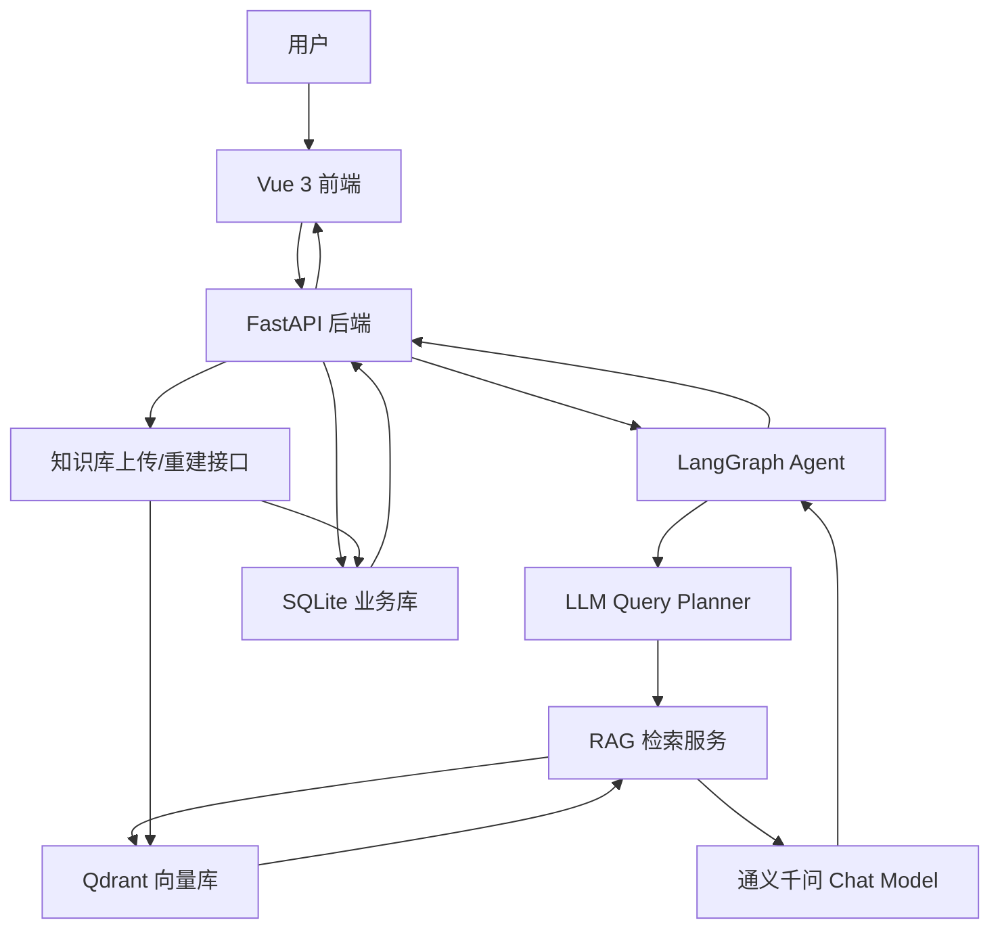
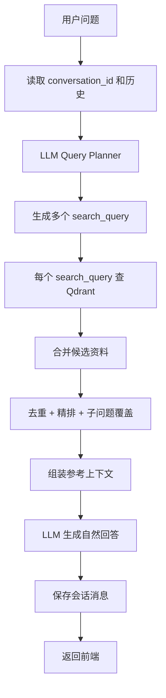
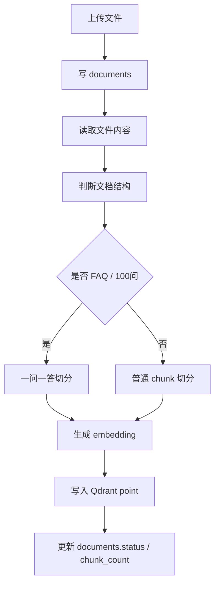

# AI RAG Agent Project Overall Design

本文档是当前项目的整体设计方案，覆盖：

```text
FastAPI 后端
Vue 3 前端
Qdrant 向量库
知识库上传与重建
RAG 检索与回答生成
会话历史持久化
Docker 部署
```

核心原则：

```text
知识答案只走 Qdrant。
SQLite 只做业务元数据。
LLM 负责 query planning 和自然回答。
```

## 0.0 实现状态总览

状态说明：

| 状态 | 含义 |
| --- | --- |
| 已完成 | 当前代码基本已经实现 |
| 部分完成 | 已有雏形，但还没有达到本文档最终设计 |
| 未完成 | 设计已确定，代码尚未实现 |
| 待清理 | 旧逻辑仍在代码或数据库中，需要删除或停用 |

| 模块 | 当前状态 | 说明 |
| --- | --- | --- |
| FastAPI 基础接口 | 已完成 | 已有 `/chat`、`/chat/stream`、`/knowledge/*`、`/health` 等接口 |
| Vue 3 前端 | 已完成 | 已有聊天页面、知识库上传、流式/非流式切换 |
| Qdrant 服务 | 已完成 | 已支持 Docker / Docker Compose 启动 |
| Qdrant 入库 | 部分完成 | 已能写入 Qdrant points，但代码中仍保留写 SQLite 知识表的旧逻辑 |
| FAQ 一问一答切分 | 已完成 | FAQ / 100问 文档按一问一答写入 Qdrant |
| 普通文档切分 | 已完成 | 普通文档按 RecursiveCharacterTextSplitter 切分 |
| 用户答案检索只走 Qdrant | 部分完成 | 当前回答链路已切到 Qdrant，但旧 SQLite 查询方法仍需清理 |
| LLM Query Planner | 未完成 | 需要新增，用于把用户复杂问题拆成多个 `search_query` |
| 多 query 召回 | 未完成 | 需要实现每个 `search_query` 单独查 Qdrant top5 |
| 精排每 query 保留 top2 | 未完成 | 需要实现按子问题分组精排，每个 query 保留 2 条 |
| LLM 最终润色回答 | 部分完成 | FAQ 命中后已开始模型润色，普通多 query 回答还需统一改造 |
| SQLite 知识表清理 | 待清理 | `document_segments`、`faq_items`、`knowledge_units` 应删除/停用 |
| `documents` 文件管理表 | 已完成 | 用于文件记录、状态、版本、chunk_count |
| 会话历史 SQLite 持久化 | 未完成 | 需要新增 `conversations`、`conversation_messages` |
| 前端 conversation_id 支持 | 未完成 | 前端请求需要携带并维护 `conversation_id` |

## 0. 项目整体架构



各组件职责：

| 组件 | 职责 |
| --- | --- |
| Vue 3 前端 | 聊天页面、知识库上传、流式/非流式切换 |
| FastAPI | API 网关、聊天接口、上传接口、健康检查 |
| LangGraph Agent | 管理工具调用、会话上下文、流式输出 |
| Qdrant | 保存知识向量和 payload，作为唯一知识检索来源 |
| SQLite | 保存文件记录、上传状态、会话历史等业务元数据 |
| DashScope Chat Model | Query planning 和最终自然语言回答 |
| DashScope Embedding Model | 文档入库和用户 query 向量化 |

## 0.1 项目关键文件

| 文件/目录 | 作用 |
| --- | --- |
| `api/main.py` | FastAPI 入口，提供聊天、知识库、调试、健康检查接口 |
| `agent/react_agent.py` | LangGraph Agent，负责执行一次性/流式聊天 |
| `agent/tools/agent_tools.py` | Agent 可调用工具 |
| `rag/vector_store.py` | Qdrant 向量库连接、写入、检索、payload filter |
| `rag/rag_service.py` | RAG 检索、query 拆解后的多路召回、上下文组装 |
| `rag/document_parser.py` | 文档类型识别、FAQ/普通文档切分 |
| `rag/reranker.py` | 候选资料精排 |
| `rag/query_pipeline.py` | 旧版规则 query 分析，后续应收敛到 LLM Query Planner |
| `rag/knowledge_store.py` | SQLite 业务元数据存储，最终只保留文件/会话管理 |
| `model/factory.py` | Chat 模型和 Embedding 模型创建 |
| `config/qdrant.yml` | Qdrant、切分、topK 等配置 |
| `config/rag.yml` | 模型名称配置 |
| `config/prompts.yml` | prompt 文件路径配置 |
| `prompts/main_prompt.txt` | Agent 主提示词 |
| `prompts/rag_summarize.txt` | RAG 总结提示词 |
| `Dockerfile` | 后端 API 镜像构建文件 |
| `docker-compose.yml` | API、Qdrant、前端组合部署 |
| `data/` | 内置知识库文件目录 |
| `uploads/` | 用户上传文件保存目录 |
| `storage/knowledge.db` | SQLite 本地业务数据库 |

## 1. 设计结论

本项目的知识问答链路统一收敛为：

```text
知识答案只走 Qdrant。
关系型数据库只做业务元数据，不做知识答案查询。
```

保留 SQLite 的原因是管理业务状态，例如文件上传记录、索引状态、会话历史。
但用户问答不能再依赖 SQLite `LIKE`、`faq_items`、`document_segments` 这类关系型查询。

最终职责边界：

| 组件 | 职责 |
| --- | --- |
| Qdrant | 保存知识 chunk / FAQ / payload / vector，负责知识检索 |
| LLM | 拆解用户问题、生成检索 query、根据参考资料自然回答 |
| SQLite | 保存文件记录、上传状态、会话历史等业务元数据 |
| FastAPI | 提供上传、检索、聊天、会话接口 |

## 2. 为什么不用关系型表查知识答案

真实用户不会严格按照知识库原句提问。

例如知识库中是：

```text
中国市场何时开始普及？
```

用户可能会问：

```text
中国市场啥时候开始普及？
国内扫地机器人哪年开始流行？
中国什么时候开始大规模使用扫地机器人？
```

这类问题本质是语义匹配，不是字符串匹配。

如果用 SQLite：

```sql
WHERE question LIKE '%中国市场啥时候开始普及%'
```

就会因为表达不同而漏掉答案。

因此知识检索应该统一走：

```text
query -> embedding -> Qdrant similarity search -> payload -> LLM answer
```

## 3. 数据存储边界

### 3.1 SQLite 保留表

只保留文件管理表：

```text
documents
```

作用：

| 字段方向 | 用途 |
| --- | --- |
| document_id | 文件唯一标识，用于删除和重建索引 |
| filename | 原始文件名 |
| file_path | 服务端文件路径 |
| file_md5 | 去重 |
| status | uploaded / indexing / indexed / failed / deleted |
| version | 重建索引版本 |
| chunk_count | 写入 Qdrant 的 point 数量 |
| error_message | 入库失败原因 |

### 3.2 SQLite 废弃表

以下表不再作为最终设计保留：

```text
document_segments
faq_items
knowledge_units
```

原因：

```text
Qdrant 已经保存 page_content + metadata + vector。
再存一份到 SQLite 会造成双写、数据不一致和查询路径混乱。
```

### 3.3 会话历史表

会话历史可以用 SQLite，但它和知识库答案无关。

后续可以新增：

```text
conversations
conversation_messages
```

### 3.3.1 conversations 表

`conversations` 保存一条会话的整体信息。

建表 SQL：

```sql
CREATE TABLE conversations (
    conversation_id TEXT PRIMARY KEY,
    user_id TEXT,
    title TEXT,
    status TEXT NOT NULL DEFAULT 'active',
    message_count INTEGER NOT NULL DEFAULT 0,
    summary TEXT,
    metadata_json TEXT,
    created_at TEXT NOT NULL,
    updated_at TEXT NOT NULL,
    last_message_at TEXT
);
```

字段说明：

| 字段 | 类型 | 是否必填 | 说明 |
| --- | --- | --- | --- |
| `conversation_id` | TEXT | 是 | 会话唯一 ID，例如 `conv_xxx`。前端每次聊天都带这个 ID。 |
| `user_id` | TEXT | 否 | 用户 ID。未登录或匿名用户可以为空。 |
| `title` | TEXT | 否 | 会话标题，可由第一条用户问题生成。 |
| `status` | TEXT | 是 | 会话状态，建议值：`active`、`archived`、`deleted`。 |
| `message_count` | INTEGER | 是 | 当前会话消息数量，便于列表展示和统计。 |
| `summary` | TEXT | 否 | 长会话压缩摘要。历史太长时，可把早期消息总结到这里。 |
| `metadata_json` | TEXT | 否 | 扩展字段，JSON 字符串，例如来源端、业务场景、客户端版本。 |
| `created_at` | TEXT | 是 | 创建时间，建议 ISO 字符串。 |
| `updated_at` | TEXT | 是 | 最近更新时间。 |
| `last_message_at` | TEXT | 否 | 最后一条消息时间，用于会话列表排序。 |

建议索引：

```sql
CREATE INDEX idx_conversations_user_updated
ON conversations(user_id, updated_at);

CREATE INDEX idx_conversations_status
ON conversations(status);
```

### 3.3.2 conversation_messages 表

`conversation_messages` 保存会话中的每一条消息。

建表 SQL：

```sql
CREATE TABLE conversation_messages (
    message_id TEXT PRIMARY KEY,
    conversation_id TEXT NOT NULL,
    sequence_no INTEGER NOT NULL,
    role TEXT NOT NULL,
    content TEXT NOT NULL,
    content_type TEXT NOT NULL DEFAULT 'text',
    model_name TEXT,
    token_count INTEGER,
    metadata_json TEXT,
    created_at TEXT NOT NULL,
    FOREIGN KEY(conversation_id) REFERENCES conversations(conversation_id),
    UNIQUE(conversation_id, sequence_no)
);
```

字段说明：

| 字段 | 类型 | 是否必填 | 说明 |
| --- | --- | --- | --- |
| `message_id` | TEXT | 是 | 消息唯一 ID，例如 `msg_xxx`。 |
| `conversation_id` | TEXT | 是 | 所属会话 ID，关联 `conversations.conversation_id`。 |
| `sequence_no` | INTEGER | 是 | 当前会话内的消息顺序，从 1 递增。用于稳定恢复上下文。 |
| `role` | TEXT | 是 | 消息角色，建议值：`user`、`assistant`、`system`、`tool`。 |
| `content` | TEXT | 是 | 消息正文。用户问题和 AI 回答都存这里。 |
| `content_type` | TEXT | 是 | 内容类型，默认 `text`。后续可扩展 `image`、`file`、`json`。 |
| `model_name` | TEXT | 否 | assistant 消息使用的模型名，例如 `qwen3-max`。用户消息为空。 |
| `token_count` | INTEGER | 否 | 该消息 token 数，用于成本统计和上下文裁剪。 |
| `metadata_json` | TEXT | 否 | 扩展字段，JSON 字符串。可保存 query plan、召回 point_id、耗时、错误信息等。 |
| `created_at` | TEXT | 是 | 消息创建时间。 |

建议索引：

```sql
CREATE INDEX idx_messages_conversation_sequence
ON conversation_messages(conversation_id, sequence_no);

CREATE INDEX idx_messages_conversation_created
ON conversation_messages(conversation_id, created_at);
```

`metadata_json` 示例：

```json
{
  "query_plan": [
    "为什么叫扫地机器人而不是吸尘机器人",
    "第一台扫地机器人是哪年发明的"
  ],
  "retrieved_points": [
    {
      "point_id": "xxx",
      "source_file": "扫地机器人100问.pdf",
      "question_no": 97,
      "score": 0.81
    }
  ],
  "latency_ms": 1320
}
```

注意：

```text
metadata_json 可以记录“召回了哪些 Qdrant point”，方便调试。
但它不是知识答案来源。
真正的知识答案仍然以 Qdrant 为准。
```

CREATE TABLE conversation_messages (
    message_id TEXT PRIMARY KEY,
    conversation_id TEXT NOT NULL,
    role TEXT NOT NULL,
    content TEXT NOT NULL,
    created_at TEXT NOT NULL,
    FOREIGN KEY(conversation_id) REFERENCES conversations(conversation_id)
);
```

## 4. Qdrant Point 设计

每个可检索知识单元对应一个 Qdrant point。

### 4.1 FAQ 文档

FAQ / 100问 文档采用：

```text
一问一答 = 一个 point
```

示例 payload：

```json
{
  "page_content": "问题：中国市场何时开始普及？\n答案：2015 年后随着小米生态链产品兴起快速普及。",
  "metadata": {
    "document_id": "doc_xxx",
    "content_type": "faq",
    "document_type": "faq",
    "source_file": "扫地机器人100问.pdf",
    "question_no": 95,
    "question": "中国市场何时开始普及？",
    "category": "十三、历史与发展类",
    "segment_index": 94
  }
}
```

### 4.2 普通文档

普通文档按语义或长度切分成 chunk。

示例 payload：

```json
{
  "page_content": "选购时需要关注导航方式、吸力、电池容量、尘盒容量等参数。",
  "metadata": {
    "document_id": "doc_xxx",
    "content_type": "segment",
    "document_type": "guide",
    "source_file": "选购指南.txt",
    "segment_index": 12
  }
}
```

### 4.3 Qdrant 搭建方式

本地开发可以直接运行 Qdrant 容器：

```powershell
docker run -d --name qdrant -p 6333:6333 -p 6334:6334 qdrant/qdrant
```

端口说明：

| 端口 | 协议 | 当前用途 |
| --- | --- | --- |
| `6333` | HTTP REST | 当前项目默认使用，LangChain/QdrantClient 通过 HTTP 连接 |
| `6334` | gRPC | 已暴露，但当前配置 `prefer_grpc: false`，默认不使用 |

当前配置文件：

```text
config/qdrant.yml
```

核心配置：

```yaml
collection_name: agent
url: http://localhost:6333
grpc_port: 6334
prefer_grpc: false
distance: COSINE
force_recreate: false

k: 3
data_path: data
allow_knowledge_file_type: ["txt", "pdf"]

chunk_size: 200
chunk_overlap: 20
```

字段说明：

| 配置 | 说明 |
| --- | --- |
| `collection_name` | Qdrant collection 名称 |
| `url` | 本地 Qdrant HTTP 地址 |
| `grpc_port` | gRPC 端口 |
| `prefer_grpc` | 是否优先使用 gRPC |
| `distance` | 向量距离算法，当前为 COSINE |
| `force_recreate` | 是否启动时重建 collection，一般保持 false |
| `k` | 默认召回数量 |
| `data_path` | 内置知识库目录 |
| `allow_knowledge_file_type` | 允许上传/入库的文件类型 |
| `chunk_size` | 普通文档切分大小 |
| `chunk_overlap` | 普通文档切分重叠长度 |

### 4.4 Docker Compose 部署

项目根目录提供：

```text
docker-compose.yml
```

包含三个服务：

| 服务 | 作用 |
| --- | --- |
| `qdrant` | 向量数据库 |
| `api` | FastAPI 后端 |
| `frontend` | Vue 3 前端静态服务 |

关键配置：

```yaml
qdrant:
  image: qdrant/qdrant
  ports:
    - "6333:6333"
    - "6334:6334"
  volumes:
    - qdrant_storage:/qdrant/storage

api:
  build: .
  depends_on:
    - qdrant
  ports:
    - "8000:8000"
  env_file:
    - .env
  environment:
    QDRANT_URL: http://qdrant:6333
    QDRANT_COLLECTION_NAME: agent
```

注意：

```text
Docker Compose 内部访问 Qdrant 使用 http://qdrant:6333。
本机开发访问 Qdrant 使用 http://localhost:6333。
```

### 4.5 后端镜像构建文件

后端镜像使用：

```text
Dockerfile
```

主要流程：

```text
python:3.12-slim
安装 requirements.txt
复制项目代码
启动 uvicorn api.main:app
```

构建命令：

```powershell
docker build -t ai-rag-agent-api:1.0 .
```

运行时需要 `.env` 提供：

```text
DASHSCOPE_API_KEY
QDRANT_URL
QDRANT_COLLECTION_NAME
```

## 5. 用户提问处理流程

整体流程：



## 6. Query Planner 设计

### 6.1 为什么需要 Query Planner

用户一次可能问多个问题：

```text
为什么叫扫地机器人而不是吸尘机器人？
第一台扫地机器人是哪年发明的？
电费消耗大吗？
耗材年花费大约多少？
```

如果把整句话作为一个 query 去 Qdrant 召回，top1 很可能只覆盖其中一个问题。

因此需要 LLM 把用户问题拆成多个检索 query。

### 6.2 Planner 输出格式

建议输出 JSON：

```json
{
  "queries": [
    "为什么叫扫地机器人而不是吸尘机器人",
    "第一台扫地机器人是哪年发明的",
    "扫地机器人电费消耗大吗",
    "扫地机器人耗材一年花费多少钱"
  ]
}
```

注意：

```text
这里不需要硬编码 purchase / maintenance / history 这类分类。
LLM 只负责把用户问题拆成适合检索的 query。
```

## 7. Qdrant 召回策略

### 7.1 普通语义问题

每个 search_query 执行：

```text
Qdrant similarity_search(query, top5)
```

可选 filter：

```text
metadata.content_type = faq
```

当问题明显适合 FAQ 时，优先查 FAQ point。

最终参数：

```text
per_query_top_k = 5
per_query_keep = 2
final_context_limit = 10 ~ 12
```

### 7.2 第几问

例如：

```text
扫地机器人100问的95问是什么？
```

这种不是语义问题，而是结构化定位。

直接使用 Qdrant payload filter：

```text
metadata.content_type = faq
metadata.question_no = 95
```

注意：仍然是查 Qdrant，不查 SQLite。

### 7.3 100问列表

例如：

```text
扫拖一体机器人100问都有哪些？
```

使用 Qdrant scroll：

```text
metadata.content_type = faq
metadata.source_file = "扫拖一体机器人100问.txt"
```

然后按：

```text
metadata.question_no
```

排序。

## 8. 精排设计

召回后不能只全局取 top3。

如果用户问了 4 个问题，必须保证每个子问题都有资料覆盖。

精排规则：

```text
1. 每个 search_query 从 Qdrant 获取 top5。
2. 每个 search_query 精排后保留 top2。
3. 对重复 point 按 point_id 去重。
4. FAQ point 优先使用 question_no / question / category 辅助排序。
5. 最终上下文按用户问题顺序组织。
```

示例：

```text
用户一次问 4 个问题。
LLM Query Planner 拆成 4 个 search_query。
每个 search_query 向 Qdrant 获取 5 条。
每个 search_query 精排保留 2 条。
理论最多进入上下文 8 条。
如果有重复 point，再去重。
```

目标：

```text
用户问几个问题，最终回答就覆盖几个问题。
```

## 9. 回答生成

Qdrant 只负责找资料，不直接把 payload 原样返回给用户。

最终回答必须交给 LLM 生成：

```text
用户问题
+ 会话历史
+ Qdrant 参考资料
-> LLM 自然回答
```

要求：

```text
1. 像真实客服对话，不要像数据库字段 dump。
2. 多个问题逐项回答，不能漏答。
3. 只能基于参考资料回答，资料不足时明确说明。
4. 不默认输出 source_file、category，除非用户问来源。
```

## 10. 会话历史设计

每次聊天请求应携带：

```json
{
  "conversation_id": "conv_xxx",
  "user_id": "1001",
  "message": "用户问题"
}
```

后端流程：

```text
1. 如果没有 conversation_id，创建一个新的。
2. 根据 conversation_id 读取最近 N 轮消息。
3. 把历史传给 Query Planner 和最终回答模型。
4. 回答完成后保存 user / assistant 两条消息。
```

会话历史可以存 SQLite。

这类表是业务数据，不是知识答案。

## 11. 入库流程



入库时不再写：

```text
document_segments
faq_items
knowledge_units
```

### 11.1 上传目录和文件来源

知识文件有两类来源：

| 来源 | 目录 | 说明 |
| --- | --- | --- |
| 内置知识库 | `data/` | 项目自带知识文件，例如 FAQ、选购指南、维护保养 |
| 用户上传 | `uploads/` | 前端上传的文件，按 `document_id` 分目录保存 |

上传文件保存结构：

```text
uploads/
  doc_xxx/
    用户上传文件.pdf
```

临时预览文件：

```text
uploads/
  _preview/
    tmp_xxx/
      待确认文件.pdf
```

### 11.2 上传预览接口

接口：

```text
POST /knowledge/upload/preview
```

作用：

```text
只保存临时文件，不写 Qdrant。
识别文件类型和建议切分策略。
返回给前端让用户确认。
```

流程：

```text
1. 前端选择文件。
2. 后端保存到 uploads/_preview/{upload_id}/。
3. 计算 MD5，判断是否重复。
4. 读取文件样本文本。
5. 判断 document_type 和 split_strategy。
6. 返回 upload_id、识别结果、样本文本。
```

返回字段重点：

| 字段 | 说明 |
| --- | --- |
| `upload_id` | 临时上传 ID，确认入库时使用 |
| `filename` | 原始文件名 |
| `file_md5` | 文件 MD5 |
| `duplicate` | 是否重复 |
| `detected_type` | 系统识别的文档类型 |
| `split_strategy` | 建议切分策略 |
| `sample_text` | 文件样本文本 |

### 11.3 上传确认接口

接口：

```text
POST /knowledge/upload/confirm
```

作用：

```text
把临时文件转成正式文件。
创建 documents 记录。
解析文件。
写入 Qdrant。
更新 documents 状态。
```

流程：

```text
1. 前端提交 upload_id、document_type、split_strategy。
2. 后端把文件从 uploads/_preview 移动到 uploads/{document_id}/。
3. 写入 documents。
4. 根据 document_type / split_strategy 切分。
5. 生成 embedding。
6. 写入 Qdrant points。
7. 更新 documents.status = indexed。
```

### 11.4 直接上传接口

接口：

```text
POST /knowledge/upload
```

作用：

```text
兼容旧流程。
上传后自动识别文档类型并立即入库。
```

建议：

```text
前端正式使用时优先走 preview + confirm。
这样用户可以确认识别结果，避免误切分。
```

### 11.5 内置知识库重建接口

接口：

```text
POST /knowledge/reload
```

作用：

```text
扫描 data/ 目录。
同步 documents 记录。
重建 Qdrant collection。
重新写入所有 active documents。
```

适用场景：

```text
1. 第一次初始化知识库。
2. 修改了切分逻辑。
3. 修改了 Qdrant payload 结构。
4. 想清理旧向量重新入库。
```

注意：

```text
reload 会重新生成 embedding，文件多时会比较慢，也会消耗模型调用额度。
```

### 11.6 单文件和全量重建

接口：

```text
POST /knowledge/files/{document_id}/reindex
POST /knowledge/files/reindex-all
```

用途：

| 接口 | 说明 |
| --- | --- |
| `/knowledge/files/{document_id}/reindex` | 重建单个文件对应的 Qdrant points |
| `/knowledge/files/reindex-all` | 重建所有 active 文件 |

重建时只更新：

```text
Qdrant points
documents.version
documents.chunk_count
documents.status
```

不再写：

```text
document_segments
faq_items
knowledge_units
```

### 11.7 文件删除

接口：

```text
DELETE /knowledge/files/{document_id}
```

流程：

```text
1. 按 document_id 删除 Qdrant points。
2. documents.status 标记为 deleted。
3. 原始文件可以暂时保留，便于审计和问题排查。
```

### 11.8 知识库文件列表

接口：

```text
GET /knowledge/files
GET /knowledge/files/{document_id}
```

数据来源：

```text
SQLite documents 表。
```

用途：

```text
前端知识库管理页面展示文件名、状态、版本、chunk_count、错误信息。
```

注意：

```text
这里查 SQLite 是合理的。
因为它查的是文件管理元数据，不是知识答案。
```

## 12. 代码改造清单

### 12.1 删除/停用 SQLite 知识表

需要清理：

```text
document_segments
faq_items
knowledge_units
```

代码层面：

```text
KnowledgeStore 不再创建这些表。
入库流程不再写这些表。
RAG 查询不再调用这些表。
```

### 12.2 Qdrant 作为知识唯一来源

需要保留：

```text
VectorStoreService.search_documents
VectorStoreService.search_faq_documents
VectorStoreService.scroll_faq_documents
```

### 12.3 LLM Query Planner

新增：

```text
QueryPlannerService
```

职责：

```text
用户问题 + 会话历史 -> search_query 列表
```

### 12.4 多 query 召回

新增或改造：

```text
retrieve_for_queries(queries)
```

职责：

```text
每个 search_query 单独召回 Qdrant top5。
```

### 12.5 精排

改造：

```text
Reranker
```

职责：

```text
按 query 分组保底。
每个 query 精排后保留 top2。
避免多个问题只回答一个。
```

## 13. 本地启动和部署

### 13.1 本地开发启动

启动 Qdrant：

```powershell
docker run -d --name qdrant -p 6333:6333 -p 6334:6334 qdrant/qdrant
```

安装后端依赖：

```powershell
.\.venv\Scripts\python.exe -m pip install -r requirements.txt
```

启动后端：

```powershell
.\.venv\Scripts\python.exe -m uvicorn api.main:app --reload --host 127.0.0.1 --port 8000
```

初始化知识库：

```powershell
curl -X POST http://127.0.0.1:8000/knowledge/reload
```

启动前端：

```powershell
cd D:\PycharmProjects\AI_RAG_Agent_Frontend
npm install
npm run dev
```

访问：

```text
前端：http://127.0.0.1:5173
后端：http://127.0.0.1:8000
API 文档：http://127.0.0.1:8000/docs
Qdrant：http://127.0.0.1:6333
```

### 13.2 Docker Compose 部署

项目根目录执行：

```powershell
docker compose up --build
```

启动服务：

```text
qdrant: 6333 / 6334
api: 8000
frontend: 8080
```

访问：

```text
前端：http://localhost:8080
后端：http://localhost:8000
API 文档：http://localhost:8000/docs
```

### 13.3 后端镜像构建

本地构建：

```powershell
docker build -t ai-rag-agent-api:1.0 .
```

推送 Docker Hub 时使用：

```powershell
docker tag ai-rag-agent-api:1.0 <dockerhub用户名>/ai-rag-agent-api:1.0
docker push <dockerhub用户名>/ai-rag-agent-api:1.0
```

生产部署时，`docker-compose.yml` 中的 `api` 可以从：

```yaml
build: .
```

替换为：

```yaml
image: <dockerhub用户名>/ai-rag-agent-api:1.0
```

### 13.4 环境变量

项目根目录需要 `.env`。

必填：

```text
DASHSCOPE_API_KEY=你的 DashScope Key
```

可选：

```text
QDRANT_URL=http://localhost:6333
QDRANT_COLLECTION_NAME=agent
QDRANT_PREFER_GRPC=false
QDRANT_GRPC_PORT=6334
```

Docker Compose 中 API 容器访问 Qdrant 应使用：

```text
QDRANT_URL=http://qdrant:6333
```

本机开发访问 Qdrant 应使用：

```text
QDRANT_URL=http://localhost:6333
```

## 14. 迁移 SQL

确认代码不再依赖后，可执行：

```sql
DROP TABLE IF EXISTS document_segments;
DROP TABLE IF EXISTS faq_items;
DROP TABLE IF EXISTS knowledge_units;
```

保留：

```text
documents
```

## 15. 最终原则

```text
1. 知识检索只走 Qdrant。
2. SQLite 不查知识答案。
3. LLM 负责拆问题和自然回答。
4. Qdrant payload 支持编号、来源、分类等结构化过滤。
5. 多问题必须多 query 召回，每个 query 获取 5 条，精排保留 2 条。
6. 会话历史可以存 SQLite，但它不是知识库。
```
