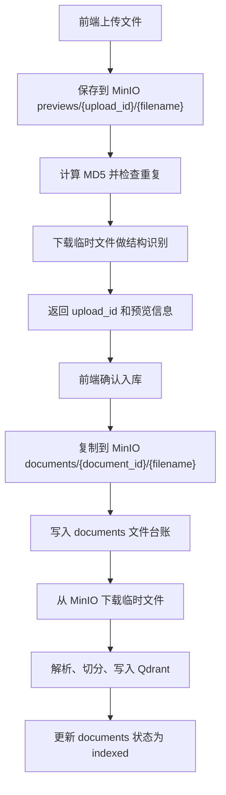
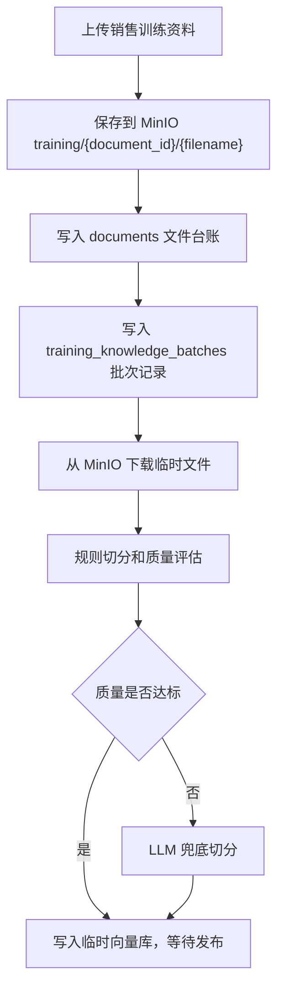

# MinIO 使用整改方案

## 一、整改背景

项目原来的文件上传链路以本地 `uploads/` 目录作为长期文件存储：

- 普通知识库上传预览会把文件保存到 `uploads/_preview/`。
- 确认入库后再移动到 `uploads/{document_id}/`。
- 文件预览、重建索引、销售训练资料解析都会从本地路径读取原文件。

这种方式在本地单机开发阶段能跑通，但不适合后续长期维护和部署：

1. 多实例部署时，本地文件不共享，任意实例都可能读不到原文件。
2. 文件备份、访问、删除和迁移都依赖服务器磁盘目录，管理成本高。
3. 数据库 `documents.file_path` 混合承载“业务定位”和“物理路径”，后续扩展容易混乱。

因此本次整改把 MinIO 作为唯一持久文件存储。本地磁盘只允许作为临时解析缓存，不再保存正式业务文件。

## 二、整改目标

1. 新上传文件全部进入 MinIO。
2. 历史本地文件全部迁移到 MinIO。
3. 业务代码不再按本地 `uploads/` 路径读取正式文件。
4. 普通知识库和销售训练资料统一复用 `documents` 文件台账。
5. 删除文件时同步删除 MinIO 对象，避免对象存储泄漏。
6. 文件预览、重建索引、销售训练重切分统一从 MinIO 下载临时文件后解析。

## 三、存储路径规范

| 场景 | MinIO 对象路径 |
| --- | --- |
| 知识库上传预览 | `previews/{upload_id}/{filename}` |
| 知识库正式文件 | `documents/{document_id}/{filename}` |
| 销售训练资料 | `training/{document_id}/{filename}` |
| 历史文件迁移 | `documents/{document_id}/{filename}` |

## 四、数据库整改

`documents` 表继续作为统一文件台账。

保留字段：

| 字段 | 新含义 |
| --- | --- |
| `file_path` | MinIO 存储 URI，格式为 `minio://bucket/object_name` |

新增字段：

| 字段 | 说明 |
| --- | --- |
| `storage_type` | 存储类型，当前统一为 `minio` |
| `bucket_name` | MinIO 桶名，例如 `pub` |
| `object_name` | MinIO 对象路径 |
| `public_url` | 文件公共访问地址 |

对应迁移 SQL：

```text
docs/mysql迁移_documents文件改为MinIO存储.sql
```

初始化建表脚本也已同步更新：

```text
docs/mysql初始化建表和基础数据.sql
```

## 五、后端代码整改

### 1. 新增统一文件存储服务

新增：

```text
infrastructure/file_storage_service.py
```

职责：

- 保存上传文件到 MinIO。
- 复制临时对象为正式对象。
- 下载 MinIO 对象为临时解析文件。
- 删除 MinIO 对象。
- 生成 `minio://...` 存储 URI。

业务层不直接调用 MinIO SDK，统一通过 `FileStorageService` 操作。

### 2. MinIO 客户端增强

修改：

```text
utils/minio_client.py
```

新增能力：

- `copy_object()`：对象内部复制。
- `download_file()`：下载对象到本地临时路径。
- `public_read` 配置：自动设置桶公开读策略。

### 3. 普通知识库上传链路

修改：

```text
api/services/upload_services.py
api/routers/knowledge.py
api/services/indexing_services.py
infrastructure/vector_store_service.py
```

新流程：



### 4. 文件预览和重建索引

预览不再读本地路径。

新流程：

1. 根据 `document_id` 查询 `documents`。
2. 读取 `bucket_name/object_name`。
3. 从 MinIO 下载到临时目录。
4. 根据文件类型提取预览文本。
5. 请求结束后删除临时目录。

重建索引同理，先从 MinIO 下载，再交给原有解析器和向量入库流程。

### 5. 销售训练资料上传链路

修改：

```text
training/services/sales_training_service.py
training/repository.py
training/schemas.py
```

新流程：



销售训练批次只负责业务批次、版本、状态、质量报告；文件基础信息统一保存在 `documents`。

## 六、历史文件迁移

新增脚本：

```text
scripts/migrate_local_files_to_minio.py
```

迁移逻辑：

1. 扫描 `documents` 中 `object_name` 为空且未删除的记录。
2. 读取旧 `file_path` 指向的本地文件。
3. 上传到 MinIO。
4. 回填：
   - `storage_type`
   - `bucket_name`
   - `object_name`
   - `public_url`
   - `file_path=minio://...`

本次已执行迁移，结果：

```text
迁移完成：成功=7，失败=0
```

当前真实库检查结果：

```text
active_documents=19
missing_object_name=0
```

## 七、MinIO 配置

配置文件：

```text
config/minio.yml
```

关键配置：

```yaml
enabled: true
endpoint: 127.0.0.1:9000
bucket_name: pub
public_base_url: http://127.0.0.1:9000
auto_create_bucket: false
public_read: true
```

说明：

- `9000` 是文件访问和 S3 API 端口。
- `9001` 是 MinIO 管理台端口。
- 文件公开访问地址使用 `http://127.0.0.1:9000/pub/...`。

## 八、删除策略

删除知识库文件时：

1. 删除 Qdrant 中该 `document_id` 的向量点。
2. `documents.status` 标记为 `deleted`。
3. 删除 MinIO 中对应对象。

删除销售训练资料时：

1. 删除正式向量库和临时向量库中的 `batch_id` 向量点。
2. `training_knowledge_batches.status` 标记为 `deleted`。
3. `documents.status` 标记为 `deleted`。
4. 删除 MinIO 中对应对象。

## 九、验证结果

编译验证已通过：

```powershell
.\.venv312\Scripts\python.exe -m py_compile ...
```

核心测试已通过：

```powershell
.\.venv312\Scripts\python.exe -m pytest tests\test_file_storage_service.py tests\test_minio_client.py tests\test_api_app.py::test_openapi_exposes_core_routes tests\test_api_app.py::test_preview_knowledge_file_reads_text_from_registered_document tests\test_sales_training_ingest_flow.py::test_training_upload_waits_for_manual_publish tests\test_sales_training_ingest_flow.py::test_training_delete_batch_marks_document_deleted -q
```

结果：

```text
9 passed
```

真实接口验证：

- 已迁移文件可以通过 `/knowledge/files/{document_id}/preview` 正常预览。
- 日志显示预览过程会从 MinIO 下载临时文件。

## 十、后续建议

1. 给 MinIO 对象增加统一生命周期清理策略，定期清理过期 `previews/` 对象。
2. 后台增加“MinIO 文件健康检查”，统计 `documents` 中缺失对象或访问失败的记录。
3. 前端文件详情页展示 `public_url`，方便直接打开原文件。
4. 后续如部署多环境，可以把 `bucket_name` 按环境区分，例如 `dev-pub`、`test-pub`、`prod-pub`。
