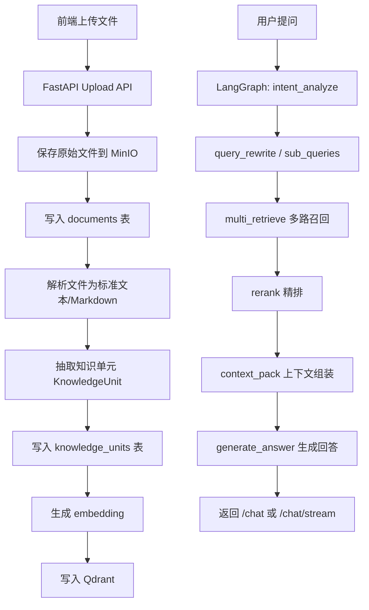
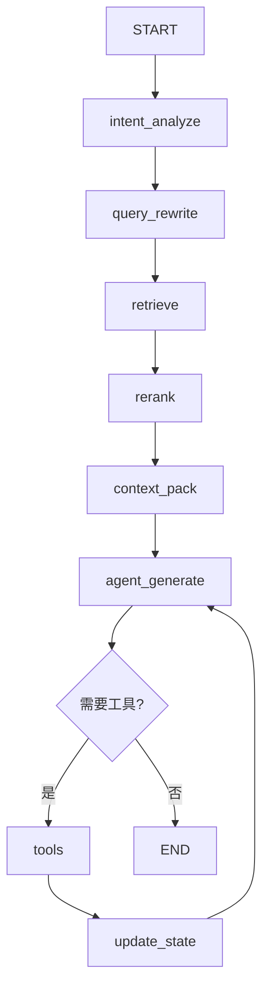

# RAG 知识库结构化入库、多意图识别与精排设计方案

> 当前状态说明：本文最初描述的是“MySQL 保存结构化知识单元 + Qdrant 保存向量索引”的演进方案。
> 项目当前实现已经进一步收敛为：MySQL 只保存文件、索引状态和会话等业务元数据；知识正文、FAQ、
> chunk payload 和向量统一以 Qdrant 为准。本文中涉及 `knowledge_units` 表的内容保留为历史设计背景，
> 不再代表当前落地方案。当前实现以 `ai_rag_agent_project_overall_design.md` 为准。
>
> 2026-06-15 更新：主 RAG 链路不再使用规则关键词硬匹配做多意图识别。当前推荐方案是
> `adaptive` 查询规划：先用原问题做向量召回，评估召回质量；质量不足时才调用 LLM Query Planner
> 做语义改写或拆分。本文第 9 节保留为历史设计参考，不再代表当前默认实现。

## 1. 背景

当前项目已经具备基础 RAG 能力：

- FastAPI 提供 `/chat` 和 `/chat/stream` 接口。
- LangGraph 负责编排 Agent、工具调用和流式输出。
- Qdrant 存储知识库向量。
- 前端 Vue3 支持一次性输出和流式输出。

当前知识库入库方式是：

```text
文件 -> 文本 -> 固定长度分片 -> embedding 向量 -> Qdrant point
```

这种方式适合学习和 Demo，但对于一个可部署、可维护的 RAG 项目来说还比较粗糙。

主要问题：

- 文件只是机械分片，没有抽取业务语义。
- Qdrant 里缺少稳定的 `document_id`、`unit_id`、`chunk_id`。
- 文件更新后旧向量不会自动删除。
- 检索只依赖向量相似度，缺少多意图、多路召回和精排。
- 不同类型知识没有结构化，例如 FAQ、故障排查、维护保养、选购指南混在一起。
- 无法很好支持文件列表、文件删除、重新索引、入库状态追踪。

## 2. 设计目标

本方案目标是把当前基础 RAG 改造成更成熟的知识库系统。

目标：

- 支持上传文件并管理文件状态。
- 将原始文件解析为结构化知识单元。
- Qdrant 不再保存粗糙文本块，而是保存可检索的知识单元向量。
- 支持多意图识别，把复杂问题拆成多个子查询。
- 支持多路召回，提升召回覆盖率。
- 支持 rerank 精排，提升最终上下文质量。
- 支持按 `document_id` 删除或重建向量。
- 保持前端聊天接口基本不变。
- 继续使用 LangGraph 编排整个 RAG/Agent 流程。

非目标：

- 第一阶段不做复杂权限系统。
- 第一阶段不做分布式任务队列。
- 第一阶段不强制引入对象存储，可以先用本地文件系统。
- 第一阶段不强制更换 Qdrant。

## 3. 总体架构



## 4. 存储分层设计

不要把 Qdrant 当文件库。

推荐拆成三层：

```text
1. 原始文件层
   保存用户上传的原始文件。

2. 结构化知识层
   使用 MySQL/Postgres 保存文件、章节、知识单元、索引状态。

3. 向量索引层
   使用 Qdrant 保存知识单元的 embedding 和检索 metadata。
```

### 4.1 原始文件层

当前统一使用 MinIO 保存原始文件：

```text
MinIO bucket: pub
documents/
  doc_001/
    original.pdf
  doc_002/
    选购指南.txt
```

后续如需替换对象存储，业务层仍通过 `FileStorageService` 收口：

- S3
- OSS

### 4.2 数据库层

第一阶段建议使用 MySQL，降低复杂度。

后续生产环境可替换为 PostgreSQL。

建议新增：

```text
storage/
  ai_rag_agent MySQL database
```

### 4.3 Qdrant 层

Qdrant 只保存可检索知识单元的向量和 payload。

Qdrant 不负责：

- 保存原始文件
- 管理文件状态
- 管理文件版本
- 判断文件是否删除

## 5. 数据模型设计

### 5.1 documents 表

用于保存文件级信息。

```sql
CREATE TABLE documents (
    document_id TEXT PRIMARY KEY,
    filename TEXT NOT NULL,
    file_path TEXT NOT NULL,
    file_type TEXT NOT NULL,
    file_md5 TEXT NOT NULL,
    file_size INTEGER NOT NULL,
    status TEXT NOT NULL,
    version INTEGER NOT NULL DEFAULT 1,
    chunk_count INTEGER NOT NULL DEFAULT 0,
    created_at TEXT NOT NULL,
    updated_at TEXT NOT NULL,
    error_message TEXT
);
```

字段说明：

| 字段 | 说明 |
|---|---|
| `document_id` | 文件唯一 ID |
| `filename` | 原始文件名 |
| `file_path` | MinIO 存储 URI，格式为 `minio://桶名/对象路径` |
| `file_type` | 文件类型，例如 txt/pdf/docx |
| `file_md5` | 文件内容 MD5 |
| `status` | uploaded/indexing/indexed/failed/deleted |
| `version` | 文件版本 |
| `chunk_count` | 写入 Qdrant 的知识单元数量 |
| `error_message` | 入库失败原因 |

### 5.2 knowledge_units 表

用于保存结构化知识单元。

```sql
CREATE TABLE knowledge_units (
    unit_id TEXT PRIMARY KEY,
    document_id TEXT NOT NULL,
    unit_type TEXT NOT NULL,
    title TEXT,
    question TEXT,
    answer TEXT,
    content TEXT NOT NULL,
    category TEXT,
    tags TEXT,
    source_page INTEGER,
    unit_index INTEGER NOT NULL,
    created_at TEXT NOT NULL,
    FOREIGN KEY(document_id) REFERENCES documents(document_id)
);
```

字段说明：

| 字段 | 说明 |
|---|---|
| `unit_id` | 知识单元唯一 ID |
| `document_id` | 所属文件 ID |
| `unit_type` | faq/guide/troubleshooting/maintenance/general |
| `title` | 标题 |
| `question` | FAQ 问题 |
| `answer` | FAQ 答案 |
| `content` | 用于 embedding 和生成上下文的正文 |
| `category` | 知识分类 |
| `tags` | 标签，JSON 字符串 |
| `source_page` | PDF 页码 |
| `unit_index` | 文件内顺序 |

### 5.3 indexing_jobs 表

用于记录入库任务状态。

```sql
CREATE TABLE indexing_jobs (
    job_id TEXT PRIMARY KEY,
    document_id TEXT NOT NULL,
    status TEXT NOT NULL,
    started_at TEXT,
    finished_at TEXT,
    error_message TEXT
);
```

第一阶段可以不做独立任务队列，但保留 job 表有利于前端展示状态。

## 6. Qdrant Payload 设计

每个 Qdrant point 代表一个知识单元。

建议 payload：

```json
{
  "document_id": "doc_001",
  "unit_id": "unit_001_0001",
  "unit_type": "faq",
  "title": "选购时最应该关注哪些参数？",
  "question": "选购时最应该关注哪些参数？",
  "content": "问题：选购时最应该关注哪些参数？\n答案：导航类型、吸力大小、电池容量、尘盒/水箱容量。",
  "category": "选购指南",
  "tags": ["选购", "导航", "吸力", "电池"],
  "source_file": "扫地机器人100问.pdf",
  "source_page": 3,
  "version": 1
}
```

这样做的好处：

- 可以按 `document_id` 删除某个文件的所有向量。
- 可以按 `unit_type` 过滤 FAQ、故障、保养等知识。
- 可以按 `category` 做定向召回。
- 可以在回答中返回引用来源。
- 可以在 rerank 后保留结构化信息。

## 7. 知识单元设计

### 7.1 FAQ 知识单元

适合“100 问”类文件。

```json
{
  "unit_type": "faq",
  "question": "小户型适合哪种扫地机器人？",
  "answer": "基础激光导航机型即可，如米家 1C、石头 T4。",
  "category": "选购指南",
  "tags": ["小户型", "激光导航", "选购"]
}
```

### 7.2 故障排查知识单元

适合故障类文件。

```json
{
  "unit_type": "troubleshooting",
  "title": "扫地机器人迷路怎么办？",
  "problem": "扫地机器人迷路",
  "symptoms": ["重复打转", "找不到充电座", "地图错乱"],
  "causes": ["传感器脏污", "环境变化", "地图异常"],
  "solutions": ["清洁传感器", "重建地图", "检查充电座位置"]
}
```

### 7.3 维护保养知识单元

```json
{
  "unit_type": "maintenance",
  "title": "主刷清理",
  "cycle": "每周一次",
  "steps": ["取出主刷", "剪掉缠绕毛发", "清理轴承"],
  "warnings": ["不要水洗电机部件"]
}
```

### 7.4 普通指南知识单元

适合选购指南、品牌对比等长文档。

```json
{
  "unit_type": "guide",
  "title": "吸力参数怎么选？",
  "content": "家用建议选择大于等于 3000Pa 的机型，地毯场景建议大于等于 4000Pa。",
  "category": "选购指南",
  "tags": ["吸力", "地毯", "参数"]
}
```

## 8. 入库流程设计

### 8.1 上传预览接口

```text
POST /knowledge/upload/preview
```

请求：

```text
multipart/form-data
file: 知识库文件
```

响应：

```json
{
  "upload_id": "tmp_001",
  "filename": "扫地机器人100问.pdf",
  "detected_type": "faq",
  "split_strategy": "numbered_qa",
  "sample_text": "..."
}
```

### 8.2 上传确认接口

```text
POST /knowledge/upload/confirm
```

请求：

```json
{
  "upload_id": "tmp_001",
  "document_type": "faq",
  "split_strategy": "numbered_qa"
}
```

确认后才会创建 documents 记录并写入 Qdrant。

### 8.2 入库流程

```text
上传文件
  ↓
保存原始文件
  ↓
计算 MD5
  ↓
判断是否重复
  ↓
创建 documents 记录
  ↓
解析文件
  ↓
抽取 knowledge_units
  ↓
生成 embedding
  ↓
写入 Qdrant
  ↓
更新 documents.status = indexed
```

### 8.3 删除流程

```text
DELETE /knowledge/files/{document_id}
```

执行步骤：

```text
查 documents
  ↓
按 document_id 删除 Qdrant points
  ↓
删除 knowledge_units
  ↓
更新 documents.status = deleted
```

### 8.4 重新索引流程

```text
POST /knowledge/files/{document_id}/reindex
```

执行步骤：

```text
删除旧 Qdrant points
  ↓
删除旧 knowledge_units
  ↓
重新解析原始文件
  ↓
重新生成 embedding
  ↓
写入 Qdrant
  ↓
更新 version 和 chunk_count
```

## 9. 多意图识别设计（历史方案）

当前默认实现已经替换为 adaptive 查询规划：

```text
原问题向量召回
  ↓
召回质量评估
  ↓
质量达标：直接进入精排和回答生成
  ↓
质量不足：调用 LLM Query Planner 做语义改写/拆分
  ↓
多路向量召回 + 精排
```

这样可以避免用固定关键词强行判断管理端自由输入，同时减少简单问题的首包等待时间。
下面内容只作为早期规则意图识别方案的历史记录。

### 9.1 意图类型

建议先定义这些意图：

| intent | 说明 |
|---|---|
| `purchase` | 选购咨询 |
| `troubleshooting` | 故障排查 |
| `maintenance` | 维护保养 |
| `comparison` | 品牌/型号对比 |
| `weather` | 天气相关 |
| `report` | 用户报告 |
| `general` | 普通闲聊或无法分类 |

### 9.2 意图识别输出

```json
{
  "intents": ["purchase", "maintenance"],
  "sub_queries": [
    "小户型有宠物怎么选择扫地机器人",
    "扫地机器人后期如何维护保养"
  ],
  "filters": {
    "unit_type": ["faq", "guide"],
    "category": ["选购指南", "维护保养"]
  }
}
```

### 9.3 LangGraph 节点

```text
intent_analyze
```

职责：

- 分析用户问题。
- 判断是否是多意图。
- 生成子查询。
- 生成 metadata filter。
- 决定是否需要工具。

## 10. 多路召回设计

当前只有向量召回。

升级后建议：

```text
原始问题向量召回
子问题向量召回
metadata filter 定向召回
关键词召回
历史上下文补充召回
```

第一阶段可以先做：

- 原始问题向量召回
- 子问题向量召回
- metadata filter

第二阶段再加：

- BM25 关键词检索
- hybrid search

## 11. 精排 Rerank 设计

### 11.1 为什么需要 rerank

向量召回是粗召回。

它解决的是：

```text
哪些内容大概相关？
```

rerank 解决的是：

```text
哪些内容最应该放进最终上下文？
```

### 11.2 精排流程

```text
候选知识单元 20 条
  ↓
reranker 打分
  ↓
按分数排序
  ↓
去重
  ↓
保留 top 3~5
```

### 11.3 rerank 接口抽象

建议定义统一接口：

```python
class BaseReranker:
    def rerank(self, query: str, documents: list[Document]) -> list[Document]:
        pass
```

后续可以实现：

- 云端 rerank
- 本地 rerank
- 简单规则 rerank

第一阶段可以先做一个规则版：

```text
向量分数
+ 标题命中
+ 分类命中
+ 问题文本命中
```

之后再接专业 rerank 模型。

## 12. LangGraph 编排设计

建议把当前图扩展为：



### 12.1 AgentState 建议

```python
class AgentState(TypedDict, total=False):
    messages: Annotated[list[AnyMessage], add_messages]
    user_id: str
    intents: list[str]
    sub_queries: list[str]
    filters: dict
    retrieved_units: list[dict]
    reranked_units: list[dict]
    context: str
    report: bool
```

### 12.2 节点职责

| 节点 | 职责 |
|---|---|
| `intent_analyze` | 识别单意图/多意图 |
| `query_rewrite` | 拆分子查询 |
| `retrieve` | 多路召回 |
| `rerank` | 精排候选知识 |
| `context_pack` | 拼接上下文 |
| `agent_generate` | 调用模型生成回答 |
| `tools` | 执行外部工具 |
| `update_state` | 工具结果后处理 |

## 13. API 设计

### 13.1 聊天接口保持不变

前端聊天可以不改：

```text
POST /chat
POST /chat/stream
```

后端内部增强 RAG 流程即可。

### 13.2 知识库管理接口

新增：

```text
POST   /knowledge/upload/preview
POST   /knowledge/upload/confirm
GET    /knowledge/files
GET    /knowledge/files/{document_id}
DELETE /knowledge/files/{document_id}
POST   /knowledge/files/{document_id}/reindex
```

### 13.3 调试接口

建议开发阶段增加：

```text
POST /debug/retrieve
```

用于查看：

- 识别到的 intent
- 生成的 sub_queries
- 召回的候选知识
- rerank 分数
- 最终上下文

生产环境可以关闭。

## 14. 前端影响

### 14.1 聊天页面

如果只是提升回答质量，聊天页面不用改。

继续使用：

```text
/api/chat
/api/chat/stream
```

### 14.2 知识库管理页面

如果要支持上传、删除、重新索引，需要新增知识库管理区域：

```text
文件上传
文件列表
入库状态
删除文件
重新索引
查看 chunk 数量
```

### 14.3 调试面板

开发阶段可以加一个折叠面板展示：

```text
识别意图
子查询
召回文档
rerank 分数
引用来源
```

这个不是必须，但对调试 RAG 效果非常有帮助。

## 15. 分阶段落地计划

### 阶段一：知识单元和文件管理

目标：

- 新增 MySQL。
- 新增 documents 表。
- 新增 knowledge_units 表。
- 新增上传接口。
- VectorStoreService 改为按 document_id 写入。
- Qdrant payload 加入 document_id/unit_id/unit_type/category。

结果：

- 能上传文件。
- 能看到文件列表。
- 能按 document_id 删除向量。

### 阶段二：结构化切分

目标：

- FAQ 按问答切分。
- 故障排查按问题/原因/解决方案切分。
- 维护保养按主题/步骤切分。
- 普通长文按标题层级切分。

结果：

- Qdrant 里不再是粗糙 chunk，而是知识单元。

### 阶段三：多意图识别

目标：

- 新增 LangGraph `intent_analyze` 节点。
- 支持多意图输出。
- 支持子查询生成。
- 支持 metadata filter。

结果：

- 复杂问题可以拆成多个检索任务。

### 阶段四：多路召回和 rerank

目标：

- 多子查询召回。
- metadata filter 召回。
- rerank 候选知识。
- context_pack 去重和截断。

结果：

- 最终进入大模型的上下文更准确、更干净。

### 阶段五：前端知识库管理

目标：

- 上传文件。
- 文件列表。
- 删除文件。
- 重新索引。
- 查看状态。

结果：

- 项目具备基础知识库管理能力。

## 16. 风险和注意点

### 16.1 文件更新风险

如果只追加新向量，不删除旧向量，会导致旧知识污染检索。

解决：

- 必须支持按 `document_id` 删除 Qdrant points。

### 16.2 LLM 抽取成本

如果用大模型抽取知识单元，效果好，但成本高。

第一阶段建议：

- 规则切分优先。
- LLM 抽取作为增强能力。

### 16.3 rerank 延迟

rerank 会增加延迟。

建议：

- 先召回 20 条。
- rerank 后保留 3~5 条。
- 流式回答前完成 rerank。

### 16.4 状态管理复杂度

LangGraph 节点变多后，状态字段要设计清楚。

建议：

- 每个节点只读写自己负责的字段。
- 保持 `AgentState` 明确。
- 调试接口输出完整状态快照。

## 17. 推荐优先级

最高优先级：

1. `document_id / unit_id / unit_type` 数据模型。
2. 按 `document_id` 删除 Qdrant points。
3. FAQ/故障/保养的结构化切分。

中等优先级：

4. 多意图识别。
5. metadata filter。
6. 多子查询召回。

后续增强：

7. rerank 模型。
8. hybrid search。
9. 引用来源展示。
10. 前端调试面板。

## 18. 最终目标形态

最终希望从：

```text
粗糙文件分片 RAG
```

升级为：

```text
结构化知识库 + 多意图识别 + 多路召回 + 精排 + LangGraph 可控编排
```

这样项目会更接近真实可部署的企业级 RAG Agent。
