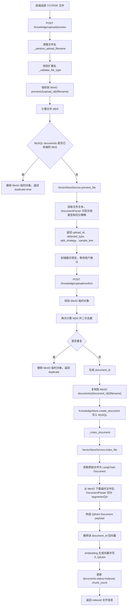
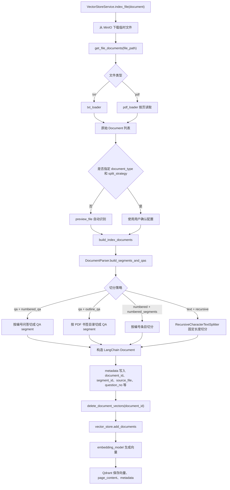
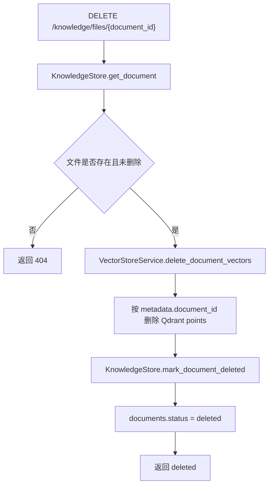

# 上传文件的流程

本文档说明知识库文件从前端上传到后端入库的完整链路。当前项目采用“两阶段上传”：

1. 预览阶段：保存到 MinIO 临时对象，识别文件类型、去重、抽样展示，不写入正式知识库。
2. 确认阶段：用户确认后复制为 MinIO 正式对象，写入 MySQL 文件元数据，并解析、切分、向量化后写入 Qdrant。

## 核心入口

| 阶段 | 接口 | 主要代码 | 作用 |
| --- | --- | --- | --- |
| 上传预览 | `POST /knowledge/upload/preview` | `api/routers/knowledge.py::preview_knowledge_file` | 临时保存文件、计算 MD5、判断重复、识别文档类型和切分策略 |
| 确认入库 | `POST /knowledge/upload/confirm` | `api/routers/knowledge.py::confirm_knowledge_file` | 将临时文件转为正式文件，创建 documents 记录，写入 Qdrant |
| 文件列表 | `GET /knowledge/files` | `api/routers/knowledge.py::list_knowledge_files` | 查询 MySQL 中未删除的知识库文件 |
| 文件预览 | `GET /knowledge/files/{document_id}/preview` | `api/routers/knowledge.py::preview_indexed_knowledge_file` | 读取原始文件文本预览，不触发向量检索 |
| 单文件重建 | `POST /knowledge/files/{document_id}/reindex` | `api/routers/knowledge.py::reindex_knowledge_file` | 删除该文件旧向量并重新解析入库 |
| 全量重建 | `POST /knowledge/files/reindex-all` | `api/routers/knowledge.py::reindex_all_knowledge_files` | 重建 collection，并重新索引所有 active 文件 |
| 内置数据重载 | `POST /knowledge/reload` | `api/routers/knowledge.py::reload_knowledge` | 扫描 `data/` 文件，同步到 documents 后全量重建 |
| 删除文件 | `DELETE /knowledge/files/{document_id}` | `api/routers/knowledge.py::delete_knowledge_file` | 删除 Qdrant points，并把 MySQL 文件标记为 deleted |

## 总体流程

## 预览阶段

预览接口只做“临时接收和识别”，不创建正式知识库记录，也不写 Qdrant。

主要步骤：

1. `preview_knowledge_file()` 接收 `UploadFile`。
2. `_sanitize_upload_filename()` 去掉目录路径和空字符，避免用户上传 `../../xxx.pdf` 这种危险文件名。
3. `_validate_file_type()` 根据 `config/qdrant.yml` 的 `allow_knowledge_file_type` 校验文件类型，目前支持 `txt`、`pdf`。
4. `_save_preview_file()` 将文件按 1MB 分片写入临时文件并上传到 MinIO `previews/{upload_id}/{filename}`。
5. `get_file_md5_hex()` 计算文件 MD5。
6. `KnowledgeStore.find_active_document_by_md5()` 检查 active 文件是否已存在相同内容。
7. 如果重复，删除 MinIO 临时对象并返回 `duplicate=true`。
8. 如果不重复，调用 `VectorStoreService.preview_file()`。
9. `preview_file()` 读取文件样本文本，调用 `DocumentParser.detect_document_type()` 识别文档类型和建议切分策略。

预览阶段返回的关键字段：

| 字段 | 含义 |
| --- | --- |
| `upload_id` | 临时上传编号，确认入库时必须传回 |
| `filename` | 清理后的原始文件名 |
| `file_type` | 文件类型，如 `txt`、`pdf` |
| `file_md5` | 文件内容 MD5，用于去重 |
| `duplicate` | 是否与已入库 active 文件重复 |
| `detected_type` | 系统识别的文档结构类型，只使用 `qa`、`numbered`、`text` |
| `split_strategy` | 建议切分策略，如 `numbered_qa`、`outline_qa`、`numbered_segments`、`recursive` |
| `confidence` | 类型识别置信度 |
| `reasons` | 类型识别原因 |
| `sample_text` | 抽样文本，用于前端确认 |

## 确认入库阶段

确认接口会把临时文件转成正式知识库文件，并启动索引。

主要步骤：

1. `confirm_knowledge_file()` 接收 `upload_id`、`document_type`、`split_strategy`。
2. 校验 `upload_id` 对应的 MinIO 临时对象必须存在。
3. 再次清理文件名、校验类型、计算 MD5。
4. 二次查询 `documents`，避免预览到确认期间重复提交。
5. 生成 `document_id = doc_{uuid}`。
6. `_promote_preview_file()` 将临时对象复制到 `documents/{document_id}/{filename}`。
7. `KnowledgeStore.create_document()` 写入 MySQL `documents` 表，记录 `storage_type/bucket_name/object_name/public_url`，初始状态为 `uploaded`。
8. `_index_document()` 将状态更新为 `indexing`，然后调用 `VectorStoreService.index_file()`。
9. 索引成功后更新为 `indexed`，记录 `chunk_count`。
10. 索引失败时更新为 `failed`，保存 `error_message`，接口返回 500。

## 入库索引细节

`VectorStoreService.index_file()` 是真正写入 Qdrant 的核心函数。

写入 Qdrant 的每个 point 主要包含：

| 数据 | 说明 |
| --- | --- |
| 向量 | 由 `model.factory.embed_model` 对文本分片生成 |
| `page_content` | 检索时返回给 RAG 的文本片段 |
| `metadata.document_id` | 所属文件 ID |
| `metadata.segment_id/chunk_id` | 分片 ID |
| `metadata.content_type` | `qa` 或 `segment` |
| `metadata.document_type/unit_type` | 文档结构类型：`qa`、`numbered`、`text` |
| `metadata.split_strategy` | 切分策略 |
| `metadata.source_file` | 来源文件名 |
| `metadata.file_md5` | 文件 MD5 |
| `metadata.version` | 文件索引版本 |
| `metadata.question_no/question/category` | QA 或结构化文档的补充信息 |

## PDF 目录问答切分

`outline_qa` 不是新的上传类型，而是 `qa` 类型下的一种切分策略。

适用条件：

1. 文件是 PDF，并且能读取到 PDF 书签目录。
2. 书签呈现稳定的两层结构：一级是章节或分类，二级是题目。
3. 二级书签多数像题目，例如以 `1、`、`2、` 开头，或包含“什么”“区别”“原理”“如何”等问法。
4. 书签标题能在正文样本文本中找到，避免把普通目录误判成问答目录。

入库后的典型 metadata：

| 字段 | 说明 |
| --- | --- |
| `document_type` | 固定为 `qa` |
| `split_strategy` | 固定为 `outline_qa` |
| `structure_source` | `pdf_outline`，表示结构来自 PDF 书签 |
| `section_title` | 一级目录标题，如 `Java集合/泛型面试题` |
| `section_path` | 一级目录和题目的完整路径 |
| `question_id` | 同一道题的稳定编号；长答案二次切片时多个片段共享同一个 `question_id` |
| `question_no` | 题目前置编号，能识别时写入 |
| `source_page` | PDF 书签指向页码 |

## MySQL 和 Qdrant 的职责边界

当前设计中，MySQL 不再作为知识正文检索来源。

| 存储 | 保存内容 | 不保存内容 |
| --- | --- | --- |
| MySQL `documents` | 文件名、路径、MD5、大小、状态、版本、chunk_count、错误信息 | 知识正文、FAQ 答案、embedding 向量 |
| Qdrant | 文本分片、向量、检索 payload、metadata | 文件管理状态、会话历史 |
| MySQL `conversations` / `conversation_messages` | 聊天会话和消息历史 | 知识库正文 |

## 重建索引流程

单文件重建：

1. `POST /knowledge/files/{document_id}/reindex`
2. 读取 MySQL 中的文件元数据。
3. `_index_document(..., increment_version=True)` 将版本号加 1。
4. 删除该 `document_id` 在 Qdrant 中的旧 points。
5. 重新读取原始文件、切分、向量化、写入 Qdrant。
6. 更新 `chunk_count` 和状态。

全量重建：

1. `POST /knowledge/files/reindex-all`
2. `VectorStoreService.recreate_collection_service()` 重建当前 collection。
3. 遍历所有 active documents。
4. 对每个文件调用 `_index_document(..., increment_version=True)`。
5. 返回每个文件的 indexed/failed 结果。

内置数据重载：

1. `POST /knowledge/reload`
2. `_sync_data_files_to_documents()` 扫描 `config/qdrant.yml` 的 `data_path`。
3. 按 MD5 将 `data/` 文件同步到 MySQL `documents`。
4. 重建 Qdrant collection。
5. 对所有 active documents 重新索引。

## 删除流程

注意：当前删除是知识库层面的逻辑删除。Qdrant points 会删除，MySQL 文件状态会变为 `deleted`，但 `uploads/` 下的原始文件暂时保留，便于排查和审计。

## 设计评审与后续优化点

当前上传设计的主干是合理的：两阶段上传让用户先预览和确认，MySQL 与 Qdrant 的职责边界清晰，`document_id` 贯穿文件管理、删除、重建和检索 payload，已经具备知识库管理系统的基础形态。

但当前实现更接近“同步版 MVP”，适合小规模和内部可控场景。如果要继续增强稳定性和生产可用性，建议优先优化以下方向。

### 1. 确认入库改为后台任务

现状：

- `POST /knowledge/upload/confirm` 会同步执行文件解析、切分、embedding 生成和 Qdrant 写入。
- 大文件、复杂 PDF、embedding 服务慢或 Qdrant 写入慢时，接口容易长时间阻塞甚至超时。

建议：

- `confirm` 只完成临时文件转正式文件、创建 `documents` 记录和创建索引任务。
- 接口立即返回 `document_id` 和 `job_id`。
- 后台 worker 异步执行 `_index_document()`。
- 前端通过轮询、SSE 或 WebSocket 查询入库进度。

建议新增任务状态：

| 状态 | 含义 |
| --- | --- |
| `pending` | 已创建索引任务，等待执行 |
| `indexing` | 正在解析、切分和写入向量库 |
| `indexed` | 索引成功 |
| `failed` | 索引失败 |
| `canceled` | 用户取消或系统中止 |

### 2. 临时上传文件增加生命周期清理

现状：

- 预览文件保存在 `uploads/_preview/{upload_id}/`。
- 用户只预览但不确认时，临时目录会长期保留。
- 重复文件、异常中断、前端关闭页面等场景也可能留下临时文件。

建议：

- 给临时上传文件增加过期时间，例如 30 分钟或 24 小时。
- 增加定时清理任务，删除过期的 `uploads/_preview/` 子目录。
- 清理前只允许删除 `_preview` 目录下的子目录，继续保留当前的路径安全校验。
- 预览阶段如果已经判断为重复文件，可以考虑直接删除临时目录，只返回已有文件信息。

### 3. 重建索引避免“先删后写”的空窗风险

现状：

- `VectorStoreService.index_file()` 会先删除该 `document_id` 的旧向量，再写入新向量。
- 如果删除成功后，embedding 或 Qdrant 写入失败，该文件会变成 MySQL 中存在但 Qdrant 中不可检索。

建议：

- Qdrant payload 保留 `document_id` 和 `version`。
- 重建时先写入新 `version` 的 points。
- 新版本写入成功后，再删除旧 `version` 的 points。
- 检索时可按当前 documents.version 过滤，或者在清理完成前同时允许新旧版本并存。

这样可以把“重建失败导致知识暂时消失”的风险降到最低。

### 4. 预览服务与向量服务解耦

现状：

- 上传预览调用 `VectorStoreService().preview_file()`。
- `VectorStoreService` 初始化时会构造 Qdrant 向量库连接。
- 预览本质只需要文件读取、样本文本抽取和结构识别，不应该依赖 Qdrant 可用性。

建议：

- 抽出独立的 `DocumentPreviewService` 或 `DocumentStructureService`。
- 预览阶段只依赖文件 loader 和 `DocumentParser`。
- Qdrant 故障时，用户仍然可以上传、查看样本并选择切分策略。
- 确认入库阶段再依赖 Qdrant 和 embedding 服务。

### 5. 去重和并发确认需要更强幂等

现状：

- 当前通过 `find_active_document_by_md5()` 查询相同 MD5 文件。
- 预览和确认阶段都会做去重检查。
- 但在两个相同文件并发确认时，仍可能都通过查询，然后分别创建 documents 记录。

建议：

- 在业务层增加 `file_md5 + collection_name` 维度的并发锁。
- 或在数据库层增加更强的唯一约束/幂等表，用于限制同一 collection 内 active 文件重复。
- `confirm` 接口应支持重复提交同一个 `upload_id` 时返回同一个结果，而不是产生多份状态。

### 6. 文件管理能力后续可补齐

当前删除是逻辑删除，原始文件仍保留在 `uploads/` 中，方便排查和审计。后续可以按业务需要增加：

- 物理删除原始文件的可选开关。
- 文件保留周期配置。
- 文件大小上限配置。
- 单用户或单 collection 容量限制。
- 上传来源、操作者、备注等审计字段。

### 推荐落地优先级

1. 先做临时文件 TTL 清理，成本低，能立刻减少磁盘堆积风险。
2. 再做后台索引任务，解决大文件上传确认超时和前端等待体验问题。
3. 然后做预览服务与 Qdrant 解耦，让上传预览链路更稳定。
4. 最后做索引版本化写入和并发幂等，这部分改动更深，但对生产稳定性最关键。

## 关键配置

| 配置 | 位置 | 作用 |
| --- | --- | --- |
| `collection_name` | `config/qdrant.yml` | Qdrant collection 名称 |
| `url` | `config/qdrant.yml` | Qdrant HTTP 地址 |
| `distance` | `config/qdrant.yml` | 向量距离算法，当前为 `COSINE` |
| `allow_knowledge_file_type` | `config/qdrant.yml` | 允许入库的文件类型 |
| `chunk_size` | `config/qdrant.yml` | recursive 切分时的目标块大小 |
| `chunk_overlap` | `config/qdrant.yml` | recursive 切分重叠字符数 |
| `separators` | `config/qdrant.yml` | recursive 切分分隔符优先级 |
| `embedding_model_name` | `config/rag.yml` | 入库和检索使用的 embedding 模型 |

## 常见失败点

| 失败位置 | 表现 | 排查方向 |
| --- | --- | --- |
| 文件类型校验 | 400 不支持的文件类型 | 检查 `allow_knowledge_file_type` |
| 临时文件保存 | 500 保存失败 | 检查 `uploads/_preview/` 权限和磁盘空间 |
| MD5 计算 | 500 MD5 失败 | 检查文件是否为空、路径是否有效 |
| 文档读取 | 入库失败，提示没有有效文本内容 | 检查 PDF 是否为扫描件、TXT 编码是否正确 |
| Qdrant 连接 | 入库失败或重建失败 | 检查 Qdrant 服务和 `config/qdrant.yml` |
| embedding 调用 | 入库耗时长或失败 | 检查模型配置、API Key、模型兼容性 |
| 文档切分 | chunk_count 异常 | 检查文档格式、`chunk_size`、`separators` |
