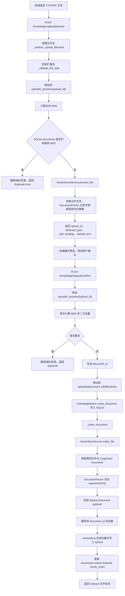
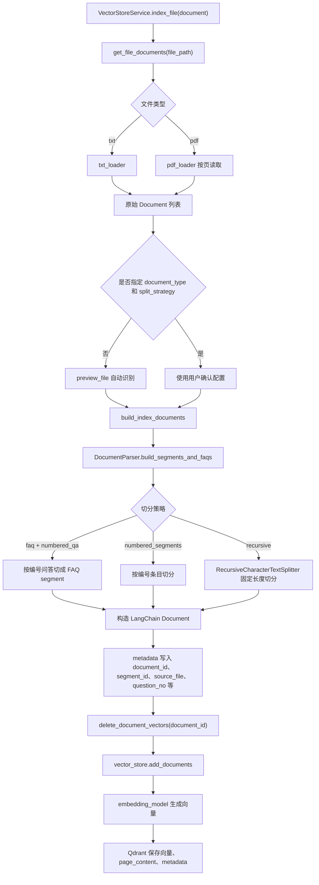
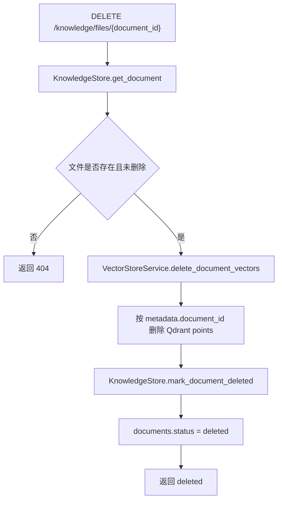

# 上传文件的流程

本文档说明知识库文件从前端上传到后端入库的完整链路。当前项目采用“两阶段上传”：

1. 预览阶段：保存到临时目录，识别文件类型、去重、抽样展示，不写入正式知识库。
2. 确认阶段：用户确认后移动到正式目录，写入 SQLite 文件元数据，并解析、切分、向量化后写入 Qdrant。

## 核心入口

| 阶段 | 接口 | 主要代码 | 作用 |
| --- | --- | --- | --- |
| 上传预览 | `POST /knowledge/upload/preview` | `api/routers/knowledge.py::preview_knowledge_file` | 临时保存文件、计算 MD5、判断重复、识别文档类型和切分策略 |
| 确认入库 | `POST /knowledge/upload/confirm` | `api/routers/knowledge.py::confirm_knowledge_file` | 将临时文件转为正式文件，创建 documents 记录，写入 Qdrant |
| 文件列表 | `GET /knowledge/files` | `api/routers/knowledge.py::list_knowledge_files` | 查询 SQLite 中未删除的知识库文件 |
| 文件预览 | `GET /knowledge/files/{document_id}/preview` | `api/routers/knowledge.py::preview_indexed_knowledge_file` | 读取原始文件文本预览，不触发向量检索 |
| 单文件重建 | `POST /knowledge/files/{document_id}/reindex` | `api/routers/knowledge.py::reindex_knowledge_file` | 删除该文件旧向量并重新解析入库 |
| 全量重建 | `POST /knowledge/files/reindex-all` | `api/routers/knowledge.py::reindex_all_knowledge_files` | 重建 collection，并重新索引所有 active 文件 |
| 内置数据重载 | `POST /knowledge/reload` | `api/routers/knowledge.py::reload_knowledge` | 扫描 `data/` 文件，同步到 documents 后全量重建 |
| 删除文件 | `DELETE /knowledge/files/{document_id}` | `api/routers/knowledge.py::delete_knowledge_file` | 删除 Qdrant points，并把 SQLite 文件标记为 deleted |

## 总体流程

## 预览阶段

预览接口只做“临时接收和识别”，不创建正式知识库记录，也不写 Qdrant。

主要步骤：

1. `preview_knowledge_file()` 接收 `UploadFile`。
2. `_sanitize_upload_filename()` 去掉目录路径和空字符，避免用户上传 `../../xxx.pdf` 这种危险文件名。
3. `_validate_file_type()` 根据 `config/qdrant.yml` 的 `allow_knowledge_file_type` 校验文件类型，目前支持 `txt`、`pdf`。
4. `_save_preview_file()` 将文件按 1MB 分片写入 `uploads/_preview/{upload_id}/`。
5. `get_file_md5_hex()` 计算文件 MD5。
6. `KnowledgeStore.find_active_document_by_md5()` 检查 active 文件是否已存在相同内容。
7. 如果重复，删除临时目录并返回 `duplicate=true`。
8. 如果不重复，调用 `VectorStoreService.preview_file()`。
9. `preview_file()` 读取文件样本文本，调用 `DocumentParser.detect_document_type()` 识别文档类型和建议切分策略。

预览阶段返回的关键字段：

| 字段 | 含义 |
| --- | --- |
| `upload_id` | 临时上传编号，确认入库时必须传回 |
| `filename` | 清理后的原始文件名 |
| `file_type` | 文件类型，如 `txt`、`pdf` |
| `file_md5` | 文件内容 MD5，用于去重 |
| `duplicate` | 是否与已入库 active 文件重复 |
| `detected_type` | 系统识别的文档类型，如 `faq`、`guide`、`maintenance`、`troubleshooting`、`general` |
| `split_strategy` | 建议切分策略，如 `numbered_qa`、`numbered_segments`、`recursive` |
| `confidence` | 类型识别置信度 |
| `reasons` | 类型识别原因 |
| `sample_text` | 抽样文本，用于前端确认 |

## 确认入库阶段

确认接口会把临时文件转成正式知识库文件，并启动索引。

主要步骤：

1. `confirm_knowledge_file()` 接收 `upload_id`、`document_type`、`split_strategy`。
2. 校验 `uploads/_preview/{upload_id}` 必须存在，且目录中只有一个文件。
3. 再次清理文件名、校验类型、计算 MD5。
4. 二次查询 `documents`，避免预览到确认期间重复提交。
5. 生成 `document_id = doc_{uuid}`。
6. `_move_upload_file()` 将临时文件移动到 `uploads/{document_id}/{filename}`。
7. `KnowledgeStore.create_document()` 写入 SQLite `documents` 表，初始状态为 `uploaded`。
8. `_index_document()` 将状态更新为 `indexing`，然后调用 `VectorStoreService.index_file()`。
9. 索引成功后更新为 `indexed`，记录 `chunk_count`。
10. 索引失败时更新为 `failed`，保存 `error_message`，接口返回 500。

## 入库索引细节

`VectorStoreService.index_file()` 是真正写入 Qdrant 的核心函数。

写入 Qdrant 的每个 point 主要包含：

| 数据 | 说明 |
| --- | --- |
| 向量 | 由 `model.factory.embed_model` 对文本分片生成 |
| `page_content` | 检索时返回给 RAG 的文本片段 |
| `metadata.document_id` | 所属文件 ID |
| `metadata.segment_id/chunk_id` | 分片 ID |
| `metadata.content_type` | `faq` 或 `segment` |
| `metadata.document_type/unit_type` | 文档类型 |
| `metadata.split_strategy` | 切分策略 |
| `metadata.source_file` | 来源文件名 |
| `metadata.file_md5` | 文件 MD5 |
| `metadata.version` | 文件索引版本 |
| `metadata.question_no/question/category` | FAQ 或结构化文档的补充信息 |

## SQLite 和 Qdrant 的职责边界

当前设计中，SQLite 不再作为知识正文检索来源。

| 存储 | 保存内容 | 不保存内容 |
| --- | --- | --- |
| SQLite `documents` | 文件名、路径、MD5、大小、状态、版本、chunk_count、错误信息 | 知识正文、FAQ 答案、embedding 向量 |
| Qdrant | 文本分片、向量、检索 payload、metadata | 文件管理状态、会话历史 |
| SQLite `conversations` / `conversation_messages` | 聊天会话和消息历史 | 知识库正文 |

## 重建索引流程

单文件重建：

1. `POST /knowledge/files/{document_id}/reindex`
2. 读取 SQLite 中的文件元数据。
3. `_index_document(..., increment_version=True)` 将版本号加 1。
4. 删除该 `document_id` 在 Qdrant 中的旧 points。
5. 重新读取原始文件、切分、向量化、写入 Qdrant。
6. 更新 `chunk_count` 和状态。

全量重建：

1. `POST /knowledge/files/reindex-all`
2. `VectorStoreService.recreate_collection_service()` 重建当前 collection。
3. 遍历所有 active documents。
4. 对每个文件调用 `_index_document(..., increment_version=True)`。
5. 返回每个文件的 indexed/failed 结果。

内置数据重载：

1. `POST /knowledge/reload`
2. `_sync_data_files_to_documents()` 扫描 `config/qdrant.yml` 的 `data_path`。
3. 按 MD5 将 `data/` 文件同步到 SQLite `documents`。
4. 重建 Qdrant collection。
5. 对所有 active documents 重新索引。

## 删除流程

注意：当前删除是知识库层面的逻辑删除。Qdrant points 会删除，SQLite 文件状态会变为 `deleted`，但 `uploads/` 下的原始文件暂时保留，便于排查和审计。

## 关键配置

| 配置 | 位置 | 作用 |
| --- | --- | --- |
| `collection_name` | `config/qdrant.yml` | Qdrant collection 名称 |
| `url` | `config/qdrant.yml` | Qdrant HTTP 地址 |
| `distance` | `config/qdrant.yml` | 向量距离算法，当前为 `COSINE` |
| `allow_knowledge_file_type` | `config/qdrant.yml` | 允许入库的文件类型 |
| `chunk_size` | `config/qdrant.yml` | recursive 切分时的目标块大小 |
| `chunk_overlap` | `config/qdrant.yml` | recursive 切分重叠字符数 |
| `separators` | `config/qdrant.yml` | recursive 切分分隔符优先级 |
| `embedding_model_name` | `config/rag.yml` | 入库和检索使用的 embedding 模型 |

## 常见失败点

| 失败位置 | 表现 | 排查方向 |
| --- | --- | --- |
| 文件类型校验 | 400 不支持的文件类型 | 检查 `allow_knowledge_file_type` |
| 临时文件保存 | 500 保存失败 | 检查 `uploads/_preview/` 权限和磁盘空间 |
| MD5 计算 | 500 MD5 失败 | 检查文件是否为空、路径是否有效 |
| 文档读取 | 入库失败，提示没有有效文本内容 | 检查 PDF 是否为扫描件、TXT 编码是否正确 |
| Qdrant 连接 | 入库失败或重建失败 | 检查 Qdrant 服务和 `config/qdrant.yml` |
| embedding 调用 | 入库耗时长或失败 | 检查模型配置、API Key、模型兼容性 |
| 文档切分 | chunk_count 异常 | 检查文档格式、`chunk_size`、`separators` |
