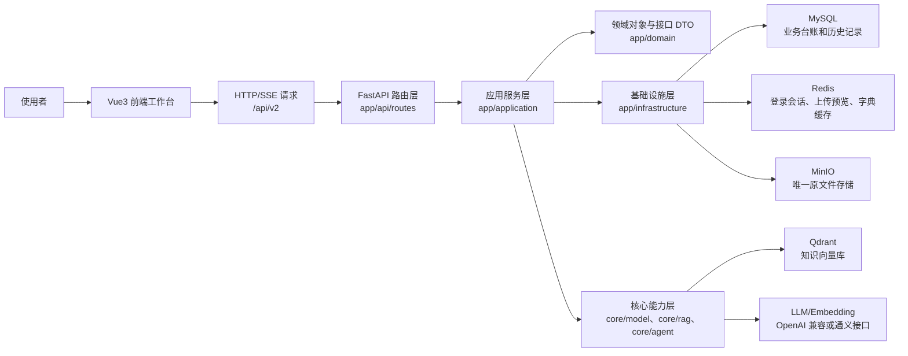

# AI RAG Agent 项目概要设计

## 1. 项目定位

本项目是一个面向知识库问答、对话式考试和 AI 销售陪练的 RAG 应用平台。它把文档资料上传到 MinIO 保存原文件，再把文本切片写入 Qdrant 向量库；用户提问、考试抽题、销售训练角色生成和训练评分时，再按业务场景检索向量库，并调用大模型生成回答、题目、角色、目标和评分报告。

系统当前已经进入 V2 分层架构：后端主线在 `app`，前端主线在 `src/features`。旧的 `core` 模块仍承载 RAG、模型工厂、文件处理、切片策略和旧 Agent 能力，属于底层能力层，不直接承担页面业务编排。

## 2. 总体架构

## 3. 前端概要

前端是 Vue3 + Vite 单页应用，目前没有使用 Vue Router，而是在 `src/App.vue` 中通过 `activePage` 切换主页面。菜单来自后端 `/api/v2/system/menus/me`，前端再根据 `page_key` 映射到具体页面组件。

| 层级 | 目录/文件 | 主要职责 |
| --- | --- | --- |
| 应用壳 | `src/App.vue`、`src/app/AppShell.vue`、`src/app/LoginGate.vue` | 登录恢复、主题切换、左侧菜单、页面切换、登录态失效处理 |
| 页面模块 | `src/features/dashboard/pages/HomePage.vue` | 首页驾驶舱，展示服务状态、知识库概览、训练概览等 |
| 页面模块 | `src/features/chat/pages/ChatPage.vue` | 智能客服，支持一次性/流式回答、检索调试、聊天记录 |
| 页面模块 | `src/features/exam/pages/ExamPage.vue` | 对话式考试，支持题源选择、答题、评分和历史记录 |
| 页面模块 | `src/features/sales-training/pages/SalesTrainingPage.vue` | 销售训练主流程，包含资料、方案、画像、目标、训练、评分复盘 |
| 页面模块 | `src/features/system/pages/*` | 用户、角色、菜单、字典等系统管理页面 |
| 接口封装 | `src/shared/api/*` | 统一请求封装、token 刷新、各业务 API |

前端所有页面都需要遵守深色/浅色主题。主题状态在 `App.vue` 维护，传给页面组件后通过 CSS 变量或 class 控制视觉方案。

## 4. 后端概要

后端使用 FastAPI，入口是 `api/main.py`。V2 接口统一挂在 `/api/v2`，路由总入口是 `app/api/router.py`。

| 层级 | 目录 | 主要职责 |
| --- | --- | --- |
| API 启动层 | `api/` | 创建 FastAPI app、启动预热、挂载 V2 路由 |
| 路由层 | `app/api/routes/` | 接收 HTTP 请求、参数校验、调用应用服务 |
| 应用服务层 | `app/application/` | 编排业务流程，例如上传、聊天、考试、训练、登录 |
| 领域层 | `app/domain/` | ORM 实体、接口 DTO、常量 |
| 基础设施层 | `app/infrastructure/` | MySQL 会话、仓储、MinIO、Qdrant 适配器、ID 生成 |
| 核心能力层 | `core/` | 模型工厂、RAG 检索、文件处理、切片策略、旧 Agent |

核心思想是：路由层不写业务细节，应用服务层负责编排，仓储和适配器负责隔离数据库、对象存储和向量库。

## 5. 核心业务能力

| 能力 | 当前实现 | 使用的存储/模型 |
| --- | --- | --- |
| 登录鉴权 | JWT access token + Redis refresh token + HttpOnly Cookie | MySQL 用户表、Redis refresh 会话 |
| 知识库上传 | 预览、模型推荐切片、确认入库、重建索引、删除 | MinIO、Redis 预览态、MySQL documents、Qdrant |
| 智能客服 | 支持一次性和流式；可按配置走直连 RAG 或 Agent | Qdrant、LLM、MySQL conversations |
| 对话式考试 | 从结构化问答切片抽题，LLM 生成题目和阅卷 | Qdrant、LLM、MySQL exam 表 |
| 销售训练资料 | 上传到临时库，发布后进入正式训练向量库 | MinIO、Qdrant staging/published、MySQL batch |
| 销售训练 | 生成角色、目标、评分规则；对话训练；最终评分 | Qdrant、LLM、MySQL training 表 |
| 首页驾驶舱 | 聚合服务状态、知识库、字典、会话、训练概览 | MySQL、Qdrant、Redis |

## 6. 主要外部依赖

| 依赖 | 用途 |
| --- | --- |
| MySQL | 保存业务台账、聊天历史、考试历史、训练方案、评分结果 |
| Redis | 保存 refresh token、上传预览状态、字典缓存 |
| MinIO | 保存上传的原文件，是当前唯一文件处理器 |
| Qdrant | 保存向量切片，支持知识问答、考试抽题、训练检索 |
| LLM | Query Planner、多意图拆分、知识回答、考试出题/阅卷、训练角色/目标/评分 |
| Embedding 模型 | 把文档切片和查询文本转成向量 |

## 7. 关键设计模式

本项目没有必要硬套 23 种 GoF 设计模式，当前合理使用的是以下几类。

| 设计模式 | 使用位置 | 选择原因 |
| --- | --- | --- |
| 外观模式 | `KnowledgeApplicationService`、`ChatApplicationService`、`V2SalesTrainingCoreService`、`DashboardApplicationService` | 对路由层隐藏复杂编排，路由只调用一个清晰入口 |
| 工厂方法模式 | `FileProcessorFactory`、`SplitStrategyFactory`、`KnowledgeIngestStrategyFactory`、`core/model/factory.py` | 根据文件类型、切片策略、训练资料类型或模型档位创建具体实现 |
| 策略模式 | 文件处理器、知识库切片策略、训练资料入库策略 | 不同格式和业务资料用不同策略，新增策略时不改主流程 |
| 适配器模式 | `FileStorageAdapter`、`VectorStoreAdapter` | 隔离 MinIO、Qdrant 的第三方 API，应用层不直接依赖实现细节 |
| 状态模式思想 | 文档状态、训练批次状态、训练会话状态、考试状态 | 虽未单独建状态类，但业务流由状态字段驱动，例如 `pending_review`、`published`、`active`、`completed` |
| 代理/缓存思想 | Redis refresh token、字典缓存、Dashboard 健康检查缓存、模型缓存 | 减少重复外部请求和数据库查询 |

## 8. 登录与安全概要

登录接口是 `/api/v2/auth/login`。后端校验用户名密码后返回短期 access token，并把 refresh token 写入 HttpOnly Cookie。前端把 access token 保存在内存变量中，不写 localStorage；页面刷新后通过 `/api/v2/auth/refresh` 读取 Cookie 中的 refresh token 换新 access token。

认证链路的好处是：access token 泄露窗口较短，refresh token 不暴露给普通 JS，后端可以通过 Redis 主动让 refresh 会话失效。当前默认管理员账号由初始化逻辑创建，密码哈希使用 PBKDF2-SHA256。

## 9. 当前边界与后续建议

1. 当前前端没有真正路由 URL，页面跳转依赖内存状态。后续如果需要浏览器前进后退、分享链接、页面权限细化，可以引入 Vue Router。
2. `core` 仍包含旧 Agent 和 RAG 能力，是底层能力仓库，不建议继续在里面堆业务编排。新增业务应优先落在 `app/application`。
3. 智能客服当前由 `rag.chat_route_mode` 控制走直连 RAG 或 Agent。后续建议生产环境默认使用 `direct_rag`，Agent 工具链作为高级模式保留。
4. 销售训练一期只做开放式训练，流程式阶段推进可作为二期扩展。
5. 文档上传已经统一 MinIO，但迁移脚本和历史兼容字段仍需等所有环境迁移完成后再清理。
