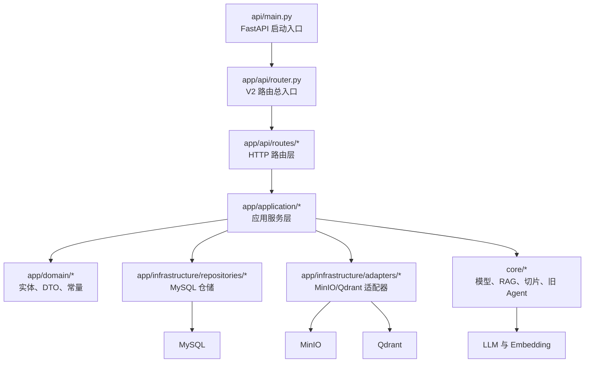
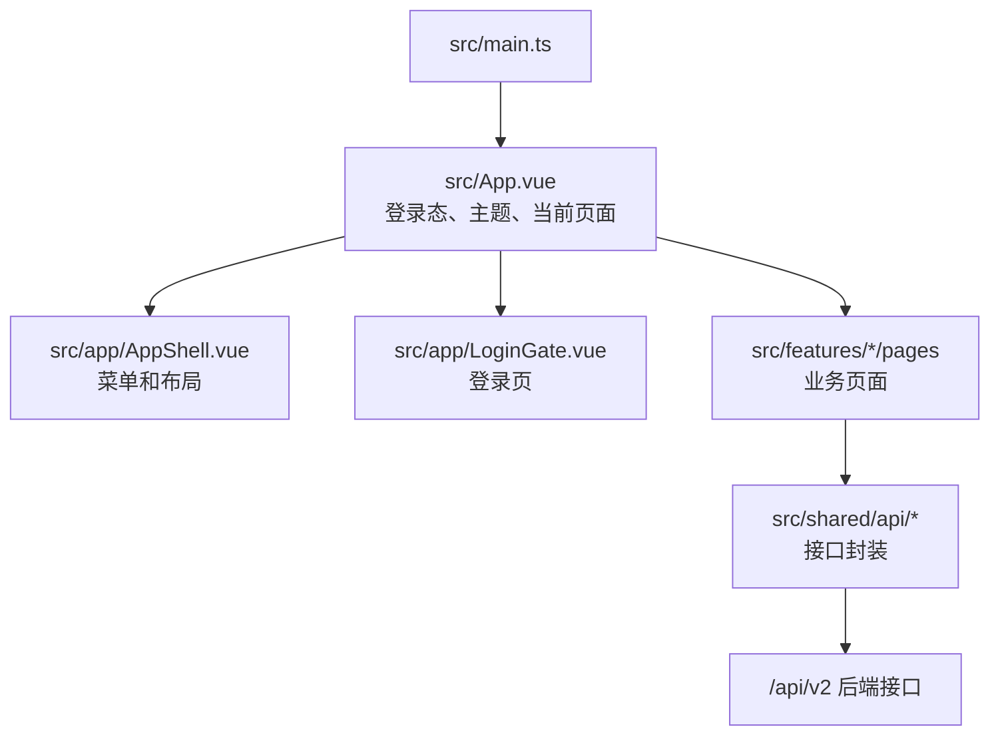
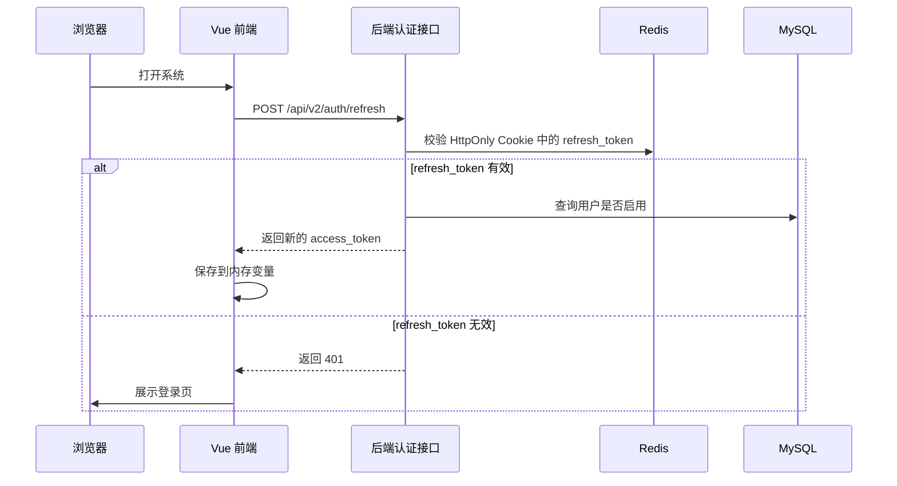

# AI RAG Agent 项目详细设计

## 1. 设计目标

本详细设计面向后续开发和维护，重点回答四个问题：

1. 前后端分别有哪些模块，每个模块负责什么。
2. 业务数据存在哪里，主要表字段是什么意思。
3. 知识库、聊天、考试、销售训练如何复用 RAG、向量库和大模型。
4. 哪些地方已经抽象成工厂/策略/适配器，哪些地方仍存在硬编码或正则规则。

## 2. 后端详细分层

### 2.1 API 启动层

| 文件 | 职责 |
| --- | --- |
| `api/main.py` | 创建 FastAPI app，配置标题、生命周期，挂载 `/api/v2` 路由和内部任务路由 |
| `api/warmup.py` | 启动预热，按配置检查 Qdrant、Embedding、Chat Model |
| `api/schemas.py`、`api/auth_schemas.py`、`api/exam_schemas.py` | 部分历史 DTO，V2 中仍被复用 |

### 2.2 V2 路由层

| 路由文件 | 接口前缀 | 职责 |
| --- | --- | --- |
| `auth.py` | `/api/v2/auth` | 登录、刷新 token、当前用户、退出 |
| `dashboard.py` | `/api/v2/dashboard` | 首页驾驶舱数据聚合 |
| `chat.py` | `/api/v2/chat`、`/api/v2/conversations` | 智能客服、流式聊天、聊天记录、检索调试 |
| `knowledge.py` | `/api/v2/knowledge` | 普通知识库上传、预览、确认入库、删除、重建索引 |
| `exam.py` | `/api/v2/exam` | 对话式考试，实际 router 由 `exam_service.py` 导出 |
| `training.py` | `/api/v2/training` | 销售训练资料、方案、画像、目标、会话、评分 |
| `dictionaries.py` | `/api/v2/dictionaries` | 字典父级和子项管理 |
| `system.py` | `/api/v2/system` | 菜单、角色、用户管理 |
| `health.py` | `/api/v2/health` | 基础健康检查 |
| `internal_jobs.py` | `/internal/jobs` | 内部定时任务，例如清理过期预览文件 |

路由层原则：只做参数接收、依赖注入、响应包装，不直接写数据库、不直接调 Qdrant、不写复杂业务判断。

### 2.3 应用服务层

| 服务 | 职责 |
| --- | --- |
| `AuthService` | 登录、密码哈希、JWT 签发校验、refresh token 存储与续签 |
| `DashboardApplicationService` | 聚合首页所需的健康、知识库、会话、训练数据 |
| `ChatApplicationService` | 聊天会话创建、消息保存、一次性和流式回答、调试检索 |
| `KnowledgeApplicationService` | 普通知识库上传预览、推荐切片、确认入库、预览文件、删除、重建 |
| `TrainingMaterialApplicationService` | 销售训练资料上传、批次列表、发布、回滚、重切 |
| `TrainingPlanApplicationService` | 销售训练方案创建、查询、修改、删除 |
| `TrainingProfileApplicationService` | 学员/客户画像字典查询、角色生成、场景润色、补充问题 |
| `TrainingGoalApplicationService` | 开放式训练目标和评分规则生成 |
| `TrainingSessionApplicationService` | 训练会话开始、每轮对话、流式对话、历史查询 |
| `TrainingScoringApplicationService` | 训练结束后的最终评分 |
| `V2SalesTrainingCoreService` | 当前销售训练主编排服务，组合资料、方案、画像、目标、对话、评分逻辑 |

### 2.4 基础设施层

| 模块 | 职责 |
| --- | --- |
| `orm_session.py` | SQLAlchemy engine、session 上下文 |
| `id_generator.py` | 雪花 ID 生成 |
| `repositories/*` | MySQL 表读写，隔离 SQLAlchemy 细节 |
| `file_storage_service.py` | MinIO 文件保存、复制、删除、临时下载 |
| `adapters/file_storage_adapter.py` | 文件存储适配器，应用层通过它使用 MinIO |
| `vector_store_service.py` | Qdrant 向量库底层服务 |
| `adapters/vector_store_adapter.py` | 向量库适配器，应用层通过它预览、入库、删除向量 |

### 2.5 核心能力层

| 模块 | 职责 |
| --- | --- |
| `core/model/factory.py` | 根据配置创建 Chat Model 和 Embedding Model |
| `core/rag/file_processors/*` | TXT、PDF、DOCX 读取为 LangChain Document |
| `core/rag/split_strategies/*` | 普通知识库切片策略 |
| `core/rag/document_parser.py` | 文档类型识别、问答结构抽取、标题结构切片、语义切片拼装 |
| `core/rag/services/rag_service.py` | RAG 检索、Query Planner 调用、召回质量评估、rerank |
| `core/rag/services/knowledge_answer_service.py` | 智能客服最终回答生成 |
| `core/rag/services/query_planner_service.py` | 多意图问题拆分和检索 query 改写 |
| `core/agent/react_agent.py` | 旧 LangGraph ReAct Agent 链路 |

## 3. 前端详细设计

### 3.1 页面与模块

| 前端模块 | 主要文件 | 职责 |
| --- | --- | --- |
| 应用壳 | `App.vue`、`AppShell.vue`、`PortalNavTree.vue` | 登录恢复、菜单树、页面切换、主题切换 |
| 登录 | `LoginGate.vue`、`shared/api/auth.ts` | 登录、退出、刷新 token、当前用户 |
| 首页 | `features/dashboard/pages/HomePage.vue` | 首页驾驶舱，展示服务状态、知识库、训练、最近会话 |
| 智能客服 | `features/chat/pages/ChatPage.vue` | 提问、流式输出、一次性输出、检索返回、聊天记录 |
| 考试 | `features/exam/pages/ExamPage.vue` | 题源选择、开始考试、作答、阅卷、历史 |
| 销售训练 | `features/sales-training/pages/SalesTrainingPage.vue` | 训练资料、方案、画像、目标、对话、评分复盘 |
| 销售训练组件 | `features/sales-training/components/*` | 训练资料工作台、上传面板、复盘工作区 |
| 系统管理 | `features/system/pages/*` | 用户、角色、菜单管理 |
| 接口类型 | `shared/api/types/*` | 前后端 DTO 类型定义 |

### 3.2 前端鉴权流程

access token 只放前端内存，页面刷新后消失；refresh token 放 HttpOnly Cookie，后端 Redis 只保存 refresh token 的 SHA256 哈希，不保存明文。

## 4. 配置文件设计

| 配置文件 | 主要用途 |
| --- | --- |
| `config/app.yml` | 模型名称、RAG 策略、Query Planner、启动预热、文档解析规则、内置知识文件映射 |
| `config/storage.yml` | MySQL、Redis、MinIO、Qdrant 连接和存储行为 |
| `config/training.yml` | 销售训练资料入库规则、训练向量库、LMS 案例切片、质量评估、发布验证 |
| `config/prompts.yml` | 大模型提示词集中管理，覆盖知识回答、Query Planner、语义切片、销售训练、考试 |

建议继续坚持：业务规则优先放配置，不在代码里散落字符串；prompt 放 `prompts.yml`；对外协议字段名保持英文，不因中文日志和文档而改名。

## 5. 数据表详细设计

### 5.1 documents：统一文件台账

用于记录普通知识库文件和销售训练资料文件的元数据。原文件在 MinIO，向量在 Qdrant，表里保存索引状态和定位信息。

| 字段 | 含义 |
| --- | --- |
| `document_id` | 文件唯一编号 |
| `filename` | 原始文件名 |
| `file_path` | 文件存储 URI，MinIO 模式为 `minio://bucket/object` |
| `storage_type` | 存储类型，当前为 `minio` |
| `bucket_name` | MinIO 桶名 |
| `object_name` | MinIO 对象路径 |
| `public_url` | 可用于预览或下载的公开地址 |
| `file_type` | 文件扩展名，例如 `txt`、`pdf`、`docx` |
| `file_md5` | 文件内容 MD5，用于重复上传校验 |
| `file_size` | 文件大小，单位字节 |
| `status` | 文件状态，例如已入库、索引中、已删除、失败 |
| `version` | 文件索引版本号 |
| `chunk_count` | 写入向量库的切片数量 |
| `collection_name` | Qdrant collection 名称 |
| `document_type` | 文档结构类型，例如普通文本、问答型、编号段落 |
| `split_strategy` | 切片策略，例如递归切片、编号问答、语义切片 |
| `created_at` | 创建时间 |
| `updated_at` | 更新时间 |
| `error_message` | 入库或索引失败原因 |

### 5.2 conversations：聊天会话摘要

用于首页最近会话和聊天记录列表。

| 字段 | 含义 |
| --- | --- |
| `conversation_id` | 会话唯一编号 |
| `user_id` | 用户编号 |
| `title` | 会话标题 |
| `status` | 会话状态，例如 active |
| `message_count` | 消息数量 |
| `summary` | 会话摘要 |
| `metadata_json` | 扩展元数据 |
| `created_at` | 创建时间 |
| `updated_at` | 更新时间 |
| `last_message_at` | 最后一条消息时间 |

### 5.3 conversation_messages：聊天消息明细

| 字段 | 含义 |
| --- | --- |
| `message_id` | 消息唯一编号 |
| `conversation_id` | 所属会话编号 |
| `sequence_no` | 会话内顺序号 |
| `role` | 消息角色，例如 user、assistant |
| `content` | 消息正文 |
| `content_type` | 内容类型，当前主要是 text |
| `model_name` | 生成该消息使用的模型 |
| `token_count` | token 数量 |
| `metadata_json` | 检索耗时、trace_id、引用等扩展信息 |
| `created_at` | 创建时间 |

### 5.4 dictionary_items：系统字典

系统字典用于把模型档位、文档类型、切片策略、训练画像字段、状态等可配置项放到数据库中，避免前端和后端都写死。

| 字段 | 含义 |
| --- | --- |
| `dictionary_item_id` | 字典项唯一编号 |
| `dictionary_code` | 字典编码，代表一组字典 |
| `dictionary_name` | 字典名称 |
| `item_code` | 字典项编码 |
| `item_name` | 字典项展示名 |
| `parent_item_id` | 父级字典项编号，用于树形字典 |
| `item_level` | 字典层级 |
| `sort_order` | 排序值 |
| `enabled` | 是否启用 |
| `description` | 字典项说明 |
| `metadata_json` | 扩展配置，例如默认项、字段类型、选项集合 |
| `created_at` | 创建时间 |
| `updated_at` | 更新时间 |

### 5.5 system_users：系统用户

| 字段 | 含义 |
| --- | --- |
| `user_id` | 用户唯一编号 |
| `username` | 登录账号 |
| `display_name` | 展示名称 |
| `password_hash` | PBKDF2-SHA256 密码哈希 |
| `role` | 用户角色编码 |
| `status` | 用户状态，例如 active |
| `last_login_at` | 最后登录时间 |
| `created_at` | 创建时间 |
| `updated_at` | 更新时间 |

### 5.6 system_roles、system_menus、system_role_menus：权限菜单

| 表 | 关键字段 | 含义 |
| --- | --- | --- |
| `system_roles` | `role_id` | 角色唯一编号 |
| `system_roles` | `role_code` | 角色编码 |
| `system_roles` | `role_name` | 角色名称 |
| `system_roles` | `status` | 角色状态 |
| `system_roles` | `sort_order` | 排序值 |
| `system_roles` | `built_in` | 是否内置角色 |
| `system_roles` | `description` | 角色说明 |
| `system_menus` | `menu_id` | 菜单唯一编号 |
| `system_menus` | `parent_menu_id` | 父级菜单编号 |
| `system_menus` | `menu_code` | 菜单编码 |
| `system_menus` | `menu_name` | 菜单名称 |
| `system_menus` | `menu_type` | 菜单类型，例如目录或页面 |
| `system_menus` | `page_key` | 前端页面 key，用于匹配组件 |
| `system_menus` | `route_path` | 预留路由路径 |
| `system_menus` | `component_key` | 预留组件 key |
| `system_menus` | `icon` | 菜单图标 |
| `system_menus` | `permission_code` | 权限编码 |
| `system_menus` | `visible` | 是否显示 |
| `system_menus` | `status` | 菜单状态 |
| `system_role_menus` | `role_menu_id` | 角色菜单关系编号 |
| `system_role_menus` | `role_id` | 角色编号 |
| `system_role_menus` | `menu_id` | 菜单编号 |

### 5.7 exam_sessions：考试会话

| 字段 | 含义 |
| --- | --- |
| `session_id` | 考试会话编号 |
| `user_id` | 用户编号 |
| `title` | 考试标题 |
| `collection_name` | 题源向量库 collection |
| `document_id` | 限定题源文件编号 |
| `filename` | 限定题源文件名 |
| `section_path` | 限定题源目录 |
| `round_count` | 题目数量 |
| `question_types_json` | 题型列表 JSON |
| `status` | 考试状态 |
| `current_round` | 当前轮次 |
| `answered_count` | 已回答数量 |
| `total_score` | 当前总分 |
| `max_score` | 满分 |
| `model_mode` | 模型档位 |
| `metadata_json` | 扩展元数据 |
| `created_at` | 创建时间 |
| `updated_at` | 更新时间 |
| `completed_at` | 完成时间 |

### 5.8 exam_questions：考试题目与作答

| 字段 | 含义 |
| --- | --- |
| `exam_question_id` | 考试题目编号 |
| `session_id` | 所属考试会话 |
| `round_no` | 轮次 |
| `source_question_id` | 来源知识库问题编号 |
| `source_document_id` | 来源文件编号 |
| `source_filename` | 来源文件名 |
| `source_page` | 来源页码 |
| `section_path` | 来源目录 |
| `question_type` | 题型 |
| `prompt` | 题干 |
| `options_json` | 选项 JSON |
| `correct_answer_json` | 标准答案 JSON |
| `reference_answer` | 参考答案 |
| `user_answer` | 用户答案 |
| `is_correct` | 是否正确 |
| `score` | 得分 |
| `max_score` | 本题满分 |
| `analysis_json` | 阅卷分析 JSON |
| `status` | 题目状态 |
| `created_at` | 创建时间 |
| `answered_at` | 回答时间 |

### 5.9 training_knowledge_batches：销售训练资料批次

| 字段 | 含义 |
| --- | --- |
| `batch_id` | 上传批次编号 |
| `document_id` | 关联 documents 文件编号 |
| `source_type` | 资料来源类型，例如 LMS 场景案例 |
| `source_file` | 原始文件名 |
| `file_path` | 历史兼容文件路径 |
| `file_md5` | 文件 MD5 |
| `version_group_id` | 版本组编号 |
| `version_no` | 版本号 |
| `previous_batch_id` | 上一个批次编号 |
| `is_current` | 是否当前版本 |
| `profile_type` | 适用画像类型 |
| `task_type` | 训练任务类型 |
| `industry` | 行业标签 |
| `difficulty` | 难度 |
| `visibility_default` | 默认可见范围 |
| `status` | 批次状态，例如待审核、已发布、解析失败 |
| `chunk_count` | 切片数量 |
| `point_count` | 向量点数量 |
| `error_message` | 失败原因 |
| `quality_report_json` | 切片质量报告 |
| `created_by` | 创建人 |
| `created_at` | 创建时间 |
| `updated_at` | 更新时间 |

### 5.10 training_plans：销售训练方案

| 字段 | 含义 |
| --- | --- |
| `plan_id` | 训练方案编号 |
| `plan_name` | 训练方案名称 |
| `trainee_id` | 学员编号 |
| `trainee_name` | 学员名称 |
| `profile_type` | 客户画像类型 |
| `trainee_json` | 学员画像快照 JSON |
| `selected_fields_json` | 客户画像字段快照 JSON |
| `scenario_description` | 训练场景描述 |
| `extra_details` | 补充说明 |
| `model_mode` | 默认模型档位 |
| `active_profile_id` | 当前客户画像编号 |
| `active_setting_id` | 当前训练目标编号 |
| `role_status` | 角色生成状态 |
| `goal_status` | 目标生成状态 |
| `score_status` | 评分规则状态 |
| `created_at` | 创建时间 |
| `updated_at` | 更新时间 |

### 5.11 training_role_profiles：AI 客户画像

| 字段 | 含义 |
| --- | --- |
| `profile_id` | 客户画像编号 |
| `trainee_id` | 学员编号 |
| `plan_id` | 所属训练方案 |
| `profile_type` | 画像类型 |
| `visible_profile_json` | 可展示画像 JSON |
| `hidden_profile_json` | 隐藏画像 JSON，训练中不直接暴露给学员 |
| `role_profile_json` | AI 扮演画像 JSON |
| `role_confirm_card_json` | 前端确认卡片 JSON |
| `selected_fields_json` | 画像字段选择快照 JSON |
| `scenario_description` | 场景描述 |
| `extra_details` | 补充说明 |
| `retrieved_evidence_json` | 生成画像时召回的训练资料证据 |
| `status` | 画像状态 |
| `created_at` | 创建时间 |
| `updated_at` | 更新时间 |

### 5.12 training_goal_settings：训练目标与评分规则

| 字段 | 含义 |
| --- | --- |
| `setting_id` | 目标设置编号 |
| `profile_id` | 关联客户画像编号 |
| `plan_id` | 所属训练方案 |
| `trainee_id` | 学员编号 |
| `training_mode` | 训练方式，一期主要是开放式 |
| `training_purpose` | 训练宗旨 |
| `round_limit` | 训练轮数上限，由 LLM 动态生成后后端限制范围 |
| `stages_json` | 阶段设置 JSON，一期开放式只有一个阶段 |
| `scoring_rules_json` | 评分规则 JSON，通用 40 分 + 阶段 60 分 |
| `status` | 设置状态 |
| `created_at` | 创建时间 |
| `updated_at` | 更新时间 |

### 5.13 sales_training_sessions：销售训练会话

| 字段 | 含义 |
| --- | --- |
| `session_id` | 训练会话编号 |
| `profile_id` | 客户画像编号 |
| `setting_id` | 训练目标编号 |
| `trainee_id` | 学员编号 |
| `training_mode` | 训练方式 |
| `response_mode` | 响应方式，流式或一次性 |
| `current_stage_no` | 当前阶段编号 |
| `status` | 会话状态，例如 active、scoring、completed |
| `round_limit` | 轮数上限 |
| `total_score` | 总分 |
| `level` | 评级 |
| `report_json` | 训练报告 JSON |
| `started_at` | 开始时间 |
| `ended_at` | 结束时间 |
| `created_at` | 创建时间 |
| `updated_at` | 更新时间 |

### 5.14 sales_training_turns：销售训练单轮对话

| 字段 | 含义 |
| --- | --- |
| `turn_id` | 对话轮次编号 |
| `session_id` | 所属训练会话 |
| `role` | 角色，例如学员或 AI 客户 |
| `content` | 对话内容 |
| `round_no` | 轮次 |
| `stage_no` | 阶段编号 |
| `response_mode` | 响应方式 |
| `started_at` | 开始时间 |
| `submitted_at` | 提交时间 |
| `response_seconds` | 响应耗时 |
| `retrieved_chunk_ids_json` | 本轮召回切片编号 JSON |
| `retrieved_evidence_json` | 本轮召回证据 JSON |
| `stage_decision_json` | 阶段判断 JSON |
| `coach_analysis_json` | 教练分析 JSON |
| `metadata_json` | 扩展元数据 |
| `created_at` | 创建时间 |

### 5.15 sales_training_scores：销售训练评分

| 字段 | 含义 |
| --- | --- |
| `score_id` | 评分编号 |
| `session_id` | 所属训练会话 |
| `general_score` | 通用能力得分，满分 40 |
| `stage_score` | 阶段能力得分，满分 60 |
| `penalty_score` | 扣分 |
| `final_score` | 最终得分 |
| `level` | 评级 |
| `is_passed` | 是否通过 |
| `detail_json` | 评分明细 JSON |
| `review_status` | 复核状态 |
| `created_at` | 创建时间 |
| `updated_at` | 更新时间 |

## 6. 向量库设计

| collection | 中文含义 | 使用场景 |
| --- | --- | --- |
| `agent` | 普通知识库默认向量库 | 智能客服、考试抽题、知识库调试 |
| `sales_training_cases_staging` | 销售训练资料临时审核库 | 上传后预览、切片审核、发布前检查 |
| `sales_training_cases` | 销售训练资料正式库 | 角色生成、每轮对话、最终评分 |

普通知识库向量 metadata 主要包含文件编号、文件名、页码、目录、内容类型、问题、答案等。销售训练向量 metadata 额外包含 `batch_id`、`case_part`、`visibility`、`case_title`、`case_index`。

销售训练可见性含义：

| metadata 值 | 中文含义 | 允许使用位置 |
| --- | --- | --- |
| `visible` | 可展示资料，学员/教练/AI 都可用 | 角色生成、对话、评分、页面预览 |
| `hidden` | 隐藏资料，给 AI 客户扮演使用，不直接展示给学员 | 角色生成、对话 |
| `scoring_only` | 评分专用资料 | 最终评分 |

## 7. 关键设计模式落点

| 模式 | 代码位置 | 为什么使用 |
| --- | --- | --- |
| 外观模式 | `KnowledgeApplicationService`、`ChatApplicationService`、`V2SalesTrainingCoreService` | 对路由隐藏复杂业务流程，路由只关心请求和响应 |
| 工厂方法模式 | `FileProcessorFactory`、`SplitStrategyFactory`、`KnowledgeIngestStrategyFactory`、`ChatModelFactory`、`EmbeddingsFactory` | 根据配置和输入类型创建具体实现 |
| 策略模式 | `BaseFileProcessor` 子类、`BaseSplitStrategy` 子类、`KnowledgeIngestStrategy` 子类 | 支持 TXT/PDF/DOCX、不同切片策略、不同训练资料解析策略 |
| 适配器模式 | `FileStorageAdapter`、`VectorStoreAdapter` | 隔离 MinIO/Qdrant 第三方 API |
| 模板方法思想 | `BaseSplitStrategy.split()`、`BaseFileProcessor.load_documents()` | 父类约束接口，子类实现具体步骤 |
| 缓存/代理思想 | `RefreshSessionStore`、字典 Redis 缓存、模型缓存、首页健康缓存 | 降低重复数据库和外部服务请求 |

此场景不需要强行套完整 23 种设计模式。当前优先保持可理解、可测试、可维护。

## 8. 硬编码与正则现状

### 8.1 已配置化的规则

| 位置 | 规则 | 说明 |
| --- | --- | --- |
| `config/app.yml -> rag.document_parse_rules` | 编号题、标题、答案前缀、无效答案、问题标点 | 普通知识库文档解析规则 |
| `config/training.yml -> lms_case.case_title_pattern` | LMS 案例标题识别 | 销售训练资料案例切分 |
| `config/training.yml -> lms_case.part_markers` | 案例片段关键词 | 判断客户信息、任务要求、参考话术、隐藏心理、评分规则 |
| `config/training.yml -> lms_case.part_visibility` | 片段可见性 | 决定哪些资料给学员、AI 客户、评分模型使用 |
| `config/prompts.yml` | 大模型提示词 | 减少 prompt 散落在代码中 |

### 8.2 仍在代码内的硬编码或正则

| 位置 | 内容 | 风险与建议 |
| --- | --- | --- |
| `query_planner_service.py` | 多问题拆分使用问号、分号、换行正则 | 合理保留，属于显式用户分隔符解析；可后续放配置 |
| `query_planner_service.py` | JSON code block 提取正则 | 合理保留，兼容模型输出 |
| `exam_service.py` | 题型 code、选项 A-Z、判断题“正确/错误”、答案清洗规则 | 建议后续把题型和选项规则字典化 |
| `sales_training_core.py` | 教练分析关键词、兜底话术、兜底评分规则 | 一期可保留，二期建议迁移到配置或 prompt |
| `storage.yml` | 默认 collection 为 `agent` | 可以保留，但页面应展示中文含义 |
| `training.yml` | `sales_training_cases`、`sales_training_cases_staging` | 业务 collection 名可配置，当前合理 |
| 前端销售训练页 | 部分 label fallback、状态 fallback | 后端字典未返回时兜底；后续可减少 |

## 9. 性能与查询设计

| 场景 | 当前做法 | 优化建议 |
| --- | --- | --- |
| 首页健康检查 | Qdrant 检查 10 秒缓存 | 合理，避免频繁打 Qdrant |
| 聊天 RAG | adaptive 模式先原问题检索，召回不足再 Query Planner | 合理，减少不必要 LLM 调用 |
| 多意图检索 | 多 query 并发查 Qdrant，最终 rerank 去重 | 合理，注意并发线程数配置 |
| 考试抽题 | Qdrant scroll 候选题，随机抽取，后台生成后续题 | 题库大时可增加题源缓存或分页 scroll 游标 |
| 销售训练每轮对话 | 每轮都查训练向量库 | 更真实，但会增加延迟；可保留 topK 和 evidence 长度限制 |
| 字典查询 | Redis 缓存 | 合理，字典修改后需要清缓存 |
| 文件预览 | 原文件从 MinIO 临时下载后读取 | 大文件建议限制最大预览字符，当前已有 `max_chars` |

## 10. 开发约束

1. 新业务接口必须放在 `/api/v2` 下。
2. 对外 API 字段保持英文，不用中文字段名。
3. 日志统一中文，但不能改变 SSE 事件名、数据库字段名、API 字段名。
4. 原文件统一进 MinIO，不再新增本地上传目录。
5. 新增切片策略时优先实现 `BaseSplitStrategy`，并注册到 `SplitStrategyFactory`。
6. 新增训练资料类型时优先实现 `KnowledgeIngestStrategy`，并注册到 `KnowledgeIngestStrategyFactory`。
7. 新增大模型提示词优先写入 `config/prompts.yml`，不要直接散落到业务代码中。
