# 文档上传、预览、入库、删除流程设计

## 1. 设计范围

本设计覆盖两类资料上传：

1. 普通知识库上传：用于智能客服和对话式考试，默认写入普通知识库向量库。
2. 销售训练资料上传：用于 AI 销售陪练，先写入临时审核向量库，发布后进入正式训练向量库。

销售训练资料上传的交互流程和后端技术流程已经单独拆出来，详见 [05-销售训练资料上传交互与技术流程.md](05-销售训练资料上传交互与技术流程.md)。这份总文档保留整体上传设计，销售训练专题文档负责把页面怎么点、接口怎么走、MinIO/Qdrant 怎么落数据讲清楚。

两类上传都以 MinIO 作为唯一原文件存储。MySQL 只保存文件台账和业务状态，Qdrant 只保存文本切片向量和 metadata。

## 2. 存储职责

| 存储 | 中文职责 | 说明 |
| --- | --- | --- |
| MinIO | 保存原文件 | 上传的 TXT、PDF、DOCX 原文件都放这里，后续预览、重建索引、销售训练重切都从这里读取 |
| MySQL `documents` | 文件台账 | 保存文件名、MD5、MinIO 路径、入库状态、切片数量、collection 等 |
| MySQL `training_knowledge_batches` | 销售训练资料批次 | 保存训练资料版本、发布状态、质量报告、关联文件 |
| Redis | 临时预览状态 | 普通知识库上传预览阶段保存 `upload_id -> MinIO 临时对象` 元数据 |
| Qdrant | 文本切片向量 | 普通知识库、考试题源、销售训练资料的检索都依赖它 |

## 3. 普通知识库上传流程

### 3.1 用户交互流程

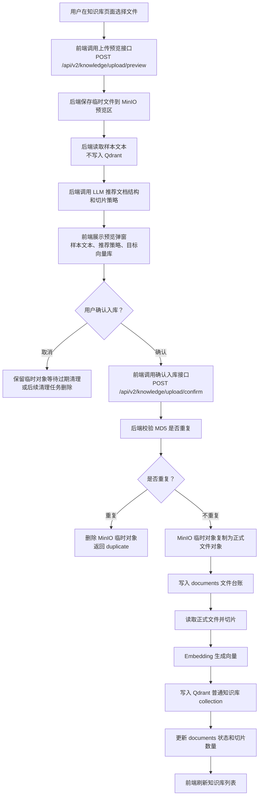

### 3.2 接口与服务链路

| 步骤 | 接口/服务 | 说明 |
| --- | --- | --- |
| 上传预览 | `POST /api/v2/knowledge/upload/preview` | 前端上传 multipart 文件 |
| 保存临时文件 | `_save_preview_file()` | 将文件保存到 MinIO `previews` 前缀，并把元数据写 Redis |
| 样本预览 | `VectorStoreService.preview_file()` | 读取部分文本用于页面展示，不写向量库 |
| 推荐策略 | `_recommend_upload_split_strategy_or_fallback()` | 调用 LLM 推荐文档结构和切片策略，失败回退普通文本 + 递归切片 |
| 确认入库 | `POST /api/v2/knowledge/upload/confirm` | 用户确认后正式入库 |
| 重复校验 | `DocumentRepository.find_active_document_by_md5()` | 用文件 MD5 防止重复入库 |
| 文件转正 | `_promote_preview_file()` | MinIO 复制临时对象到 `documents` 正式前缀，删除预览对象 |
| 写台账 | `DocumentRepository.create_document()` | 写 `documents` 表 |
| 索引入库 | `_index_document()` | 读取 MinIO 文件、切片、Embedding、写 Qdrant |

### 3.3 技术时序图

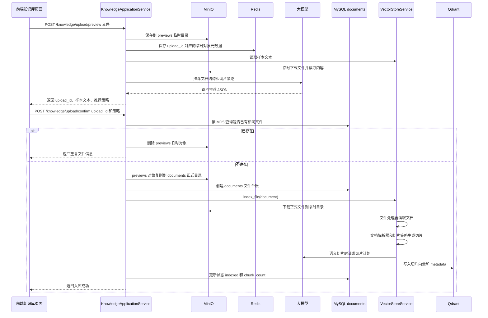

## 4. 普通知识库切片策略

### 4.1 文件处理工厂

`FileProcessorFactory` 根据文件扩展名选择处理器：

| 文件类型 | 处理器 | 说明 |
| --- | --- | --- |
| TXT | `TxtFileProcessor` | 读取纯文本 |
| PDF | `PdfFileProcessor` | 读取 PDF 页文本和目录 |
| DOCX | `DocxFileProcessor` | 读取 Word 段落、标题样式、页码等元数据 |

### 4.2 切片策略工厂

`SplitStrategyFactory` 根据 `split_strategy` 创建策略：

| 策略 code | 中文含义 | 适用场景 |
| --- | --- | --- |
| `llm_semantic` | LLM 语义切片 | 默认推荐，适合结构不稳定或语义边界复杂的资料 |
| `outline_qa` | PDF/文档目录问答切片 | 有清晰目录，目录项本身像问题 |
| `numbered_qa` | 编号问答切片 | 例如“1. 问题 + 答案”结构 |
| `numbered_segments` | 编号段落切片 | 编号条目不是问答，只是说明段落 |
| `recursive` | 通用递归字符切片 | 普通文本兜底 |

### 4.3 切片技术流程

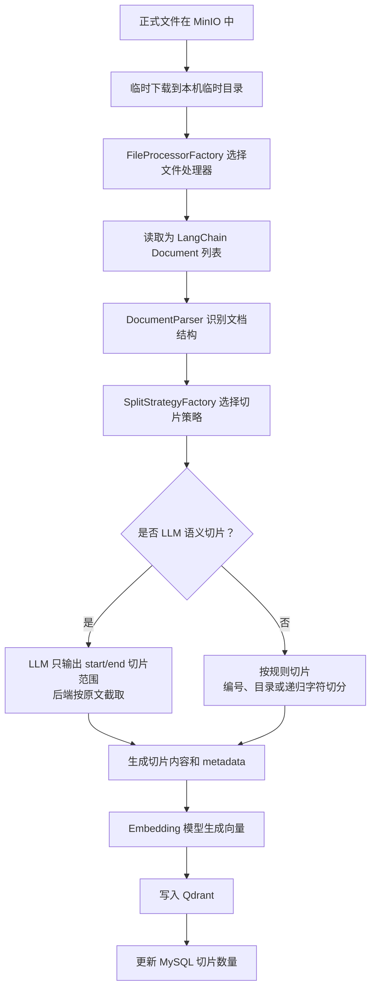

## 5. 普通知识库预览、删除、重建

### 5.1 已入库文件预览

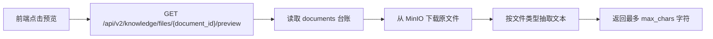

预览读取的是 MinIO 原文件，不依赖 Qdrant。这样即使向量库重建失败，原文件仍然可以预览。

### 5.2 删除文件

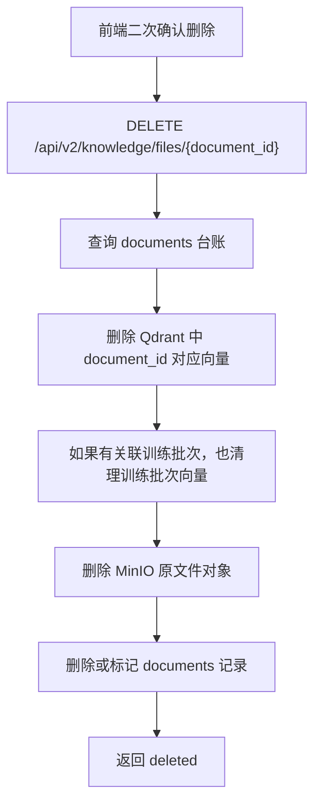

删除是破坏性操作，前端必须二次弹窗确认。后端删除时应尽量按“先删向量、再删文件、最后删台账”的思路执行，避免台账没了但向量残留无法定位。

### 5.3 重建索引

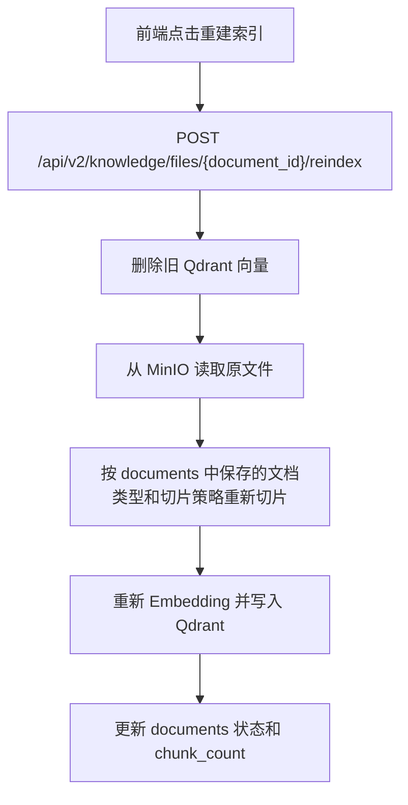

全量重建接口 `/api/v2/knowledge/files/reindex-all` 会对当前 documents 表中的文件逐个执行上述流程。

## 6. 销售训练资料上传流程

销售训练资料和普通知识库不同：训练资料上传后不是马上进入正式训练库，而是先进入临时审核库。只有发布成功后，训练角色生成、对话和评分才会使用正式训练库的数据。

### 6.1 用户交互流程

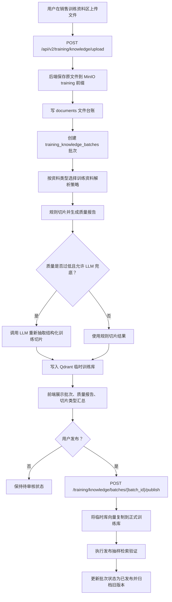

### 6.2 技术时序图

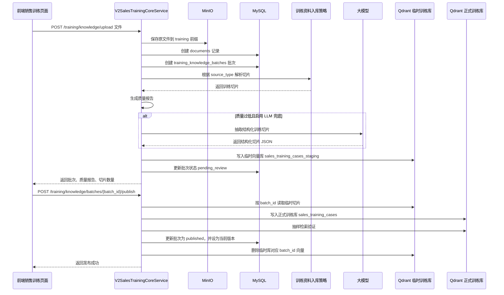

## 7. 销售训练资料切片规则

### 7.1 训练资料解析策略

`KnowledgeIngestStrategyFactory` 根据 `source_type` 选择策略。

| 策略 | 中文含义 | 说明 |
| --- | --- | --- |
| `LmsCaseIngestStrategy` | LMS 场景案例解析 | 识别案例标题、客户信息、任务要求、参考话术、隐藏心理、评分规则 |
| `GenericTrainingIngestStrategy` | 通用训练资料解析 | 无法识别 LMS 结构时兜底切成普通训练片段 |

### 7.2 训练资料切片类型

| `case_part` | 中文含义 | 主要用途 |
| --- | --- | --- |
| `case_profile` | 客户/企业基本信息 | 生成客户角色的身份、行业、阶段、背景 |
| `task_requirement` | 训练任务要求 | 生成训练目标和对话推进方向 |
| `standard_answer` | 标准话术或参考答案 | 对话追问、学员反馈、最终评分参考 |
| `hidden_psychology` | 客户隐藏心理或底层顾虑 | AI 客户扮演时使用，训练中不直接暴露给学员 |
| `scoring_rubric` | 评分规则或扣分点 | 最终评分时使用 |

### 7.3 训练资料可见性

| `visibility` | 中文含义 | 使用位置 |
| --- | --- | --- |
| `visible` | 可见资料，教练和 AI 都能用 | 角色生成、训练对话、评分、页面预览 |
| `hidden` | 隐藏资料，只给 AI 客户扮演使用 | 角色生成、训练对话 |
| `scoring_only` | 评分专用资料 | 训练结束评分 |

### 7.4 质量评估

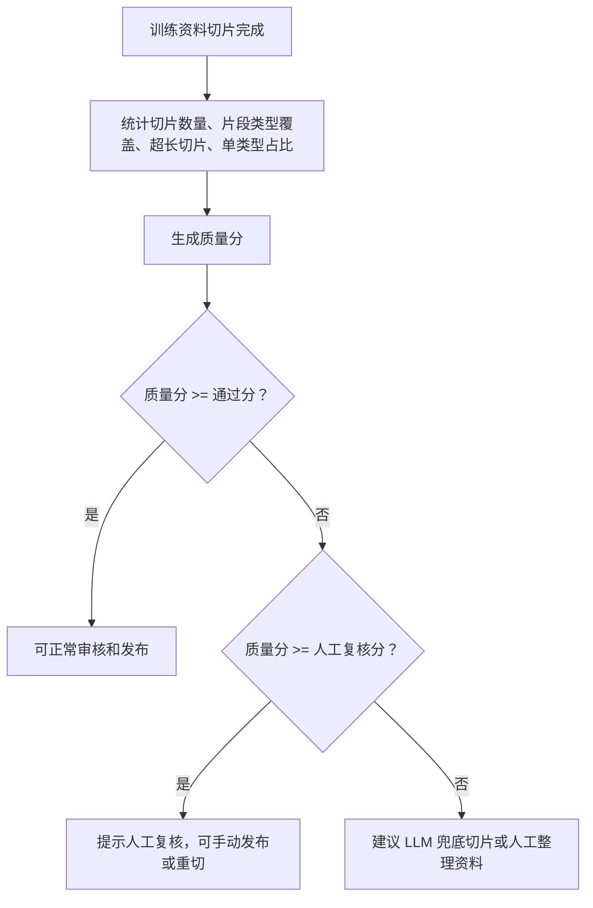

质量阈值来自 `config/training.yml -> quality`：

| 配置 | 中文含义 |
| --- | --- |
| `pass_score` | 切片质量通过分 |
| `review_score` | 需要人工复核的最低分 |
| `max_chunk_chars` | 单个切片最大推荐字符数 |
| `max_single_part_ratio` | 单一片段类型占比上限 |
| `required_parts` | 必须出现的片段类型 |
| `recommended_parts` | 推荐出现的片段类型 |

## 8. 销售训练资料删除、回滚、重切

### 8.1 删除训练资料

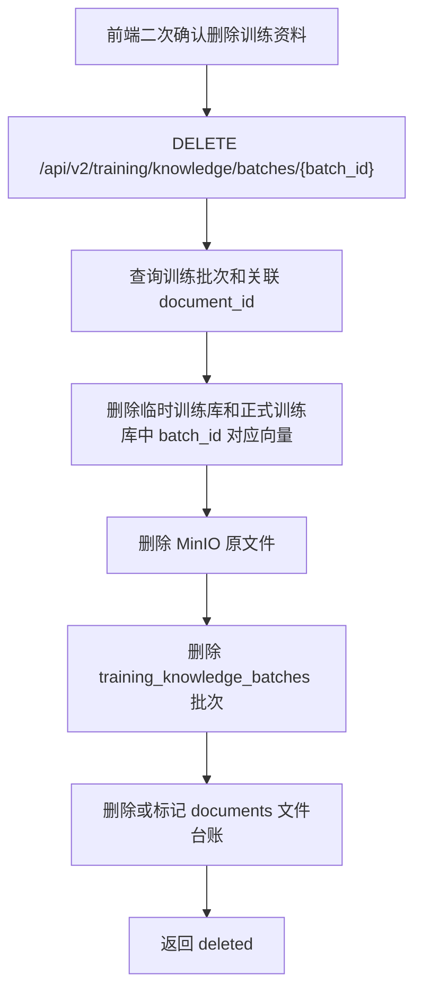

### 8.2 回滚训练资料版本

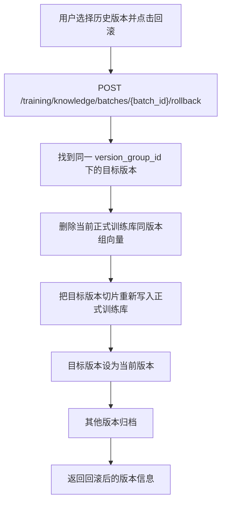

### 8.3 重新切分训练资料

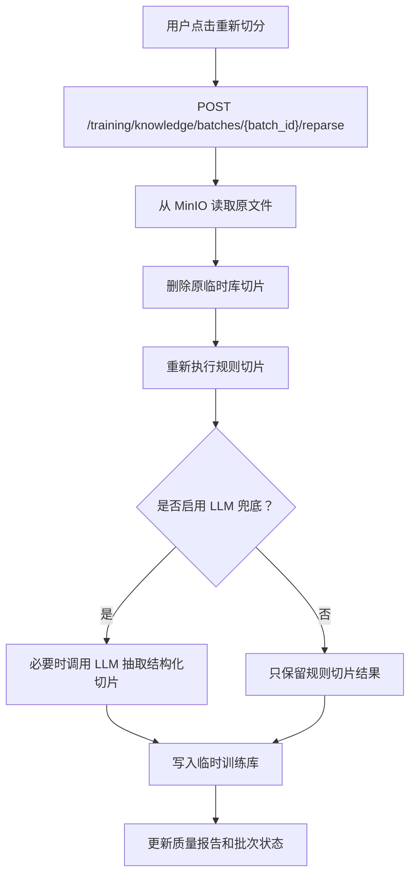

## 9. 删除与重复校验规则

| 场景 | 重复校验方式 | 删除范围 |
| --- | --- | --- |
| 普通知识库确认入库 | `documents.file_md5` 查活动文件 | MinIO 原文件、Qdrant document_id 向量、documents 台账 |
| 销售训练资料上传 | `documents.file_md5` / `training_knowledge_batches.file_md5` 查未删除批次 | MinIO 原文件、临时/正式训练向量、training batch、documents 台账 |
| 预览临时文件 | `upload_id` 作为临时对象标识 | 过期后清理 MinIO previews 对象和 Redis 元数据 |

## 10. 当前硬编码和正则说明

| 位置 | 内容 | 中文说明 |
| --- | --- | --- |
| `storage.yml -> qdrant.allow_knowledge_file_type` | `txt`、`pdf`、`docx` | 允许上传的知识文件类型 |
| `storage.yml -> qdrant.collection_name` | `agent` | 普通知识库默认向量库 |
| `training.yml -> collections.published` | `sales_training_cases` | 销售训练正式向量库 |
| `training.yml -> collections.staging` | `sales_training_cases_staging` | 销售训练临时审核向量库 |
| `app.yml -> document_parse_rules` | 编号、标题、答案前缀等正则 | 普通知识库结构识别规则 |
| `training.yml -> lms_case.case_title_pattern` | LMS 案例标题正则 | 销售训练案例边界识别 |
| `training.yml -> lms_case.part_markers` | 片段关键词 | 通过中文关键词判断切片属于哪类业务片段 |
| `query_planner_service.py` | JSON 提取正则 | 兼容 LLM 返回 Markdown code block |
| `exam_service.py` | 选项 A-Z、判断题“正确/错误” | 考试题型生成和阅卷兜底规则 |

## 11. 日志建议

当前主要流程已经有中文日志，建议保留并继续补齐以下关键点：

1. 上传预览开始/成功/失败：记录文件名、upload_id、文件大小。
2. 模型推荐切片开始/成功/失败：记录 upload_id、推荐策略、置信度。
3. 确认入库开始/重复/成功/失败：记录 document_id、collection、chunk_count。
4. Qdrant 写入开始/完成：记录 collection、document_id、切片数。
5. 销售训练发布开始/完成/失败：记录 batch_id、临时库、正式库、抽样命中率。
6. 删除开始/完成/失败：记录 document_id、batch_id、MinIO 对象名、向量清理范围。

日志使用中文描述，但 API 字段、SSE 事件名、数据库字段名保持英文。
