# 聊天、考试、销售训练交互流程设计

## 1. 设计范围

本设计覆盖三个面向用户的核心交互：

1. 智能客服聊天：用户提问，系统检索知识库并生成答案。
2. 对话式考试：系统从知识库抽题，用户答题，LLM 或规则阅卷。
3. AI 销售训练：基于销售训练资料生成客户角色，学员对话训练，最终评分。

重点说明每一步什么时候使用 MySQL、Qdrant、MinIO、LLM，以及哪些地方仍有硬编码或正则规则。

## 2. 智能客服聊天流程

### 2.1 当前路线选择

聊天入口由 `config/app.yml -> rag.chat_route_mode` 控制。

| 配置值 | 中文含义 | 链路 |
| --- | --- | --- |
| `direct_rag` | 直连 RAG | 用户问题 -> RAG 检索 -> LLM 最终回答 |
| `agent`、`react_agent`、`legacy_agent` | Agent 工具链 | 用户问题 -> LangGraph ReAct Agent -> 工具调用 -> LLM 回答 |

当前配置文件显示 `chat_route_mode: agent`。如果改成 `direct_rag`，就走更短、更稳定的知识直答链路。

### 2.2 一次性聊天流程

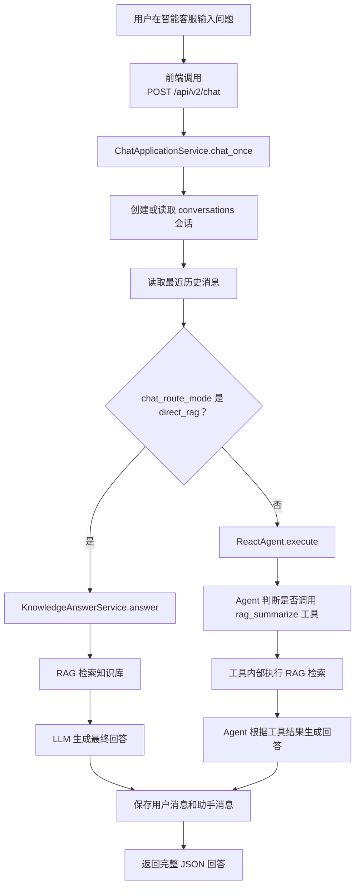

### 2.3 流式聊天流程

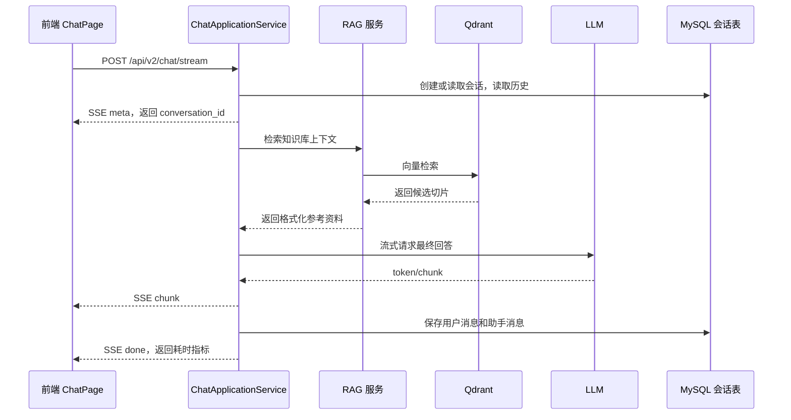

### 2.4 RAG 检索细节

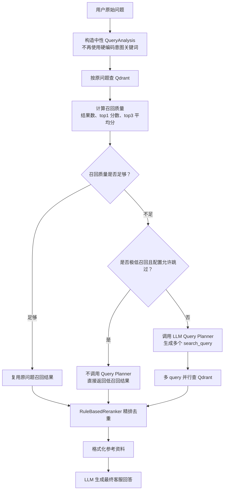

### 2.5 多意图拆分输出

Query Planner 的目标不是直接回答，而是把用户问题拆成适合检索的 query，例如：

用户问题：

```text
小区灰尘大，如何减少机器人拖扫的频次？APP中拖扫地图如何保存和删除？如何共享扫拖设置给家人？
```

可能拆分为：

```json
{
  "queries": [
    "小区灰尘大 如何减少机器人拖扫频次",
    "APP 中拖扫地图如何保存和删除",
    "如何共享扫拖设置给家人"
  ]
}
```

日志应输出中文，例如：

```text
[查询规划] 模型拆分完成 追踪编号=trace-20260628-001 原问题=小区灰尘大，如何减少机器人拖扫的频次？APP中拖扫地图如何保存和删除？如何共享扫拖设置给家人？ 拆分问题数量=3
[查询规划] 拆分问题1：小区灰尘大 如何减少机器人拖扫频次
[查询规划] 拆分问题2：APP 中拖扫地图如何保存和删除
[查询规划] 拆分问题3：如何共享扫拖设置给家人
```

### 2.6 聊天使用的数据

| 数据 | 来源 | 使用位置 |
| --- | --- | --- |
| 会话摘要 | MySQL `conversations` | 聊天记录列表、首页最近会话 |
| 消息明细 | MySQL `conversation_messages` | 上下文历史、会话详情 |
| 知识切片 | Qdrant 普通知识库 collection | RAG 检索 |
| prompt | `config/prompts.yml -> knowledge.answer` | LLM 最终回答 |
| 模型配置 | `config/app.yml -> rag.*` | 模型选择、Query Planner、检索阈值 |

## 3. 对话式考试流程

### 3.1 题源建立关系

考试不直接读取原文件，而是从已经写入 Qdrant 的结构化问答切片中抽题。也就是说，考试依赖知识库上传时正确抽取出 `content_type = qa` 的切片。

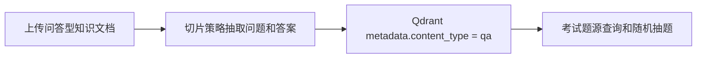

### 3.2 开始考试流程

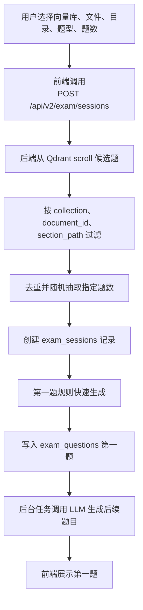

### 3.3 作答与阅卷流程

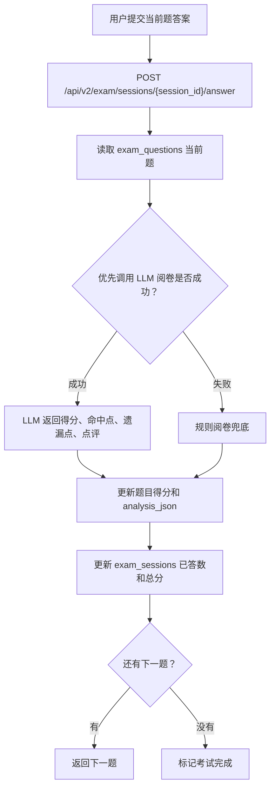

### 3.4 考试 LLM 使用点

| 使用点 | 是否必须 | prompt 位置 | 失败兜底 |
| --- | --- | --- | --- |
| 题目生成 | 不是 | `config/prompts.yml -> exam.question_generation` | 规则生成题目 |
| 答案阅卷 | 不是 | `config/prompts.yml -> exam.answer_grading` | `_rule_answer_analysis()` |

### 3.5 考试硬编码与正则

| 位置 | 内容 | 中文说明 |
| --- | --- | --- |
| 题型枚举 | `single_choice`、`multiple_choice`、`true_false`、`short_answer`、`fill_blank` | 单选、多选、判断、简答、填空 |
| 选项标签 | A-Z | 客观题选项生成和答案解析 |
| 判断题答案 | “正确”“错误” | 判断题固定选项 |
| 填空题识别 | `____`、中文括号等 | 判断是否可构造成填空题 |
| 答案清洗 | 多选分隔符、选项前缀清洗 | 兼容用户输入和模型输出 |

这些规则属于考试业务规则，一期可保留；如果题型变多，建议迁移到题型策略类或字典配置。

## 4. AI 销售训练完整流程

销售训练一期只做开放式训练，不做流程式多阶段推进。它依赖销售训练正式向量库 `sales_training_cases`。

### 4.1 全流程总览

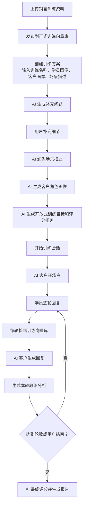

### 4.2 训练资料如何和训练对话建立关系

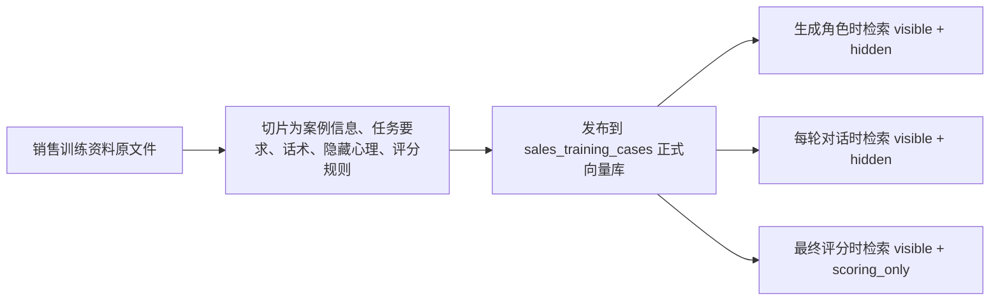

训练不是把整篇文档一次性塞给模型，而是在关键步骤动态检索：

| 步骤 | 检索内容 | 可见性过滤 |
| --- | --- | --- |
| 生成客户角色 | 根据画像字段、场景描述、补充细节检索相关案例 | `visible` + `hidden` |
| 每轮训练对话 | 根据学员回复和场景描述检索相关话术、痛点、隐藏心理 | `visible` + `hidden` |
| 最终评分 | 根据完整对话检索参考话术和评分标准 | `visible` + `scoring_only` |

## 5. 销售训练方案与画像流程

### 5.1 训练方案创建

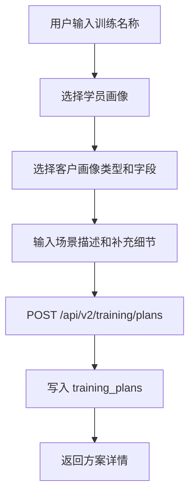

当前代码注释中提到训练名称允许重复，但用户之前提出“训练名称不能重复”。如果业务上必须强制唯一，需要在 `training_plans.plan_name` 查询和保存前增加唯一性校验，并在前端给出提示。这是后续需要确认和补齐的点。

### 5.2 补充问题生成

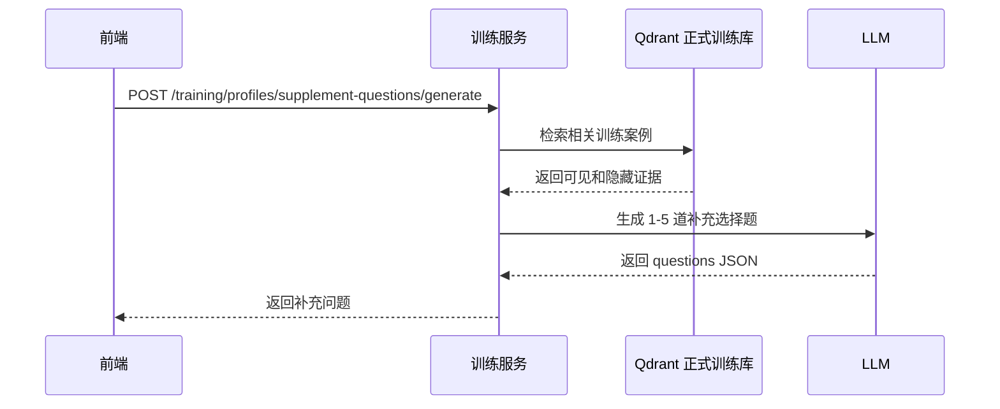

### 5.3 场景润色

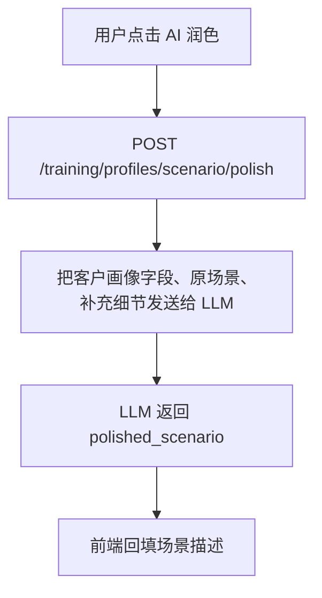

### 5.4 客户角色生成

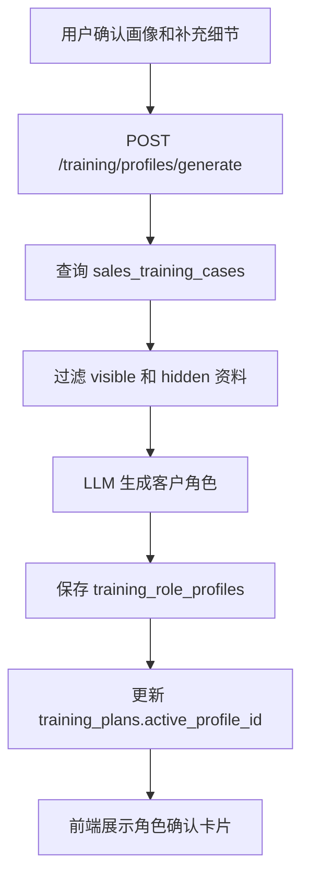

LLM 生成内容包含：

| 字段 | 中文含义 |
| --- | --- |
| `visible_profile` | 可展示给教练/管理员看的客户画像摘要 |
| `hidden_profile` | 客户隐藏心理和真实顾虑，不直接给学员看 |
| `role_profile` | AI 客户实际扮演设定 |
| `role_confirm_card` | 前端展示的角色确认卡片 |

## 6. 训练目标与评分规则生成

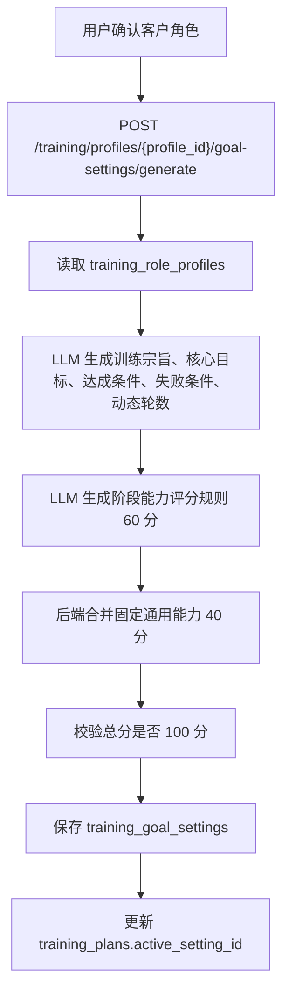

评分结构：

| 部分 | 分值 | 说明 |
| --- | --- | --- |
| 通用能力 | 40 | 固定规则：内容质量、语言表达、互动与态度 |
| 阶段能力 | 60 | LLM 根据客户画像、学员画像、场景和目标生成，至少 3 个维度，每个维度至少 3 个考核点 |
| 扣分 | 一期简化 | 当前违规词先不做，主要保留响应时效或后续扩展 |

一期开放式训练只有一个阶段；流程式训练后续再扩展。

## 7. 销售训练会话流程

### 7.1 开始训练

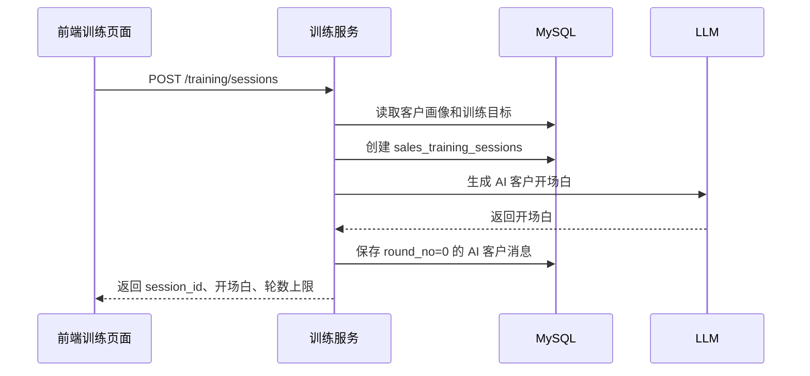

### 7.2 每轮对话

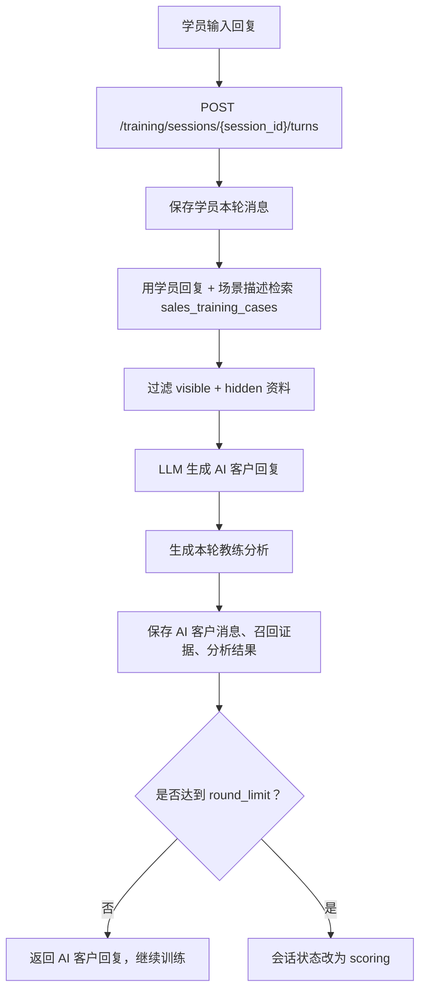

### 7.3 流式训练对话 SSE

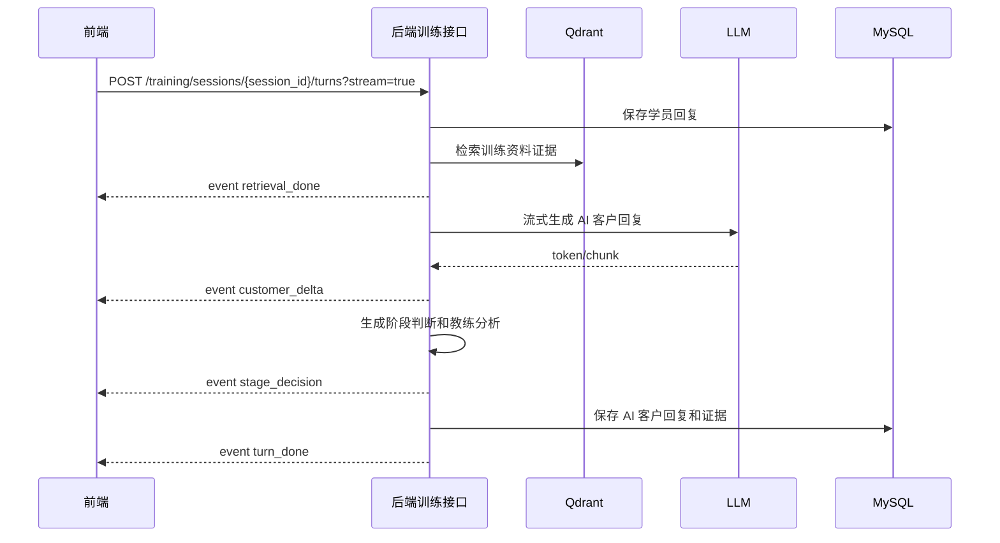

SSE 事件名保持英文协议：

| 事件名 | 中文含义 |
| --- | --- |
| `retrieval_done` | 训练资料检索完成 |
| `customer_delta` | AI 客户回复片段 |
| `stage_decision` | 阶段状态判断 |
| `turn_done` | 本轮完成 |
| `error` | 流式生成失败 |

## 8. 销售训练最终评分流程

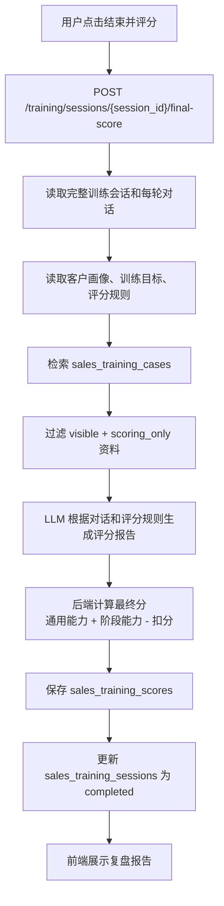

评分公式：

```text
最终分 = 通用能力得分 + 阶段能力得分 - 扣分
```

当前一期简化处理违规词扣分，后续若补全违规词模块，可以扩展为：

```text
最终分 = 通用能力得分 × 阶段完成惩罚系数 + 阶段能力得分 - 违规词扣分 - 响应时效扣分
```

## 9. 三个业务与知识库的关系

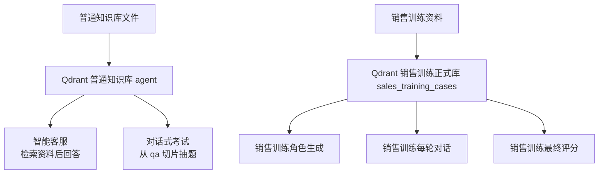

| 业务 | 使用哪个向量库 | 使用方式 |
| --- | --- | --- |
| 智能客服 | 普通知识库 collection，默认 `agent` | 按用户问题检索参考资料，LLM 生成回答 |
| 对话式考试 | 普通知识库 collection，默认 `agent` | 从 `content_type=qa` 的切片抽题 |
| 销售训练角色 | `sales_training_cases` | 检索客户信息、任务要求、隐藏心理生成角色 |
| 销售训练对话 | `sales_training_cases` | 每轮按学员回复动态检索，AI 客户更贴近资料 |
| 销售训练评分 | `sales_training_cases` | 检索标准话术和评分规则辅助评分 |

## 10. 硬编码、正则与规则说明

### 10.1 聊天

| 位置 | 内容 | 说明 |
| --- | --- | --- |
| `query_planner_service.py` | `[？?；;\n\r]+` | 显式多问题拆分正则 |
| `query_planner_service.py` | JSON 提取正则 | 兼容模型返回 ```json 代码块 |
| `rag_service.py` | 召回质量阈值 | 已配置在 `app.yml` |
| `reranker.py` | 轻量关键词加分和去重逻辑 | 当前是规则精排，后续可换模型 rerank |

### 10.2 考试

| 位置 | 内容 | 说明 |
| --- | --- | --- |
| `exam_service.py` | 题型 code | 前后端都依赖，后续可字典化 |
| `exam_service.py` | A-Z 选项标签 | 客观题显示和答案归一化 |
| `exam_service.py` | 正确/错误 | 判断题固定答案 |
| `exam_service.py` | 填空和答案清洗正则 | 提高模型输出和用户输入兼容性 |

### 10.3 销售训练

| 位置 | 内容 | 说明 |
| --- | --- | --- |
| `training.yml` | `case_title_pattern` | LMS 案例标题识别正则 |
| `training.yml` | `part_markers` | 训练资料片段中文关键词 |
| `sales_training_core.py` | 兜底角色、兜底目标、兜底评分 | LLM 失败时保障流程可用 |
| `sales_training_core.py` | 本轮教练分析关键词 | 当前是规则分析，不是 LLM 分析 |
| `training.yml` | `visible`、`hidden`、`scoring_only` | 虽是英文 code，但文档和页面应展示中文含义 |

## 11. 交互和页面建议

1. 智能客服页面：输入框固定底部，消息区独立滚动；流式和一次性切换保留；检索调试区用深浅色主题分别适配。
2. 考试页面：左侧只放题源和考试设置，中间答题，右侧历史；题源必须明确显示来自哪个知识库和文件。
3. 销售训练页面：资料上传建议放到首页知识库管理或独立资料工作台；训练会话页左侧只展示客户角色摘要，右侧/下方展示教练分析，避免配置内容挤在聊天页。
4. 销售训练评分设置必须在角色生成后明确展示：固定通用能力 40 分 + LLM 阶段能力 60 分，保存前校验总分 100。
5. 页面展示 code 时必须补中文，例如 `hidden` 显示为“AI 客户隐藏资料”，不要直接把英文 code 丢给用户。

## 12. 日志建议

建议保留并持续增强以下中文日志：

| 业务 | 建议日志 |
| --- | --- |
| 聊天 | 会话编号、路由模式、是否调用 Query Planner、拆分问题、召回分数、最终耗时 |
| 考试 | 题源 collection、候选题数量、抽题数量、LLM 生成题目耗时、阅卷方式 |
| 销售训练 | 资料批次、发布状态、角色生成检索证据数、目标生成轮数、每轮检索切片数、评分得分 |

日志描述用中文；字段名、SSE 事件名、API 字段名保持英文，避免破坏前后端协议。
