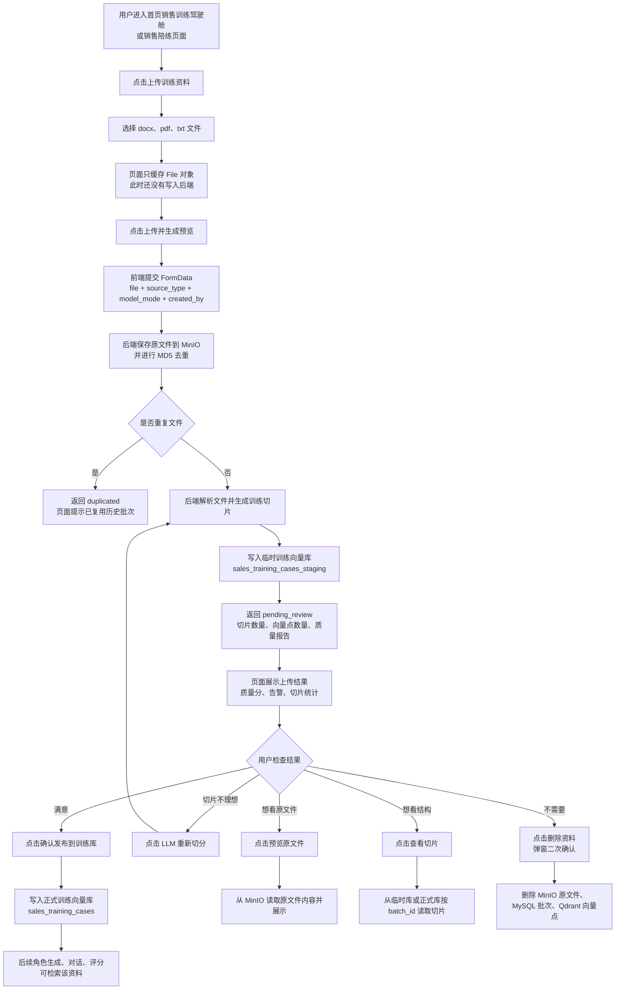
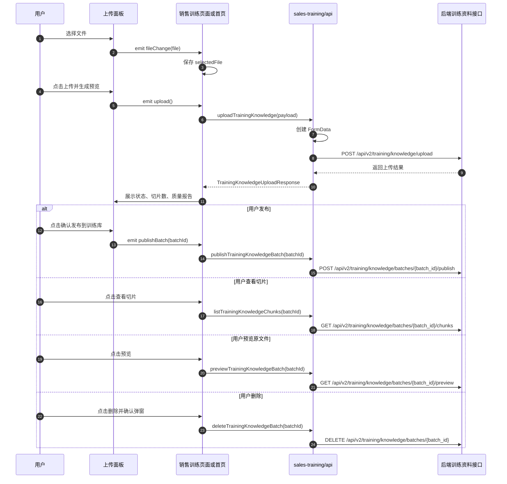
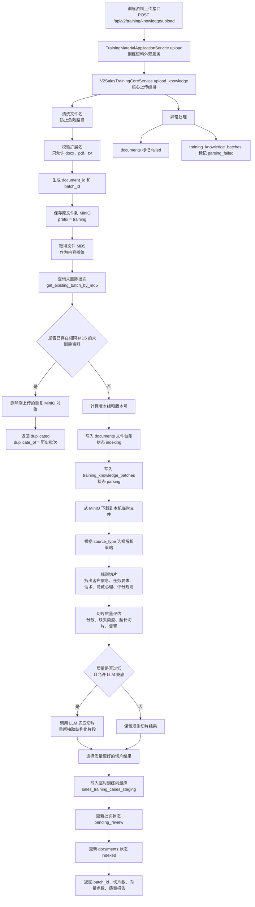
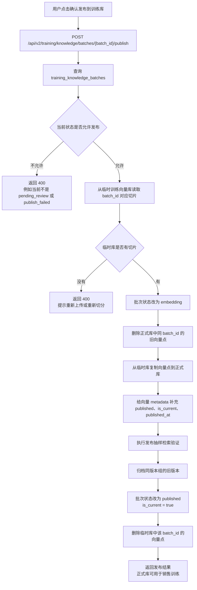
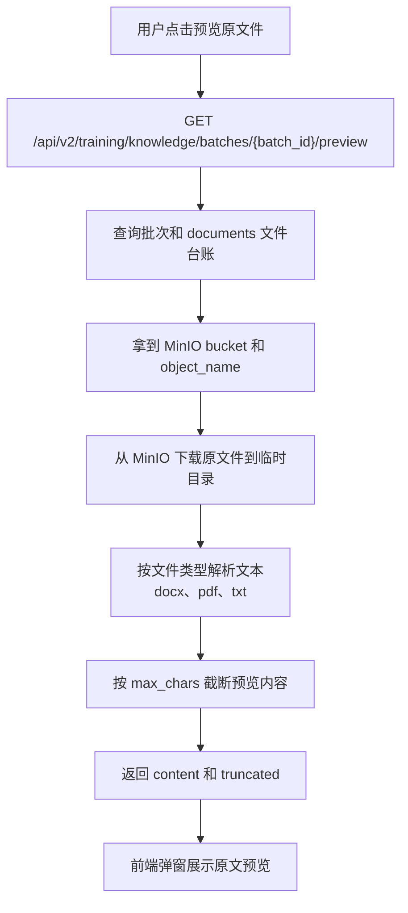
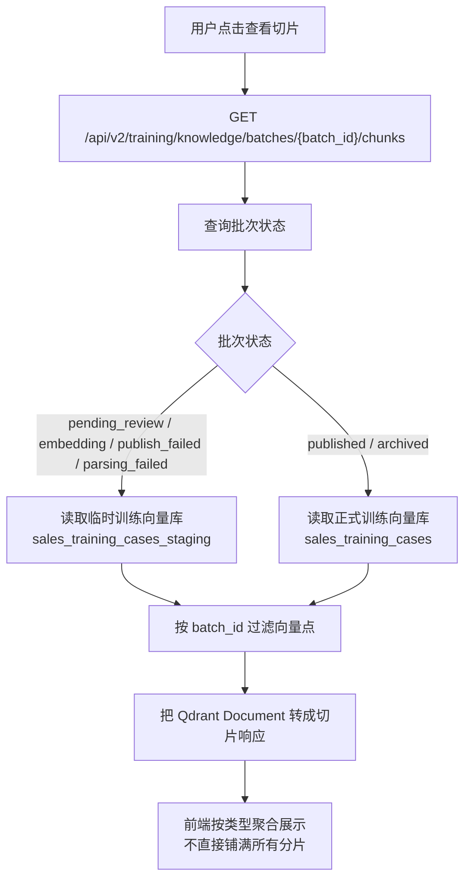
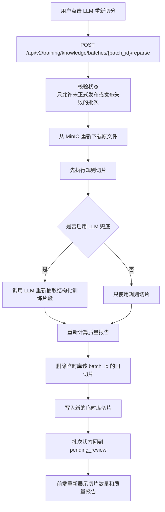
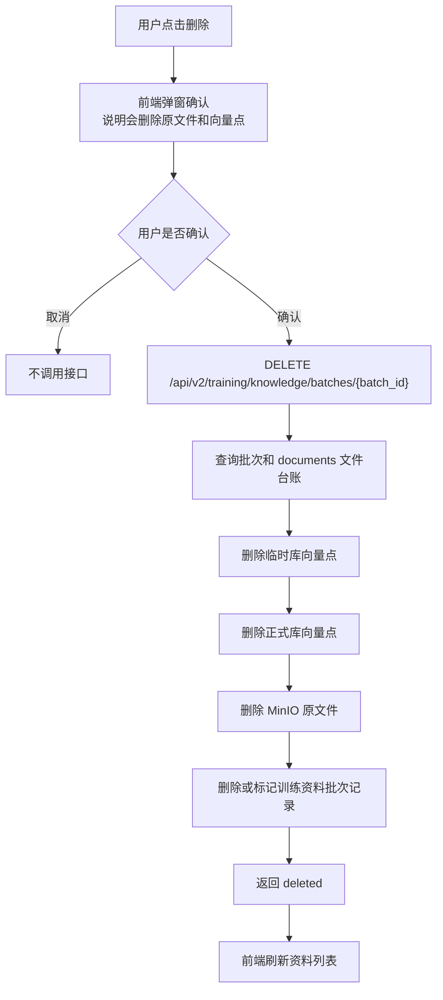
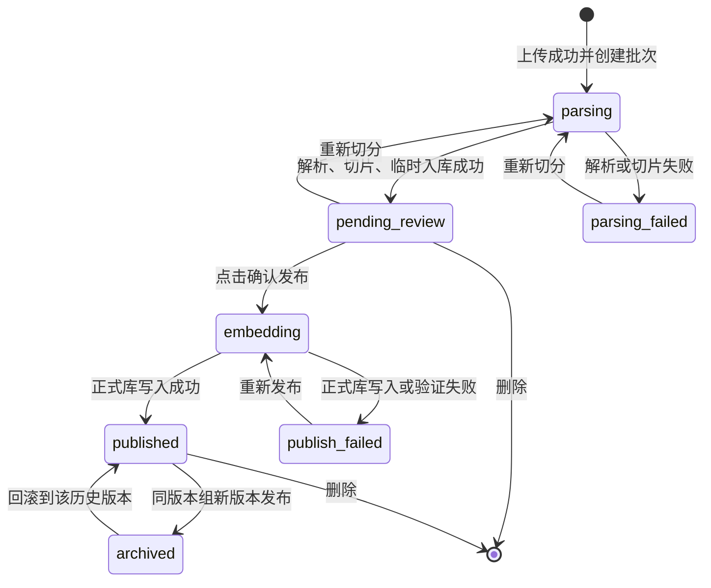
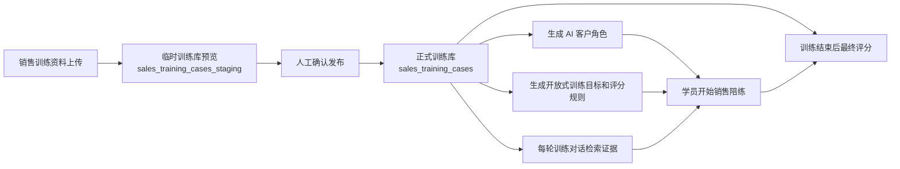

# 销售训练资料上传交互与技术流程

## 1. 这份文档解决什么问题

这份文档专门说明“销售训练资料上传”这一块，不和普通知识库上传混在一起。

销售训练资料上传的目标不是简单把文件扔进向量库，而是完成这几件事：

1. 把原文件保存到 MinIO，后续预览、重切、删除都以 MinIO 为唯一文件来源。
2. 用文件 MD5 做重复校验，避免同一份资料反复切片、反复写向量库。
3. 先切片并写入临时训练向量库，给页面预览和人工确认。
4. 人工确认后再发布到正式训练向量库。
5. 正式训练向量库才会参与 AI 客户角色生成、训练对话和最终评分。

涉及到的主要代码位置：

| 位置 | 作用 |
| --- | --- |
| 前端 `src/features/sales-training/components/TrainingKnowledgeUploadPanel.vue` | 训练资料上传面板，只负责选择文件、展示上传结果和质量报告 |
| 前端 `src/features/sales-training/components/TrainingKnowledgeWorkspace.vue` | 训练资料列表、切片查看、预览、发布、重切、版本链、删除 |
| 前端 `src/features/sales-training/api/index.ts` | 封装训练资料上传、发布、预览、删除等接口 |
| 后端 `app/api/routes/training.py` | 暴露 `/api/v2/training/knowledge/` 系列接口 |
| 后端 `app/application/training/material_service.py` | 训练资料外观服务，统一收口上传、预览、发布、删除等动作 |
| 后端 `app/application/training/sales_training_core.py` | 训练资料核心编排，负责 MinIO、MySQL、Qdrant、LLM 兜底切片 |
| 配置 `config/training.yml` | 配置正式训练库、临时训练库、切片质量规则、LLM 兜底规则 |

## 2. 页面交互流程

销售训练资料上传现在有两个入口：

1. 首页销售训练驾驶舱里的“上传训练资料”按钮。
2. 销售陪练页面里的训练资料管理区。

两边最终走同一套前端 API 和后端接口。



交互上要注意：上传完成不代表资料已经进入正式训练库。只有点击“确认发布到训练库”并成功后，AI 销售训练才会使用这份资料。

## 3. 前端接口调用流程

前端上传没有使用普通 JSON 请求，因为文件上传必须用 `FormData`。



前端函数和接口对应关系：

| 用户动作 | 前端函数 | 后端接口 | 结果 |
| --- | --- | --- | --- |
| 上传并生成预览 | `uploadTrainingKnowledge()` | `POST /api/v2/training/knowledge/upload` | 保存原文件、去重、切片、写临时库 |
| 查询资料列表 | `listTrainingKnowledgeBatches()` | `GET /api/v2/training/knowledge/batches` | 分页展示训练资料批次 |
| 预览原文件 | `previewTrainingKnowledgeBatch()` | `GET /api/v2/training/knowledge/batches/{batch_id}/preview` | 从 MinIO 读取原文件文本 |
| 查看切片 | `listTrainingKnowledgeChunks()` | `GET /api/v2/training/knowledge/batches/{batch_id}/chunks` | 从临时库或正式库读取切片 |
| 确认发布 | `publishTrainingKnowledgeBatch()` | `POST /api/v2/training/knowledge/batches/{batch_id}/publish` | 临时库复制到正式训练库 |
| 重新切分 | `reparseTrainingKnowledgeBatch()` | `POST /api/v2/training/knowledge/batches/{batch_id}/reparse` | 重新解析原文件，重新写临时库 |
| 回滚版本 | `rollbackTrainingKnowledgeBatch()` | `POST /api/v2/training/knowledge/batches/{batch_id}/rollback` | 切换当前可用版本 |
| 删除资料 | `deleteTrainingKnowledgeBatch()` | `DELETE /api/v2/training/knowledge/batches/{batch_id}` | 删除原文件、批次和向量点 |

## 4. 后端上传技术流程

上传主接口是：

```text
POST /api/v2/training/knowledge/upload
```

表单参数：

| 参数 | 中文含义 | 当前用途 |
| --- | --- | --- |
| `file` | 上传文件 | 必填，支持 docx、pdf、txt |
| `source_type` | 资料来源类型 | 默认 `lms_case`，决定使用哪种训练资料解析策略 |
| `model_mode` | 模型档位 | 只影响 LLM 兜底切片时使用的模型档位 |
| `created_by` | 上传人 | 审计字段，没有登录用户时可以为空 |

完整技术流程如下：



这个流程里，原文件只进入 MinIO。MySQL 保存文件台账和批次状态。Qdrant 保存切片向量。

## 5. 发布技术流程

上传完成后只是 `pending_review`，也就是待确认。发布才会把训练资料从临时向量库放到正式训练向量库。



正式库名称来自 `config/training.yml`：

| 配置项 | 中文含义 | 当前值 |
| --- | --- | --- |
| `collections.staging` | 临时待审核训练向量库 | `sales_training_cases_staging` |
| `collections.published` | 正式训练资料向量库 | `sales_training_cases` |

## 6. 原文件预览流程

预览不是从 Qdrant 读，因为 Qdrant 只保存切片，不保存完整原文件。



这样设计的好处是：即使向量库需要重建，原文件仍然可以预览和重新切分。

## 7. 查看切片流程

查看切片时，后端会根据批次状态决定读临时库还是正式库。



切片响应里的关键字段：

| 字段 | 中文含义 |
| --- | --- |
| `chunk_id` | 切片唯一编号 |
| `batch_id` | 所属上传批次 |
| `case_part` | 切片业务类型，例如客户信息、任务要求、标准话术、隐藏心理、评分规则 |
| `visibility` | 可见范围，例如可见、AI 客户可见、仅评分可见 |
| `chunk_text` | 切片正文 |
| `metadata` | 额外信息，例如案例标题、案例序号 |

## 8. 重新切分流程

重新切分用于处理“规则切片不理想”的情况。



重新切分不会直接覆盖正式库。必须再次确认发布，才会进入正式训练库。

## 9. 删除流程

删除属于有副作用操作，页面必须先弹窗二次确认。



删除后如果要恢复，只能重新上传原文件。正式生产环境如果需要审计保留，可以把物理删除改成软删除，但当前设计是为了功能闭环和本地开发清爽。

## 10. 数据写入点

| 数据位置 | 写入时机 | 保存内容 | 为什么需要 |
| --- | --- | --- | --- |
| MinIO | 上传接口开始阶段 | 原始 docx、pdf、txt 文件 | 预览、重切、删除、版本追踪都需要原文件 |
| MySQL `documents` | 文件保存后 | 文件名、MD5、MinIO 地址、状态、collection | 统一文件台账，避免业务表直接承担文件系统职责 |
| MySQL `training_knowledge_batches` | 上传批次创建时 | 批次、版本、状态、质量报告、上传人 | 管理销售训练资料的审核、发布、回滚 |
| Qdrant `sales_training_cases_staging` | 上传解析完成后 | 待审核切片向量 | 发布前预览和人工确认 |
| Qdrant `sales_training_cases` | 确认发布后 | 正式训练资料向量 | AI 客户角色生成、训练对话、最终评分 |

## 11. 状态流转



状态中文说明：

| 状态 | 中文含义 | 页面处理 |
| --- | --- | --- |
| `parsing` | 解析中 | 一般是短暂状态，页面可展示处理中 |
| `pending_review` | 待确认发布 | 可以查看切片、预览原文、发布、重切、删除 |
| `duplicated` | 重复文件 | 不新增正式资料，提示复用历史批次 |
| `embedding` | 发布入库中 | 发布按钮 loading，避免重复点击 |
| `published` | 已发布 | 可以用于销售训练，也可以预览、查看切片、删除 |
| `publish_failed` | 发布失败 | 可以重新发布或重切 |
| `parsing_failed` | 解析失败 | 可以重新切分或删除 |
| `archived` | 历史归档版本 | 不是当前训练版本，可用于版本链查看和回滚 |

## 12. 切片类型和可见范围

训练资料不是简单按固定长度切片，而是尽量拆成业务片段。

| 业务片段 | 中文含义 | 主要用途 |
| --- | --- | --- |
| `case_profile` | 客户或企业基本信息 | 生成 AI 客户身份、行业、背景 |
| `task_requirement` | 训练任务要求 | 生成训练目标和对话约束 |
| `standard_answer` | 标准话术或参考答案 | 对话追问和最终评分参考 |
| `hidden_psychology` | 客户隐藏心理或底层顾虑 | 让 AI 客户更真实地追问和施压 |
| `scoring_rubric` | 评分规则或扣分点 | 最终评分时作为评分依据 |

可见范围：

| 可见范围 | 中文含义 | 谁会使用 |
| --- | --- | --- |
| `visible` | 可见资料 | 角色生成、训练对话、评分都可以使用 |
| `hidden` | 隐藏资料 | AI 客户扮演可用，不直接展示给学员 |
| `scoring_only` | 仅评分资料 | 最终评分模型使用，不参与日常对话扮演 |

## 13. 为什么不直接复用普通知识库上传接口

底层能力可以复用，比如 MinIO 文件保存、文件解析、向量写入、删除对象、日志打印。但业务接口不建议完全复用。

原因如下：

| 对比项 | 普通知识库上传 | 销售训练资料上传 |
| --- | --- | --- |
| 目标 | 智能客服 RAG、考试题源 | AI 销售陪练资料 |
| 入库方式 | 预览确认后进入普通知识库 | 先入临时训练库，人工发布后进正式训练库 |
| 是否需要版本链 | 通常不需要 | 需要版本组、版本号、回滚 |
| 是否需要质量报告 | 可以简单一些 | 必须展示切片质量、告警、LLM 兜底情况 |
| 是否需要可见范围 | 普通问答一般不需要 | 需要 visible、hidden、scoring_only |
| 是否影响角色生成 | 不直接影响 | 直接影响 AI 客户角色、目标、评分 |
| 删除影响 | 删除普通问答资料 | 删除训练资料、切片、版本资料和 MinIO 原文件 |

所以当前设计是：

1. 复用底层文件存储和向量能力。
2. 不复用同一个业务上传接口。
3. 销售训练保留独立接口，方便表达审核、发布、回滚、质量报告这些业务概念。

## 14. 使用到的设计模式

| 设计模式 | 使用位置 | 为什么这样设计 |
| --- | --- | --- |
| 外观模式 | `TrainingMaterialApplicationService` | 前端路由只面对上传、预览、发布、删除这些简单入口，不直接了解核心编排细节 |
| 策略模式 | 训练资料解析切片策略 | `source_type` 不同可以选择不同解析方式，后续新增资料类型时少改主流程 |
| 工厂方法模式 | 文件处理器、切片策略、模型创建 | 根据文件类型、策略类型、模型档位创建具体实现 |
| 适配器模式 | MinIO 文件服务、Qdrant 向量服务 | 应用层不直接依赖第三方 SDK，后续替换存储或向量库更容易 |
| 模板方法思路 | 上传到发布的固定主流程 | 上传、去重、切片、评估、临时入库、发布这些步骤顺序固定，局部策略可替换 |

## 15. 需要重点打印的日志

销售训练资料上传链路比较长，日志应该覆盖以下关键点，方便 PyCharm 控制台定位问题：

| 阶段 | 建议日志内容 |
| --- | --- |
| 上传开始 | 文件名、source_type、created_by |
| 保存 MinIO 成功 | bucket、object_name、file_md5、file_size |
| 命中重复 | 当前文件名、复用批次、MD5 |
| 创建批次 | batch_id、document_id、版本组、版本号 |
| 规则切片完成 | batch_id、切片数量 |
| LLM 兜底开始和结束 | batch_id、模型档位、规则分、LLM 分、最终选择 |
| 写临时库完成 | 临时 collection、batch_id、向量点数量 |
| 发布开始 | batch_id、临时库、正式库、切片数量 |
| 发布验证结果 | 抽样数量、命中率、是否通过 |
| 删除开始和完成 | batch_id、document_id、MinIO 对象、临时库、正式库 |

日志描述使用中文，但接口字段、数据库字段、SSE 事件名仍保持英文，避免破坏前后端协议。

## 16. 和销售训练主流程的关系



一句话总结：上传只是准备资料，发布才是让资料进入销售陪练业务闭环。
