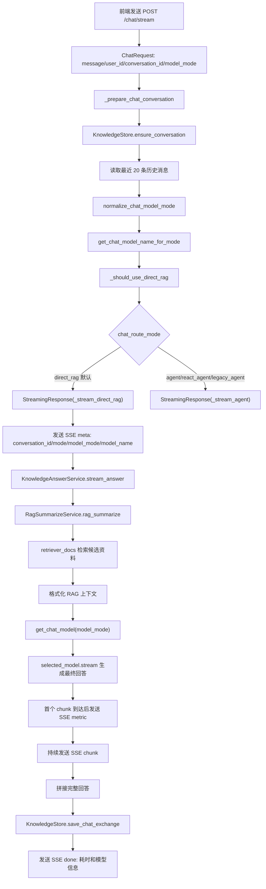
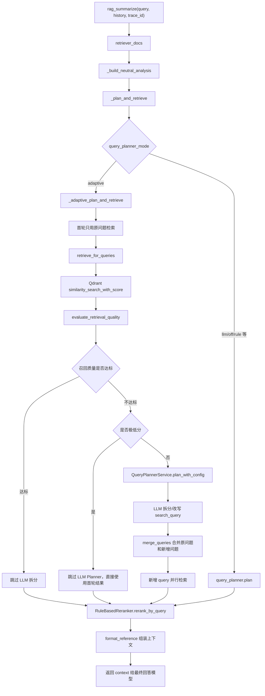

# 用户输入向量检索的流程

本文档说明用户在聊天框输入问题后，后端如何完成会话准备、模型档位选择、RAG 检索、召回质量判断、Query Planner 拆分、多路向量召回、精排、上下文组装、最终模型流式输出和会话保存。

当前默认聊天链路是 `direct_rag`：

```text
用户问题
-> 创建/读取会话
-> 选择回答模型档位
-> RAG 检索上下文
-> 最终回答模型流式生成
-> SSE 返回前端
-> 保存会话历史
```

## 核心入口

| 阶段 | 接口/类 | 主要代码 | 作用 |
| --- | --- | --- | --- |
| 流式聊天入口 | `POST /chat/stream` | `api/routers/chat.py::chat_stream` | 创建会话、选择模型档位、路由到 direct_rag 或 Agent，返回 SSE |
| 一次性聊天入口 | `POST /chat` | `api/routers/chat.py::chat` | 等待完整回答后返回 JSON |
| 请求体 | `ChatRequest` | `api/schemas.py` | 接收 `message/user_id/conversation_id/model_mode` |
| 会话准备 | `_prepare_chat_conversation` | `api/services.py` | 创建/读取会话，读取最近历史消息 |
| 模型选择 | `normalize_chat_model_mode/get_chat_model_name_for_mode/get_chat_model` | `model/factory.py` | 根据 `model_mode` 选择 low/medium/high 对应的模型 |
| 流式输出包装 | `_stream_direct_rag` | `api/services.py` | 把知识直答 token 包装成 SSE |
| 知识直答 | `KnowledgeAnswerService` | `rag/knowledge_answer_service.py` | 检索上下文并调用最终回答模型 |
| RAG 检索 | `RagSummarizeService` | `rag/rag_service.py` | adaptive 查询规划、向量召回、质量判断、精排、上下文格式化 |
| 查询规划 | `QueryPlannerService` | `rag/query_planner.py` | 显式多问句切分、LLM 拆分/改写、原问题兜底 |
| 向量库访问 | `VectorStoreService` | `rag/vector_store.py` | 查询 Qdrant 并返回相似度分数 |
| 精排 | `RuleBasedReranker` | `rag/reranker.py` | 去重、按 query 覆盖策略选择最终上下文 |
| 会话存储 | `KnowledgeStore` | `rag/knowledge_store.py` | 保存 conversations 和 conversation_messages |
| 启动预热 | `run_startup_warmup` | `api/warmup.py` | 服务启动时预热 RAG 关键依赖，降低首次请求冷启动 |

## 请求体

聊天接口共用 `ChatRequest`。

| 字段 | 必填 | 含义 |
| --- | --- | --- |
| `message` | 是 | 用户本轮输入的问题 |
| `user_id` | 否 | 用户编号，用于会话归属和后续扩展 |
| `conversation_id` | 否 | 当前会话编号；为空时后端创建新会话 |
| `model_mode` | 否 | 回答模型档位：`low`、`medium`、`high`，默认 `high` |

模型档位来自 `config/rag.yml`：

| 档位 | 配置项 | 当前模型 | 适合场景 |
| --- | --- | --- | --- |
| `low` | `chat_model_low` | `qwen-turbo` | 低延迟，适合日常快速问答 |
| `medium` | `chat_model_medium` | `qwen3.6-flash` | 速度和效果折中 |
| `high` | `chat_model_high` | `deepseek-v4-flash` | 更看重复杂问题质量 |

注意：`QueryPlannerService` 目前使用模块级默认 `chat_model`，也就是默认高档位模型；最终回答模型会根据本次请求的 `model_mode` 选择。

## 总体流程



## 启动预热

应用启动时，`api/main.py` 会在 lifespan 中调用 `run_startup_warmup()`。

预热配置在 `config/rag.yml`：

| 配置 | 当前值 | 作用 |
| --- | --- | --- |
| `startup_warmup_enabled` | `true` | 启动时是否执行预热 |
| `warmup_qdrant` | `true` | 检查 Qdrant collection 是否可访问 |
| `warmup_embedding` | `true` | 用短文本调用一次 embedding 模型 |
| `warmup_chat_model` | `false` | 是否真实调用一次回答模型，默认关闭以避免消耗 token |
| `warmup_fail_fast` | `false` | 预热失败是否中断应用启动 |

预热能减少首次请求的冷启动等待，但不会改变检索结果。它主要影响第一次聊天的初始化耗时，例如 Qdrant 客户端、embedding 模型鉴权和网络连接。

## 会话准备

`chat_stream()` 和 `chat()` 都会先调用 `_prepare_chat_conversation(request)`。

主要逻辑：

1. 创建 `KnowledgeStore()`，连接 SQLite `storage/knowledge.db`。
2. 如果前端传入 `conversation_id`，优先复用未删除的旧会话。
3. 如果没有传入，创建新会话，标题取当前问题前 40 个字符。
4. 读取最近 20 条历史消息：`store.list_recent_messages(conversation_id, limit=20)`。
5. 返回 `conversation_id` 和 `history`。

历史消息用途：

| 使用位置 | 用途 |
| --- | --- |
| `QueryPlannerService` | 触发 LLM 拆分时理解追问，如“那这个呢” |
| `KnowledgeAnswerService` | 最终回答模型生成时保留对话上下文 |
| adaptive 首轮质量判断 | 不使用历史，只用当前原问题检索 |

最终回答模型只取历史中的后 12 条消息，避免 prompt 随会话无限增长。

## 聊天路由

路由由 `config/rag.yml` 的 `chat_route_mode` 控制。

| 配置值 | 链路 | 特点 |
| --- | --- | --- |
| `direct_rag` | 直接 RAG 检索后回答 | 默认模式，链路短，首字更快 |
| `agent` | 走 ReAct Agent 工具链 | 更灵活，但通常更慢 |
| `react_agent` | `agent` 等价别名 | 兼容旧配置 |
| `legacy_agent` | `agent` 等价别名 | 兼容旧配置 |

当前产品知识问答推荐使用 `direct_rag`。它不会让模型先判断是否调用工具，而是直接进入“检索上下文 -> 最终回答”。

## direct_rag SSE 事件

`_stream_direct_rag()` 负责把后端内部迭代器转成浏览器能读的 SSE。

发送事件顺序：

| 事件 | 发送时机 | data 内容 |
| --- | --- | --- |
| `meta` | 流刚开始 | `conversation_id`、`mode=direct_rag`、`model_mode`、`model_name` |
| `metric` | 第一个回答分片到达 | `first_token_ms` |
| `chunk` | 每个模型文本分片 | `content` |
| `done` | 回答完成 | `done`、`conversation_id`、`model_mode`、`model_name`、`first_token_ms`、`total_ms` |
| `error` | 流式过程中异常 | `error` |

`first_token_ms` 是从 `_stream_direct_rag()` 开始到最终回答模型第一个有效 chunk 返回的耗时，包含：

```text
RAG 检索耗时
+ 上下文格式化耗时
+ 最终回答模型首包耗时
```

它不包含 `chat_stream()` 进入 `_stream_direct_rag()` 之前的会话准备耗时。

## RAG 检索主流程

`KnowledgeAnswerService.stream_answer()` 会先调用 `_retrieve_context()`，内部进入 `RagSummarizeService.rag_summarize()`。



## Query Planner 模式

配置位置：`config/rag.yml::query_planner_mode`。

| 模式 | 行为 | 适合场景 |
| --- | --- | --- |
| `adaptive` | 先用原问题检索，质量差才可能调用 LLM 拆分 | 默认推荐，兼顾速度和召回 |
| `llm` | 每次都调用 LLM 拆分/改写 | 复杂问题多，但首字会更慢 |
| `rule/rules/off/disabled` | 不调用 LLM，也不做关键词硬拆分，只用原问题或显式多问句 | 想关闭模型规划时使用 |

当前代码已经取消“宠物、地毯、预算、充电”等硬编码意图拆分。多意图拆分主要由 LLM Query Planner 完成；只有用户自己用问号、分号、换行明确写出多个问题时，才会先走显式切分。

显式切分规则：

```text
按 ？ ? ； ; 换行 分割
清洗空白和标点
去重
最多保留 max_queries 个，当前 QueryPlannerService 默认 6 个
```

## adaptive 质量判断

adaptive 模式先用原问题做一次向量检索，然后调用 `evaluate_retrieval_quality()`。

配置位置：`config/rag.yml`。

| 配置 | 当前值 | 含义 |
| --- | --- | --- |
| `adaptive_retrieve_min_docs` | `3` | 首轮召回资料数少于 3 条，则认为覆盖不足 |
| `adaptive_retrieve_min_score` | `0.72` | top1 向量分低于 0.72，则认为最高相关性偏弱 |
| `adaptive_retrieve_top3_avg_score` | `0.68` | top3 平均分低于 0.68，则认为整体相关性不稳定 |

判断逻辑：

```text
如果以下任一条件成立，就认为首轮召回质量不足：

1. 召回数量 < adaptive_retrieve_min_docs
2. top1_score < adaptive_retrieve_min_score
3. top3_avg_score < adaptive_retrieve_top3_avg_score
```

`top3_avg_score` 只计算召回分数最高的前 3 条。如果实际不足 3 条，就按实际召回条数计算。

## 极低分跳过 Query Planner

现在 adaptive 模式多了一层保护：如果首次召回分数极低，就跳过 LLM Query Planner。

配置位置：`config/rag.yml`。

| 配置 | 当前值 | 含义 |
| --- | --- | --- |
| `adaptive_skip_planner_on_very_low_score` | `true` | 是否启用极低分跳过 Planner |
| `adaptive_skip_planner_max_score` | `0.55` | top1 低于该值才可能跳过 |
| `adaptive_skip_planner_top3_avg_score` | `0.50` | top3 平均分低于该值才可能跳过 |

跳过条件必须同时满足：

```text
1. adaptive_skip_planner_on_very_low_score = true
2. 当前 QueryAnalysis 没有意图和过滤条件
3. top1_score < adaptive_skip_planner_max_score
4. top3_avg_score < adaptive_skip_planner_top3_avg_score
```

这层保护的目的：

1. 避免完全无关问题、乱码、闲聊触发一次无效 LLM 拆分。
2. 降低首字等待。
3. 防止 LLM Planner 把无关问题强行改写成业务问题。

## 向量召回

向量召回由 `retrieve_for_queries()` 执行。

关键配置在 `config/qdrant.yml`：

| 配置 | 当前值 | 作用 |
| --- | --- | --- |
| `per_query_top_k` | `5` | 每个 search_query 从 Qdrant 召回 5 条候选 |
| `parallel_query_workers` | `4` | 多个 search_query 时最多 4 个线程并行查 Qdrant |
| `use_metadata_filter` | `false` | 默认不强制按 metadata 过滤，适合自由输入 |
| `distance` | `COSINE` | 使用余弦相似度 |
| `final_context_limit` | `6` | 最终放进回答上下文的资料上限 |

多 query 时的行为：

1. 如果只有一个 query，直接同步检索。
2. 如果有多个 query，使用 `ThreadPoolExecutor` 并行检索。
3. 每个 query 调用 `_retrieve_one_query()`。
4. `_retrieve_one_query()` 内部调用 `_search_documents()`。
5. `_search_documents()` 调用 `VectorStoreService.search_documents()`。
6. `VectorStoreService.search_documents()` 调用 Qdrant `similarity_search_with_score()`。
7. Qdrant 返回的 score 会写入 `Document.metadata["_vector_score"]`。

如果 Qdrant 检索失败，当前代码会捕获 `ConnectionError`、`TimeoutError`、`RuntimeError`、`ValueError`，打印中文 warning 日志，并返回空候选，避免整个接口直接崩掉。

## 检索分值日志

每个 search_query 检索后都会调用 `_log_retrieved_scores()`，按多行输出召回分值。

日志结构：

```text
[RAG召回分值]
检索问题：预算3000 大户型160平 扫地机器人 推荐
第1条：分值=0.764697 来源=扫地机器人100问.pdf 问题编号=40
第2条：分值=0.729204 来源=选购指南.txt
第3条：分值=0.717272 来源=维护保养.txt
```

这部分日志主要用于判断：

1. 原问题召回是否足够准。
2. LLM 拆分后的子问题是否比原问题更容易命中。
3. 0.72、0.68、0.55、0.50 这些阈值是否需要按真实数据调整。

## 精排和上下文截断

`RuleBasedReranker.rerank_by_query()` 负责把候选资料整理成最终上下文。

当前策略：

1. 对每个 search_query 的候选资料单独去重。
2. 以向量分为基础分。
3. 当前主链路不再依赖规则意图，所以主要看向量分和 query 覆盖。
4. 每个 search_query 最多保留 `per_query_keep` 条，当前为 2。
5. 全局按 `point_id/unit_id/chunk_id/segment_id/source+page+content` 去重。
6. 最终资料数不超过 `final_context_limit`，当前为 6。
7. 如果每个 query 保留后资料不足，会从全局高分候选里补齐。

这样做的目的：

1. 避免一个子问题召回太多，挤掉其他子问题。
2. 避免同一个 Qdrant point 被多个 query 重复放进上下文。
3. 控制最终 prompt 长度，减少首字等待。

## 上下文组装

`rag_summarize()` 将精排后的 `Document` 列表格式化成上下文文本：

```text
【参考资料1】
{doc.page_content}
来源：来源文件：xxx；知识类型：xxx；分类：xxx；页码：xxx
```

这段上下文只给最终回答模型看。对用户输出时，系统提示词要求不要输出参考资料编号和元数据。

如果没有检索到相关资料，会返回：

```text
未检索到相关参考资料。
```

然后最终回答模型再根据系统提示判断：如果是基础常识，可以简洁回答；如果不是基础常识，就说明缺少依据。

## 最终回答模型

`KnowledgeAnswerService._build_messages()` 会构造：

1. `SystemMessage`：客服角色叫“阿良”，优先根据参考资料回答，不编造品牌型号、价格、参数、APP 路径、售后政策或故障代码。
2. 最近历史消息：最多使用后 12 条消息。
3. `HumanMessage`：包含用户问题和 RAG 上下文。

流式生成使用：

```python
selected_model.stream(self._build_messages(query, context, history=history))
```

非流式生成使用：

```python
selected_model.invoke(self._build_messages(query, context, history=history))
```

`selected_model` 来自：

```python
selected_model = get_chat_model(model_mode)
```

模型对象带有 `lru_cache(maxsize=8)` 缓存，同一个模型名会复用模型对象，减少重复初始化成本。

## 会话保存

流式回答结束后，`_stream_direct_rag()` 会拼接所有 chunk：

1. `answer = "".join(chunks).strip()`
2. 调用 `_save_chat_exchange()`
3. `KnowledgeStore.save_chat_exchange()` 写入两条消息：
   - `role=user`：用户问题
   - `role=assistant`：助手完整回答
4. assistant 消息的 `metadata_json` 会保存：
   - `mode=direct_rag_stream`
   - `model_mode`
   - `model_name`
   - `first_token_ms`
   - `total_ms`
5. assistant 消息的 `model_name` 字段也会保存当前模型名称。

聊天记录接口：

| 接口 | 作用 |
| --- | --- |
| `GET /conversations?page=1&page_size=10` | 分页查询聊天记录 |
| `GET /conversations/{conversation_id}` | 查询单个会话详情 |
| `DELETE /conversations/{conversation_id}` | 删除聊天记录 |

## 性能日志观测点

| 日志标签 | 位置 | 说明 |
| --- | --- | --- |
| `[性能] 聊天请求准备完成` | `api/routers/chat.py` | 会话准备、模型档位解析耗时 |
| `[聊天路由] 流式接口路由结果=知识直答` | `api/routers/chat.py` | 当前请求走 direct_rag |
| `[聊天路由] 流式接口走知识直答` | `api/services.py` | `_stream_direct_rag` 开始 |
| `[性能] RAG轻量分析完成` | `rag/rag_service.py` | 构造无规则分析对象耗时 |
| `[性能] 向量召回完成` | `rag/rag_service.py` | 单个 search_query 的 Qdrant 检索耗时 |
| `[召回质量] 首次召回评估完成` | `rag/rag_service.py` | top1、top3、是否触发 Planner |
| `[查询规划] adaptive模式触发模型拆分` | `rag/rag_service.py` | 质量不足且未跳过时进入 LLM Planner |
| `[查询规划] adaptive模式跳过模型改写` | `rag/rag_service.py` | 极低分时跳过 Planner |
| `[性能] RAG召回完成` | `rag/rag_service.py` | 检索问题总数、候选总数 |
| `[性能] RAG精排完成` | `rag/rag_service.py` | 精排耗时、最终资料数 |
| `[性能] RAG上下文格式化完成` | `rag/rag_service.py` | 上下文字符数 |
| `[性能] 知识直答上下文准备完成` | `rag/knowledge_answer_service.py` | RAG 全流程耗时 |
| `[性能] 首个回答分片到达` | `rag/knowledge_answer_service.py` | 最终模型首包耗时 |
| `[性能] 流式模型输出完成` | `rag/knowledge_answer_service.py` | 模型完整输出耗时 |
| `[聊天路由] 知识直答流式完成` | `api/services.py` | SSE 流结束 |

## 性能关键点

| 阶段 | 可能变慢的原因 | 优化方向 |
| --- | --- | --- |
| 服务首次请求 | 模型、Qdrant、embedding 冷启动 | 启用启动预热，必要时打开 `warmup_chat_model` |
| 会话准备 | SQLite 慢、历史消息过多 | 保持读取最近 20 条，确认索引存在 |
| 首轮向量召回 | Qdrant 慢、embedding 慢 | 检查 Qdrant 服务、embedding 模型延迟 |
| adaptive 触发 LLM 拆分 | 首轮质量差，需要额外模型调用 | 优化知识切分和向量模型，校准阈值 |
| 无关问题误触发 Planner | 低相关问题被模型规划 | 已用极低分跳过 Planner 保护 |
| 多 query 检索 | query 数多、每个 topK 大 | 并行检索已启用，可调 `parallel_query_workers` |
| 上下文过长 | `final_context_limit` 太大、chunk 太长 | 控制上下文数量和 `chunk_size` |
| 最终模型首包慢 | 模型本身慢、prompt 太长 | 选择 `low/medium` 档位，减少上下文 |

## 复杂问题典型链路

用户问题：

```text
我家 160 平，有宠物和地毯，预算 3000，想省维护，还担心充电找不到基站，这种怎么选？
```

adaptive 模式下可能发生：

1. 首轮只用原问题检索 1 次。
2. 如果召回质量达标，不调用 LLM Query Planner，直接进入精排和回答。
3. 如果召回质量不达标，会先判断是否“极低分”。
4. 如果没有达到极低分跳过条件，调用 LLM Query Planner 生成多个 search_query。
5. 合并原问题和新增 query。
6. 新增 query 并行检索。
8. 每个 query 从 Qdrant 召回 `per_query_top_k=5` 条。
9. 每个 query 精排后优先保留 `per_query_keep=2` 条。
10. 最终最多放入 `final_context_limit=6` 条上下文。
11. 根据 `model_mode` 选择最终回答模型并开始流式输出。

首字时间主要取决于：

```text
RAG 检索耗时
+ 如触发则加上 Query Planner 模型耗时
+ 新增 query 并行召回耗时
+ 精排和上下文格式化耗时
+ 最终回答模型首包耗时
```

接口完整耗时还要加上：

```text
会话准备耗时
+ 模型档位解析耗时
+ 会话保存耗时
```

## 无关问题典型链路

用户问题：

```text
今天天气怎么样？
```

在 `direct_rag` 默认路由下，它仍会进入 RAG 首轮召回。但如果：

1. 首轮 top1 分数低于 `0.55`。
2. top3 平均分低于 `0.50`。

系统会跳过 LLM Query Planner，避免再消耗一次模型调用。最终回答模型会看到“未检索到相关参考资料”，再根据系统提示决定是否说明缺少依据。

## 调试接口

`POST /debug/retrieve` 可以只看检索结果，不生成最终回答。

它返回：

| 字段 | 含义 |
| --- | --- |
| `query` | 原始问题 |
| `intents` | 当前主链路中通常为空，保留兼容 |
| `sub_queries` | 实际用于检索的 query 列表 |
| `filters` | metadata filter，当前默认空 |
| `candidate_count` | 候选资料总数 |
| `groups` | 每个 search_query 的召回数量 |
| `reranked` | 精排后的资料、向量分、精排分和 metadata |

这个接口适合用来判断：

1. 当前问题是否触发了 Query Planner。
2. 每个 search_query 召回了多少资料。
3. 最终进入上下文的资料是否合理。
4. 向量分和精排分是否需要继续调阈值。
