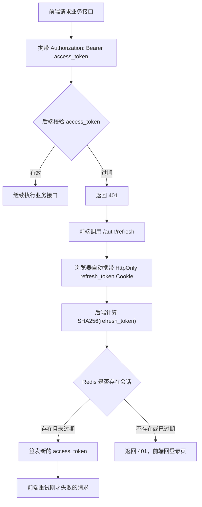

# 登录功能设计

## 目标

为当前 AI RAG Agent 系统增加一套完整登录能力。登录后才能进入首页、智能客服、销售陪练、问答考试、知识库管理等页面；所有普通请求、上传请求和流式请求都要携带登录态。

本次先做身份认证，不做细粒度权限菜单。用户表保留 `role` 字段，为后续管理员、普通用户、教练、学员等权限模型预留空间。

## 最终方案

采用“短期访问令牌 + 长期续签令牌”的方案：

```text
access_token：JWT，30 分钟过期，前端内存保存，后端不保存
refresh_token：随机字符串，7 天过期，浏览器 HttpOnly Cookie 保存明文，后端 Redis 保存哈希
system_users：MySQL 保存登录用户和密码哈希
```

这样做的原因：

- `access_token` 每次请求都要携带，暴露机会更高，所以有效期短。
- `refresh_token` 只用于续签，不给前端 JS 读取，降低 XSS 风险。
- Redis 天然适合保存登录会话，支持 TTL 自动过期和退出登录时主动删除。
- MySQL 只保存真正的用户业务数据，不保存短生命周期会话状态。

## Token 存储

### access_token

`access_token` 是接口访问令牌，用标准 JWT 格式：

```text
header.payload.signature
```

前端保存位置：

```text
浏览器内存
```

后端保存位置：

```text
不保存
```

请求时前端放在请求头：

```http
Authorization: Bearer <access_token>
```

JWT payload 中只放必要字段：

```json
{
  "sub": "user_001",
  "username": "admin",
  "role": "admin",
  "type": "access",
  "iat": 1780000000,
  "exp": 1780001800
}
```

注意：payload 不是加密内容，只是编码内容，所以不能放密码、密钥、手机号、身份证等敏感信息。

### refresh_token

`refresh_token` 是续签令牌，不参与普通业务接口访问。

浏览器保存位置：

```text
HttpOnly Cookie
```

Cookie 建议配置：

```text
Name: ai_rag_refresh_token
HttpOnly: true
Secure: 生产 true，本地开发可 false
SameSite: Lax
Max-Age: 604800
Path: /auth
```

后端保存位置：

```text
Redis
```

Redis 只保存 `SHA256(refresh_token)`，不保存明文。

Redis key 设计：

```text
auth:refresh:{refresh_token_hash}
```

Redis value 示例：

```json
{
  "user_id": "user_001",
  "username": "admin",
  "role": "admin",
  "created_at": "2026-06-25 10:00:00",
  "last_used_at": "2026-06-25 10:30:00",
  "ip_address": "127.0.0.1",
  "user_agent": "Chrome"
}
```

Redis TTL：

```text
604800 秒，也就是 7 天
```

## 过期时间

默认配置：

```text
AUTH_ACCESS_TOKEN_EXPIRE_SECONDS=1800
AUTH_REFRESH_TOKEN_EXPIRE_SECONDS=604800
```

含义：

- `access_token` 30 分钟过期。
- `refresh_token` 7 天过期。

30 分钟内，前端可以直接访问接口。30 分钟后，如果 `refresh_token` 仍有效，前端自动续签。7 天后，`refresh_token` 也失效，用户必须重新输入账号密码登录。

## 续签机制

续签接口：

```text
POST /auth/refresh
```

续签流程：



续签成功时，后端可以刷新 Redis 中的 `last_used_at`。第一版不强制轮换 refresh token；后续如果要提升安全等级，可以增加 refresh token rotation，每次续签都发新 refresh token，并删除旧 Redis key。

## 校验机制

### access_token 校验

后端每次处理需要登录的接口时执行：

```text
1. 从 Authorization 请求头读取 Bearer token
2. 使用 AUTH_TOKEN_SECRET 校验 JWT HS256 签名
3. 校验 exp 是否过期
4. 校验 payload.type 是否等于 access
5. 从 sub 读取 user_id
6. 查询 MySQL system_users 表
7. 判断用户是否存在、status 是否 active
8. 校验通过后把当前用户注入接口
```

### refresh_token 校验

后端续签时执行：

```text
1. 从 HttpOnly Cookie 读取 refresh_token 明文
2. 计算 SHA256(refresh_token)
3. 查询 Redis key auth:refresh:{hash}
4. 判断 Redis 会话是否存在
5. 查询 MySQL system_users 表
6. 判断用户是否存在、status 是否 active
7. 签发新的 access_token
8. 更新 Redis last_used_at，并保持 TTL
```

退出登录时：

```text
1. 从 Cookie 读取 refresh_token
2. 计算 hash
3. 删除 Redis key
4. 清除浏览器 Cookie
5. 前端清空内存 access_token
```

## 密码策略

密码不加密保存，使用不可逆哈希。

建议算法：

```text
PBKDF2-HMAC-SHA256 + 随机盐
```

数据库保存格式：

```text
pbkdf2_sha256$200000$salt_base64$hash_base64
```

原因：

- 密码不能可逆解密。
- 每个用户都有独立随机盐。
- 即使数据库泄露，也不能直接还原密码。

## 默认管理员

系统提供开发环境默认管理员，方便本地启动后直接登录。

默认值：

```text
用户名：admin
密码：1234qwer
显示名：系统管理员
角色：admin
```

环境变量：

```env
AUTH_ENABLE_DEFAULT_ADMIN=true
AUTH_DEFAULT_USERNAME=admin
AUTH_DEFAULT_PASSWORD=1234qwer
AUTH_DEFAULT_DISPLAY_NAME=系统管理员
AUTH_DEFAULT_ROLE=admin
```

启动或首次认证时：

```text
1. 确保 system_users 表存在
2. 查询默认管理员是否存在
3. 不存在则创建
4. 已存在则不覆盖密码
5. 打印中文安全提醒日志
```

生产环境建议：

```env
AUTH_ENABLE_DEFAULT_ADMIN=false
```

## 配置项

敏感配置放 `.env`：

```env
AUTH_TOKEN_SECRET=请换成一串足够长的随机密钥
AUTH_ACCESS_TOKEN_EXPIRE_SECONDS=1800
AUTH_REFRESH_TOKEN_EXPIRE_SECONDS=604800
AUTH_REFRESH_COOKIE_NAME=ai_rag_refresh_token
AUTH_REFRESH_COOKIE_SECURE=false
AUTH_REFRESH_COOKIE_SAMESITE=lax
AUTH_ENABLE_DEFAULT_ADMIN=true
AUTH_DEFAULT_USERNAME=admin
AUTH_DEFAULT_PASSWORD=1234qwer
AUTH_DEFAULT_DISPLAY_NAME=系统管理员
AUTH_DEFAULT_ROLE=admin
```

说明：

- `AUTH_TOKEN_SECRET` 用于 JWT 签名，生产环境必须配置强随机值。
- `AUTH_REFRESH_COOKIE_SECURE` 本地开发可以是 `false`，HTTPS 生产环境必须是 `true`。
- 密码和密钥不能写入普通 YAML 配置文件。

## 后端接口

### POST /auth/login

用途：账号密码登录。

输入：

```json
{
  "username": "admin",
  "password": "1234qwer"
}
```

处理：

```text
1. 校验用户名密码
2. 签发 access_token
3. 生成 refresh_token
4. Redis 保存 refresh_token_hash 对应会话，设置 TTL
5. refresh_token 明文写入 HttpOnly Cookie
6. 返回 access_token 和用户信息
```

### POST /auth/refresh

用途：用 Cookie 中的 refresh token 换新 access token。

输入：

```text
不需要请求体，浏览器自动携带 Cookie
```

输出：

```json
{
  "access_token": "...",
  "token_type": "bearer",
  "expires_in": 1800,
  "user": {
    "user_id": "user_001",
    "username": "admin",
    "display_name": "系统管理员",
    "role": "admin",
    "status": "active"
  }
}
```

### GET /auth/me

用途：根据 access token 查询当前用户。

### POST /auth/logout

用途：退出登录，删除 Redis refresh session 并清除 Cookie。

## 前端设计

### 登录门禁

`App.vue` 负责判断登录态：

```text
1. 页面首次打开，内存没有 access_token
2. 先调用 /auth/refresh 尝试用 Cookie 恢复登录
3. 成功则进入系统
4. 失败则展示登录页
```

登录成功后：

```text
1. access_token 放入前端内存
2. refresh_token 已由浏览器 Cookie 自动保存
3. 进入系统首页
```

退出登录后：

```text
1. 调用 /auth/logout
2. 清空内存 access_token
3. 回到登录页
```

### 请求自动续签

`api.ts` 统一封装请求：

```text
1. 普通 JSON 请求自动加 Authorization
2. 文件上传请求自动加 Authorization，但不手动设置 Content-Type
3. SSE 流式请求自动加 Authorization 和 Accept: text/event-stream
4. 请求返回 401 时，自动调用 /auth/refresh
5. refresh 成功后重试原请求一次
6. refresh 失败则清空登录态并回登录页
```

为了避免死循环，自动重试只做一次。

## Redis 不可用策略

Redis 不可用时：

```text
1. 登录接口返回明确错误：登录会话服务暂不可用
2. refresh 接口返回 401 或 503
3. 已有 access_token 在 30 分钟内仍可继续访问
4. access_token 过期后无法续签，需要 Redis 恢复后重新登录
```

原因：refresh session 存在 Redis 中，Redis 不可用时不能可靠判断 refresh token 是否有效，不能绕过校验。

## 所用设计模式

- 外观模式：`AuthService` 统一封装登录、续签、退出、当前用户解析，路由层不直接拼认证流程。
- 仓储模式：`AuthRepository` 负责 MySQL 用户读写，`RefreshSessionStore` 负责 Redis 会话读写。
- 策略模式：密码哈希、JWT 签名、refresh token 哈希封装为可替换策略，后续更换算法或库时不影响路由。
- 代理模式：FastAPI `get_current_user` 作为接口访问代理，统一做 token 校验和用户注入。

## 验证

后端测试：

```text
1. 密码哈希能验证正确密码，拒绝错误密码
2. 登录成功返回 access_token，并写入 refresh_token Cookie
3. access_token 过期后 /auth/me 返回 401
4. refresh_token 有效时 /auth/refresh 返回新 access_token
5. logout 后 Redis refresh session 被删除
6. logout 后旧 refresh_token 不能续签
7. Redis 不可用时 refresh 失败
8. OpenAPI 暴露 /auth/login、/auth/refresh、/auth/me、/auth/logout
```

前端验证：

```text
1. 未登录进入登录页
2. admin / 1234qwer 可登录
3. 刷新页面后通过 /auth/refresh 恢复登录
4. access_token 过期后自动 refresh 并重试请求
5. 退出登录后回到登录页
6. npm run build 通过
```
