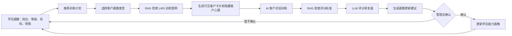
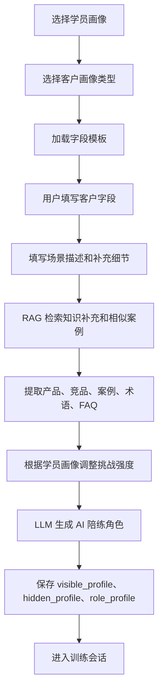
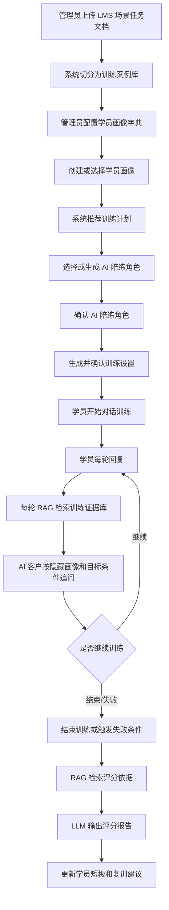
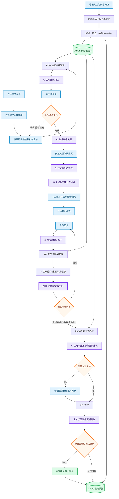
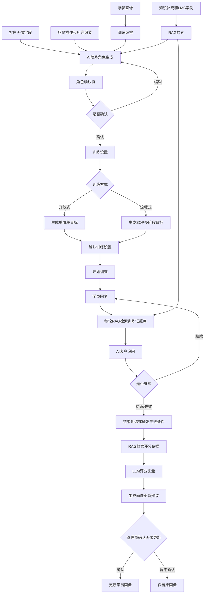
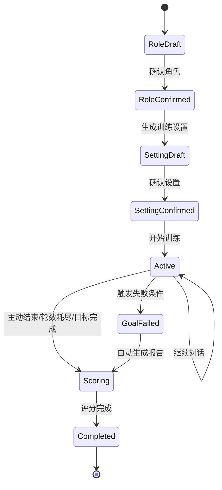
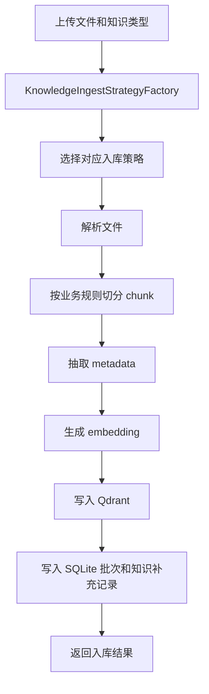

# 销售训练客户画像 RAG 设计

## 1. 设计目标

本设计用于把 LMS 场景任务案例文档升级为“AI 销售训练与选拔系统”。

系统不只是让销售查询资料，而是要完成：

```text
选择学员画像
选择客户画像类型
-> 生成客户画像
-> AI 扮演客户
-> 销售多轮对话
-> RAG 检索标准案例和评分标准
-> LLM 打分、点评、给复训建议
```

最终目标：

| 目标 | 说明 |
| --- | --- |
| 训练销售 | 让销售在模拟客户场景中练陌拜、跟进、诊断、产品介绍、逼单 |
| 选拔销售 | 通过多轮对话判断销售是否具备客户理解、痛点挖掘、成交推进能力 |
| 沉淀能力画像 | 保存每个销售的得分、短板、适合岗位和复训建议 |
| 复用 LMS 文档 | 把现有 LMS 场景任务案例变成可检索、可出题、可评分的训练案例库 |

核心原则：

```text
客户画像决定“客户怎么演”。
学员画像决定“练什么、练多难、按什么标准判分”。
```

## 2. 核心定位

这类系统属于：

```text
训练评测型 RAG
销售场景陪练型 RAG
AI 销售训练考官
```

和普通客服 RAG 的区别：

| 类型 | 普通客服 RAG | 销售训练 RAG |
| --- | --- | --- |
| 用户 | 客户 | 销售学员 |
| 目标 | 回答客户问题 | 训练和评估销售能力 |
| 检索内容 | 产品知识、FAQ、操作说明 | 客户案例、标准话术、隐性心理、评分标准 |
| LLM 输出 | 客服答案 | 客户追问、评分结果、改进建议 |
| 会话结果 | 一条回答 | 一份训练报告 |

## 3. 双画像模型

销售训练不能只建客户画像，还必须建学员画像。

```text
客户画像：模拟客户是谁、有什么需求、怎么追问、怎么抗拒。
学员画像：销售是谁、岗位是什么、水平如何、短板是什么、适合练什么。
```

双画像匹配后，系统才能做到：

| 能力 | 说明 |
| --- | --- |
| 因材施教 | 新手练陌拜和产品介绍，高级销售练异议处理和成交推进 |
| 难度自适应 | 初级学员面对低阻力客户，高级学员面对强势、挑剔、价格敏感客户 |
| 训练闭环 | 根据学员短板标签自动推荐训练任务 |
| 选拔客观 | 同一岗位角色用相同评分维度和通过线 |

双画像训练闭环：



## 4. 学员画像设计

从截图看，学员画像是训练系统的配置字典，不是客户画像字段。它主要由四类父级字典构成：

```text
岗位角色
经验等级
任务目标/难度
短板标签（针对性训练）
```

| 父级字典 | 建议 key | 当前截图里的子项 | 在系统里的作用 |
| --- | --- | --- | --- |
| 职位角色 | position_role | 外综服客户经理、超级客服、海外BD | 决定适合练哪类业务场景、客户画像模板和评分权重 |
| 经验等级 | experience_level | 新手、初级、中级、高级 | 决定客户难度、追问强度、评分严格度和训练轮数 |
| 任务目标（难度） | task_goal | 初级、中级、高级 | 决定本次训练要达到的目标难度 |
| 短板标签（针对性训练） | weakness_tag | 产品介绍、需求挖掘、价格谈判、异议处理、通单技巧、售后处理、陌拜、行业趋势分析 | 决定本次重点训练任务、RAG 检索方向和复训建议 |

这里的字典不是用来做关键词硬编码路由，而是业务配置。它只负责描述“这个学员是谁、要练什么”，真正的案例依据仍然来自 LMS 文档入库后的 RAG 检索。

### 4.1 岗位角色

当前可见岗位：

| 岗位角色 | key | 训练重点 |
| --- | --- | --- |
| 外综服客户经理 | wzf_customer_manager | 陌拜、需求挖掘、套餐推荐、成单推进 |
| 超级客服 | wm_ai_service | 线上跟进、产品介绍、报价处理、售后处理、样品扩展 |
| 海外BD | overseas_bd | 海外渠道开发、代理沟通、服务合作、样品测试推进 |

岗位角色决定：

```text
可选客户画像模板
可选训练任务类型
评分维度权重
合格分数线
训练话术风格
```

### 4.2 经验等级

当前可见等级：

| 等级 | key | 含义 |
| --- | --- | --- |
| 新手 | beginner | 刚接触业务，主要练基础结构和标准话术 |
| 初级 | junior | 能完成基础沟通，但痛点挖掘和推进不足 |
| 中级 | intermediate | 能独立跟进常规客户，需训练复杂异议 |
| 高级 | senior | 适合高难客户、强压谈判、复杂成交推进 |

经验等级决定：

```text
客户难度
追问强度
评分严格度
训练轮数
是否给提示
是否允许查看参考话术
```

### 4.3 任务目标/难度

当前可见任务目标：

| 标签 | key | 说明 |
| --- | --- | --- |
| 初级 | goal_junior | 训练基础表达和标准流程 |
| 中级 | goal_intermediate | 训练场景判断和异议处理 |
| 高级 | goal_senior | 训练复杂客户推进和成单能力 |

任务目标不是学员当前水平，而是本次训练目标。

例如：

```text
学员经验等级=初级
任务目标=中级
```

表示给初级学员安排一次略高于当前水平的进阶训练。

### 4.4 能力/短板标签

截图里有“短板标签（针对性训练）”，可见标签：

| 标签 | 建议 key | 训练含义 |
| --- | --- | --- |
| 产品介绍 | product_intro | 不会把产品价值讲清楚 |
| 需求挖掘 | demand_discovery | 不会通过提问挖真实需求 |
| 价格谈判 | price_negotiation | 面对压价容易退让或解释不清价值 |
| 异议处理 | objection_handling | 客户质疑时容易卡住 |
| 通单技巧 | deal_closing | 成交流程、合同、下一步动作推进弱 |
| 售后处理 | after_sales | 售后、交付、质量问题回应弱 |
| 陌拜 | cold_outreach | 开场破冰、建联、钩子设计弱 |
| 行业趋势分析 | industry_trend | 不会结合行业趋势建立专业信任 |

这些标签的作用：

```text
用于自动推荐训练任务
用于调整评分维度权重
用于生成复训计划
用于学员成长画像统计
```

### 4.5 学员画像结构

建议保存为：

```json
{
  "trainee_id": "sales_001",
  "name": "张三",
  "position_role": "overseas_bd",
  "experience_level": "junior",
  "task_goal": "goal_intermediate",
  "weakness_tags": ["需求挖掘", "异议处理", "价格谈判"],
  "strength_tags": ["产品介绍"],
  "recent_scores": {
    "客户理解": 72,
    "痛点挖掘": 61,
    "产品匹配": 78,
    "话术表达": 75,
    "成交推进": 58
  }
}
```

### 4.6 学员画像如何生成

学员画像来源有三类：

| 来源 | 说明 |
| --- | --- |
| 手工选择 | 管理员给学员选择岗位、经验等级、短板标签 |
| 历史训练生成 | 根据多次训练得分生成短板更新建议，管理员确认后再更新 |
| 入职测评生成 | 新学员先做一次基础测评，由系统给出初始画像 |

建议第一阶段先做手工选择。第二阶段即使引入模型建议，也只生成画像更新建议，不自动覆盖学员画像。

## 5. 两类客户画像

当前设计先支持两种画像模板：

```text
超级客服画像
海外 BD 画像
```

这两种画像不是两个简单下拉框，而是两套不同的客户建模逻辑。

### 5.1 超级客服画像

适合训练：

```text
线上询盘回复
客户跟进
报价后互动
产品咨询转化
AI 超级客服 / CRM / 报价 / 物流工具推介
```

核心字段：

| 字段 | 用途 |
| --- | --- |
| 客户类型 | 区分 C 端、B 端、大业务 |
| 客户阶段 | 判断客户在成交、报价、P 阶段、产品咨询等哪个阶段 |
| 客户所在地 | 决定语言、文化、物流、关税、付款等关注点 |
| 客户来源 | Facebook、Google SEO、阿里国际站等，不同来源跟进方式不同 |
| 客户意向 | 决定 AI 客户配合程度和追问强度 |
| 合作阶段 | 新用户、老客户、公海客户 |
| 行业 | 决定产品场景、痛点和话术方向 |
| 当前阶段 | 首次跟进、再次跟进、跟进不同、跟进回复 |
| 核心关注点 | 质量、交期、售后、品牌、定制、资质、价格、物流等 |
| 价格敏感度 | 决定客户是否频繁压价 |
| 是否决策人 | 决定是否需要销售推动上级决策 |
| 适用产品 | 拖拉机、高尔夫球车、焊接清洗机、报价工具等 |
| 性格特征 | 直接果断、谨慎犹豫、挑剔细节、强势主导 |

### 5.2 海外 BD 画像

适合训练：

```text
海外渠道开发
代理商沟通
服务合作洽谈
样品测试推进
需求确认
报价谈判
中高意向客户转化
```

核心字段：

| 字段 | 用途 |
| --- | --- |
| 客户类型 | C 端、B 端、G 端 |
| 客户分类 | 一般意向、中等意向、高意向 |
| 合作阶段 | 与客户分类联动，决定当前沟通目标 |
| 客户所在地 | 决定国家市场、采购习惯、合规关注 |
| 公司规模 | 微型团队、小型企业、成长型企业、大型企业等 |
| 客户来源 | 展会、地推、转介绍、谷歌搜索、地图获客、海关获客等 |
| 行业 | 工程机械、农业机械、电动搬运、木工、五金等 |
| 服务内容 | 产品或服务 |
| 核心关注点 | 产品质量、交期、售后、品牌、认证、服务获客、成本、市场选择等 |
| 价格敏感度 | 判断报价谈判强度 |
| 是否决策人 | 判断是否要争取老板或采购负责人入局 |
| 适用产品 | 代购、代采、代卖、代发、物流、品宣、代销 |
| 性格特征 | 直接果断、谨慎犹豫、挑剔细节、强势主导 |

## 6. 客户画像生成思路

这里建议把“客户画像”进一步升级为“AI 陪练角色”。客户画像负责定义客户是谁，AI 陪练角色负责定义这个客户在训练里怎么说话、怎么追问、怎么施压、怎么给反馈。

AI 陪练角色由五类输入共同生成：

| 输入 | 作用 |
| --- | --- |
| 学员画像 | 决定 AI 客户提问方式、对话难度和针对性，例如新手更温和，高级学员更尖锐 |
| 客户画像 | 直接映射到角色的基本身份、诉求、行业、合作阶段、核心关注点和痛点 |
| 知识补充 | 让 AI 拥有真实业务知识、行业背景、产品术语、案例和标准答案 |
| 场景描述 | 提取具体业务痛点、典型异议、对话氛围和对话内容侧重 |
| 补充细节 | 进一步细化角色关注点、潜台词、隐藏顾虑和触发条件 |

### 6.1 画像分为可见层和隐藏层

客户画像不能全部展示给销售，否则销售会直接“背答案”。

建议拆成两层：

| 层级 | 给谁看 | 内容 |
| --- | --- | --- |
| 可见客户卡片 | 销售学员 | 行业、地区、公司规模、客户阶段、公开需求、任务目标 |
| 隐藏客户画像 | AI 客户和评分模型 | 真实顾虑、预算态度、决策逻辑、心理防线、触发成交条件、禁忌话术 |

示例：

```json
{
  "visible_profile": {
    "客户类型": "B端",
    "行业": "工程机械",
    "地区": "土耳其",
    "客户阶段": "报价后客户冷淡",
    "公开需求": "想了解拖拉机配件供货和报价",
    "训练任务": "完成二次跟进并推动客户回复"
  },
  "hidden_profile": {
    "真实顾虑": [
      "担心中国供应商交期不稳定",
      "觉得上次报价偏高",
      "正在对比另外两家供应商"
    ],
    "心理状态": "谨慎犹豫",
    "价格敏感度": "中",
    "成交触发条件": [
      "销售能说明质量保障",
      "能给出明确交期",
      "能提供后续样品或小单试合作方案"
    ],
    "扣分点": [
      "只催客户付款",
      "没有回应报价冷淡原因",
      "没有提出下一步动作"
    ]
  }
}
```

### 6.2 画像生成方式

AI 陪练角色生成分为八步：

```text
1. 从客户画像中提取核心属性
2. 根据行业和客户类型推断合理职位
3. 结合场景描述和补充细节生成当前工作痛点
4. 从知识补充中提取关键事实
5. 根据性格特征和价格敏感度推断沟通习惯
6. 从痛点和知识补充中提炼潜台词
7. 根据学员画像调整挑战强度
8. 整合输出完整 AI 陪练角色
```

流程：



### 6.3 AI 陪练角色生成步骤

| 步骤 | 处理逻辑 | 输出内容 |
| --- | --- | --- |
| 1. 提取客户核心属性 | 从客户画像中提取客户类型、行业、合作阶段、核心关注点、价格敏感度、性格特征 | 基础客户标签 |
| 2. 推断合理职位 | 根据行业和客户类型推断客户身份，例如零售商可推断为采购总监或运营负责人 | 角色职位 |
| 3. 生成工作痛点 | 结合场景描述和补充细节，把泛化痛点变成当前业务问题 | 当前痛点 |
| 4. 提取知识事实 | 从知识补充和 RAG 结果中提取产品功能、竞品对比、成功案例、术语、常见问答 | 可追问知识点 |
| 5. 推断沟通习惯 | 根据性格特征和价格敏感度决定客户语气、追问方式、是否施压 | 对话风格 |
| 6. 提炼潜台词 | 从痛点、预算、风险和知识补充中提炼客户没明说但真正在意的点 | 隐藏顾虑 |
| 7. 调整挑战强度 | 根据学员经验等级、短板标签、任务难度调整追问强度和异议数量 | 挑战策略 |
| 8. 输出完整角色 | 汇总角色身份、简介、痛点、潜台词、沟通习惯和评分关注点 | AI 陪练角色 |

知识补充建议提取为结构化事实：

| 知识类型 | 示例 | 用途 |
| --- | --- | --- |
| 产品功能/特性 | 自动对账支持 10 种格式 | 验证学员是否掌握产品能力 |
| 竞品对比 | A 公司年费低 20%，但无数据看板 | 制造竞品异议 |
| 成功案例 | 某东南亚客户使用后效率提升 40% | 判断学员是否会用案例增强信任 |
| 行业术语/缩写 | ROI（投资回报率） | 判断学员专业度 |
| 常见客户问题与标准答案 | 实施一般 2 周，含培训 | 评分和追问依据 |

### 6.4 AI 陪练角色输出结构

建议生成并保存为结构化 JSON：

```json
{
  "role_profile": {
    "position": "采购总监",
    "role_summary": "负责海外农机配件采购，正在评估中国供应商的价格、交期和售后稳定性。",
    "personality": "务实谨慎",
    "communication_style": "喜欢追问数据、要求案例，不会轻易表态",
    "cost_control_habit": "关注总成本，不只看单价，也会计算物流、返修和交付风险",
    "business_pain_points": [
      "现有供应商交期不稳定",
      "报价结构不清楚，难以向老板解释",
      "担心售后响应慢影响本地客户"
    ],
    "subtext": [
      "希望拿到更高性价比，但怕试错风险",
      "如果销售不能证明稳定交付，会继续观望"
    ],
    "challenge_strategy": {
      "difficulty": "medium",
      "target_weakness_tags": ["需求挖掘", "价格谈判"],
      "objection_points": ["价格偏高", "担心交期", "想看成功案例"],
      "hint_level": "少量提示"
    },
    "knowledge_facts": [
      "样品测试可作为小单试合作方案",
      "类似客户常关注交期、物流、售后响应"
    ]
  }
}
```

这个结构不全部展示给学员。学员只看到可见客户卡片；AI 客户和评分模型可以读取完整 role_profile。

### 6.5 最终陪练角色确认页

AI 陪练角色生成后，前端需要先展示“确认角色”页面，让管理员或学员确认这个角色是否符合本次训练目标，再进入正式对话。

页面结构建议：

| 页面区域 | 字段 | 是否给学员可见 | 说明 |
| --- | --- | --- | --- |
| 标题区 | 请确认你的 AI 陪练角色 | 是 | 告诉用户当前是生成结果确认页 |
| 角色基础信息 | 角色名称、性别、年龄、职位/身份 | 是 | 例如：AI客户，男，33岁，外贸业务负责人 |
| 角色简介 | 业务背景、当前阶段、主要负责事项、适用产品、当前关注点 | 是 | 帮学员理解这是谁、为什么来沟通 |
| 性格特征 | 性格类型、沟通风格、关注点、对价格/方案的态度 | 是 | 决定对话语气和追问方式 |
| 成本控制习惯 | 预算态度、投入产出关注点、长期订阅/费用敏感点 | 是 | 用于训练价格谈判和价值解释 |
| 业务痛点 | 当前业务问题、流程问题、工具问题、效率问题 | 是 | 用于训练需求挖掘和方案匹配 |
| 潜台词 | 未明说的真实顾虑、隐藏判断标准 | 建议部分可见 | 可见版用于训练提示，完整版只给 AI 和评分模型 |
| 操作区 | 编辑、确认角色 | 是 | 编辑后重新生成或保存，确认后进入训练 |

截图里的最终角色卡可以抽象成下面的数据：

```json
{
  "role_confirm_card": {
    "title": "请确认你的AI陪练角色",
    "subtitle": "基于您选择的场景，AI正在生成陪练角色",
    "role_name": "AI客户",
    "gender": "男",
    "age": 33,
    "identity": "外贸业务负责人",
    "role_summary": "担任公司外贸业务负责人，专注农业机械出口至东南亚市场多年。主要处理老客户复购业务，目前采购阶段处于初步了解，对价格较为敏感，其次关注售后服务。适用产品为AI验出海。公司因现有工具效率低、成本高而寻求新解决方案。",
    "personality_traits": "务实谨慎型，对成本控制严格，关注实际收益，沟通直接，易质疑价格，重视方案落地性",
    "cost_control_habits": [
      "日常运营严格审核支出，优先选高性价比方案",
      "习惯性对比投入产出",
      "对长期订阅费用递增情况特别敏感"
    ],
    "business_pain_points": [
      "复购报价环节重复且易出错",
      "缺乏自动化辅助工具",
      "团队培训成本高，现有软件操作复杂效率低"
    ],
    "subtext": [
      "争取首年折扣或免费试用机会",
      "担心软件功能是否真解决痛点，操作是否复杂，代替手动翻查",
      "对比效率提升与成本节省是否成正比，价格与价值对等"
    ]
  }
}
```

确认页展示的是 role_profile 的可见版。隐藏顾虑、追问策略、评分扣分点仍然保存在 hidden_profile 或 challenge_strategy 里，不直接展示给学员。

### 6.6 第二步：训练设置

AI 陪练角色确认后，进入“训练设置”。这一页用于把角色场景转成可执行的训练目标。

页面布局：

```text
左侧：第一步生成的 AI 训练角色场景，支持编辑修改
右侧：基于左侧角色场景生成训练目标设置
```

训练方式长期设计支持开放式和流程式，但一期只实现开放式。

| 训练方式 | 说明 | AI 预设逻辑 |
| --- | --- | --- |
| 开放式 | 一期实现。不要求固定流程顺序，围绕一个核心目标完成对话 | AI 只生成一个阶段目标，学员可以自由推进，只要满足目标达成条件即可 |
| 流程式 | 二期再做。一期不进入开发范围，前端可以隐藏或置灰 | AI 按 SOP 阶段推进，生成多个阶段目标，未达成当前阶段目标不会进入下一阶段 |

开放式训练设置字段：

| 字段 | 类型 | 规则 | 说明 |
| --- | --- | --- | --- |
| 训练宗旨 | 文本输入 | 最多 20 字 | 本次训练的核心意义 |
| 核心目标 | 文本输入 | 最多 50 字 | 描述该阶段需要达成的沟通目的 |
| 目标达成条件 | 文本输入 | 最多 500 字 | 学员满足后视为目标完成 |
| 目标失败条件 | 文本输入 | 最多 500 字 | 学员触发后训练失败，并自动生成训练报告 |
| 对话轮数 | 计数器 | LLM 动态生成，范围 5-100 轮，用户可编辑 | 根据难易程度、客户性格特征、学员经验等级动态预设，不写死 |

开放式默认生成示例：

```json
{
  "training_mode": "open",
  "training_purpose": "破冰与需求挖掘",
  "round_limit": 8,
  "stages": [
    {
      "stage_no": 1,
      "stage_name": "破冰与需求挖掘",
      "core_goal": "学员与客户建立有效沟通，获取客户基本背景、当前痛点或需求方向，并让客户愿意继续对话。",
      "success_conditions": [
        "客户主动描述了一个具体痛点",
        "客户明确回应了学员提出的两个以上背景问题，且没有表现出不耐烦",
        "客户给出了正向承接信号，例如“嗯，你说得有点道理”或“可以继续聊聊”"
      ],
      "failure_conditions": [
        "客户明确拒绝，例如“不需要”“没兴趣”“别打电话了”",
        "连续多轮对话客户只给出低价值回复，且学员未有效调整",
        "客户主动提出结束对话，且未约定下次联系"
      ]
    }
  ]
}
```

流程式训练设置字段（二期预留，一期不实现）：

| 字段 | 类型 | 规则 | 说明 |
| --- | --- | --- | --- |
| 训练宗旨 | 文本输入 | 最多 20 字 | 本次训练的核心意义 |
| 阶段列表 | 阶段数组 | 至少 2 个阶段 | 例如破冰、需求挖掘、方案、异议、成交 |
| 阶段核心目标 | 文本输入 | 每阶段最多 50 字 | 当前阶段要达成的沟通目的 |
| 阶段达成条件 | 文本输入 | 每阶段最多 500 字 | 满足后进入下一阶段 |
| 阶段失败条件 | 文本输入 | 每阶段最多 500 字 | 触发后训练失败或进入复盘 |
| 阶段轮数 | 计数器 | LLM 动态生成，每阶段建议 1-30 轮，用户可编辑 | 控制每个阶段最多对话次数，不写死 |

训练设置联动规则：

```text
一期固定使用开放式 -> AI 默认生成一个阶段目标
流程式二期再开放 -> AI 默认生成多个 SOP 阶段目标
点击重新生成 -> 根据角色场景、学员画像、训练方式重新生成目标
点击编辑 -> 管理员可修改 AI 预设内容
训练中触发失败条件 -> 学员端提示“训练目标未达成，自动生成训练报告”
训练中满足开放式目标 -> 可以继续自由对话，也可以提前结束评分
训练中满足流程式阶段目标 -> 自动进入下一阶段。该能力二期实现
```

### 6.7 为什么要 RAG 参与画像生成

如果只按字段随机拼画像，客户会像“假人”。

RAG 的作用是把画像拉回真实案例：

```text
行业相似
阶段相似
关注点相似
产品相似
客户顾虑相似
标准话术相似
```

例如用户选择：

```text
客户类型：B端
行业：农用机械
客户阶段：报价后冷淡
核心关注点：交期、价格、物流
性格：谨慎犹豫
```

系统会检索 LMS 案例里类似的：

```text
农机客户
报价/物流/跟进问题
客户对人工报价、物流核算、交付风险有顾虑
```

再生成更真实的客户隐藏心理。

## 7. 学员画像和客户画像如何匹配

匹配逻辑：

```text
学员岗位角色 -> 限定客户画像类型
学员短板标签 -> 推荐训练任务
学员等级/目标 -> 决定客户难度
客户画像字段 -> 生成具体客户
```

### 7.1 岗位和画像类型匹配

| 学员岗位 | 推荐客户画像 |
| --- | --- |
| 超级客服 | 超级客服画像 |
| 海外BD | 海外BD画像 |
| 外综服客户经理 | 超级客服画像 + 海外BD画像都可用，按训练任务选择 |

### 7.2 短板和训练任务匹配

| 学员短板 | 推荐训练任务 |
| --- | --- |
| 陌拜 | 首次开场、破冰建联 |
| 需求挖掘 | 多轮提问、客户痛点诊断 |
| 产品介绍 | 产品卖点讲解、痛点卖点对应 |
| 价格谈判 | 报价解释、价值锚定、压价处理 |
| 异议处理 | 平台踩坑、预算不足、不信任、同行对比 |
| 通单技巧 | 合同权益、下一步动作、成交闭环 |
| 售后处理 | 质量、交期、售后、物流、赔付 |
| 行业趋势分析 | 行业趋势拆解、区域市场判断、专业信任建立 |

### 7.3 难度生成规则

| 学员等级/目标 | 客户难度 | 客户表现 |
| --- | --- | --- |
| 新手/初级目标 | 低 | 客户表达清晰，追问少，阻力弱 |
| 初级/中级目标 | 中 | 客户有顾虑，会压价，会要求案例 |
| 中级/高级目标 | 高 | 客户强势、挑剔、信息不完整，多次异议 |
| 高级/选拔 | 极高 | 客户隐藏真实诉求，要求销售主动挖掘和推进 |

### 7.4 训练推荐示例

```json
{
  "trainee_profile": {
    "position_role": "overseas_bd",
    "experience_level": "junior",
    "task_goal": "goal_intermediate",
    "weakness_tags": ["需求挖掘", "异议处理"]
  },
  "recommended_training": {
    "profile_type": "overseas_bd",
    "training_mode": "customer_roleplay",
    "customer_difficulty": "medium",
    "task_types": ["需求确认", "异议处理", "样品测试推进"],
    "round_count": 8
  }
}
```

### 7.5 学员画像到客户画像的实际转换

学员画像不会直接变成客户画像，而是先变成训练约束，再参与客户画像生成。

```text
职位角色 -> 限定客户画像模板
经验等级 -> 设定客户阻力和评分严格度
任务目标 -> 设定训练目标难度
短板标签 -> 设定训练任务和检索重点
```

示例：

| 学员画像条件 | 系统转换结果 |
| --- | --- |
| 海外BD + 初级 + 中级目标 + 需求挖掘 | 推荐海外BD客户画像，生成中等难度客户，客户会给出部分信息但需要销售主动追问 |
| 超级客服 + 新手 + 初级目标 + 产品介绍 | 推荐超级客服客户画像，生成低阻力客户，重点考察产品卖点是否讲清 |
| 外综服客户经理 + 中级 + 高级目标 + 价格谈判 | 客户画像可选超级客服或海外BD，客户更价格敏感，评分重点放在价值锚定和报价解释 |

## 8. LMS 文档入库方式

LMS 文档不能按普通长文本粗切。

首批样例语料直接使用已经提供的三份文档，不需要另找样例：

| 样例文件 | 用途 |
| --- | --- |
| `C:\Users\chen\Documents\LMS-场景任务案例6.11（替换文案）.docx` | 验证 6.11 版本场景任务的解析、切片和 metadata 抽取 |
| `C:\Users\chen\Documents\LMS-场景任务案例6.12(1).docx` | 验证 6.12 分支版本内容差异和重复案例处理 |
| `C:\Users\chen\Documents\LMS-场景任务案例6.12.docx` | 验证 6.12 正式版本场景任务入库 |

这三份文件就是第一版训练知识库的切片验收基准。上传策略先用它们跑通，再扩展到更多 LMS 文档。

推荐切分单位：

```text
一个场景任务 = 一个 training_case
```

每个任务再拆成多个 point：

| point 类型 | 内容 | 用途 |
| --- | --- | --- |
| case_profile | 客户案例、行业、规模、阶段、现状 | 生成客户画像 |
| task_requirement | 任务要求、时间限制、表达要求 | 出题和约束训练目标 |
| standard_answer | 标准话术、匹配套餐、产品卖点 | 评分参考 |
| hidden_psychology | 隐性心理、底层顾虑、成交阻力 | AI 客户扮演 |
| scoring_rubric | 命中点、扣分点、能力维度 | LLM 打分 |

Qdrant collection 建议：

```text
sales_training_cases
```

metadata 示例：

```json
{
  "content_type": "sales_training_case",
  "case_id": "lms_6_11_001",
  "case_part": "standard_answer",
  "profile_type": "super_customer_service",
  "task_type": "陌拜",
  "industry": "机械配件加工厂",
  "customer_stage": "外贸0-1起步",
  "recommended_package": "L1一星启航版",
  "source_file": "LMS-场景任务案例6.11.docx",
  "section_title": "一、陌拜的"
}
```

## 9. 训练使用方式

### 9.1 标准作答模式

适合新人基础训练。

流程：

```text
系统展示客户卡片
-> 系统展示任务要求
-> 销售输入一段话术
-> RAG 检索标准答案和评分标准
-> LLM 打分
-> 输出改进建议
```

示例：

```text
任务：请对一个山东机械配件工厂老板做首次陌拜开场。
要求：30-90 秒，包含个人介绍、公司介绍、产品介绍、来意，并预留钩子。
```

销售回答后评分：

```text
得分：82/100
命中：能识别客户0-1出海阶段，提到低风险试水
遗漏：没有明确公司介绍，没有具体回访钩子
建议：补充“山东5家同款工厂出海收支台账”作为后续建联钩子
```

### 9.2 客户追问模式

适合练异议处理。

流程：

```text
销售先回答
-> AI 根据 hidden_profile 追问
-> 销售继续应对
-> 多轮后统一评分
```

客户追问示例：

```text
我之前看过阿里国际站，花了钱没效果，你这个和阿里有什么区别？
```

### 9.3 实战选拔模式

适合判断销售是否能独立谈客户。

流程：

```text
AI 只给少量客户公开信息
-> 销售需要主动提问挖需求
-> AI 按客户性格和隐藏顾虑回答
-> 销售推荐产品或套餐
-> AI 继续压价、质疑、拖延或要求案例
-> 最终评分和评级
```

能力评级：

| 等级 | 含义 |
| --- | --- |
| S | 可独立成单，能处理复杂异议 |
| A | 可进入真实客户跟进，需少量辅导 |
| B | 基础合格，适合继续训练 |
| C | 暂不适合独立接待客户 |

### 9.4 完整使用流程

管理员和学员的使用路径建议如下：



第一阶段可以先让管理员手动选择学员画像和客户画像；第二阶段再根据历史训练记录自动推荐。

## 10. 评分设计

评分规则由三部分组成：

```text
评分维度：通用能力 40 分 + 阶段能力 60 分
附加扣分：第一版只启用文字响应时效扣分。违规词扣分、语音响应时效扣分先不做，后续再补充。
复核方式：AI 自动评分 / AI 自动评分 + 人工复核
```

### 10.1 评分规则总览

初始评分规则由系统固定的 3 个通用能力和 AI 生成的阶段能力组成。

```text
通用能力：固定 40 分
阶段能力：动态 60 分
总分：始终必须等于 100 分
```

交互要求：

```text
右侧支持锚点定位，点击评分规则、附加扣分、复核方式等锚点可快速定位到对应配置区域。
所有考核点分值实时求和。
保存并发布前必须校验总分=100。
如果不等于100，提示：“满分为100分，当前为xxx分，是否自动平衡总分？”
点击确认后，按最大余数法自动平衡总分。
```

注意：

```text
关闭某个考核点后，对应评分维度总分同步减少，总分也同步减少。
删除或编辑考核点后，对应评分维度总分同步调整，总分也同步调整。
保存发布时仍必须满足总分=100。
```

### 10.2 通用能力 40 分

通用能力由系统固定，不支持删除和编辑。每个通用评分维度下至少必须开启一项考核点。

| 通用能力 | 总分 | 考核点 | 分值 | 默认状态 |
| --- | --- | --- | --- | --- |
| 内容质量 | 20 | 信息准确性：回答与业务事实、产品知识一致，无常识错误 | 10 | 开启 |
| 内容质量 | 20 | 需求理解与回应：准确理解客户问题，针对性回应，不答非所问 | 5 | 开启 |
| 内容质量 | 20 | 价值传递：清晰说明产品/方案对客户的价值 | 5 | 开启 |
| 语言表达 | 10 | 流利度：说话流畅。每分钟 150-300 字，无明显停顿；超过 3 秒扣 1 分，最多扣 10 分；无冗余词，占比超过 3% 扣 1 分 | 4 | 开启 |
| 语言表达 | 10 | 专业术语使用：正确使用行业术语，不滥用或误用 | 3 | 开启 |
| 语言表达 | 10 | 逻辑性清晰度：评估学员话术是否具备清晰逻辑结构，能够有条不紊地传达信息 | 3 | 开启 |
| 互动与态度 | 10 | 倾听与承接：回应承接上一轮客户发言，不跳跃 | 4 | 开启 |
| 互动与态度 | 10 | 礼貌与亲和力：用词礼貌、态度积极、无负面用语 | 3 | 开启 |
| 互动与态度 | 10 | 主动引导：能够主动推进话题，引导客户进入下一步沟通 | 3 | 开启 |

通用能力交互规则：

```text
通用能力维度固定为内容质量、语言表达、互动与态度。
通用能力维度不支持删除和重命名。
通用能力考核点默认开启，支持开关。
每个通用能力维度下至少必须保留一个开启的考核点。
关闭某个考核点后，该维度总分和全局总分实时减少。
保存发布时仍必须通过满分 100 校验。
```

### 10.3 阶段能力 60 分

阶段能力由 AI 根据训练方式生成。一期只按开放式生成单阶段能力，流程式为二期预留。

开放式：

```text
只有一个阶段评分维度。
AI 根据学员画像、客户画像、场景描述、核心目标拆分至少 3 个考核点。
AI 为每个考核点匹配分值。
阶段能力总分与通用能力相加必须等于 100。
至少保留一个阶段评分维度。
```

流程式（二期预留，一期不实现）：

```text
AI 根据每个阶段生成一个阶段评分维度。
每个阶段结合学员画像、客户画像、场景描述、核心目标拆分至少 3 个考核点。
AI 为每个考核点匹配分值。
所有阶段能力 + 通用能力必须等于 100。
```

阶段能力支持操作：

| 操作 | 说明 |
| --- | --- |
| 编辑 | 支持评分维度、考核点、分数编辑 |
| 添加 | 在当前评分维度的当前考核点下方新增一条考核点和分数 |
| 删除 | 删除当前评分维度下的当前考核点 |
| 新增评分维度 | 弹出新增评分维度弹窗，支持自定义评分维度，分数范围 1-100 |

### 10.4 总分校验和最大余数法

评分规则必须保证发布时总分为 100。

最大余数法用于自动平衡分值。

注意：

```text
自动平衡只调整阶段能力评分和自定义新增评分维度。
系统预设的通用能力 40 分不参与自动平衡。
如果通用能力考核点被关闭，系统先计算当前已开启通用能力分值，再把剩余分值作为阶段能力和自定义维度的目标总分。
```

算法步骤：

```text
1. 计算固定通用能力已开启总分 fixed_score。
2. 计算可调目标分 target_score = 100 - fixed_score。
3. 按比例系数 target_score / 当前可调项总分 计算每个参与平衡项的理论分值，保留精确小数。
4. 对理论分值四舍五入取整，得到临时整数值。
5. 计算临时可调项总分与 target_score 的差值 d。
6. 若 d > 0，表示不足 target_score，按小数部分从大到小排序，给前 d 个维度各加 1 分。
7. 若 d < 0，表示超过 target_score，按小数部分从小到大排序，给前 |d| 个维度各减 1 分。
8. 最终固定通用能力 + 可调项总分严格等于 100。
```

示例：

```text
原维度分值：10、10、10、56，总分 86。
比例系数：100 / 86 = 1.16279。

理论分值：
10 * 1.16279 = 11.6279，小数部分 0.6279
10 * 1.16279 = 11.6279，小数部分 0.6279
10 * 1.16279 = 11.6279，小数部分 0.6279
56 * 1.16279 = 65.1163，小数部分 0.1163

四舍五入取整：12、12、12、65，总分 101，超出 1 分。
按小数部分从小到大排序，0.1163 对应原 56 分项。
扣减最小小数部分的项：65 -> 64。

最终分值：12、12、12、64，总分 100。
```

### 10.5 附加扣分

附加扣分从最终得分中扣除。第一版只计算文字响应时效扣分。

#### 违规词扣分

第一版先不做违规词扣分，后续再补充。

预留设计：支持输入多个违规词。当学员对话中出现预设违规词时，根据配置次数扣分。

配置项：

| 字段 | 规则 |
| --- | --- |
| 违规词 | 必填，支持多个 |
| 次数 | 必填，整数，范围 1-10 |
| 最小扣分 | 必填，整数，范围 0-10 |
| 最大扣分 | 必填，整数，范围 0-10，不能小于最小扣分，可以相等 |

#### 响应时效扣分

系统固定扣分规则，但支持管理员修改超时扣分规则。第一版只做文字训练计时，语音训练先不做。

规则：

```text
每轮合计扣分不超过 5 分。
首次开场白不进行扣分。
网络延迟等系统原因不进行扣分。
```

### 10.6 复核方式

复核方式为单选，默认选中“AI 自动评分”。

| 复核方式 | 说明 |
| --- | --- |
| AI 自动评分 | AI 完成评分后直接生效 |
| AI 自动评分 + 人工复核 | AI 先给出评分，管理员可人工调整分数，确认后生效 |

### 10.7 AI 评分公式

```text
AI评分 = 通用能力得分 x (1 - 惩罚系数) + 阶段能力得分 - 附加扣分
```

惩罚系数：

| 情况 | 惩罚系数 | 规则 |
| --- | --- | --- |
| 所有阶段完成 | 0 | 通用能力不打折 |
| 存在未完成阶段 | 0.3 | 通用能力得分打 7 折 |

当存在未完成阶段时：

```text
总分封顶为 及格分 - 1
判定为不及格
```

最后得分：

```text
四舍五入，取整数。
```

### 10.8 等级划分

| 总分 | 等级 |
| --- | --- |
| 90（不含）以上 | 优秀 |
| 80（不含）- 90（含） | 良好 |
| 75（含）- 80（含） | 及格 |
| 60（含）- 75（不含） | 待观察 |
| 0-60（不含） | 不及格 |

### 10.9 评分输出

```json
{
  "total_score": 82,
  "level": "良好",
  "is_passed": true,
  "general_score": 34,
  "stage_score": 50,
  "penalty_score": 2,
  "penalty_coefficient": 0,
  "dimension_scores": [],
  "violation_deductions": [],
  "response_timeout_deductions": [],
  "hit_points": [],
  "missing_points": [],
  "wrong_points": [],
  "improvement_advice": "",
  "reference_script": "",
  "next_training_plan": []
}
```

## 11. 数据存储设计

### 11.0 表字段设计规范

后续所有表设计必须遵守：

```text
不能只列字段名。
每个字段必须说明字段含义。
关键字段必须说明来源、用途、是否可为空。
JSON 字段必须单独展开内部结构。
枚举字段必须列出可选值。
对外接口字段、数据库字段、前端展示字段要保持语义一致。
```

表字段说明建议格式：

| 字段 | 类型 | 是否必填 | 来源 | 用途 | 说明 |
| --- | --- | --- | --- | --- | --- |
| 示例字段 | string | 是 | 用户输入/系统生成 | 前端展示/模型推理/评分 | 这里写清楚业务含义 |

### 11.1 Qdrant

Qdrant 只保存可检索训练知识。

建议 collection：

```text
sales_training_cases
```

保存内容：

```text
LMS 案例
客户画像生成依据
标准话术
隐性心理
评分标准
产品包适配依据
```

### 11.2 SQLite

SQLite 保存业务过程。

建议新增表：

```text
trainee_profiles
customer_profile_templates
training_knowledge_batches
training_knowledge_chunks
training_knowledge_supplements
customer_profiles
role_generation_records
training_goal_settings
sales_training_sessions
sales_training_turns
sales_training_scores
score_rule_templates
trainee_profile_update_suggestions
```

#### trainee_profiles

保存学员画像。

| 字段 | 说明 |
| --- | --- |
| trainee_id | 学员编号 |
| trainee_name | 学员姓名 |
| position_role | 职位角色，例如 overseas_bd、wm_ai_service |
| experience_level | 经验等级，例如 beginner、junior、intermediate、senior |
| task_goal | 本阶段训练目标，例如 goal_junior、goal_intermediate、goal_senior |
| weakness_tags_json | 短板标签，例如 需求挖掘、异议处理、价格谈判 |
| strength_tags_json | 优势标签 |
| ability_scores_json | 最近能力维度得分 |
| metadata_json | 扩展信息 |
| created_at | 创建时间 |
| updated_at | 更新时间 |

#### customer_profile_templates

保存客户画像模板。它不是某一次生成出来的客户，而是“超级客服画像”“海外 BD 画像”这类可复用模板。

| 字段 | 说明 |
| --- | --- |
| template_id | 模板编号 |
| profile_type | 画像类型，例如 super_customer_service、overseas_bd |
| profile_name | 前端展示名称，例如 超级客服、海外 BD |
| field_schema_json | 前端动态表单字段，包含字段名、控件类型、选项、是否必填 |
| default_visibility_rules_json | 默认可见性规则，控制哪些字段进入 visible / hidden / scoring_only |
| default_prompt_config_json | 默认生成 Prompt 配置，例如角色语气、追问强度、输出格式 |
| status | enabled / disabled |
| sort_order | 展示排序 |
| created_at | 创建时间 |
| updated_at | 更新时间 |

#### customer_profiles

保存每次生成的客户画像和 AI 陪练角色。第一阶段可以继续叫 customer_profiles，业务含义上把它当成“陪练角色实例”。

| 字段 | 说明 |
| --- | --- |
| profile_id | 画像编号 |
| profile_type | super_customer_service / overseas_bd |
| visible_profile_json | 销售可见画像 |
| hidden_profile_json | AI 内部使用画像 |
| role_profile_json | AI 陪练角色完整结构，包含职位、简介、性格、痛点、潜台词、挑战策略 |
| role_confirm_card_json | 前端确认页展示用结构 |
| selected_fields_json | 用户选择的原始字段 |
| scenario_description | 场景描述 |
| extra_details | 补充细节 |
| knowledge_facts_json | 从知识补充和 RAG 案例里提取出的关键事实 |
| retrieved_case_ids_json | 生成画像时参考的案例 |
| status | draft / confirmed / archived |
| created_at | 创建时间 |
| updated_at | 更新时间 |

#### training_knowledge_batches

保存每次训练知识上传任务。它负责记录上传进度、失败原因和入库统计。

| 字段 | 说明 |
| --- | --- |
| batch_id | 上传批次编号 |
| source_type | 上传资料类型，例如 lms_case、product_doc、faq |
| source_file | 原始文件名 |
| file_md5 | 文件 MD5，用于去重和追溯 |
| profile_type | 适用画像类型 |
| task_type | 适用训练任务 |
| industry | 行业 |
| difficulty | 难度 |
| visibility_default | 默认可见性：visible / hidden / scoring_only |
| status | uploaded / parsing / chunking / embedding / stored / published / parsing_failed / embedding_failed / publish_failed |
| chunk_count | 切片总数 |
| point_count | 写入 Qdrant 的 point 数 |
| error_message | 失败原因，成功时为空 |
| created_by | 上传人 |
| created_at | 创建时间 |
| updated_at | 更新时间 |

#### training_knowledge_chunks

保存训练知识切片明细，保证评分证据和对话依据能追溯到具体 chunk。

| 字段 | 说明 |
| --- | --- |
| chunk_id | 切片编号 |
| batch_id | 所属上传批次 |
| supplement_id | 所属知识补充记录 |
| qdrant_point_id | 对应 Qdrant point 编号 |
| chunk_text | 切片文本，供后台预览和证据追溯 |
| source_type | 资料类型 |
| profile_type | 适用画像类型 |
| task_type | 适用训练任务 |
| industry | 行业 |
| difficulty | 难度 |
| case_part | case_profile / task_requirement / standard_answer / hidden_psychology / scoring_rubric / product_fact / faq / competitor / success_case / glossary |
| visibility | visible / hidden / scoring_only |
| metadata_json | 额外 metadata，例如页码、标题路径、问题编号、案例编号 |
| created_at | 创建时间 |

#### training_knowledge_supplements

保存用于生成陪练角色的知识补充。它可以来自 LMS 文档、人工补充、产品资料、竞品资料、成功案例、FAQ 或行业术语。

| 字段 | 说明 |
| --- | --- |
| supplement_id | 知识补充编号 |
| source_type | lms_case / product_doc / competitor / success_case / faq / glossary / manual_input |
| batch_id | 来源上传批次，人工补充时可为空 |
| title | 标题 |
| content | 原始内容或人工补充内容 |
| extracted_facts_json | 提取后的结构化事实 |
| related_profile_type | 适用画像类型 |
| related_task_tags_json | 适用训练标签，例如 价格谈判、需求挖掘 |
| vector_point_ids_json | 对应 Qdrant point |
| status | draft / published / archived |
| created_at | 创建时间 |
| updated_at | 更新时间 |

#### role_generation_records

保存每次 AI 陪练角色生成过程，方便排查“为什么生成这个客户”和后续优化 Prompt。

| 字段 | 说明 |
| --- | --- |
| generation_id | 生成记录编号 |
| profile_id | 对应 customer_profiles.profile_id |
| trainee_snapshot_json | 生成时使用的学员画像 |
| input_json | 客户画像字段、场景描述、补充细节、知识补充 |
| retrieved_evidence_json | RAG 检索依据 |
| prompt_version | 使用的 Prompt 版本 |
| output_json | 模型原始输出 |
| created_at | 创建时间 |

#### training_goal_settings

保存第二步训练设置。它定义本次训练如何判定目标达成、目标失败和阶段推进。

一期只实现 `training_mode=open`。`sop` 字段值和多阶段结构保留为二期兼容设计。

| 字段 | 说明 |
| --- | --- |
| setting_id | 训练设置编号 |
| profile_id | 对应已确认的 AI 陪练角色 |
| trainee_id | 学员编号 |
| training_mode | open / sop；一期只允许 open |
| training_purpose | 训练宗旨 |
| round_limit | 总对话轮数上限 |
| stages_json | 阶段目标列表。一期开放式固定只有一个阶段，流程式多阶段二期再启用 |
| generated_by_ai | 是否由 AI 生成 |
| edited_by_user | 是否被人工编辑 |
| status | draft / confirmed |
| created_at | 创建时间 |
| updated_at | 更新时间 |

#### sales_training_sessions

保存一次训练。

| 字段 | 说明 |
| --- | --- |
| session_id | 训练编号 |
| profile_id | 使用哪个客户画像 |
| setting_id | 使用哪个训练设置 |
| trainee_user_id | 销售人员编号 |
| trainee_snapshot_json | 训练开始时的学员画像快照 |
| training_mode | open / sop；一期只允许 open |
| response_mode | AI 客户回复模式：stream / blocking，可在训练中切换 |
| current_stage_no | 当前阶段，开放式固定为 1 |
| status | active / failed / scoring / completed |
| started_at | 训练开始时间 |
| ended_at | 训练结束时间 |
| total_score | 总分 |
| level | 评级 |
| report_json | 最终训练报告 |
| created_at | 创建时间 |
| updated_at | 更新时间 |

#### sales_training_turns

保存每轮对话。

| 字段 | 说明 |
| --- | --- |
| turn_id | 轮次编号 |
| session_id | 训练编号 |
| role | customer / trainee / coach |
| content | 对话内容 |
| round_no | 第几轮 |
| stage_no | 当前阶段编号，开放式固定为 1 |
| response_mode | 本轮使用的回复模式：stream / blocking |
| started_at | 本轮开始时间，用于文字响应时效统计 |
| submitted_at | 本轮提交时间，用于文字响应时效统计 |
| response_seconds | 学员本轮响应耗时，系统原因导致的延迟不计入 |
| retrieved_chunk_ids_json | 本轮检索命中的 chunk 编号 |
| retrieved_evidence_json | 本轮检索证据摘要，包含 case_part、visibility、score |
| stage_decision_json | 本轮阶段判定结果，例如 active / passed / failed |
| metadata_json | 本轮参考资料、意图、追问原因 |
| created_at | 创建时间 |

#### score_rule_templates

保存评分规则模板。系统可以为不同训练方式、不同岗位或不同客户画像生成不同评分规则。

| 字段 | 说明 |
| --- | --- |
| rule_id | 评分规则编号 |
| profile_id | 对应 AI 陪练角色，可为空，表示通用模板 |
| setting_id | 对应训练设置，可为空 |
| rule_name | 评分规则名称 |
| review_mode | ai_auto / ai_auto_manual_review |
| pass_score | 及格分，默认 75 |
| general_dimensions_json | 通用能力维度，系统固定 40 分 |
| stage_dimensions_json | 阶段能力维度，AI 生成或人工编辑 |
| violation_rules_json | 违规词扣分规则，第一版预留但不启用 |
| response_timeout_rules_json | 文字响应时效扣分规则，第一版启用 |
| total_score | 发布时必须等于 100 |
| status | draft / published |
| created_at | 创建时间 |
| updated_at | 更新时间 |

#### sales_training_scores

保存训练评分结果。

| 字段 | 说明 |
| --- | --- |
| score_id | 评分编号 |
| session_id | 训练会话编号 |
| rule_id | 使用的评分规则 |
| general_score | 通用能力得分 |
| stage_score | 阶段能力得分 |
| penalty_score | 附加扣分总分，第一版只包含文字响应时效扣分 |
| penalty_coefficient | 惩罚系数 |
| final_score | 最终得分，四舍五入取整 |
| level | 等级：优秀、良好、及格、待观察、不及格 |
| is_passed | 是否通过 |
| detail_json | 分维度评分、扣分明细、证据引用 |
| review_mode | ai_auto / ai_auto_manual_review |
| manual_adjustment_json | 人工复核调整记录 |
| review_status | pending_review / confirmed / rejected；AI 自动评分模式下直接 confirmed |
| confirmed_by | 人工复核确认人，AI 自动评分模式下可为空 |
| confirmed_at | 人工复核确认时间，AI 自动评分模式下可为空 |
| created_at | 创建时间 |
| updated_at | 更新时间 |

#### trainee_profile_update_suggestions

保存训练后生成的学员画像更新建议。第一版不自动覆盖学员画像，必须管理员确认后才生效。

| 字段 | 说明 |
| --- | --- |
| suggestion_id | 建议编号 |
| trainee_id | 学员编号 |
| session_id | 来源训练会话 |
| score_id | 来源评分记录 |
| suggested_weakness_tags_json | 建议新增或强化的短板标签 |
| suggested_strength_tags_json | 建议新增或强化的优势标签 |
| suggested_ability_scores_json | 建议更新后的能力分 |
| reason_json | 生成建议的原因，必须引用对话轮次或知识库证据 |
| status | pending / accepted / rejected |
| reviewed_by | 审核人 |
| reviewed_at | 审核时间 |
| created_at | 创建时间 |
| updated_at | 更新时间 |

### 11.3 核心 JSON 字段设计

设计表中所有 `_json` 字段必须有明确结构，不允许只写“扩展信息”就结束。

#### trainee_profiles.ability_scores_json

保存学员最近能力得分，用于推荐训练和判断短板。

| 字段 | 含义 |
| --- | --- |
| customer_understanding | 客户理解得分 |
| demand_discovery | 需求挖掘得分 |
| product_matching | 产品匹配得分 |
| expression | 话术表达得分 |
| closing | 成交推进得分 |
| updated_from_session_id | 最近一次更新来源训练会话 |

#### customer_profiles.visible_profile_json

销售学员可见的客户公开信息。

| 字段 | 含义 |
| --- | --- |
| customer_type | 客户类型，例如 B端、C端、渠道商 |
| industry | 行业 |
| region | 地区或国家 |
| company_size | 公司规模 |
| customer_stage | 客户阶段，例如初步了解、报价后冷淡 |
| public_need | 客户公开表达的需求 |
| training_task | 学员本次可见训练任务 |

#### customer_profiles.hidden_profile_json

AI 客户和评分模型使用，学员不可见。

| 字段 | 含义 |
| --- | --- |
| real_concerns | 客户真实顾虑 |
| decision_logic | 决策逻辑 |
| budget_attitude | 预算态度 |
| psychological_barriers | 心理防线 |
| deal_triggers | 成交触发条件 |
| objection_points | 异议点 |
| forbidden_scripts | 禁忌话术 |
| scoring_focus | 评分关注点 |

#### customer_profiles.role_profile_json

AI 陪练角色完整设定，用于控制客户怎么说话、怎么追问、怎么施压。

| 字段 | 含义 |
| --- | --- |
| position | 角色职位 |
| role_summary | 角色简介 |
| personality | 性格特征 |
| communication_style | 沟通习惯 |
| cost_control_habit | 成本控制习惯 |
| business_pain_points | 业务痛点 |
| subtext | 潜台词 |
| challenge_strategy | 挑战策略 |
| knowledge_facts | 可用于追问和验证的知识事实 |

#### customer_profiles.role_confirm_card_json

前端确认页展示结构，是 role_profile 的可见版。

| 字段 | 含义 |
| --- | --- |
| title | 页面标题 |
| subtitle | 页面副标题 |
| role_name | 角色名称 |
| gender | 性别 |
| age | 年龄 |
| identity | 身份/职位 |
| role_summary | 角色简介 |
| personality_traits | 性格特征 |
| cost_control_habits | 成本控制习惯 |
| business_pain_points | 业务痛点 |
| subtext | 可展示的潜台词 |

#### training_goal_settings.stages_json

保存开放式或流程式训练阶段。

| 字段 | 含义 |
| --- | --- |
| stage_no | 阶段序号 |
| stage_name | 阶段名称 |
| core_goal | 核心目标 |
| success_conditions | 目标达成条件 |
| failure_conditions | 目标失败条件 |
| round_limit | 阶段轮数上限 |
| pass_to_next_stage | 是否达成后进入下一阶段 |

#### score_rule_templates.general_dimensions_json

保存通用能力评分规则。

| 字段 | 含义 |
| --- | --- |
| dimension_code | 维度编码，例如 content_quality |
| dimension_name | 维度名称，例如 内容质量 |
| max_score | 维度满分 |
| is_system_preset | 是否系统预设 |
| items | 考核点列表 |

items 内部字段：

| 字段 | 含义 |
| --- | --- |
| item_code | 考核点编码 |
| item_name | 考核点名称 |
| description | 评分说明 |
| score | 分值 |
| enabled | 是否开启 |

#### score_rule_templates.stage_dimensions_json

保存阶段能力评分规则。

| 字段 | 含义 |
| --- | --- |
| stage_no | 对应训练阶段 |
| dimension_name | 阶段评分维度名称 |
| max_score | 阶段维度满分 |
| items | 至少 3 个阶段考核点 |

#### sales_training_scores.detail_json

保存评分明细。

| 字段 | 含义 |
| --- | --- |
| dimension_scores | 各维度得分 |
| item_scores | 各考核点得分 |
| violation_deductions | 违规词扣分明细，第一版固定为空数组 |
| response_timeout_deductions | 响应超时扣分明细 |
| matched_success_conditions | 命中的达成条件 |
| matched_failure_conditions | 命中的失败条件 |
| evidence_refs | 对话轮次和知识库证据引用 |
| hit_points | 命中点 |
| missing_points | 遗漏点 |
| wrong_points | 错误点 |

## 12. API 设计

### 12.1 查询学员画像字典

```text
GET /training/trainee-dictionaries
```

返回职位角色、经验等级、任务目标、短板标签。

这些数据可以复用现有字典表思路，但建议业务上归到“训练配置”。

### 12.2 保存学员画像

```text
POST /training/trainee-profiles
```

请求：

```json
{
  "trainee_id": "sales_001",
  "trainee_name": "张三",
  "position_role": "overseas_bd",
  "experience_level": "junior",
  "task_goal": "goal_intermediate",
  "weakness_tags": ["需求挖掘", "异议处理"]
}
```

### 12.3 推荐训练配置

```text
POST /training/recommend-plan
```

根据学员画像推荐客户画像类型、训练模式、难度和任务。

返回：

```json
{
  "profile_type": "overseas_bd",
  "training_mode": "customer_roleplay",
  "customer_difficulty": "medium",
  "task_types": ["需求确认", "异议处理"],
  "round_count": 8
}
```

### 12.4 查询客户画像模板

```text
GET /training/profile-templates
```

返回：

```json
[
  {
    "profile_type": "super_customer_service",
    "profile_name": "超级客服",
    "fields": []
  },
  {
    "profile_type": "overseas_bd",
    "profile_name": "海外BD",
    "fields": []
  }
]
```

### 12.5 上传训练知识

```text
POST /training/knowledge/upload
```

用途：

```text
上传 LMS 案例、产品资料、FAQ、竞品资料、成功案例或行业术语。
该接口写入新建的 sales_training_cases 向量库，不影响现有 /knowledge/upload。
```

请求参数：

| 字段 | 说明 |
| --- | --- |
| file | 上传文件 |
| source_type | lms_case / product_doc / faq / competitor / success_case / glossary |
| profile_type | 适用画像类型 |
| task_type | 适用训练任务 |
| industry | 行业 |
| difficulty | 难度 |
| visibility_default | 默认可见性：visible / hidden / scoring_only |

返回：

```json
{
  "batch_id": "batch_xxx",
  "status": "stored",
  "chunk_count": 26,
  "point_count": 26,
  "failed_chunks": []
}
```

### 12.6 查询训练知识切片

```text
GET /training/knowledge/batches/{batch_id}/chunks
```

用途：

```text
管理员预览切片内容、metadata、visibility，确认是否发布或重新上传。
```

返回：

```json
{
  "batch_id": "batch_xxx",
  "chunks": [
    {
      "chunk_id": "chunk_xxx",
      "case_part": "hidden_psychology",
      "visibility": "hidden",
      "chunk_text": "客户真实顾虑是...",
      "metadata": {}
    }
  ]
}
```

### 12.7 发布训练知识

```text
POST /training/knowledge/batches/{batch_id}/publish
```

用途：

```text
上传解析成功后，管理员确认发布。只有 published 状态的训练知识进入正式训练检索。
```

### 12.8 生成 AI 陪练角色

```text
POST /training/profiles/generate
```

请求：

```json
{
  "trainee_id": "sales_001",
  "profile_type": "super_customer_service",
  "selected_fields": {
    "客户类型": "B端",
    "行业": "农业机械",
    "客户阶段": "报价后客户冷淡",
    "核心关注点": ["价格", "交期", "物流"],
    "价格敏感度": "中",
    "性格特征": "谨慎犹豫"
  },
  "scenario_description": "客户正在评估AI外贸工具，过去使用人工报价和表格管理，效率低且容易出错。",
  "extra_details": "客户对价格敏感，希望先看到实际效率提升和试用方案。",
  "knowledge_supplement_ids": ["supplement_001", "supplement_002"]
}
```

返回：

```json
{
  "profile_id": "profile_xxx",
  "visible_profile": {},
  "role_profile": {},
  "role_confirm_card": {},
  "hidden_summary": "已生成隐藏心理画像",
  "retrieved_cases": [],
  "knowledge_facts": []
}
```

这个接口不只是生成客户字段，而是完成：

```text
客户画像字段
+ 场景描述
+ 补充细节
+ 学员画像
+ RAG 检索案例
+ 知识补充
-> AI 陪练角色
-> 角色确认页
```

### 12.9 确认 AI 陪练角色

```text
POST /training/profiles/{profile_id}/confirm
```

用途：

```text
用户在确认页点击“确认角色”后调用。
确认后该角色可以进入正式训练。
```

请求：

```json
{
  "confirmed_by": "admin_001",
  "edited_role_confirm_card": {
    "role_name": "AI客户",
    "identity": "外贸业务负责人"
  }
}
```

返回：

```json
{
  "profile_id": "profile_xxx",
  "status": "confirmed"
}
```

### 12.10 编辑并重新生成 AI 陪练角色

```text
POST /training/profiles/{profile_id}/regenerate
```

用途：

```text
用户在确认页点击“编辑”后，可以调整场景描述、补充细节或客户字段，然后重新生成角色。
```

请求字段和 `POST /training/profiles/generate` 基本一致，但需要带上 `profile_id`。

### 12.11 生成训练设置

```text
POST /training/profiles/{profile_id}/goal-settings/generate
```

一期只支持开放式训练，`training_mode` 必须为 `open`。如果传入 `sop`，后端返回“流程式训练二期支持”。

请求：

```json
{
  "trainee_id": "sales_001",
  "training_mode": "open"
}
```

返回：

```json
{
  "setting_id": "setting_xxx",
  "training_mode": "open",
  "training_purpose": "破冰与需求挖掘",
  "round_limit": 8,
  "stages": [
    {
      "stage_no": 1,
      "stage_name": "破冰与需求挖掘",
      "core_goal": "学员与客户建立有效沟通，获取客户的基本背景、当前痛点或需求方向，并让客户愿意继续对话。",
      "success_conditions": [],
      "failure_conditions": []
    }
  ]
}
```

### 12.12 确认训练设置

```text
POST /training/goal-settings/{setting_id}/confirm
```

请求：

```json
{
  "training_purpose": "破冰与需求挖掘",
  "round_limit": 8,
  "stages": []
}
```

返回：

```json
{
  "setting_id": "setting_xxx",
  "status": "confirmed"
}
```

### 12.13 重新生成训练设置

```text
POST /training/goal-settings/{setting_id}/regenerate
```

用途：

```text
用户修改角色场景、训练宗旨或核心目标后，重新生成开放式训练目标。
流程式训练二期再支持切换。
```

### 12.14 开始训练

```text
POST /training/sessions
```

请求：

```json
{
  "profile_id": "profile_xxx",
  "setting_id": "setting_xxx",
  "trainee_id": "sales_001",
  "training_mode": "open",
  "response_mode": "stream"
}
```

### 12.15 提交销售回复

```text
POST /training/sessions/{session_id}/turns
```

一次性返回和流式返回共用同一个业务语义，但建议分两种 HTTP 表现：

| 模式 | 请求方式 | 返回方式 | 适用场景 |
| --- | --- | --- | --- |
| blocking | `POST /training/sessions/{session_id}/turns` | 普通 JSON，一次性返回完整 AI 客户回复 | 稳定、便于调试、便于日志排查 |
| stream | `POST /training/sessions/{session_id}/turns?stream=true` | SSE 流式返回，最后发送完成事件 | 训练体验更像真实对话，适合前端逐字展示 |

请求：

```json
{
  "message": "王总您好，我是...",
  "response_mode": "stream"
}
```

返回：

```json
{
  "customer_reply": "我之前投过阿里，花了8万没效果，你这个凭什么行？",
  "round_score": null,
  "current_stage_no": 1,
  "stage_status": "active",
  "session_status": "active",
  "retrieved_chunk_ids": ["chunk_001", "chunk_009"],
  "response_seconds": 18
}
```

如果触发失败条件：

```json
{
  "customer_reply": "我现在不想聊了，先这样吧。",
  "stage_status": "failed",
  "session_status": "scoring",
  "user_tip": "训练目标未达成，自动生成训练报告"
}
```

流式返回建议事件：

| SSE 事件 | 说明 |
| --- | --- |
| `customer_delta` | AI 客户回复增量文本 |
| `retrieval_done` | 本轮 RAG 检索完成，返回命中的 chunk 编号和摘要 |
| `stage_decision` | 阶段判定结果 |
| `turn_done` | 本轮完成，返回完整消息、轮次状态和响应耗时 |
| `error` | 本轮生成失败 |

前端允许在训练过程中切换流式 / 一次性。切换只影响下一轮请求，已经生成中的本轮不强制中断。

### 12.16 结束并评分

```text
POST /training/sessions/{session_id}/final-score
```

返回完整训练报告。

### 12.17 人工复核评分

```text
POST /training/scores/{score_id}/review
```

用途：

```text
当复核方式为 AI 自动评分 + 人工复核 时，管理员确认或调整 AI 评分。
确认后评分才正式生效，并生成学员画像更新建议。
```

请求：

```json
{
  "reviewer_id": "admin_001",
  "manual_adjustment": {
    "final_score": 84,
    "reason": "学员需求挖掘比 AI 初评更充分，第 3 轮和第 5 轮均有证据。"
  },
  "review_status": "confirmed"
}
```

### 12.18 查询画像更新建议

```text
GET /training/trainee-profiles/{trainee_id}/update-suggestions
```

返回训练后待确认的短板、优势和能力分更新建议。

### 12.19 确认画像更新建议

```text
POST /training/profile-update-suggestions/{suggestion_id}/review
```

用途：

```text
管理员确认后才更新 trainee_profiles。
拒绝时只保留建议记录，不修改学员画像。
```

## 13. 前端页面设计

建议新增一个一级页面：

```text
销售训练
```

也可以在前端命名为：

```text
AI 陪练
销售训练
训练中心
```

建议作为一个独立前端模块，不要继续塞进现有知识库或聊天页面。

全局 UI 要求：

```text
所有销售训练页面必须同时支持深色模式和浅色模式。
主题跟随首页当前选择，不在局部页面另起一套主题状态。
新增组件必须使用统一的主题变量，例如背景、文字、边框、卡片、按钮、输入框、表格、弹窗、代码块和高亮色。
禁止只在浅色模式下调样式，深色模式下必须检查可读性、对比度、悬浮态、选中态和禁用态。
```

前端模块结构建议：

```text
src/modules/sales-training/
  pages/
    SalesTrainingWorkbench.vue
    RoleGeneratePage.vue
    TrainingSettingPage.vue
    TrainingChatPage.vue
    TrainingReportPage.vue
    TrainingKnowledgePage.vue
  components/
    TraineeProfilePanel.vue
    CustomerProfileForm.vue
    AiRoleConfirmCard.vue
    TrainingGoalEditor.vue
    ScoreRuleEditor.vue
    TrainingChatWindow.vue
    TrainingReportPanel.vue
  api/
    salesTrainingApi.ts
  stores/
    salesTrainingStore.ts
  types/
    salesTrainingTypes.ts
```

页面布局：

```text
第一步：生成并确认 AI 陪练角色
第二步：训练设置
第三步：对话训练
第四步：评分复盘
```

### 13.1 学员画像区

功能：

```text
选择职位角色
选择经验等级
选择任务目标
选择短板标签
点击“推荐训练”
生成本次训练建议
```

### 13.2 客户画像配置区

功能：

```text
选择画像类型：超级客服 / 海外BD
动态渲染对应字段
支持随机生成部分字段
点击“生成客户画像”
展示 AI 陪练角色确认页
支持编辑角色字段
确认角色后进入对话训练
```

角色确认页展示内容：

```text
角色名称
性别/年龄/身份
角色简介
性格特征
成本控制习惯
业务痛点
潜台词
编辑/确认角色按钮
```

### 13.3 训练设置区

功能：

```text
左侧展示第一步生成的 AI 训练角色场景
支持编辑角色场景
一期固定开放式训练
根据开放式训练方式 AI 默认生成训练目标
支持重新生成训练目标
支持编辑训练宗旨、核心目标、达成条件、失败条件、对话轮数
确认训练设置后进入对话训练
```

流程式入口：

```text
一期建议不展示流程式入口。
如果产品上必须展示，则置灰并标注“二期支持”。
不要在一期前端提交 training_mode=sop。
```

开放式设置展示：

```text
训练方式：开放式
说明：不要求流程顺序，围绕核心目标展开对话完成要求目标
训练宗旨
核心目标
目标达成条件
目标失败条件
对话轮数
重新生成按钮
编辑按钮
确认设置按钮
```

流程式设置展示（二期预留，一期不展示）：

```text
训练方式：流程式
说明：AI 按 SOP 阶段推进，未达成阶段目标不会进入下一阶段
阶段列表：破冰 / 需求挖掘 / 方案介绍 / 异议处理 / 成交推进
每个阶段包含：阶段目标、达成条件、失败条件、阶段轮数
重新生成按钮
编辑按钮
确认设置按钮
```

### 13.4 对话训练区

功能：

```text
选择训练模式
选择 AI 回复模式：流式 / 一次性
开始训练
销售输入回复
AI 客户多轮追问
展示当前阶段和轮数
触发失败条件时提示“训练目标未达成，自动生成训练报告”
可随时结束评分
```

AI 回复模式切换：

| 模式 | 前端表现 | 说明 |
| --- | --- | --- |
| 流式 | AI 客户逐字或分段输出，输入框进入生成中状态 | 体验更真实，适合正式训练 |
| 一次性 | 等待后直接展示完整 AI 客户回复 | 便于调试、复盘和弱网环境 |

切换规则：

```text
默认使用流式。
用户可以在训练过程中切换流式 / 一次性。
切换只影响下一轮回复，不影响已经完成的历史轮次。
流式生成中不建议切换；如果用户切换，前端提示“将在下一轮生效”。
无论哪种模式，后端都必须保存完整 customer_reply、retrieved_chunk_ids_json、stage_decision_json。
```

### 13.5 评分区

功能：

```text
总分
能力雷达
命中点
遗漏点
错误点
参考话术
复训建议
历史训练记录
```

### 13.6 评分规则配置区

评分规则配置区建议放在训练设置之后、训练发布之前。

页面交互：

```text
右侧提供锚点导航：评分规则 / 附加扣分 / 复核方式 / 等级划分
点击锚点后定位到对应配置区域
页面顶部实时显示当前总分
总分不等于100时，保存并发布按钮不可直接通过
```

评分规则区域：

```text
展示通用能力 40 分，默认开启，不支持删除和编辑
通用能力维度固定为内容质量、语言表达、互动与态度
通用能力考核点支持开关，但每个通用能力维度至少保留一项开启
展示阶段能力 60 分，AI 根据训练方式生成
支持编辑阶段评分维度、考核点、分数
支持添加考核点
支持删除考核点
支持新增评分维度
```

保存校验：

```text
如果总分=100，允许保存并发布。
如果总分不等于100，提示：“满分为100分，当前为xxx分，是否自动平衡总分？”
点击确认后按最大余数法平衡分数。
最大余数法只调整阶段能力评分和自定义新增评分维度，不调整系统预设通用能力 40 分。
点击取消则留在当前页面继续编辑。
```

附加扣分区域：

```text
配置文字响应时效扣分规则
每轮扣分合计不超过5分
违规词扣分第一版先不做，页面可暂不展示或展示为后续能力
```

复核方式区域：

```text
默认 AI 自动评分
可切换为 AI 自动评分 + 人工复核
人工复核模式下，管理员可调整 AI 分数，确认后最终生效
```

### 13.7 训练知识上传区

销售训练需要独立的训练知识上传入口，不建议复用普通知识库上传页面。

功能：

```text
上传 LMS 场景任务案例
上传产品资料
上传 FAQ
上传竞品资料
上传成功案例
上传行业术语
查看入库状态
查看切分结果
查看 Qdrant 入库数量
支持失败重试
```

上传页面字段：

| 字段 | 说明 |
| --- | --- |
| 知识类型 | lms_case / product_doc / faq / competitor / success_case / glossary |
| 适用画像类型 | 超级客服 / 海外BD / 全部 |
| 适用训练标签 | 陌拜、需求挖掘、价格谈判、异议处理等 |
| 行业 | 可选，用于 metadata |
| 难度 | 初级 / 中级 / 高级 |
| 文件 | 支持 docx、pdf、txt、xlsx 等 |

前端交互：

```text
上传后展示解析状态
解析完成后展示切分块数量、可检索点数量、失败原因
管理员可以预览 chunk 内容和 metadata
允许删除未发布的上传批次
发布后进入训练知识库，供角色生成、客户追问和评分复盘使用
```

## 14. Prompt 设计

### 14.1 学员训练推荐 Prompt

```text
你是销售训练系统的训练编排器。
请根据学员岗位角色、经验等级、任务目标、短板标签，
推荐本次训练的客户画像类型、训练模式、客户难度、训练任务和轮数。

要求：
1. 不要超出该岗位职责范围。
2. 难度要略高于学员当前水平，但不能跨度过大。
3. 优先覆盖短板标签。
4. 输出 JSON。
```

### 14.2 客户画像生成 Prompt

```text
你是销售训练系统的 AI 陪练角色生成器。
请根据学员画像、客户画像字段、场景描述、补充细节，以及检索到的 LMS 销售训练案例和知识补充，
生成一个可用于 AI 客户扮演和评分的完整角色。

要求：
1. 输出 visible_profile、hidden_profile 和 role_profile。
2. visible_profile 只包含销售应该看到的信息。
3. hidden_profile 包含真实顾虑、心理防线、成交触发条件、异议点、禁忌话术。
4. role_profile 必须包含职位、角色简介、性格特征、沟通习惯、成本控制习惯、业务痛点、潜台词、挑战策略和知识事实。
5. 知识事实必须来自知识补充或 RAG 检索结果，不要凭空编造具体数字、案例和竞品结论。
6. 根据学员经验等级、短板标签、任务目标调整挑战强度。
7. 输出 JSON。
```

### 14.3 客户扮演 Prompt

```text
你正在扮演一个真实客户。
你只能依据 visible_profile、hidden_profile、role_profile、知识事实和当前对话历史回应销售。

要求：
1. 不要直接暴露 hidden_profile。
2. 根据 role_profile 的性格特征、沟通习惯和成本控制习惯控制语气。
3. 根据客户阶段、痛点和潜台词决定配合程度。
4. 如果销售没有击中顾虑，要继续追问或冷淡回应。
5. 如果销售击中关键点，可以逐步释放更多信息。
6. 如果学员短板是价格谈判、异议处理、需求挖掘等，要主动制造对应挑战。
7. 追问必须尽量贴近知识补充和真实业务术语。
8. 每次回复不要太长，像真实客户。
```

### 14.4 训练设置生成 Prompt

```text
你是销售训练系统的训练目标设计器。
请根据学员画像、AI 陪练角色、训练方式、客户隐藏顾虑、知识补充，生成本次训练设置。

一期只支持 training_mode=open：
1. 只生成一个阶段。
2. 输出训练宗旨，最多 20 字。
3. 输出核心目标，最多 50 字。
4. 输出目标达成条件，最多 500 字，必须可观察、可判定。
5. 输出目标失败条件，最多 500 字，必须可观察、可判定。
6. 动态输出对话轮数 round_limit，范围 5-100，必须结合训练难度、客户性格、学员经验等级和目标复杂度，不允许写死固定值。

training_mode=sop 为二期预留，一期不要生成 SOP 多阶段目标。二期规则如下：
1. 生成多个 SOP 阶段，例如破冰、需求挖掘、方案介绍、异议处理、成交推进。
2. 每个阶段必须有阶段目标、阶段达成条件、阶段失败条件和动态阶段轮数。
3. 未达成当前阶段目标时，不允许进入下一阶段。

要求：
1. 不要泄露隐藏顾虑原文给学员。
2. 达成条件和失败条件要能在对话中被模型判定。
3. 输出 JSON。
```

### 14.5 评分 Prompt

```text
你是销售训练考官。
请根据客户画像、AI陪练角色、训练设置、评分规则、LMS 标准案例、知识补充和完整对话，评价销售表现。

评分规则：
1. 总分由通用能力和阶段能力组成。
2. 通用能力满分 40 分，包括内容质量、语言表达、互动与态度。
3. 阶段能力满分 60 分，一期开放式只有一个阶段；流程式按阶段分别评分为二期能力。
4. 如果所有阶段完成，惩罚系数为 0。
5. 如果存在未完成阶段，惩罚系数为 0.3，通用能力得分打 7 折。
6. 如果存在未完成阶段，总分封顶为及格分 - 1，并判定为不及格。
7. 最终得分 = 通用能力得分 x (1 - 惩罚系数) + 阶段能力得分 - 附加扣分。
8. 最后得分四舍五入取整数。

必须输出：
1. 总分 0-100
2. 等级：优秀、良好、及格、待观察、不及格
3. 是否通过
4. 通用能力得分
5. 阶段能力得分
6. 附加扣分明细，第一版只包含文字响应时效扣分；违规词扣分固定输出空数组
7. 惩罚系数
8. 命中点
9. 遗漏点
10. 错误点
11. 证据引用，必须引用对话轮次或知识依据
12. 改进建议
13. 更优参考话术
14. 下一步训练建议
```

## 15. 完整落地设计方案

### 15.0 设计总览

我的建议是把系统设计成“AI 销售陪练流水线”，而不是传统问答系统。

产品上分四步：

```text
第一步：生成并确认 AI 陪练角色
第二步：生成并确认训练设置
第三步：进入对话训练
第四步：生成评分报告和复训建议
```

技术上分三层：

| 层级 | 作用 | 说明 |
| --- | --- | --- |
| 配置层 | 管理学员画像、客户画像模板、训练方式、知识补充 | 解决“练谁、练什么、怎么练” |
| 生成层 | 生成陪练角色、训练目标、追问策略、评分依据 | 由 RAG + LLM 完成 |
| 执行层 | 对话训练、阶段判定、失败判定、评分复盘 | 负责真实训练闭环 |

核心原则：

```text
学员画像决定训练难度和针对性。
客户画像决定客户身份和业务背景。
知识补充决定对话专业度。
训练设置决定本次训练是否达标。
评分报告决定学员下一步怎么提升。
```

### 15.1 完整流程图

下面这张图是本次需求的总流程。紫色节点表示 AI 生成或 AI 判定，是系统智能化的核心位置。



AI 生成点清单：

| AI 节点 | 输入 | 输出 | 是否需要人工确认 |
| --- | --- | --- | --- |
| AI 生成陪练角色 | 学员画像、客户画像、场景描述、补充细节、RAG 知识 | visible_profile、hidden_profile、role_profile、role_confirm_card | 需要 |
| AI 生成训练设置 | 陪练角色、学员画像、训练方式、隐藏顾虑、知识事实 | 训练宗旨、阶段目标、达成条件、失败条件、轮数 | 需要 |
| AI 生成阶段评分考核点 | 训练设置、阶段目标、学员画像、客户画像 | 阶段能力评分维度和考核点 | 需要，可编辑 |
| AI 客户追问/施压/释放信息 | role_profile、hidden_profile、训练设置、对话历史、每轮 RAG 检索结果 | AI 客户回复 | 不需要人工确认，但每轮生成前必须检索训练证据库 |
| AI 阶段达成/失败判定 | 对话历史、达成条件、失败条件 | stage_status、命中条件、失败原因 | 系统自动判定 |
| AI 生成评分报告和复训建议 | 完整对话、评分规则、RAG 评分依据、知识事实 | 总分、等级、证据引用、改进建议、复训计划 | 视复核方式决定 |

### 15.2 模块划分

建议把销售训练拆成八个核心模块：

| 模块 | 职责 | 主要输入 | 主要输出 |
| --- | --- | --- | --- |
| 学员画像模块 | 管理岗位、经验等级、任务目标、短板标签 | 学员信息、历史训练记录 | trainee_profile |
| 客户画像模板模块 | 管理超级客服、海外BD等画像字段和联动规则 | profile_type、字段配置 | profile_template |
| 知识补充模块 | 管理产品知识、竞品信息、成功案例、FAQ、术语 | LMS 文档、人工补充、产品资料 | knowledge_facts |
| AI 陪练角色生成模块 | 根据画像、场景和知识生成陪练角色 | 学员画像、客户画像、场景描述、补充细节、RAG 结果 | visible_profile、hidden_profile、role_profile、role_confirm_card |
| 角色确认模块 | 展示和编辑最终陪练角色 | role_confirm_card | confirmed profile |
| 训练设置模块 | 基于陪练角色生成开放式或流程式训练目标 | confirmed profile、学员画像、训练方式 | training_goal_setting |
| 对话训练模块 | 让 AI 客户按角色进行多轮追问 | confirmed profile、对话历史、学员回复 | customer_reply、turn_metadata |
| 评分复盘模块 | 根据对话和评分标准输出训练报告 | 完整对话、RAG 标准答案、role_profile | score_report、next_training_plan |

### 15.3 核心对象关系

这套系统建议围绕六个核心对象建模：

| 对象 | 含义 | 生命周期 |
| --- | --- | --- |
| TraineeProfile | 学员画像，描述岗位、等级、目标、短板 | 可长期保存，随训练更新 |
| CustomerProfileTemplate | 客户画像模板，描述超级客服/海外BD等字段结构 | 管理员维护，长期复用 |
| TrainingKnowledge | 训练知识，来自 LMS、产品资料、FAQ、案例、术语 | 入库后进入 Qdrant 检索 |
| AiRoleProfile | AI 陪练角色，某次训练生成的具体客户 | 每次训练前生成，可复用或作废 |
| TrainingGoalSetting | 训练设置，定义开放式/流程式目标和判定条件 | 角色确认后生成，训练开始前确认 |
| TrainingSession | 一次训练会话，保存对话、阶段、评分和报告 | 训练开始后创建，结束后归档 |

关系：

```text
一个学员画像 -> 可以产生多次训练会话
一个客户画像模板 -> 可以生成多个 AI 陪练角色
一个 AI 陪练角色 -> 对应一个或多个训练设置
一个训练设置 -> 对应一次正式训练会话
一次训练会话 -> 包含多轮对话和一份评分报告
训练知识 -> 同时服务角色生成、客户追问和评分复盘
```

### 15.4 核心数据流



### 15.5 页面流程设计

建议前端不要把所有东西堆在一个页面，而是做成一个训练向导。

| 步骤 | 页面目标 | 用户动作 | 系统动作 |
| --- | --- | --- | --- |
| 第一步：角色生成 | 确认这次要面对什么客户 | 选择画像、填写场景、确认角色 | RAG 检索知识，生成 AI 陪练角色 |
| 第二步：训练设置 | 确认这次练什么、怎么判定成功 | 选择开放式/流程式，编辑目标条件 | AI 生成训练目标、轮数、达成/失败条件 |
| 第三步：对话训练 | 学员和 AI 客户对话 | 输入回复、推进客户 | AI 根据角色、目标、阶段判断追问 |
| 第四步：评分复盘 | 看结果和复训建议 | 查看报告、参考话术、下一步建议 | RAG 检索评分依据，LLM 生成报告 |

页面状态建议：

```text
role_draft -> role_confirmed -> setting_draft -> setting_confirmed -> training_active -> scoring -> completed
```

失败状态：

```text
training_active -> goal_failed -> scoring -> completed
```

### 15.6 AI 陪练角色生成器设计

AI 陪练角色生成器不是简单 Prompt，而是一个可拆分的编排流程。

```text
输入校验
-> 学员画像快照
-> 客户画像字段归一化
-> 场景描述解析
-> 知识补充检索
-> 结构化事实提取
-> 角色生成 Prompt
-> JSON 校验
-> 角色确认卡生成
-> 保存生成记录
```

生成器需要输出四类结果：

| 输出 | 用途 |
| --- | --- |
| visible_profile | 学员在训练前可以看到的客户公开信息 |
| hidden_profile | AI 客户和评分模型使用的隐藏心理、顾虑、禁忌话术 |
| role_profile | AI 陪练角色完整设定，控制语气、痛点、潜台词、追问方式 |
| role_confirm_card | 前端确认页展示结构 |

### 15.7 训练设置生成器设计

训练设置生成器的职责是把“角色场景”变成“可判定目标”。它不负责聊天，只负责定义规则。

输入：

```text
学员画像
AI 陪练角色
训练方式 open。一期只支持开放式；sop 为二期预留
客户隐藏顾虑
知识补充事实
训练难度
```

输出：

```text
训练宗旨
对话轮数
阶段列表。一期只有一个阶段
阶段核心目标
阶段达成条件
阶段失败条件
阶段推进规则。一期只判断单阶段是否达成或失败
```

开放式设计：

| 特点 | 说明 |
| --- | --- |
| 阶段数量 | 只有一个阶段 |
| 对话策略 | 不限制顺序，学员可以自由推进 |
| 成功判定 | 满足核心目标和达成条件 |
| 失败判定 | 触发拒绝、连续无效沟通、客户主动结束等条件 |
| 适用场景 | 新人训练、单项能力训练、需求挖掘、破冰 |

流程式设计：

| 阶段 | 目标 | 未达标处理 |
| --- | --- | --- |
| 破冰 | 建立基础信任，让客户愿意继续聊 | 不进入需求挖掘 |
| 需求挖掘 | 获取客户背景、痛点、预算或决策链 | 不进入方案介绍 |
| 方案介绍 | 根据痛点匹配产品、案例或服务 | 客户继续追问或质疑 |
| 异议处理 | 回应价格、效果、实施、信任等异议 | 不进入成交推进 |
| 成交推进 | 明确下一步动作，例如试用、约会、发方案 | 未达成则进入复盘 |

阶段判定建议由 LLM 做，但必须要求输出结构化结果：

```json
{
  "stage_status": "active | passed | failed",
  "matched_success_conditions": [],
  "matched_failure_conditions": [],
  "next_stage_no": 2,
  "reason": "学员已经问到客户当前最大痛点，并获得继续沟通信号。"
}
```

### 15.8 可见信息和隐藏信息边界

必须明确哪些内容能给学员看，哪些不能给学员看。

| 信息 | 学员可见 | AI 客户可见 | 评分模型可见 | 说明 |
| --- | --- | --- | --- | --- |
| 角色名称、性别、年龄、职位 | 是 | 是 | 是 | 基础身份 |
| 角色简介 | 是 | 是 | 是 | 给学员理解场景 |
| 性格特征 | 是 | 是 | 是 | 可让学员预判沟通风格 |
| 成本控制习惯 | 是 | 是 | 是 | 用于训练价格谈判 |
| 业务痛点 | 是 | 是 | 是 | 用于训练需求挖掘 |
| 潜台词 | 部分可见 | 是 | 是 | 可见版只做提示，隐藏版用于追问和评分 |
| 成交触发条件 | 否 | 是 | 是 | 学员需要通过对话挖出来 |
| 扣分点 | 否 | 否 | 是 | 防止学员背评分规则 |
| 追问策略 | 否 | 是 | 是 | 控制 AI 客户怎么施压 |
| 参考答案/标准话术 | 训练后可见 | 否 | 是 | 用于复盘，不在训练前展示 |

### 15.9 训练阶段行为规则

AI 客户在训练中需要遵守角色设定，不能随意变成客服助手。

| 阶段 | AI 客户行为 |
| --- | --- |
| 开场 | 根据角色简介和性格特征给出自然回应，不主动暴露真实顾虑 |
| 学员提问 | 如果问题有效，逐步释放业务信息；如果问题泛泛，保持模糊或反问 |
| 学员介绍产品 | 根据知识事实判断是否专业，必要时追问功能、价格、实施、案例 |
| 学员触碰短板 | 根据短板标签制造针对性挑战，例如价格谈判短板就持续压价 |
| 学员命中关键点 | 释放更多信任信号，例如愿意看方案、愿意试用、愿意约下一步 |
| 结束前 | 根据训练模式决定是否给成交信号，实战选拔模式不轻易成交 |

### 15.10 会话状态机设计

训练会话必须有明确状态，避免用户在错误阶段操作。



状态规则：

| 状态 | 允许操作 | 禁止操作 |
| --- | --- | --- |
| RoleDraft | 编辑角色、重新生成角色 | 开始训练 |
| RoleConfirmed | 生成训练设置 | 提交学员回复 |
| SettingDraft | 编辑目标、重新生成设置 | 开始训练 |
| SettingConfirmed | 开始训练 | 修改角色 |
| Active | 提交回复、结束训练 | 修改角色和训练设置 |
| GoalFailed | 查看失败原因、生成报告 | 继续对话 |
| Scoring | 等待评分 | 继续对话 |
| Completed | 查看报告、复制复训计划 | 修改本次训练 |

### 15.11 评分复盘设计

评分不能只看话术像不像，还要结合角色隐藏信息和知识补充。

评分输入：

```text
学员画像快照
visible_profile
hidden_profile
role_profile
training_goal_setting
score_rule_template
完整对话
RAG 检索到的标准话术/案例/评分标准
知识补充事实
```

评分输出：

| 输出 | 说明 |
| --- | --- |
| 总分和等级 | 0-100 分，输出优秀、良好、及格、待观察、不及格 |
| 通用能力得分 | 内容质量、语言表达、互动与态度 |
| 阶段能力得分 | 开放式为单阶段，流程式为多阶段 |
| 附加扣分 | 第一版只包含文字响应时效扣分；违规词扣分预留但不启用 |
| 惩罚系数 | 所有阶段完成为 0，存在未完成阶段为 0.3 |
| 命中点 | 学员正确识别或回应的点 |
| 遗漏点 | 学员没有问到或没有回应的关键点 |
| 错误点 | 错误承诺、错误产品理解、过度压迫等 |
| 证据引用 | 对应对话轮次和参考知识 |
| 更优话术 | 给出可复训的话术示例 |
| 下一步训练计划 | 根据短板自动推荐下一次训练 |

评分公式：

```text
AI评分 = 通用能力得分 x (1 - 惩罚系数) + 阶段能力得分 - 附加扣分
```

如果存在未完成阶段：

```text
总分封顶为 及格分 - 1
判定为不及格
```

训练报告建议分成五块：

| 报告区块 | 内容 |
| --- | --- |
| 总览 | 总分、评级、是否通过、训练方式、目标是否达成 |
| 目标判定 | 哪些达成条件命中、哪些失败条件触发或接近触发 |
| 能力分析 | 五个维度得分、优势、短板 |
| 对话证据 | 引用关键轮次说明为什么扣分或加分 |
| 复训建议 | 下一次推荐训练方式、目标、短板标签和参考话术 |

### 15.12 知识库设计

这类知识库不是 FAQ 知识库，而是训练证据库。

建议拆成五类知识：

| 类型 | 例子 | 用途 |
| --- | --- | --- |
| 场景案例 | LMS 场景任务案例 | 生成客户背景和训练任务 |
| 标准话术 | 陌拜、需求挖掘、异议处理话术 | 评分和复盘 |
| 产品知识 | 产品功能、方案、实施周期、价格逻辑 | 客户追问和专业判定 |
| 竞品信息 | 竞品价格、能力差异、风险点 | 制造异议 |
| 成功案例 | 行业客户提升效果、成交路径 | 判断学员是否会用案例 |

入库原则：

```text
按业务场景切分，不按固定字数粗切。
每个 chunk 必须带 metadata。
metadata 至少包含 profile_type、task_type、industry、case_part、difficulty、source_file。
评分标准和隐藏心理必须单独标记，不能混入普通可见知识。
```

### 15.13 权限和可见性设计

不同角色看到的信息不同：

| 用户角色 | 可见内容 | 不可见内容 |
| --- | --- | --- |
| 管理员 | 全部配置、角色、隐藏画像、训练报告 | 无 |
| 教练/主管 | 学员报告、评分细节、复训建议 | 系统密钥和底层 Prompt |
| 学员 | 可见角色卡、训练设置、自己的报告 | hidden_profile、扣分规则、追问策略 |
| AI 客户 | role_profile、hidden_profile、训练设置、对话历史 | 评分报告 |
| 评分模型 | 全部对话、评分标准、隐藏画像、知识证据 | 无需看到前端编辑状态 |

### 15.14 已确认产品规则

本节记录已经确认的产品规则，后续开发按这里执行。

| 编号 | 规则 | 结论 |
| --- | --- | --- |
| 1 | 同一份训练知识是否允许多用途 | 允许。同一份资料可以同时服务角色生成、客户追问、评分复盘，但必须通过 case_part 和 visibility 区分用途 |
| 2 | hidden_profile / hidden_psychology 谁可见 | 管理员、教练可见；学员不可见 |
| 3 | 开放式训练是否允许提前完成 | 允许。目标达成后可提示继续练习或结束评分 |
| 4 | 流程式训练未完成阶段能否跳过 | 可以，但建议只给管理员/教练保留强制推进能力 |
| 5 | 自动平衡后考核点分数能否为 0 | 不能为 0。阶段能力至少保留一个维度，每个开启考核点最低 1 分 |
| 6 | 违规词扣分 | 第一版先不做，后续再补充 |
| 7 | 响应时效扣分 | 第一版只做文字训练计时，语音训练先不做 |
| 8 | 对话时是否每轮检索向量库 | 每轮检索，保证对话更真实 |
| 9 | 评分是否必须引用证据 | 是，评分报告必须引用对话轮次或知识库依据 |
| 10 | 学员画像是否自动更新 | 第一版不自动覆盖，只生成画像更新建议；管理员确认后再更新 |
| 11 | 是否新建训练知识库 collection | 新建 `sales_training_cases`，不混用现有 `agent` |
| 12 | 通用知识上传是否保留 | 保留 `/knowledge/upload`；新增 `/training/knowledge/upload` 做训练知识库 |
| 13 | 一期是否实现流程式训练 | 不实现。一期只做开放式训练；流程式作为二期预留设计 |

强制 metadata 可见性：

| visibility | 谁可用 | 用途 |
| --- | --- | --- |
| visible | 学员、管理员、教练、AI 客户、评分模型 | 可展示给学员的客户背景、公开需求、普通知识 |
| hidden | 管理员、教练、AI 客户、评分模型 | 隐藏顾虑、客户心理、追问策略，学员不可见 |
| scoring_only | 管理员、教练、评分模型 | 评分标准、扣分点、参考答案，学员训练前不可见 |

风险和待补充：

```text
评分报告必须引用证据是正确方向，但“证据引用展示样式”和“证据可点击追溯到 chunk”的交互以后再补充。
严重违规词、红线词、语音训练时效扣分暂不进入第一版。
```

### 15.15 后端模块设计

后端建议新增独立训练域，不要把训练逻辑继续堆在现有 chat 或 knowledge 接口里。

建议目录结构：

```text
training/
  api/
    trainee_profile_api.py
    role_profile_api.py
    training_goal_api.py
    score_rule_api.py
    training_session_api.py
    training_knowledge_api.py
  services/
    trainee_profile_service.py
    role_profile_service.py
    training_goal_service.py
    score_rule_service.py
    training_session_service.py
    training_score_service.py
    training_knowledge_service.py
  domain/
    entities.py
    value_objects.py
    state_machine.py
  strategies/
    role_profile_strategy.py
    training_goal_strategy.py
    scoring_strategy.py
    knowledge_ingest_strategy.py
  factories/
    role_profile_strategy_factory.py
    training_goal_strategy_factory.py
    knowledge_ingest_strategy_factory.py
  repositories/
    training_repository.py
    training_knowledge_repository.py
```

后端服务边界：

| 服务 | 职责 |
| --- | --- |
| TraineeProfileService | 学员画像查询、保存、历史能力更新 |
| RoleProfileService | AI 陪练角色生成、确认、重新生成 |
| TrainingGoalService | 开放式/流程式训练设置生成、确认、重新生成 |
| ScoreRuleService | 评分规则生成、编辑、总分校验、最大余数法 |
| TrainingSessionService | 会话开始、轮次提交、阶段判定、状态流转 |
| TrainingScoreService | AI 评分、文字响应时效扣分、人工复核、报告生成 |
| TrainingKnowledgeService | 训练资料上传、解析、切分、入库、发布 |

### 15.16 上传入库设计

训练知识上传建议使用“工厂方法 + 策略模式”。

原因：

```text
不同资料类型的解析、切分、metadata、入库规则不同。
LMS 案例要按任务案例切分。
产品资料要按功能、方案、实施说明切分。
FAQ 要按问答对切分。
竞品资料要按对比项和风险点切分。
成功案例要按行业、客户背景、结果数据切分。
行业术语要按术语解释切分。
```

如果不用策略，上传服务里会出现大量 if/else，后面每加一种资料类型都要改主流程。

首批切片验收要求：

```text
必须先用三份 LMS 场景任务案例文档验证 LmsCaseIngestStrategy。
每份文档需要输出 training_case 数量、chunk 数量、失败段落、无法识别的标题。
每个 training_case 至少要尽量识别 case_profile、task_requirement、standard_answer。
如果文档中能识别隐性心理或评分标准，则必须标记为 hidden 或 scoring_only。
管理员可以在发布前预览三份文档切出的 chunk 和 metadata。
```

上传主流程：



策略接口：

```text
KnowledgeIngestStrategy
  validate(file, metadata)
  parse(file)
  split(parsed_content)
  build_metadata(chunk, context)
  build_payload(chunk, metadata)
```

策略实现：

| 策略 | 适用类型 | 切分规则 |
| --- | --- | --- |
| LmsCaseIngestStrategy | LMS 场景任务案例 | 按客户案例、任务要求、匹配答案、隐性心理、评分标准切分 |
| ProductDocIngestStrategy | 产品资料 | 按产品功能、适用场景、实施流程、价格逻辑切分 |
| FaqIngestStrategy | FAQ | 按 Q/A 对切分 |
| CompetitorIngestStrategy | 竞品资料 | 按竞品、差异点、风险点、应对话术切分 |
| SuccessCaseIngestStrategy | 成功案例 | 按行业、客户背景、痛点、方案、结果数据切分 |
| GlossaryIngestStrategy | 行业术语 | 按术语、解释、适用场景切分 |

工厂：

```text
KnowledgeIngestStrategyFactory.create(source_type)
```

返回：

```text
lms_case -> LmsCaseIngestStrategy
product_doc -> ProductDocIngestStrategy
faq -> FaqIngestStrategy
competitor -> CompetitorIngestStrategy
success_case -> SuccessCaseIngestStrategy
glossary -> GlossaryIngestStrategy
```

上传批次状态：

```text
uploaded -> parsing -> chunking -> embedding -> stored -> published
uploaded -> parsing_failed
embedding -> embedding_failed
stored -> publish_failed
```

入库 metadata 要求：

| 字段 | 说明 |
| --- | --- |
| source_type | 资料类型 |
| source_file | 文件名 |
| profile_type | 适用画像 |
| task_type | 适用训练任务 |
| industry | 行业 |
| difficulty | 难度 |
| case_part | case_profile / task_requirement / standard_answer / hidden_psychology / scoring_rubric / product_fact / faq / competitor / success_case / glossary |
| visibility | visible / hidden / scoring_only |

### 15.17 前后端接口边界

前端只负责展示、编辑、确认和交互，不直接拼 Prompt。

后端负责：

```text
Prompt 组装
RAG 检索
LLM 调用
流式 SSE 输出和一次性 JSON 输出
JSON 校验
状态流转
评分计算
最大余数法
Qdrant 入库
SQLite 持久化
```

前端负责：

```text
训练向导页面
角色确认卡
训练设置编辑
评分规则编辑
聊天交互
流式 / 一次性回复模式切换
深色 / 浅色主题适配
报告展示
上传进度和入库结果展示
```

### 15.18 MVP 范围建议

第一版不要做太大，一期只做开放式训练，建议先完成这条主链路：

```text
上传训练资料
-> 保存原文件、去重、解析、切片、写入训练向量库
-> 查看上传批次、预览原文件、查看切片、删除资料
-> 
选择学员画像
-> 选择客户画像模板
-> 填写场景描述和补充细节
-> RAG 检索知识补充
-> 生成 AI 陪练角色
-> 展示确认页
-> 生成并确认开放式训练设置
-> 确认后按 LLM 动态生成的轮数开始文字对话
-> 训练中支持流式和一次性回复切换
-> 结束后 LLM 评分
-> 保存训练报告
```

第一版可以先不做：

```text
管理端/员工端/教练端/学员端权限区分
上传阶段配置画像类型、训练任务类型、行业、难度、可见性
自动覆盖学员画像
团队排行榜
复杂权限
多角色协同谈判
流程式训练
实时语音
违规词扣分
语音训练响应时效扣分
```

### 15.19 MVP 验收标准

第一版是否合格，看这几件事：

| 验收项 | 标准 |
| --- | --- |
| 角色生成 | 能根据学员画像、客户画像、场景描述、知识补充生成完整角色卡 |
| 训练设置 | 一期开放式能生成单阶段目标，流程式不进入一期验收 |
| 对话训练 | AI 客户能保持角色，不变成客服助手 |
| 回复模式 | 支持流式返回和一次性返回，并可在训练中切换，切换对下一轮生效 |
| 阶段判定 | 能识别目标达成、目标失败、轮数耗尽 |
| 评分报告 | 能引用对话证据和知识库依据给出评分 |
| 数据闭环 | 能保存角色、设置、会话、轮次、报告 |
| 资料上传 | 上传时只选择文件，系统能保存原文件、重复校验、切片入库、展示批次和切片 |
| 单用户闭环 | 不依赖管理端、员工端、权限体系，也能完整走通训练流程 |
| 主题适配 | 销售训练所有页面同时支持深色和浅色模式，文字、按钮、表格、弹窗、选中态均清晰可读 |

### 15.20 设计自查和修正结论

本次复盘后，设计中有几处已经修正：

| 自查项 | 原风险 | 修正结论 |
| --- | --- | --- |
| 学员画像更新 | 前文容易理解成自动更新画像 | 改为生成画像更新建议，管理员确认后才更新 |
| 训练知识落库 | 只有知识补充表，不够追踪上传过程和 chunk 证据 | 新增 training_knowledge_batches 和 training_knowledge_chunks |
| 每轮检索证据 | 只在流程里提到每轮检索，轮次表没有承接字段 | sales_training_turns 增加 retrieved_chunk_ids_json 和 retrieved_evidence_json |
| 文字响应时效 | 评分规则有响应时效，但轮次表没有耗时字段 | sales_training_turns 增加 started_at、submitted_at、response_seconds |
| 人工复核 | 评分表有人工调整字段，但没有复核状态 | sales_training_scores 增加 review_status、confirmed_by、confirmed_at |
| 画像模板 | 表清单有 customer_profile_templates，但字段未展开 | 补充模板表字段和字段含义 |
| MVP 轮数 | 容易被理解成固定 5 轮 | 改为由 LLM 动态生成 round_limit，后端只做 5-100 范围校验 |
| 最大余数法 | 直接按 100 缩放会和固定通用能力 40 分冲突 | 改为先计算固定分，再对可调项平衡到剩余分 |
| 回复模式 | 原设计只描述对话训练，没有明确返回方式 | 补充流式 SSE 和一次性 JSON 两种模式，前端可切换 |
| 主题适配 | 原设计没有把深色/浅色作为硬性验收 | 补充所有销售训练页面必须跟随首页主题并同时适配深浅模式 |
| 样例语料 | 之前表达成“后续找 2-3 份真实文档”，不够准确 | 明确使用已提供的三份 LMS 文档作为首批切片验收基准 |
| 一期训练方式 | 原设计同时写开放式和流程式，容易扩大一期范围 | 明确一期只做开放式训练，流程式二期再做 |
| 上传字段 | 原设计把画像类型、训练任务类型、行业、难度、可见性放到上传阶段，容易误导成必填 | 改为一期上传只选文件，其他训练上下文字段在创建训练任务或生成训练设置阶段处理 |
| 权限可见性 | 原设计默认有管理端和学员端隔离，但当前项目没有用户权限 | 改为一期不做权限可见性，后端 visibility 仅作为模型用途提示 |

仍然建议后续再补的点：

```text
1. 证据可点击追溯到 chunk 的前端交互细节。
2. 训练知识 chunk 的人工纠错、重新入库和版本回滚。
3. 多教练、多团队、多租户的数据权限。
4. 语音训练的 ASR、响应时效、停顿和语速评分。
5. 严重违规词、红线话术和合规风控。
6. 训练结果与真实业绩数据的关联分析。
```

## 16. 所用设计模式

### 16.1 策略模式

用于不同画像类型、训练方式、评分方式、知识上传类型的处理策略。

```text
SuperCustomerProfileStrategy
OverseasBdProfileStrategy
OpenTrainingGoalStrategy
SopTrainingGoalStrategy
LmsCaseIngestStrategy
ProductDocIngestStrategy
FaqIngestStrategy
CompetitorIngestStrategy
SuccessCaseIngestStrategy
GlossaryIngestStrategy
```

选择原因：

```text
画像字段、训练目标、上传解析、评分规则的差异都比较大，用策略模式可以避免 if/else 堆满服务层。
```

### 16.2 工厂方法模式

用于根据 profile_type、training_mode、source_type 创建对应策略。

```text
CustomerProfileStrategyFactory.create(profile_type)
TrainingGoalStrategyFactory.create(training_mode)
KnowledgeIngestStrategyFactory.create(source_type)
```

选择原因：

```text
后续新增“渠道代理画像”“终端客户画像”“新资料上传类型”时，只需新增策略类，不改主流程。
```

### 16.3 建造者模式

用于组装客户画像。

```text
CustomerProfileBuilder
```

选择原因：

```text
客户画像由用户字段、RAG 案例、隐藏心理、评分点多部分组成，分步构建更清晰。
```

### 16.4 模板方法模式

用于统一画像生成流程、训练目标生成流程和知识上传入库流程。

```text
validate_fields()
retrieve_cases()
build_visible_profile()
build_hidden_profile()
save_profile()

validate_upload()
parse_file()
split_chunks()
build_metadata()
save_vectors()
```

选择原因：

```text
两种画像流程相同，但每一步细节不同，适合抽象公共流程。
```

### 16.5 状态模式

用于训练会话状态。

```text
created -> active -> scoring -> completed
```

选择原因：

```text
训练过程中不同状态允许的操作不同，例如 completed 后不能继续提交销售回复。
```

### 16.6 责任链模式

用于评分。

```text
客户理解评分 -> 痛点挖掘评分 -> 产品匹配评分 -> 表达评分 -> 成交推进评分
```

选择原因：

```text
评分维度可以独立扩展，后续可以加“合规承诺检查”“话术风险检查”。
```

## 17. 落地阶段

### 第一阶段：MVP

```text
1. LMS 文档按任务案例入库
2. 支持超级客服 / 海外BD 两种画像模板
3. 生成 visible_profile / hidden_profile
4. 标准作答模式
5. LLM 评分并保存记录
```

### 第二阶段：客户追问

```text
1. AI 根据 hidden_profile 扮演客户
2. 支持按 LLM 动态轮数追问
3. 每轮保存对话
4. 最终统一评分
```

### 第三阶段：实战选拔

```text
1. 销售只看到少量信息
2. 必须主动挖需求
3. AI 根据销售表现动态释放信息
4. 输出综合能力画像
5. 支持团队排行榜和复训计划
```

## 18. 最终产品形态

最终页面应该不是“知识库问答”，而是：

```text
AI 销售训练与选拔平台
```

用户操作路径：

```text
上传 LMS 案例文档
-> 建立销售训练案例库
-> 选择客户画像类型
-> 填写画像字段
-> 生成 AI 陪练角色
-> 确认角色
-> 设置训练方式和训练目标
-> 销售开始对话训练
-> 每轮检索训练证据库
-> AI 客户追问
-> AI 考官评分
-> 生成训练报告
-> 给出是否通过和复训建议
```
