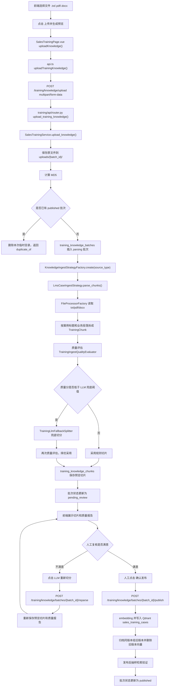
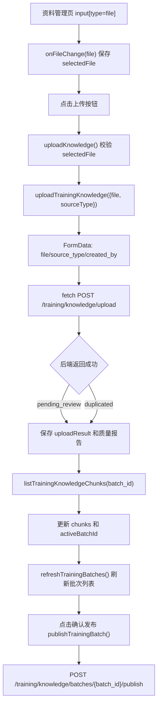
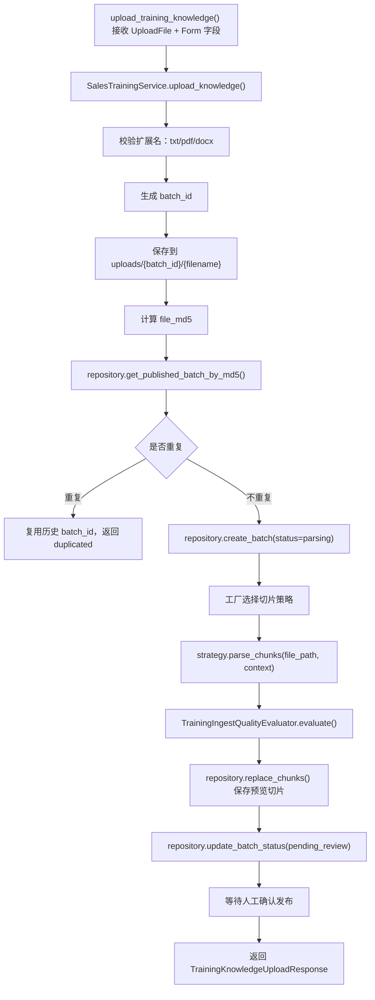
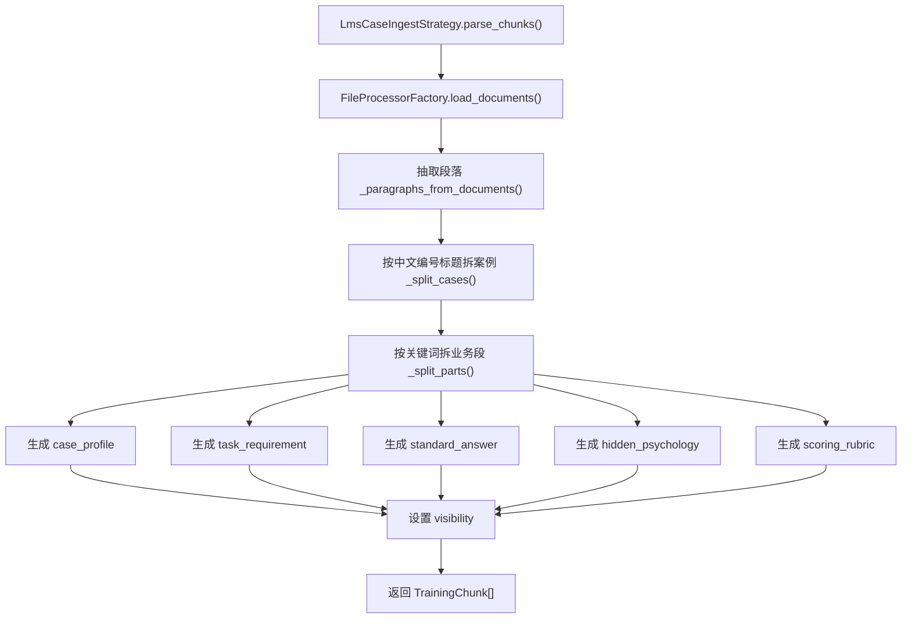
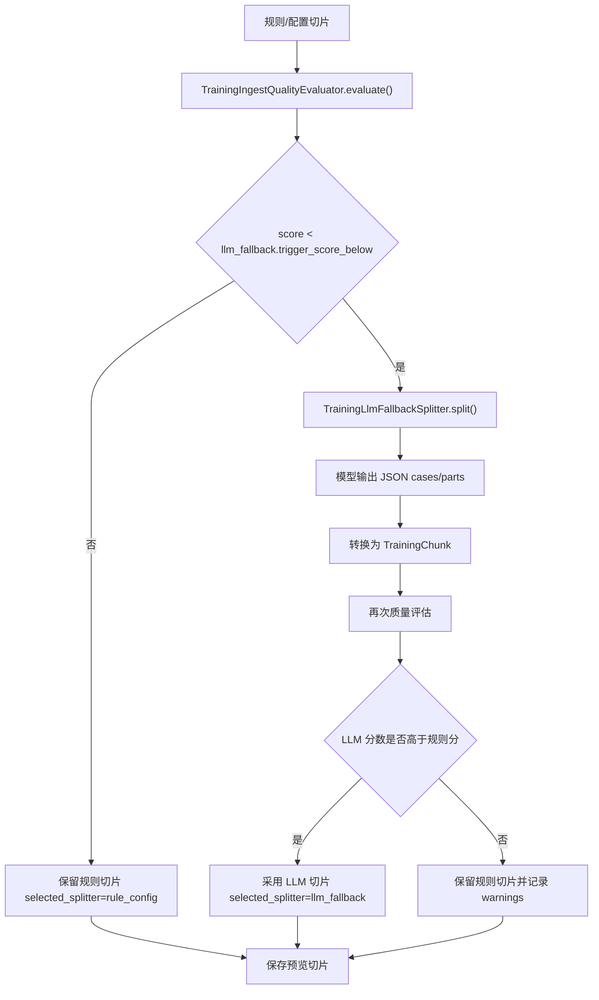
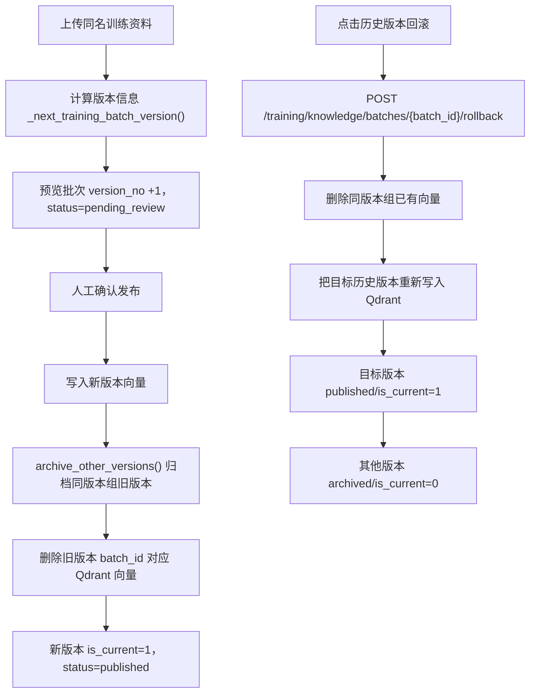
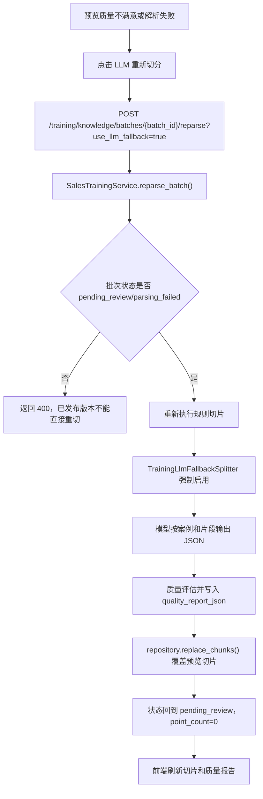
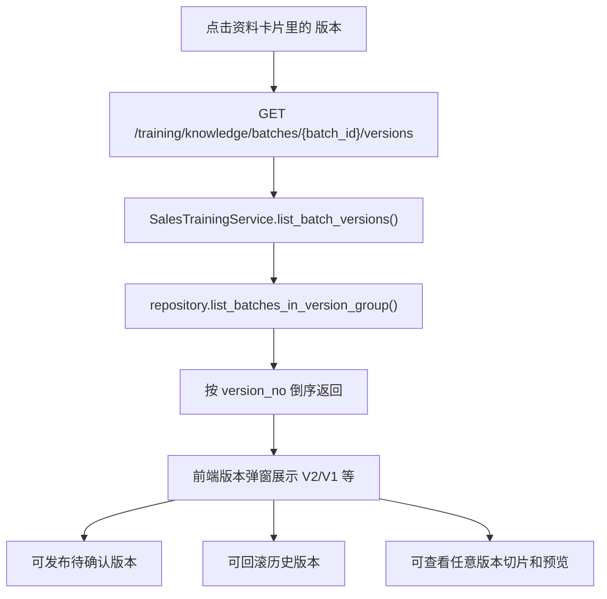
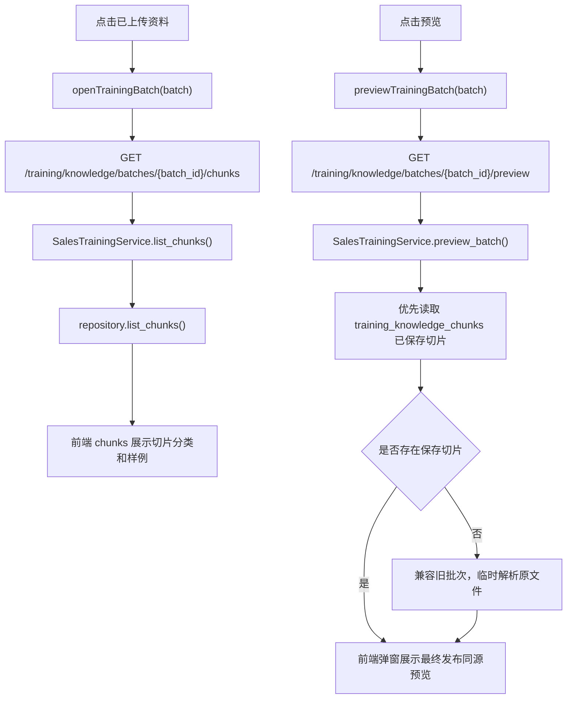
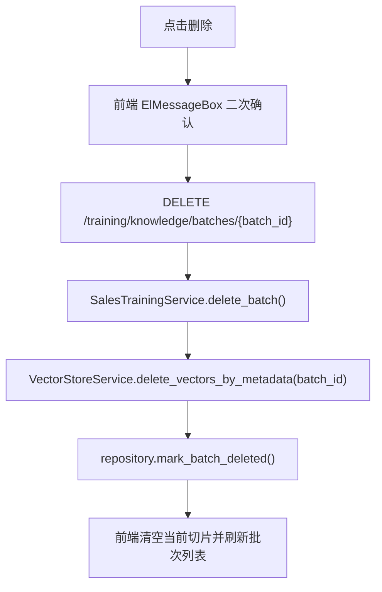

# 销售训练资料管理上传文件流程

本文只梳理销售训练页“资料管理”的上传、预览、切片查看和删除流程，方便按流程图定位代码。

销售训练资料使用独立接口和独立向量库：

| 项目 | 内容 |
| --- | --- |
| 前端页面 | `C:\Users\Administrator\WebstormProjects\AI_RAG_Agent_Frontend\src\pages\SalesTrainingPage.vue` |
| 前端 API | `C:\Users\Administrator\WebstormProjects\AI_RAG_Agent_Frontend\src\api.ts` |
| 后端路由 | `D:\d\PycharmProjects\AI_RAG_Agent_Project\training\api\router.py` |
| 后端服务 | `D:\d\PycharmProjects\AI_RAG_Agent_Project\training\services\sales_training_service.py` |
| 切片策略 | `D:\d\PycharmProjects\AI_RAG_Agent_Project\training\strategies\knowledge_ingest_strategy.py` |
| LLM 兜底切分 | `D:\d\PycharmProjects\AI_RAG_Agent_Project\training\llm_ingest.py` |
| 发布抽样验证 | `D:\d\PycharmProjects\AI_RAG_Agent_Project\training\publish_validation.py` |
| 策略工厂 | `D:\d\PycharmProjects\AI_RAG_Agent_Project\training\factories\knowledge_ingest_strategy_factory.py` |
| SQLite 仓储 | `D:\d\PycharmProjects\AI_RAG_Agent_Project\training\repository.py` |
| Qdrant collection | `sales_training_cases` |
| 切分和质量配置 | `D:\d\PycharmProjects\AI_RAG_Agent_Project\config\training_ingest.yml` |

## 1. 总流程图

## 2. 前端上传流程

### 前端代码定位

| 流程节点 | 代码位置 | 说明 |
| --- | --- | --- |
| 文件选择 | `SalesTrainingPage.vue` 模板中的 `input ref="uploadFileInput"` | 限制 `.docx,.pdf,.txt`，选择后进入 `onFileChange()` |
| 保存选中文件 | `SalesTrainingPage.vue::onFileChange()` | 将浏览器 `File` 保存到 `selectedFile` |
| 上传按钮 | `SalesTrainingPage.vue` 模板中的 `@click="uploadKnowledge"` | 用户点击后进入上传主流程 |
| 前端上传主流程 | `SalesTrainingPage.vue::uploadKnowledge()` | 校验文件、调用 API、刷新切片和批次列表 |
| 确认发布 | `SalesTrainingPage.vue::publishTrainingBatch()` | 人工确认后调用发布接口写入 Qdrant |
| LLM 重新切分 | `SalesTrainingPage.vue::reparseTrainingBatch()` | 预览质量不满意时，人工触发模型兜底切分 |
| 查看版本链 | `SalesTrainingPage.vue::openBatchVersions()` | 查询同一资料的历史版本，支持发布、回滚、查看切片 |
| 组装上传请求 | `api.ts::uploadTrainingKnowledge()` | 使用 `FormData` 发 `multipart/form-data` |
| 发布请求 | `api.ts::publishTrainingKnowledgeBatch()` | 调用 `/training/knowledge/batches/{batch_id}/publish` |
| 重切请求 | `api.ts::reparseTrainingKnowledgeBatch()` | 调用 `/training/knowledge/batches/{batch_id}/reparse` |
| 版本链请求 | `api.ts::listTrainingKnowledgeBatchVersions()` | 调用 `/training/knowledge/batches/{batch_id}/versions` |
| 查询切片 | `api.ts::listTrainingKnowledgeChunks()` | 上传成功后按 `batch_id` 拉取切片 |
| 查询批次 | `api.ts::listTrainingKnowledgeBatches()` | 刷新已上传资料列表 |
| 原文预览 | `api.ts::previewTrainingKnowledgeBatch()` | 读取服务端保存的原文件文本 |
| 删除资料 | `api.ts::deleteTrainingKnowledgeBatch()` | 删除 Qdrant 向量并软删除 SQLite 批次 |

## 3. 后端上传入库流程

### 后端代码定位

| 流程节点 | 代码位置 | 说明 |
| --- | --- | --- |
| 路由入口 | `training/api/router.py::upload_training_knowledge()` | 接收 `file`、`source_type`、`created_by` |
| 上传主流程 | `training/services/sales_training_service.py::upload_knowledge()` | 文件保存、去重、切片、质量评估、保存预览切片 |
| 确认发布 | `training/services/sales_training_service.py::publish_batch()` | 人工确认后写 Qdrant 并发布 |
| 人工重切 | `training/services/sales_training_service.py::reparse_batch()` | 对 `pending_review/parsing_failed` 批次重新切分，不写 Qdrant |
| 强制 LLM 重切 | `SalesTrainingService._force_llm_reparse_chunks()` | 人工触发时优先采用 LLM 结果，并记录规则分和 LLM 分 |
| 查询版本链 | `training/services/sales_training_service.py::list_batch_versions()` | 返回同版本组全部未删除批次 |
| 文件名清洗 | `SalesTrainingService._safe_filename()` | 防止路径穿越，保证空文件名有兜底名称 |
| 批次落库 | `training/repository.py::create_batch()` | 插入 `training_knowledge_batches` |
| MD5 去重 | `training/repository.py::get_published_batch_by_md5()` | 只复用 `status='published'` 的批次 |
| 策略选择 | `training/factories/knowledge_ingest_strategy_factory.py::create()` | `lms_case` 使用 LMS 策略，其他走通用策略 |
| LMS 切片 | `training/strategies/knowledge_ingest_strategy.py::LmsCaseIngestStrategy.parse_chunks()` | 按案例和业务段落拆分 |
| 通用切片 | `GenericTrainingIngestStrategy.parse_chunks()` | 未知来源类型整篇兜底为一个切片 |
| 质量评估 | `training/quality.py::TrainingIngestQualityEvaluator` | 计算质量分、等级和风险提示 |
| LLM 兜底切分 | `training/llm_ingest.py::TrainingLlmFallbackSplitter` | 规则切分质量低时才调用模型重新切分 |
| 写 Qdrant | `SalesTrainingService.publish_batch()` 中 `vector_store.add_documents()` | 写入 `sales_training_cases` |
| 发布验证 | `training/publish_validation.py::TrainingPublishValidator` | 发布后抽样回查 Qdrant，验证 batch_id 过滤能命中 |
| 版本回滚 | `training/services/sales_training_service.py::rollback_batch()` | 把历史版本重新写入 Qdrant 并设为当前版本 |
| 写切片明细 | `training/repository.py::replace_chunks()` | 保存预览切片到 `training_knowledge_chunks` |
| 更新状态 | `training/repository.py::update_batch_status()` | 预览成功为 `pending_review`，发布成功为 `published` |

## 4. LMS 案例切片流程

### 切片类型

| `case_part` | 中文含义 | visibility | 主要用途 |
| --- | --- | --- | --- |
| `case_profile` | 客户背景/案例信息 | `visible` | 生成 AI 客户背景 |
| `task_requirement` | 训练任务要求 | `visible` | 生成训练阶段和目标 |
| `standard_answer` | 标准话术/参考答案 | `visible` | 对话建议和评分参考 |
| `hidden_psychology` | 客户隐性心理/底层顾虑 | `hidden` | AI 客户追问和异议 |
| `scoring_rubric` | 命中点/扣分点/评分标准 | `scoring_only` | 训练结束评分 |

如果 LMS 文档没有识别出结构，策略会兜底生成一个 `case_profile` 切片。能生成预览，但质量分会降低，应该先检查源文件标题和段落结构再确认发布。

### 切分配置

LMS 标题关键词和可见性不再写死在代码里，配置位置：

`config/training_ingest.yml`

| 配置项 | 作用 |
| --- | --- |
| `lms_case.case_title_pattern` | 识别“一、二、三”这类案例标题 |
| `lms_case.part_markers` | 把段落归类为 `case_profile`、`task_requirement` 等片段 |
| `lms_case.part_visibility` | 配置不同片段的默认模型用途 |
| `quality.*` | 配置质量评估阈值、最长切片、必备片段 |
| `llm_fallback.*` | 配置低质量时是否调用 LLM 兜底切分、触发分数、最大输入字符数 |
| `publish_validation.*` | 配置发布后抽样检索验证的样本数、召回条数和命中率阈值 |

## 5. 质量门禁和 LLM 兜底

质量报告 `quality_report_json` 会记录：

| 字段 | 含义 |
| --- | --- |
| `score` | 最终采用切片的质量分 |
| `level` | `good/review/poor` |
| `selected_splitter` | `rule_config` 或 `llm_fallback` |
| `llm_fallback_attempted` | 是否尝试过 LLM 兜底 |
| `llm_fallback_used` | 最终是否采用 LLM 切片 |
| `rule_score` | 规则切片质量分 |
| `llm_score` | LLM 兜底切片质量分 |
| `metrics` | 切片数、案例数、缺失片段、最长切片等指标 |
| `warnings` | 风险提示 |

## 6. 结构化来源增强

第三阶段已经先落地轻量结构化 block，不改变上传接口：

| 文件类型 | 增强点 | 代码位置 |
| --- | --- | --- |
| DOCX | 段落 `block_index`、`block_type`、`heading_level`、`style` | `rag/file_processors/docx_processor.py` |
| PDF | 页码 `page_no`、书签标题 `outline_title`、页级 block | `rag/file_processors/pdf_processor.py` |
| LMS 切片 | 把 `start_block_index/end_block_index/page_numbers/heading_levels/outline_titles` 写入 `metadata_json` 和 Qdrant payload | `training/strategies/knowledge_ingest_strategy.py` |

这些 metadata 主要用于排查：某个切片来自原文哪一页、哪几个段落、哪个标题层级。当前还没有做完整的人工标注页面。

前端切片详情会展示这些字段：

| metadata 字段 | 前端展示 | 作用 |
| --- | --- | --- |
| `page_numbers` | 页码 | 定位 PDF 来源页 |
| `start_block_index/end_block_index` | 段落范围 | 定位 DOCX/PDF 抽取 block |
| `heading_levels` | 标题级别 | 判断是否来自标题或正文 |
| `outline_titles` | 目录 | 定位 PDF 书签或目录标题 |
| `splitter` | 切分方式 | 区分 `rule_config` 和 `llm_fallback` |

## 7. 入库后保存了什么

### SQLite: `training_knowledge_batches`

保存文件级信息：

| 字段 | 中文含义 |
| --- | --- |
| `batch_id` | 上传批次编号 |
| `source_type` | 来源类型，一期默认 `lms_case` |
| `source_file` | 原始文件名 |
| `file_path` | 服务端保存路径 |
| `file_md5` | 文件 MD5 |
| `version_group_id` | 版本组 ID，同一个 `source_type + source_file` 的多次发布归为一组 |
| `version_no` | 版本号，从 1 递增 |
| `previous_batch_id` | 上一个版本批次 ID |
| `is_current` | 是否为当前参与训练检索的版本 |
| `status` | 批次状态，枚举见下方“批次状态字典” |
| `chunk_count` | 切片数量 |
| `point_count` | Qdrant 向量点数量 |
| `error_message` | 失败原因 |
| `quality_report_json` | 切片质量报告 |

### 批次状态字典

字典编码：`training_batch_status`

| 状态值 | 中文名 | 存储位置 | 产生位置 | 说明 |
| --- | --- | --- | --- | --- |
| `parsing` | 解析中 | SQLite 批次状态 | `SalesTrainingService.upload_knowledge()` 创建批次时 | 文件已保存，正在解析和切片 |
| `pending_review` | 待确认 | SQLite 批次状态、上传响应状态 | 切片和质量评估完成后 | 等待人工确认发布 |
| `embedding` | 发布中 | SQLite 批次状态 | 点击确认发布后 | 正在生成向量并写入 Qdrant |
| `published` | 已发布 | SQLite 批次状态、发布响应状态 | 向量写入成功后 | 可以参与销售训练检索 |
| `archived` | 历史版本 | SQLite 批次状态 | 同版本组新版本发布或执行回滚时 | 不参与训练检索，但可以查看和回滚 |
| `parsing_failed` | 解析失败 | SQLite 批次状态 | 解析、切片或向量入库异常时 | 前端可查看 `error_message` 排查原因 |
| `deleted` | 已删除 | SQLite 批次状态、删除响应状态 | 删除资料批次时 | 软删除批次，并删除对应 Qdrant 向量点 |
| `duplicated` | 重复复用 | 上传响应状态 | MD5 命中已发布批次时 | 不创建新向量点，直接复用历史批次 |

### SQLite: `training_knowledge_chunks`

保存切片级信息：

| 字段 | 中文含义 |
| --- | --- |
| `chunk_id` | 切片编号 |
| `batch_id` | 所属批次 |
| `qdrant_point_id` | Qdrant 点编号，一期等于 `chunk_id` |
| `chunk_text` | 切片正文 |
| `case_part` | 业务片段类型 |
| `visibility` | 模型使用范围 |
| `metadata_json` | `case_title`、`case_index`、`source_file` 等 |

### Qdrant: `sales_training_cases`

保存向量和 payload。payload 关键字段：

| 字段 | 中文含义 |
| --- | --- |
| `batch_id` | 上传批次编号 |
| `chunk_id` | 切片编号 |
| `content_type` | 固定 `sales_training_case` |
| `source_type` | 来源类型 |
| `source_file` | 来源文件 |
| `file_md5` | 文件 MD5 |
| `version_group_id` | 版本组 ID |
| `version_no` | 版本号 |
| `is_current` | 是否当前版本 |
| `case_part` | 业务片段类型 |
| `visibility` | 模型使用范围 |
| `case_title` | LMS 案例标题 |
| `case_index` | LMS 案例序号 |

## 8. 发布、版本和回滚流程

训练检索 `_search_training_evidence()` 会先查询 `repository.list_current_published_batch_ids()`，再把这些 batch_id 作为 Qdrant metadata filter。这样历史版本即使 SQLite 仍保留，也不会参与当前训练召回。

### 8.1 人工重切流程

注意：

| 规则 | 原因 |
| --- | --- |
| 只允许 `pending_review/parsing_failed` 重切 | 避免已发布 Qdrant 向量和 SQLite 切片不一致 |
| 人工重切不会写 Qdrant | 仍需要用户确认发布 |
| 人工重切会记录 `manual_reparse=true` | 方便区分自动兜底和人工兜底 |
| LLM 兜底失败时保留规则切片 | 保证资料仍可预览和人工检查 |

### 8.2 版本链查看流程

版本链接口只读 SQLite，不访问 Qdrant。真正改变向量库的是“发布”和“回滚”接口。

## 9. 预览和切片查看流程

预览接口不会重新写入向量库。新批次优先展示已经保存的切片，保证“确认发布前看到的内容”和“最终写入 Qdrant 的内容”一致。

## 10. 删除流程

删除行为：

| 层级 | 动作 |
| --- | --- |
| Qdrant | 按 `metadata.batch_id` 删除向量点 |
| SQLite | `training_knowledge_batches.status` 标记为 `deleted` |
| 原文件 | 暂时保留在 `uploads/{batch_id}/`，方便审计和排查 |

## 11. 排查顺序

| 现象 | 优先看哪里 |
| --- | --- |
| 前端点上传没反应 | `SalesTrainingPage.vue::uploadKnowledge()` 和浏览器控制台 |
| 请求 400 文件类型不支持 | `SalesTrainingService.upload_knowledge()` 的扩展名校验 |
| 返回 duplicated | `training_knowledge_batches.file_md5` 已有 published 批次 |
| chunk_count 为 0 | `LmsCaseIngestStrategy.parse_chunks()` 和源文件结构 |
| 上传预览慢 | 看 `FileProcessorFactory` 读取文件、规则切片、质量评估和是否触发 LLM 兜底 |
| 确认发布慢 | `vector_store.add_documents()`，通常是 embedding 或 Qdrant 写入耗时 |
| 切片类型不对 | `config/training_ingest.yml` 的 `part_markers` 是否覆盖源文件标题 |
| 生成 AI 客户没引用资料 | 检查 Qdrant `sales_training_cases` 是否有点，以及 metadata 的 `visibility/case_part` |
| 旧资料仍被召回 | 检查 `is_current`、`archived` 状态，以及 `_search_training_evidence()` 是否带当前 batch_id filter |
| 删除后仍被召回 | 检查 `delete_vectors_by_metadata("batch_id", batch_id)` 是否成功 |
