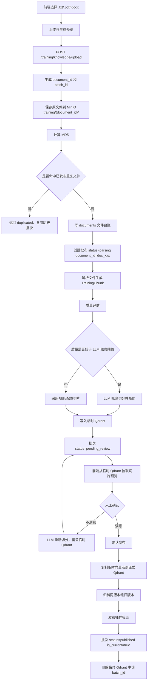
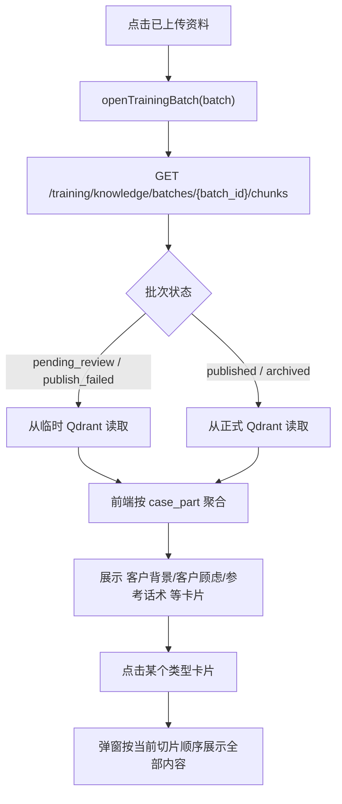
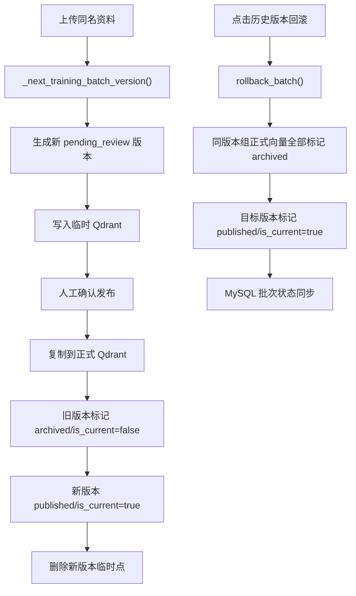

# 销售训练资料管理上传文件流程

本文说明销售训练页“资料管理”的当前上传、预览、切片查看、确认发布、版本回滚和删除流程。

当前关键变化：

- 上传文件后，切片正文写入临时 Qdrant collection `sales_training_cases_staging`，MySQL 不再保存新切片正文。
- 点击“确认发布到训练库”后，后端把临时向量点复制到正式 Qdrant collection `sales_training_cases`。
- 发布成功后，会删除临时 collection 中该 `batch_id` 对应的向量点。
- MySQL `documents` 统一保存文件名、路径、大小、MD5、collection 等文件基础信息。
- MySQL `training_knowledge_batches` 只保留上传批次、版本、状态、质量报告等销售训练业务元数据；不再创建或保留旧切片表，旧资料需要重新上传。
- 同一资料多次上传会形成版本链，当前版本才参与训练检索。

## 1. 代码位置

| 项目 | 内容 |
| --- | --- |
| 前端页面 | `C:\Users\Administrator\WebstormProjects\AI_RAG_Agent_Frontend\src\pages\SalesTrainingPage.vue` |
| 前端 API | `C:\Users\Administrator\WebstormProjects\AI_RAG_Agent_Frontend\src\api.ts` |
| 前端同名文档 | `C:\Users\Administrator\WebstormProjects\AI_RAG_Agent_Frontend\docs\销售训练资料管理上传文件流程.md` |
| 后端路由 | `D:\d\PycharmProjects\AI_RAG_Agent_Project\training\api\router.py` |
| 后端服务 | `D:\d\PycharmProjects\AI_RAG_Agent_Project\training\services\sales_training_service.py` |
| 向量库封装 | `D:\d\PycharmProjects\AI_RAG_Agent_Project\rag\vector_store.py` |
| 切片策略 | `D:\d\PycharmProjects\AI_RAG_Agent_Project\training\strategies\knowledge_ingest_strategy.py` |
| 质量评估 | `D:\d\PycharmProjects\AI_RAG_Agent_Project\training\quality.py` |
| LLM 兜底切分 | `D:\d\PycharmProjects\AI_RAG_Agent_Project\training\llm_ingest.py` |
| 发布抽样验证 | `D:\d\PycharmProjects\AI_RAG_Agent_Project\training\publish_validation.py` |
| MySQL 仓储 | `D:\d\PycharmProjects\AI_RAG_Agent_Project\training\repository.py` |
| 切分和 collection 配置 | `D:\d\PycharmProjects\AI_RAG_Agent_Project\config\training_ingest.yml` |

## 2. Collection 配置

配置来自 `config/training_ingest.yml`：

| 配置项 | 默认值 | 用途 |
| --- | --- | --- |
| `collections.published` | `sales_training_cases` | 正式训练资料库，只有发布成功的数据参与训练检索 |
| `collections.staging` | `sales_training_cases_staging` | 临时待审核库，上传和重新切分后的切片先写这里 |

## 3. 总流程

## 4. 前端流程

| 流程节点 | 代码位置 | 说明 |
| --- | --- | --- |
| 文件选择 | `SalesTrainingPage.vue` 模板中的 `input ref="uploadFileInput"` | 限制 `.docx,.pdf,.txt` |
| 上传主流程 | `SalesTrainingPage.vue::uploadKnowledge()` | 上传文件、拉取切片、刷新批次列表 |
| API 上传 | `api.ts::uploadTrainingKnowledge()` | 用 `FormData` 请求 `/training/knowledge/upload` |
| 查询切片 | `api.ts::listTrainingKnowledgeChunks()` | 后端按状态从临时库或正式库读取切片 |
| 点击批次 | `SalesTrainingPage.vue::openTrainingBatch()` | 切换左侧资料并刷新右侧切片概览 |
| 切片详情 | `SalesTrainingPage.vue::openChunkSummaryDetail()` | 点击切片类型卡片后，按顺序展示全部切片 |
| 原文预览 | `SalesTrainingPage.vue::previewTrainingBatch()` | 优先展示向量库中的切片预览，兜底读取原文件 |
| 确认发布 | `SalesTrainingPage.vue::publishTrainingBatch()` | 人工确认后发布到正式训练向量库 |
| LLM 重切 | `SalesTrainingPage.vue::reparseTrainingBatch()` | 对未发布批次重新切分，并覆盖临时向量库 |
| 版本链 | `SalesTrainingPage.vue::openBatchVersions()` | 查看同一资料历史版本 |
| 回滚版本 | `SalesTrainingPage.vue::rollbackTrainingBatch()` | 将历史版本重新设为当前版本 |
| 删除资料 | `SalesTrainingPage.vue::deleteTrainingBatch()` | 删除正式库和临时库向量，并软删除 MySQL 批次 |

## 5. 后端流程

| 流程节点 | 代码位置 | 说明 |
| --- | --- | --- |
| 上传路由 | `training/api/router.py::upload_training_knowledge()` | 接收 `file/source_type/model_mode/created_by` |
| 上传服务 | `SalesTrainingService.upload_knowledge()` | 保存文件、去重、切片、质量评估、写临时向量库 |
| 临时写入 | `SalesTrainingService._write_staging_chunks()` | 先按 `batch_id` 清理旧临时点，再写入新切片 |
| 查询待审核切片 | `SalesTrainingService._list_staging_chunk_rows()` | 从 `sales_training_cases_staging` 按 `batch_id` 读取 |
| 确认发布 | `SalesTrainingService.publish_batch()` | 从临时库复制到正式库，发布成功后清临时点 |
| 正式复制 | `SalesTrainingService._publish_staging_vectors()` | 保留已有向量，不重新调用 embedding |
| 发布验证 | `TrainingPublishValidator.validate()` | 发布后按 `batch_id` 抽样回查正式库 |
| 版本归档 | `SalesTrainingService._archive_previous_training_versions()` | 旧版本状态改为 `archived/is_current=false`，向量保留 |
| 版本回滚 | `SalesTrainingService.rollback_batch()` | 标记目标批次向量为 `published/is_current=true` |
| 重新切分 | `SalesTrainingService.reparse_batch()` | 只允许未发布或失败批次，重新写临时库 |
| 删除批次 | `SalesTrainingService.delete_batch()` | 同时清理正式库和临时库的 `batch_id` 向量点 |

## 6. 切片查看流程

切片概览只展示每种类型的第一条样例，避免列表过长。点击类型卡片后，弹窗展示同类型全部切片。

## 7. 批次状态

| 状态值 | 中文含义 | 数据位置 | 说明 |
| --- | --- | --- | --- |
| `parsing` | 解析中 | 原文件 + MySQL 批次 | 文件已保存，正在切片 |
| `pending_review` | 待确认 | 临时 Qdrant | 已生成待审核切片，等待人工发布 |
| `embedding` | 发布中 | 临时 Qdrant -> 正式 Qdrant | 正在复制临时向量点到正式库 |
| `published` | 已发布 | 正式 Qdrant | 当前或历史发布版本 |
| `archived` | 历史版本 | 正式 Qdrant | 被新版本替代，不参与当前检索，但可回滚 |
| `parsing_failed` | 解析失败 | 原文件 + MySQL 批次 | 可查看错误或重新切分 |
| `publish_failed` | 发布失败 | 临时 Qdrant | 可重试发布，或重新切分 |
| `deleted` | 已删除 | MySQL 软删除 | 正式库和临时库向量已删除 |
| `duplicated` | 重复复用 | 复用已有正式库数据 | 上传响应状态，不是批次表持久状态 |

## 8. 数据保存

### MySQL: `documents`

| 字段 | 含义 |
| --- | --- |
| `document_id` | 文件唯一编号 |
| `filename` | 原始文件名 |
| `file_path` | MinIO 存储 URI |
| `storage_type` | 文件存储类型，当前为 `minio` |
| `bucket_name` | MinIO 桶名 |
| `object_name` | MinIO 对象路径 |
| `public_url` | 文件公共访问地址 |
| `file_type` | 文件扩展名 |
| `file_md5` | 文件 MD5，用于去重 |
| `file_size` | 文件大小 |
| `collection_name` | 销售训练正式向量库，例如 `sales_training_cases` |
| `status` | 文件台账状态，例如 `indexing/indexed/failed/deleted` |

### MySQL: `training_knowledge_batches`

| 字段 | 含义 |
| --- | --- |
| `batch_id` | 上传批次编号 |
| `document_id` | 关联 `documents.document_id` |
| `source_type` | 来源类型，例如 `lms_case` |
| `source_file` | 历史兼容文件名，新数据优先读取 `documents.filename` |
| `file_path` | 历史兼容字段，新流程不再写入批次表 |
| `file_md5` | 历史兼容 MD5，新数据优先读取 `documents.file_md5` |
| `version_group_id` | 版本组 ID |
| `version_no` | 版本号 |
| `previous_batch_id` | 上一版本批次 |
| `is_current` | 是否当前参与训练检索 |
| `status` | 批次状态 |
| `chunk_count` | 切片数量 |
| `point_count` | 当前阶段的 Qdrant 向量点数量 |
| `quality_report_json` | 切片质量报告、发布验证结果 |

### 已取消：关系型切片正文表

当前链路不再使用 MySQL 保存训练切片正文，启动初始化会自动清理旧切片表。
旧表数据不再做兼容回滚或迁移兜底；如果需要恢复旧资料，请重新上传文件并人工确认发布。

### Qdrant: `sales_training_cases_staging`

上传和重新切分后写入。payload 关键字段：

| 字段 | 含义 |
| --- | --- |
| `batch_id` | 批次编号 |
| `document_id` | 文件编号 |
| `chunk_id` | 切片编号 |
| `status` | `pending_review` |
| `is_current` | `false` |
| `content_type` | 固定 `sales_training_case` |
| `source_type` | 来源类型 |
| `source_file` | 来源文件 |
| `file_md5` | 文件 MD5 |
| `version_group_id` | 版本组 |
| `version_no` | 版本号 |
| `case_part` | 切片类型 |
| `visibility` | 模型可见范围 |
| `case_title` | LMS 案例标题 |
| `case_index` | LMS 案例序号 |

### Qdrant: `sales_training_cases`

确认发布后写入。payload 与临时库基本一致，但会更新：

| 字段 | 发布后值 |
| --- | --- |
| `status` | `published` |
| `is_current` | `true` |
| `published_at` | 发布时间 |

同版本组旧版本不会删除向量，只会更新为：

| 字段 | 归档后值 |
| --- | --- |
| `status` | `archived` |
| `is_current` | `false` |

## 9. 版本和回滚

训练检索仍然以 MySQL 当前发布批次为入口，只过滤 `status=published` 且 `is_current=true` 的批次 ID。历史版本向量虽然保留，但不会参与当前训练召回。

## 10. 排查顺序

| 现象 | 优先看哪里 |
| --- | --- |
| 上传按钮没反应 | 浏览器控制台、`SalesTrainingPage.vue::uploadKnowledge()` |
| 文件类型 400 | `SalesTrainingService.upload_knowledge()` 扩展名校验 |
| 返回 duplicated | 已有相同 MD5 的 `published` 批次 |
| 切片数量为 0 | `LmsCaseIngestStrategy.parse_chunks()` 和源文件结构 |
| 质量分低 | `quality_report_json` 的 `warnings/metrics` |
| 上传预览慢 | 文件解析、规则切片、是否触发 LLM 兜底、临时库 embedding |
| 发布失败 | 查看 `publish_failed` 错误，检查临时库是否有该 `batch_id` |
| 发布慢 | 临时库复制到正式库、发布抽样验证 |
| 切片类型不对 | `config/training_ingest.yml` 的 `part_markers` |
| 想看全部客户顾虑 | 点击右侧“客户顾虑”卡片或“x 条分片” |
| 生成 AI 客户没有引用资料 | 检查是否已发布，以及正式库是否有当前版本向量 |
| 删除后仍被召回 | 检查正式库和临时库是否都按 `batch_id` 删除成功 |
