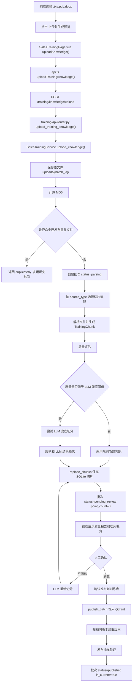
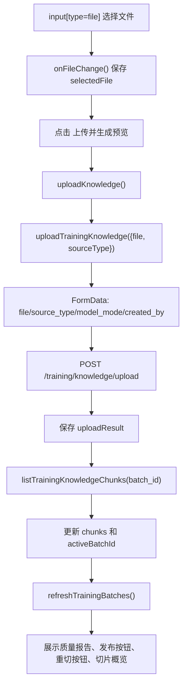
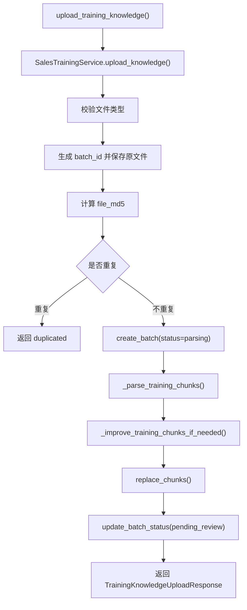
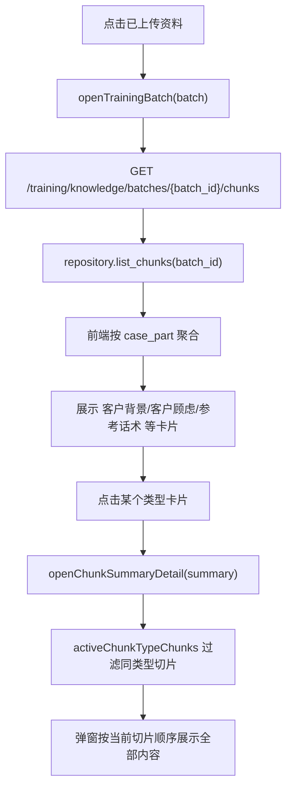
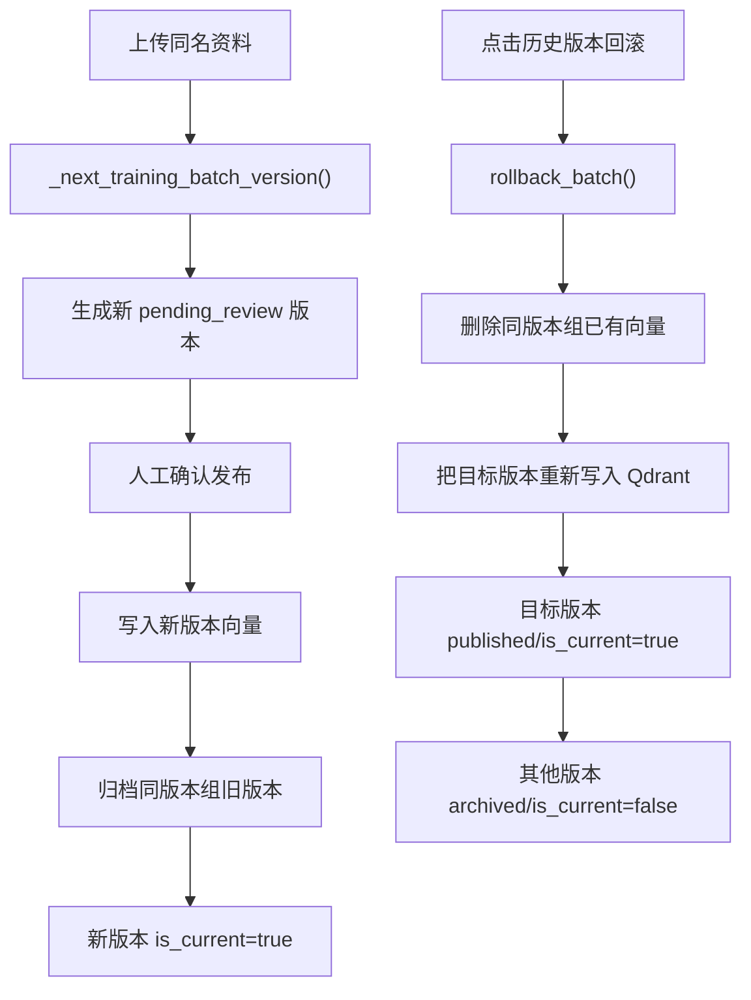

# 销售训练资料管理上传文件流程

本文说明销售训练页“资料管理”的当前上传、预览、切片查看、确认发布、版本回滚和删除流程。

当前关键变化：

- 上传文件后只生成 SQLite 预览切片和质量报告，状态为 `pending_review`。
- 点击“确认发布到训练库”后，才生成 embedding 并写入 Qdrant `sales_training_cases`。
- 切片概览卡片可点击，例如“客户背景”“客户顾虑”，弹窗会按顺序展示该类型下全部切片。
- 同一资料多次上传会形成版本链，当前版本才参与训练检索。

## 1. 代码位置

| 项目 | 内容 |
| --- | --- |
| 前端页面 | `C:\Users\Administrator\WebstormProjects\AI_RAG_Agent_Frontend\src\pages\SalesTrainingPage.vue` |
| 前端 API | `C:\Users\Administrator\WebstormProjects\AI_RAG_Agent_Frontend\src\api.ts` |
| 前端同名文档 | `C:\Users\Administrator\WebstormProjects\AI_RAG_Agent_Frontend\docs\销售训练资料管理上传文件流程.md` |
| 后端路由 | `D:\d\PycharmProjects\AI_RAG_Agent_Project\training\api\router.py` |
| 后端服务 | `D:\d\PycharmProjects\AI_RAG_Agent_Project\training\services\sales_training_service.py` |
| 切片策略 | `D:\d\PycharmProjects\AI_RAG_Agent_Project\training\strategies\knowledge_ingest_strategy.py` |
| 策略工厂 | `D:\d\PycharmProjects\AI_RAG_Agent_Project\training\factories\knowledge_ingest_strategy_factory.py` |
| 质量评估 | `D:\d\PycharmProjects\AI_RAG_Agent_Project\training\quality.py` |
| LLM 兜底切分 | `D:\d\PycharmProjects\AI_RAG_Agent_Project\training\llm_ingest.py` |
| 发布抽样验证 | `D:\d\PycharmProjects\AI_RAG_Agent_Project\training\publish_validation.py` |
| SQLite 仓储 | `D:\d\PycharmProjects\AI_RAG_Agent_Project\training\repository.py` |
| 切分配置 | `D:\d\PycharmProjects\AI_RAG_Agent_Project\config\training_ingest.yml` |
| Qdrant collection | `sales_training_cases` |

## 1.1 模型档位

销售训练页的模型档位由前端动态传给后端，默认值是 `high`。

| 档位 | 当前模型 | 主要用途 |
| --- | --- | --- |
| `high` | `deepseek-v4-flash` | 默认高质量生成 |
| `medium` | `qwen3.6-flash` | 平衡质量和速度 |
| `low` | `qwen-turbo` | 低延迟场景 |

该档位会影响补充问答题生成、场景润色、AI 客户生成、训练目标生成、开场白、每轮 AI 客户回复、最终评分，以及资料低质量时的 LLM 兜底切分和人工重新切分。

## 2. 总流程

## 3. 前端流程

| 流程节点 | 代码位置 | 说明 |
| --- | --- | --- |
| 文件选择 | `SalesTrainingPage.vue` 模板中的 `input ref="uploadFileInput"` | 限制 `.docx,.pdf,.txt` |
| 保存选中文件 | `SalesTrainingPage.vue::onFileChange()` | 保存浏览器 `File` 对象 |
| 上传主流程 | `SalesTrainingPage.vue::uploadKnowledge()` | 上传文件、拉取切片、刷新批次列表 |
| API 上传 | `api.ts::uploadTrainingKnowledge()` | 用 `FormData` 请求 `/training/knowledge/upload` |
| 查询切片 | `api.ts::listTrainingKnowledgeChunks()` | 按 `batch_id` 拉取 SQLite 切片 |
| 点击批次 | `SalesTrainingPage.vue::openTrainingBatch()` | 切换左侧资料并刷新右侧切片概览 |
| 切片详情 | `SalesTrainingPage.vue::openChunkSummaryDetail()` | 点击切片类型卡片后，按顺序展示全部切片 |
| 原文预览 | `SalesTrainingPage.vue::previewTrainingBatch()` | 读取保存的原文件或已保存切片预览 |
| 确认发布 | `SalesTrainingPage.vue::publishTrainingBatch()` | 人工确认后写入 Qdrant |
| LLM 重切 | `SalesTrainingPage.vue::reparseTrainingBatch()` | 对未发布批次重新切分 |
| 版本链 | `SalesTrainingPage.vue::openBatchVersions()` | 查看同一资料历史版本 |
| 回滚版本 | `SalesTrainingPage.vue::rollbackTrainingBatch()` | 将历史版本重新设为当前版本 |
| 删除资料 | `SalesTrainingPage.vue::deleteTrainingBatch()` | 删除 Qdrant 向量并软删除 SQLite 批次 |

## 4. 后端流程

| 流程节点 | 代码位置 | 说明 |
| --- | --- | --- |
| 上传路由 | `training/api/router.py::upload_training_knowledge()` | 接收 `file/source_type/model_mode/created_by` |
| 上传服务 | `SalesTrainingService.upload_knowledge()` | 保存文件、去重、切片、质量评估、保存预览 |
| 文件名清洗 | `SalesTrainingService._safe_filename()` | 防路径穿越 |
| MD5 去重 | `training/repository.py::get_published_batch_by_md5()` | 只复用已发布批次 |
| 版本号计算 | `SalesTrainingService._next_training_batch_version()` | 同一 `source_type + source_file` 形成版本链 |
| 策略选择 | `KnowledgeIngestStrategyFactory.create()` | `lms_case` 走 LMS 策略，其他走通用策略 |
| LMS 切片 | `LmsCaseIngestStrategy.parse_chunks()` | 按案例标题和业务段落拆分 |
| 质量评估 | `TrainingIngestQualityEvaluator.evaluate()` | 生成质量分和风险提示 |
| LLM 兜底 | `TrainingLlmFallbackSplitter` | 质量低时才尝试模型切分 |
| 保存切片 | `training/repository.py::replace_chunks()` | 覆盖当前批次 SQLite 切片 |
| 确认发布 | `SalesTrainingService.publish_batch()` | 写入 Qdrant 并更新为 `published` |
| 发布验证 | `TrainingPublishValidator.validate()` | 发布后按 batch_id 抽样回查 |
| 版本回滚 | `SalesTrainingService.rollback_batch()` | 删除同版本组向量并重写目标版本 |
| 重新切分 | `SalesTrainingService.reparse_batch()` | 只允许 `pending_review/parsing_failed` |

## 5. 切片查看流程

切片概览只展示每种类型的第一条样例，避免列表过长。点击类型卡片后，弹窗展示同类型全部切片：

| 展示项 | 来源 |
| --- | --- |
| 第几条 | 当前类型过滤后的顺序 |
| 用途 | `visibility` 转中文，例如通用知识、客户内部顾虑、评分专用 |
| 来源 | `metadata.source_file` |
| 标题 | `metadata.section_title` |
| 正文 | `chunk_text` |
| 切片编号 | `chunk_id` |
| 类型编码 | `case_part` |

## 6. 切片类型

| `case_part` | 中文含义 | 默认用途 |
| --- | --- | --- |
| `case_profile` | 客户背景/案例信息 | 生成 AI 客户背景 |
| `task_requirement` | 训练任务要求 | 生成训练阶段和目标 |
| `standard_answer` | 标准话术/参考答案 | 对话建议和评分参考 |
| `hidden_psychology` | 客户隐性心理/底层顾虑 | AI 客户追问和异议 |
| `scoring_rubric` | 命中点/扣分点/评分标准 | 训练结束评分 |
| `product_fact` | 产品事实 | 角色和回复事实依据 |
| `faq` | 常见问答 | 角色和回复事实依据 |
| `competitor` | 竞品信息 | 异议和对比场景 |
| `success_case` | 成功案例 | 话术和价值证明 |
| `glossary` | 术语说明 | 概念解释 |

切片类型、关键词和可见性主要来自：

`config/training_ingest.yml`

## 7. 批次状态

| 状态值 | 中文含义 | 是否写入 Qdrant | 说明 |
| --- | --- | --- | --- |
| `parsing` | 解析中 | 否 | 文件已保存，正在切片 |
| `pending_review` | 待确认 | 否 | 已生成预览切片，等待人工发布 |
| `embedding` | 发布中 | 正在写入 | 正在生成 embedding 并写 Qdrant |
| `published` | 已发布 | 是 | 当前或历史发布版本 |
| `archived` | 历史版本 | 否 | 被新版本替代，不参与当前检索 |
| `parsing_failed` | 解析失败 | 否 | 可查看错误或重新切分 |
| `deleted` | 已删除 | 否 | SQLite 软删除，Qdrant 向量已删除 |
| `duplicated` | 重复复用 | 复用已有 | 上传响应状态，不是批次表持久状态 |

## 8. 数据保存

### SQLite: `training_knowledge_batches`

| 字段 | 含义 |
| --- | --- |
| `batch_id` | 上传批次编号 |
| `source_type` | 来源类型，例如 `lms_case` |
| `source_file` | 原始文件名 |
| `file_path` | 服务端保存路径 |
| `file_md5` | 文件 MD5 |
| `version_group_id` | 版本组 ID |
| `version_no` | 版本号 |
| `previous_batch_id` | 上一版本批次 |
| `is_current` | 是否当前参与训练检索 |
| `status` | 批次状态 |
| `chunk_count` | 切片数量 |
| `point_count` | Qdrant 向量点数量 |
| `quality_report_json` | 切片质量报告、发布验证结果 |

### SQLite: `training_knowledge_chunks`

| 字段 | 含义 |
| --- | --- |
| `chunk_id` | 切片编号 |
| `batch_id` | 所属批次 |
| `qdrant_point_id` | Qdrant 点编号 |
| `chunk_text` | 切片正文 |
| `case_part` | 业务片段类型 |
| `visibility` | 模型可见范围 |
| `metadata_json` | 来源文件、标题、页码、段落范围等 |

### Qdrant: `sales_training_cases`

确认发布后才写入。payload 关键字段：

| 字段 | 含义 |
| --- | --- |
| `batch_id` | 批次编号 |
| `chunk_id` | 切片编号 |
| `content_type` | 固定 `sales_training_case` |
| `source_type` | 来源类型 |
| `source_file` | 来源文件 |
| `file_md5` | 文件 MD5 |
| `version_group_id` | 版本组 |
| `version_no` | 版本号 |
| `is_current` | 是否当前版本 |
| `case_part` | 切片类型 |
| `visibility` | 模型可见范围 |
| `case_title` | LMS 案例标题 |
| `case_index` | LMS 案例序号 |

## 9. 版本和回滚

训练检索会过滤当前已发布版本，历史版本不会参与当前训练召回。

## 10. 排查顺序

| 现象 | 优先看哪里 |
| --- | --- |
| 上传按钮没反应 | 浏览器控制台、`SalesTrainingPage.vue::uploadKnowledge()` |
| 文件类型 400 | `SalesTrainingService.upload_knowledge()` 扩展名校验 |
| 返回 duplicated | 已有相同 MD5 的 `published` 批次 |
| 切片数量为 0 | `LmsCaseIngestStrategy.parse_chunks()` 和源文件结构 |
| 质量分低 | `quality_report_json` 的 `warnings/metrics` |
| 上传预览慢 | 文件解析、规则切片、是否触发 LLM 兜底 |
| 发布慢 | embedding 和 Qdrant 写入 |
| 切片类型不对 | `config/training_ingest.yml` 的 `part_markers` |
| 想看全部客户顾虑 | 点击右侧“客户顾虑”卡片或“x 条分片” |
| 生成 AI 客户没有引用资料 | 检查是否已发布，以及 Qdrant 是否有当前版本向量 |
| 删除后仍被召回 | 检查 Qdrant 是否按 `batch_id` 删除成功 |
