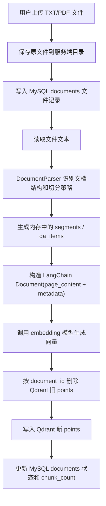
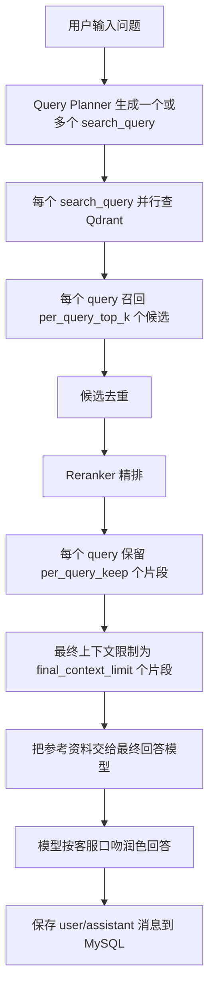

# 数据库设计

本文档整理当前项目的数据存储设计，包含 MySQL 业务数据库、Qdrant 向量库、两者职责边界、核心字段中文注释、入库流程和检索流程。

## 1. 总体设计原则

当前项目采用“关系型数据库 + 向量数据库”的组合设计：

| 存储组件 | 当前实现 | 核心职责 | 不负责的内容 |
| --- | --- | --- | --- |
| 关系型数据库 | MySQL，默认库名 `ai_rag_agent` | 保存业务状态、文件元数据、会话历史、系统字典、考试记录 | 不保存知识正文作为问答检索来源 |
| 向量数据库 | Qdrant，默认 collection 为 `agent` | 保存知识分片、embedding 向量、检索 metadata | 不保存会话状态、用户操作流水、业务字典 |

设计重点：

1. 知识问答主链路只依赖 Qdrant 召回，不再使用 MySQL 对 FAQ 或知识正文做 `LIKE` 查询。
2. MySQL 只保存“可管理、可追踪、可展示”的业务数据，例如文件上传状态、会话记录、考试记录。
3. Qdrant 保存“可语义检索”的知识内容，也就是文本分片、向量和用于筛选/展示的 metadata。
4. 文件重新入库时，先按 `document_id` 删除 Qdrant 旧向量，再写入新向量，避免同一文件多版本混在一起。

## 2. MySQL 数据库

### 2.1 基本信息

| 配置项 | 说明 |
| --- | --- |
| 数据库类型 | MySQL |
| 默认库名 | `ai_rag_agent` |
| 初始化入口 | `docs/mysql初始化建表和基础数据.sql` |
| 连接方式 | 通过 `infrastructure.orm_session.orm_session_context()` 获取 SQLAlchemy ORM Session |
| 时间格式 | `DATETIME`，由 ORM 实体字段和统一时间 helper 写入 |

### 2.2 表总览

| 表名 | 中文名 | 作用 |
| --- | --- | --- |
| `documents` | 知识文件表 | 保存上传文件、索引状态、文件版本、Qdrant collection 等元数据 |
| `conversations` | 会话主表 | 保存一次聊天会话的基本信息和统计状态 |
| `conversation_messages` | 会话消息表 | 保存用户和助手的每轮消息正文、模型信息、耗时 metadata |
| `dictionary_items` | 系统字典表 | 保存状态码、模式选项、文件类型、前端下拉选项等可配置枚举 |
| `exam_sessions` | 考试会话表 | 保存知识掌握度测试的一场考试或练习会话 |
| `exam_questions` | 考试题目表 | 保存考试会话中的每一道题、用户答案、评分和解析 |

### 2.3 `documents` 知识文件表

表含义：  
用于管理上传到知识库的原始文件。这个表只保存文件级元数据和索引状态，不保存文件正文，也不保存问答内容。真正参与 RAG 检索的内容在 Qdrant 中。

| 字段名 | 类型 | 是否必填 | 中文注释 |
| --- | --- | --- | --- |
| `document_id` | `TEXT` | 是，主键 | 文件业务编号。上传文件时生成，Qdrant metadata 也会保存同一个值，用于删除、重建、预览和追踪来源。 |
| `filename` | `TEXT` | 是 | 原始文件名。前端知识库列表展示使用，也会写入 Qdrant metadata 的 `source_file`。 |
| `file_path` | `TEXT` | 是 | MinIO 存储 URI，格式为 `minio://桶名/对象路径`。预览和重建索引会根据 `bucket_name/object_name` 临时下载原文件。 |
| `storage_type` | `TEXT` | 是 | 文件存储类型。当前统一为 `minio`，用于识别历史脏数据和后续扩展对象存储。 |
| `bucket_name` | `TEXT` | 否 | MinIO 桶名。 |
| `object_name` | `TEXT` | 否 | MinIO 对象路径，是删除、预览、重建索引时定位原文件的核心字段。 |
| `public_url` | `TEXT` | 否 | MinIO 公共访问地址。 |
| `file_type` | `TEXT` | 是 | 文件后缀或类型，例如 `txt`、`pdf`。用于判断加载器和预览方式。 |
| `file_md5` | `TEXT` | 是 | 文件内容 MD5。用于判断重复文件，也用于 Qdrant metadata 追踪同一内容版本。 |
| `file_size` | `INTEGER` | 是 | 文件大小，单位通常是字节。用于前端展示和上传记录审计。 |
| `status` | `TEXT` | 是 | 文件索引状态，例如 `uploaded`、`indexing`、`indexed`、`failed`、`deleted`。 |
| `version` | `INTEGER` | 是 | 文件索引版本号，默认 `1`。重建索引时可递增，用于区分 Qdrant 中新旧 payload。 |
| `chunk_count` | `INTEGER` | 是 | 当前文件成功写入 Qdrant 的分片数量。用于判断入库是否成功以及估算检索覆盖。 |
| `collection_name` | `TEXT` | 是 | 文件写入的 Qdrant collection，默认 `agent`。支持后续多知识库 collection 扩展。 |
| `document_type` | `TEXT` | 是 | 文档结构类型，例如普通文本、问答型、编号型。由上传预览/确认流程决定。 |
| `split_strategy` | `TEXT` | 是 | 分片策略，例如递归切分、编号问答切分、目录问答切分。决定入库时如何生成 Qdrant 分片。 |
| `created_at` | `TEXT` | 是 | 文件记录创建时间。 |
| `updated_at` | `TEXT` | 是 | 文件记录最后更新时间。上传、索引、失败、删除都会更新。 |
| `error_message` | `TEXT` | 否 | 入库失败时保存错误信息。正常索引成功时为空。 |

索引说明：

| 索引名 | 字段 | 作用 |
| --- | --- | --- |
| `idx_documents_file_md5` | `file_md5` | 加快重复文件判断。 |
| `idx_documents_collection` | `collection_name` | 加快按 Qdrant collection 查询文件列表。 |

状态说明：

| 状态值 | 中文含义 | 说明 |
| --- | --- | --- |
| `uploaded` | 已上传 | 文件已保存，但还没有完成向量化入库。 |
| `indexing` | 入库中 | 正在解析、分片、embedding、写入 Qdrant。 |
| `indexed` | 已索引 | 已成功写入 Qdrant，可以参与问答检索。 |
| `failed` | 入库失败 | 解析、分片、embedding 或写入 Qdrant 过程中失败。 |
| `deleted` | 已删除 | 文件被标记删除，正常不再作为有效知识文件展示。 |

### 2.4 `conversations` 会话主表

表含义：  
保存一次聊天会话的主记录。它相当于聊天列表中的一行，用来支持“继续聊天”“删除会话”“查看历史记录”等功能。

| 字段名 | 类型 | 是否必填 | 中文注释 |
| --- | --- | --- | --- |
| `conversation_id` | `TEXT` | 是，主键 | 会话编号。前端继续聊天时带回该编号，后端按该编号读取历史上下文。 |
| `user_id` | `TEXT` | 否 | 用户编号。当前可为空，后续接入登录体系后可用于隔离不同用户的会话。 |
| `title` | `TEXT` | 否 | 会话标题。通常取首条问题或前端传入标题，用于聊天记录列表展示。 |
| `status` | `TEXT` | 是 | 会话状态，默认 `active`。删除时改为 `deleted`。 |
| `message_count` | `INTEGER` | 是 | 当前会话下的消息数量。新增消息时递增，删除会话时清零。 |
| `summary` | `TEXT` | 否 | 会话摘要。当前预留字段，可用于长对话压缩上下文。 |
| `metadata_json` | `TEXT` | 否 | 会话扩展信息 JSON，例如前端来源、默认 collection、业务标签等。 |
| `created_at` | `TEXT` | 是 | 会话创建时间。 |
| `updated_at` | `TEXT` | 是 | 会话最后更新时间。 |
| `last_message_at` | `TEXT` | 否 | 最后一条消息时间。聊天记录排序优先使用该字段。 |

索引说明：

| 索引名 | 字段 | 作用 |
| --- | --- | --- |
| `idx_conversations_user_updated` | `user_id, updated_at` | 加快按用户查询最近会话。 |
| `idx_conversations_status` | `status` | 加快过滤已删除会话。 |

### 2.5 `conversation_messages` 会话消息表

表含义：  
保存会话中的每一条消息，包括用户问题、助手回答、模型名称、token 统计和耗时信息。RAG 检索不从这个表召回知识，但聊天上下文会从这里读取最近消息。

| 字段名 | 类型 | 是否必填 | 中文注释 |
| --- | --- | --- | --- |
| `message_id` | `TEXT` | 是，主键 | 消息编号。每条消息唯一。 |
| `conversation_id` | `TEXT` | 是，外键 | 所属会话编号，关联 `conversations.conversation_id`。 |
| `sequence_no` | `INTEGER` | 是 | 会话内消息顺序号，从 1 递增。用于按真实对话顺序展示历史。 |
| `role` | `TEXT` | 是 | 消息角色，例如 `user`、`assistant`、`system`。 |
| `content` | `TEXT` | 是 | 消息正文。用户问题和助手最终回答都会保存。 |
| `content_type` | `TEXT` | 是 | 内容类型，默认 `text`。预留支持图片、文件、结构化内容。 |
| `model_name` | `TEXT` | 否 | 生成该助手消息使用的模型名称。用户消息通常为空。 |
| `token_count` | `INTEGER` | 否 | token 数量统计。当前可为空，后续可用于成本统计。 |
| `metadata_json` | `TEXT` | 否 | 消息扩展信息 JSON，例如输出模式、首字耗时、总耗时、检索 collection 等。 |
| `created_at` | `TEXT` | 是 | 消息创建时间。 |

约束说明：

| 约束 | 作用 |
| --- | --- |
| `FOREIGN KEY(conversation_id) REFERENCES conversations(conversation_id)` | 保证消息必须属于一个会话。 |
| `UNIQUE(conversation_id, sequence_no)` | 保证同一会话内不会出现重复顺序号。 |

索引说明：

| 索引名 | 字段 | 作用 |
| --- | --- | --- |
| `idx_messages_conversation_sequence` | `conversation_id, sequence_no` | 加快按会话顺序读取全部消息。 |
| `idx_messages_conversation_created` | `conversation_id, created_at` | 加快按时间读取会话消息。 |

`metadata_json` 常见字段：

| 字段名 | 中文注释 |
| --- | --- |
| `mode` | 输出模式，例如流式或一次性。 |
| `route_reason` | 本次请求走某条回答链路的原因说明。 |
| `first_token_ms` | 首字返回耗时，单位毫秒。用于性能分析。 |
| `total_ms` | 本次回答总耗时，单位毫秒。 |
| `collection_name` | 本次聊天检索的 Qdrant collection。 |
| `model_mode` | 前端选择的模型档位，例如高质量、均衡、低延迟。 |

### 2.6 `dictionary_items` 系统字典表

表含义：  
保存系统里的枚举配置和前端选项。它不是知识库内容表，不参与 RAG 问答检索。

| 字段名 | 类型 | 是否必填 | 中文注释 |
| --- | --- | --- | --- |
| `dictionary_item_id` | `TEXT` | 是，主键 | 字典项编号。 |
| `dictionary_code` | `TEXT` | 是 | 字典编码，例如 `document_status`、`output_mode`。 |
| `dictionary_name` | `TEXT` | 是 | 字典中文名称，例如“知识库文件状态”。 |
| `item_code` | `TEXT` | 是 | 字典项编码，例如 `indexed`、`stream`。 |
| `item_name` | `TEXT` | 是 | 字典项中文名称，例如“已索引”“流式”。 |
| `parent_item_id` | `TEXT` | 否 | 父级字典项编号。用于多级字典或级联选项。 |
| `item_level` | `INTEGER` | 是 | 字典层级，默认 `1`。 |
| `sort_order` | `INTEGER` | 是 | 排序值，数值越小越靠前。 |
| `enabled` | `INTEGER` | 是 | 是否启用，`1` 表示启用，`0` 表示禁用。 |
| `description` | `TEXT` | 否 | 字典项说明。 |
| `metadata_json` | `TEXT` | 否 | 字典项扩展信息 JSON，例如默认项、推荐项、前端标签颜色。 |
| `created_at` | `TEXT` | 是 | 创建时间。 |
| `updated_at` | `TEXT` | 是 | 更新时间。 |

约束和索引：

| 名称 | 字段 | 作用 |
| --- | --- | --- |
| `UNIQUE(dictionary_code, item_code)` | `dictionary_code, item_code` | 保证同一个字典下字典项编码唯一。 |
| `idx_dictionary_items_code_parent` | `dictionary_code, parent_item_id, sort_order` | 加快按字典编码、父级和排序查询。 |

当前主要字典：

| 字典编码 | 中文含义 | 主要值 |
| --- | --- | --- |
| `document_structure` | 文档结构类型 | `text` 普通文本、`qa` 问答型、`numbered` 编号条目型 |
| `split_strategy` | 分片策略 | `recursive` 递归通用切分、`numbered_qa` 编号问答切分、`outline_qa` 目录问答切分、`numbered_segments` 编号条目切分 |
| `model_mode` | 回答模型档位 | `high` 高质量、`medium` 均衡、`low` 低延迟 |
| `output_mode` | 输出模式 | `stream` 流式、`once` 一次性 |
| `document_status` | 知识库文件状态 | `uploaded`、`indexing`、`indexed`、`failed`、`deleted` |
| `conversation_status` | 会话状态 | `active` 正常、`deleted` 已删除 |
| `message_role` | 消息角色 | `user`、`assistant`、`system` |
| `content_type` | 内容类型 | `text`、`qa`、`segment` |
| `service_status` | 服务状态 | `ok`、`degraded`、`unavailable` |
| `knowledge_result_status` | 知识库操作结果 | `indexed`、`duplicate`、`failed`、`ok`、`partial_failed` |
| `preview_type` | 文件预览类型 | `text`、`pdf_text`、`unsupported` |

### 2.7 `exam_sessions` 考试会话表

表含义：  
保存一次知识掌握度测试的主记录。题源来自 Qdrant 中的结构化 QA 分片，考试过程和结果保存在 MySQL。

| 字段名 | 类型 | 是否必填 | 中文注释 |
| --- | --- | --- | --- |
| `session_id` | `TEXT` | 是，主键 | 考试会话编号。 |
| `user_id` | `TEXT` | 否 | 用户编号。当前可为空，后续可接入登录体系。 |
| `title` | `TEXT` | 否 | 考试标题，用于考试记录列表展示。 |
| `collection_name` | `TEXT` | 是 | 题源所在 Qdrant collection。 |
| `document_id` | `TEXT` | 否 | 限定题源文件编号。为空表示不限定具体文件。 |
| `filename` | `TEXT` | 否 | 题源文件名，用于展示和筛选。 |
| `section_path` | `TEXT` | 否 | 题源章节路径。可按文档目录或分类出题。 |
| `round_count` | `INTEGER` | 是 | 本场考试总轮数或总题数。 |
| `question_types_json` | `TEXT` | 否 | 题型列表 JSON，例如单选、多选、问答等。 |
| `status` | `TEXT` | 是 | 考试状态，默认 `active`，完成后为 `completed`。 |
| `current_round` | `INTEGER` | 是 | 当前进行到第几轮。 |
| `answered_count` | `INTEGER` | 是 | 已回答题目数量。 |
| `total_score` | `REAL` | 是 | 当前累计得分。 |
| `max_score` | `REAL` | 是 | 总分上限，默认 `100`。 |
| `model_mode` | `TEXT` | 否 | 出题或评分使用的模型档位。 |
| `metadata_json` | `TEXT` | 否 | 扩展信息 JSON，例如随机种子、用户选择条件等。 |
| `created_at` | `TEXT` | 是 | 创建时间。 |
| `updated_at` | `TEXT` | 是 | 更新时间。 |
| `completed_at` | `TEXT` | 否 | 完成时间。未完成时为空。 |

索引说明：

| 索引名 | 字段 | 作用 |
| --- | --- | --- |
| `idx_exam_sessions_updated` | `updated_at` | 加快按更新时间排序考试记录。 |
| `idx_exam_sessions_user_status` | `user_id, status` | 加快按用户和状态筛选考试记录。 |

### 2.8 `exam_questions` 考试题目表

表含义：  
保存考试中的单题记录。题目生成或抽取依赖 Qdrant 的 QA 分片，用户作答、评分和解析结果保存到本表。

| 字段名 | 类型 | 是否必填 | 中文注释 |
| --- | --- | --- | --- |
| `exam_question_id` | `TEXT` | 是，主键 | 考试题目编号。 |
| `session_id` | `TEXT` | 是，外键 | 所属考试会话编号，关联 `exam_sessions.session_id`。 |
| `round_no` | `INTEGER` | 是 | 当前题目在考试会话中的轮次。 |
| `source_question_id` | `TEXT` | 否 | 来源题目编号，通常来自 Qdrant metadata 中的 `question_id`、`qa_id` 或 `segment_id`。 |
| `source_document_id` | `TEXT` | 否 | 来源文件编号，对应 Qdrant metadata 的 `document_id`。 |
| `source_filename` | `TEXT` | 否 | 来源文件名。 |
| `source_page` | `INTEGER` | 否 | 来源页码。PDF 题源可用。 |
| `section_path` | `TEXT` | 否 | 来源章节或分类路径。 |
| `question_type` | `TEXT` | 是 | 题型，例如选择题、判断题、问答题。 |
| `prompt` | `TEXT` | 是 | 题目正文。 |
| `options_json` | `TEXT` | 否 | 选项 JSON。选择题使用。 |
| `correct_answer_json` | `TEXT` | 否 | 标准答案 JSON。 |
| `reference_answer` | `TEXT` | 否 | 参考答案文本。 |
| `user_answer` | `TEXT` | 否 | 用户提交的答案。未作答时为空。 |
| `is_correct` | `INTEGER` | 否 | 是否正确，`1` 正确，`0` 错误，未评分时为空。 |
| `score` | `REAL` | 否 | 本题得分。未评分时为空。 |
| `max_score` | `REAL` | 是 | 本题满分。 |
| `analysis_json` | `TEXT` | 否 | 评分解析 JSON，包括扣分原因、知识点解释等。 |
| `status` | `TEXT` | 是 | 题目状态，默认 `pending`，作答后为 `answered`。 |
| `created_at` | `TEXT` | 是 | 创建时间。 |
| `answered_at` | `TEXT` | 否 | 用户作答时间。 |

约束和索引：

| 名称 | 字段 | 作用 |
| --- | --- | --- |
| `FOREIGN KEY(session_id) REFERENCES exam_sessions(session_id) ON DELETE CASCADE` | `session_id` | 删除考试会话时自动删除该会话下的题目。 |
| `UNIQUE(session_id, round_no)` | `session_id, round_no` | 保证同一场考试中每一轮只有一道题。 |
| `idx_exam_questions_session_round` | `session_id, round_no` | 加快按考试会话和轮次定位题目。 |

### 2.9 已废弃表

以下表已经被设计废弃，启动初始化时会主动删除：

```sql
DROP TABLE IF EXISTS qa_items;
DROP TABLE IF EXISTS document_segments;
DROP TABLE IF EXISTS knowledge_units;
```

废弃原因：

| 表名 | 原意 | 废弃原因 |
| --- | --- | --- |
| `qa_items` | 保存 FAQ 或 100 问结构化问题 | 用户问题表达通常不是原文，关系库精确/模糊查询容易漏召回，主链路应走向量库。 |
| `document_segments` | 保存文档分片文本 | 分片正文如果同时存在 MySQL 和 Qdrant，会出现双写一致性问题。 |
| `knowledge_units` | 保存知识单元 | 结构过早固定，容易限制不同类型文档；当前由 Qdrant metadata 承担可检索结构。 |

当前原则：  
知识正文、FAQ、文档分片和可检索 payload 以 Qdrant 为准。MySQL 不再作为知识答案来源。

### 2.10 MySQL 表注释说明

MySQL 支持在建表 SQL 中直接写表注释和字段注释。

| 位置 | 作用 |
| --- | --- |
| `COMMENT='表中文名'` | 维护表级中文含义。 |
| `字段 COMMENT '字段中文含义'` | 维护字段级中文含义。 |
| `information_schema` | 可查询当前 MySQL 库中的表结构、字段、索引和注释。 |

项目表结构以 `docs/mysql初始化建表和基础数据.sql` 为准，本文档用于解释业务含义和设计边界。

## 3. Qdrant 向量库设计

### 3.1 基本配置

配置文件：`config/qdrant.yml`

| 配置项 | 当前值 | 中文注释 |
| --- | --- | --- |
| `collection_name` | `agent` | 默认 Qdrant collection 名称，知识向量默认写入这里。 |
| `url` | `http://localhost:6333` | Qdrant HTTP 地址。开发环境默认使用 6333。 |
| `grpc_port` | `6334` | Qdrant gRPC 端口。只有 `prefer_grpc=true` 时才优先使用。 |
| `prefer_grpc` | `false` | 是否优先使用 gRPC。当前建议本地开发用 HTTP，部署和高吞吐场景可评估 gRPC。 |
| `distance` | `COSINE` | 向量距离算法。文本 embedding 常用余弦相似度。 |
| `force_recreate` | `false` | 启动时是否强制重建 collection。生产环境不能随便开，否则会清空向量。 |
| `k` | `3` | 旧版 retriever 默认 topK，当前主要兼容旧代码。 |
| `per_query_top_k` | `5` | 每个 search query 从 Qdrant 召回的候选数量。 |
| `per_query_keep` | `2` | 每个 search query 精排后至少保留的资料数量。 |
| `final_context_limit` | `6` | 最终送入大模型的上下文片段总上限。 |
| `use_metadata_filter` | `false` | 是否启用 metadata 强过滤。当前默认关闭，让语义召回优先。 |
| `parallel_query_workers` | `4` | 多个 search query 并行检索的线程数上限。 |
| `data_path` | `data` | 内置知识库扫描目录。 |
| `allow_knowledge_file_type` | `["txt", "pdf"]` | 允许入库的文件类型。 |
| `chunk_size` | `200` | 文本分片目标长度。 |
| `chunk_overlap` | `20` | 相邻分片重叠长度，用于减少语义断裂。 |
| `separators` | 段落、换行、标点、空格、空字符串 | 递归切分时的分隔符优先级。 |

### 3.2 Qdrant 保存的内容

Qdrant 中一个 point 可以理解为一条“可语义检索的知识分片”。

| 组成部分 | 中文注释 |
| --- | --- |
| `vector` | 文本分片经过 embedding 模型生成的向量，用于相似度搜索。 |
| `payload.page_content` 或等价文本字段 | 当前分片的正文内容，最终会作为参考资料传给大模型。具体字段由 LangChain Qdrant 封装管理。 |
| `payload.metadata` | 当前分片的业务元数据，例如来源文件、页码、问题编号、文档类型、分片策略等。 |

重要说明：

1. Qdrant 里不是保存“完整文件”，而是保存“文本分片 + 向量 + metadata”。
2. 同一个文件会被拆成多个 point。
3. 用户提问时，问题会被转成向量，与这些 point 的向量做相似度匹配。
4. Qdrant point 的 metadata 只用于来源追踪、展示、删除和必要筛选，不应该变成主要查询逻辑。

### 3.3 Qdrant metadata 字段注释

当前入库时，`VectorStoreService.build_index_documents()` 会为每个分片构造 metadata。

| metadata 字段 | 中文注释 |
| --- | --- |
| `document_id` | 文件业务编号。与 MySQL `documents.document_id` 对应，用于按文件删除向量、重建索引、追踪来源。 |
| `segment_id` | 分片编号。由解析器生成，标识当前文档内的一个文本分片。 |
| `chunk_id` | 分片编号别名，目前通常等于 `segment_id`，用于兼容不同链路里的 chunk 概念。 |
| `content_type` | 内容类型。`qa` 表示问答型分片，`segment` 表示普通文本分片。 |
| `document_type` | 文档结构类型，例如普通文本、问答型、编号型。 |
| `unit_type` | 知识单元类型，目前通常等于 `document_type`，保留给后续分类或筛选使用。 |
| `split_strategy` | 当前分片使用的切分策略，例如 `recursive`、`numbered_qa`、`outline_qa`。 |
| `source_file` | 来源文件名。最终回答可用它说明资料来源，但 prompt 要求不直接输出原始 metadata。 |
| `file_md5` | 来源文件 MD5。用于追踪文件内容版本。 |
| `version` | 文件索引版本号。重建索引后可以区分新旧数据。 |
| `segment_index` | 当前分片在文件内的顺序号。 |
| `chunk_index` | 当前 chunk 顺序号，通常等于 `segment_index`。 |
| `page_no` | 页码。PDF 文件可用，TXT 通常为空。 |
| `source_page` | 来源页码别名，主要用于接口展示和兼容考试模块。 |
| `heading_path` | 当前分片所在标题路径或章节路径。 |
| `question_no` | 问题编号。问答型或编号型文档中可用，例如“第 95 问”。 |
| `qa_id` | QA 条目编号。问答型分片可用。 |
| `question` | QA 问题文本。问答型分片可用，用于考试出题和来源理解。 |
| `category` | 分类或章节名称。优先来自 QA 分类，否则来自标题路径。 |
| `_vector_score` | 检索后临时写入的向量相似度分数，不是入库固定字段。 |
| `_rerank_score` | 精排后临时写入的综合分数，不是入库固定字段。 |
| `_search_query` | 该片段由哪个 search query 召回，检索链路临时字段。 |
| `_search_query_index` | search query 的序号，检索链路临时字段。 |

### 3.4 文件入库流程



流程说明：

| 步骤 | 中文说明 |
| --- | --- |
| 保存原文件 | 原始文件保存在服务端，`documents.file_path` 记录路径。 |
| 写 MySQL | 只写文件元数据和索引状态，不写知识正文。 |
| 解析文件 | TXT 直接读取文本，PDF 按页读取，并尽量读取目录信息。 |
| 识别结构 | 判断是普通文本、问答文档、编号文档等。 |
| 文本分片 | 按策略生成分片，尽量保留问题编号、章节路径、页码等结构信息。 |
| 构造 metadata | 给每个分片加上来源文件、页码、问题编号等追踪字段。 |
| embedding | 把每个分片正文转成向量。 |
| 写 Qdrant | 每个分片写成一个 point。 |
| 更新状态 | 写入成功后 `documents.status=indexed`，并记录 `chunk_count`。 |

### 3.5 检索问答流程



当前检索参数：

| 参数 | 当前值 | 中文说明 |
| --- | --- | --- |
| `per_query_top_k` | `5` | 每个 search query 先从 Qdrant 拿 5 个候选。 |
| `per_query_keep` | `2` | 每个 search query 精排后保留 2 个片段，避免某个子问题没资料。 |
| `final_context_limit` | `6` | 最终最多给大模型 6 个片段，控制上下文长度和首字耗时。 |
| `use_metadata_filter` | `false` | 默认不做 metadata 强过滤，防止结构识别错误导致漏召回。 |

### 3.6 Qdrant 删除和重建策略

| 操作 | 处理方式 |
| --- | --- |
| 删除单个文件 | 根据 `metadata.document_id` 删除 Qdrant 中该文件所有 points，同时更新 MySQL 文件状态。 |
| 重建单个文件索引 | 重新读取原文件，重新切分，先删旧 points，再写新 points。 |
| 全量重建 collection | 删除并重建当前 collection，然后遍历 MySQL `documents` 中有效文件重新写入。 |
| 重复上传文件 | 通过 MySQL `documents.file_md5` 判断是否已有相同文件。 |

按文件删除 Qdrant points 时使用的核心过滤字段：

| 过滤字段 | 说明 |
| --- | --- |
| `metadata.document_id` | 精确匹配文件编号，删除该文件所有分片。 |

## 4. MySQL 与 Qdrant 的职责边界

### 4.1 应该放 MySQL 的数据

| 数据类型 | 原因 |
| --- | --- |
| 文件名、路径、MD5、状态、版本 | 这些是文件管理元数据，适合关系库。 |
| 会话列表、会话消息 | 这是业务历史记录，需要分页、排序、删除、继续聊天。 |
| 系统字典 | 这是配置型枚举，适合关系库维护。 |
| 考试记录、用户答案、评分结果 | 这是业务过程数据，适合关系库事务和查询。 |

### 4.2 应该放 Qdrant 的数据

| 数据类型 | 原因 |
| --- | --- |
| 知识正文分片 | 用户问题表达不固定，需要语义匹配。 |
| FAQ 问答片段 | 即使是 FAQ，也应该通过向量召回匹配不同问法。 |
| PDF 页内容、章节内容 | 适合 embedding 后做语义检索。 |
| 问题编号、章节路径、来源页码等 metadata | 作为检索结果来源追踪和必要筛选。 |

### 4.3 不推荐的设计

| 设计 | 问题 |
| --- | --- |
| 把 FAQ 问题全文存 MySQL 后用 `LIKE` 查询 | 用户换个说法就可能查不到，召回能力弱。 |
| MySQL 和 Qdrant 同时保存同一份分片正文 | 双写一致性复杂，重建索引容易产生脏数据。 |
| 过度依赖 metadata 强过滤 | 文档类型识别或分类不准时，会把正确答案提前过滤掉。 |
| 为固定领域写死大量规则 | 换一个知识库就失效，维护成本高。 |

## 5. 当前设计中的模式说明

本项目在数据访问和向量库封装上主要使用了以下工程模式：

| 模式 | 使用位置 | 为什么使用 |
| --- | --- | --- |
| 外观模式 | `KnowledgeStore`、`VectorStoreService` | 对外隐藏 MySQL 操作、Qdrant 操作、文件解析和索引细节，让 API 层调用更简单。 |
| 工厂方法模式 | `FileProcessorFactory` | 根据文件类型选择 TXT/PDF 处理器，避免业务代码里到处写文件类型判断。 |
| 策略模式 | 文档切分策略、模型档位、输出模式 | 不同文档结构可以使用不同切分策略；流式/一次性输出也可以独立切换。 |

## 6. 后续优化建议

| 方向 | 建议 |
| --- | --- |
| 表结构文档化 | MySQL 支持表和字段 comment，建议继续维护初始化 SQL 与本文档，保证代码、数据库和接口说明一致。 |
| Qdrant payload 规范化 | metadata 字段应保持稳定，新增字段需要补充到本文档，避免前后端和考试模块理解不一致。 |
| 会话摘要 | 长对话可以把旧消息压缩到 `conversations.summary`，减少每次请求带入的上下文长度。 |
| 性能日志 | 继续保存 `first_token_ms`、`total_ms`，必要时增加检索耗时、精排耗时、最终模型耗时。 |
| 多 collection 管理 | 当前已有 `collection_name` 字段，后续可扩展成多知识库隔离。 |
| 向量重建工具 | 保留单文件重建和全量重建能力，用于切分策略调整、embedding 模型更换、payload 修复。 |

## 7. 一句话总结

这个项目的数据设计应该坚持：MySQL 管业务状态，Qdrant 管知识检索。用户问答时优先走 Qdrant 语义召回和精排，再交给大模型生成自然回答；MySQL 只负责记录文件、会话和业务过程，不再承担知识答案查询职责。
